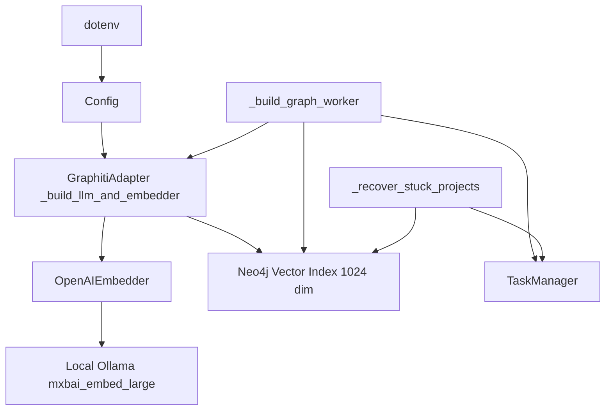
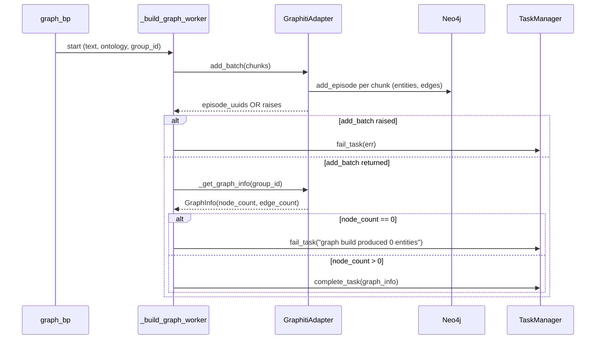
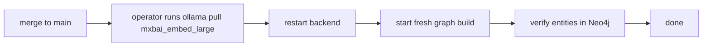

# Design: graph-build-empty-fix

## Overview

**Purpose**: Restore non-empty knowledge-graph builds under the post-migration Graphiti + Neo4j stack and migrate the embedding pipeline to a local-by-default model so the documented happy path produces a working pipeline end-to-end.

**Users**: MiroFish maintainers and operators running a fresh checkout, plus existing operators who already pinned `EMBEDDING_*` to a remote provider.

**Impact**: Flips three default values in `backend/app/config.py` (`EMBEDDING_MODEL`, `EMBEDDING_BASE_URL`, `EMBEDDING_API_KEY`) so the embedder targets a local Ollama instance with `mxbai-embed-large`, adds a non-zero-node-count gate to the graph-build worker's completion path, and updates `README.md` / `CLAUDE.md` / `docker-compose.yml` comments / `.env.example` so the documentation matches the new defaults. No new env var, no new dependency, no new provider branch in `_build_llm_and_embedder` — Ollama is reached through the existing `"openai"` provider against its OpenAI-compatible `/v1` endpoint.

### Goals
- Default `.env`-free configuration produces a non-empty `(:Entity {group_id})` set in Neo4j for the uploaded seed material.
- Any silent "succeeded but empty" graph-build outcome is converted into a `Task.status = FAILED` with an actionable error.
- Existing OpenAI- / Gemini-compatible operators are unaffected on the happy path.
- Documentation (README, CLAUDE.md, docker-compose.yml, `.env.example`) reflects the new default unambiguously.

### Non-Goals
- Startup-time embedder health probe that refuses to boot on dim/model mismatch.
- Tunable `EMBEDDING_DIM` (768/1536 support) — explicit follow-up.
- New provider branch in `_build_llm_and_embedder` (e.g., a dedicated `"ollama"` enum).
- Bundling Ollama or any model binary in `docker-compose.yml`.
- Auto-rebuilding or invalidating project graphs created before this change.
- LLM-side default change — only embedding defaults move.

## Boundary Commitments

### This Spec Owns
- The three `EMBEDDING_*` default values in `backend/app/config.py`.
- The `.env.example` block ordering / commenting that presents Ollama as active and OpenAI/Gemini as fallbacks.
- A non-zero-node-count gate in `GraphBuilderService._build_graph_worker` that converts an empty-graph completion into a `fail_task(...)`.
- Wording of the embedder section in `README.md`, `CLAUDE.md`, and `docker-compose.yml` comments.
- One new locale key (`progress.emptyGraphFailure`) in `locales/en.json` and `locales/zh.json` for the gate's failure message.

### Out of Boundary
- Any change to `_build_llm_and_embedder`'s provider factory beyond what these defaults exercise.
- Changes to `_recover_stuck_projects` — its `count > 0` gate already matches the contract.
- The single-episode `_GraphNamespace.add(...)` path (already raises naturally).
- The graphiti-core dependency version.
- Pre-existing project-graph migration / backfill.

### Allowed Dependencies
- `backend/app/services/graphiti_adapter.py` (read-only — the OpenAI branch is already Ollama-compatible).
- `backend/app/models/task.py` `TaskManager.fail_task` / `complete_task`.
- `backend/app/utils/locale.t` for the new failure message.
- Existing loud-failure contract from spec `graphiti-ollama-embedder`.

### Revalidation Triggers
- A graphiti-core upgrade that changes `EMBEDDING_DIM` away from 1024.
- A change to the recovery contract in `_recover_stuck_projects`.
- Introduction of a new embedder provider branch (would invalidate the "Ollama-via-openai-branch" assumption).
- Any new long-running task type built on the same pattern would need a parallel non-zero-count gate.

## Architecture

### Existing Architecture Analysis

- **Embedder construction**: `_build_llm_and_embedder` (`graphiti_adapter.py:92-139`) branches on `GRAPHITI_LLM_PROVIDER` ∈ {`openai`, `gemini`}. The `"openai"` branch composes `OpenAIEmbedder(OpenAIEmbedderConfig(api_key, base_url, embedding_model))` where each field falls back from `EMBEDDING_*` to `LLM_*`. Ollama's `/v1/embeddings` is OpenAI-shape-compatible, so the existing branch suffices.
- **Graph-build worker**: `_build_graph_worker` (`graph_builder.py:140-230`) ingests chunks via `add_text_batches` → `_GraphNamespace.add_batch`, waits on a no-op `episode.get` poll, fetches `_get_graph_info(graph_id)`, then calls `complete_task` with the resulting node/edge counts. Failure-path is a broad `except Exception` → traceback → `fail_task(task_id, error_msg)`.
- **Loud-failure contract** (from spec #18): `_GraphNamespace.add_batch` logs the underlying `add_episode` exception at `ERROR` and `raise`s — no placeholder UUID return path.
- **Startup recovery**: `_recover_stuck_projects` (`__init__.py:88-109`) promotes `GRAPH_BUILDING` → `GRAPH_COMPLETED` only when `count(:Entity {group_id}) > 0`.

These patterns are preserved; this design extends `_build_graph_worker` with a symmetric `count > 0` check before `complete_task` is called.

### Architecture Pattern & Boundary Map

**Architecture Integration**:
- **Selected pattern**: Defaults-flip + completion-gate (Option C from the gap analysis). Preserves the existing layered flow; adds one synchronous read inside the worker.
- **Domain / feature boundaries**: `Config` owns env-driven defaults; `GraphitiAdapter` owns provider construction; `GraphBuilderService` owns the worker lifecycle and the new `count > 0` gate; `_recover_stuck_projects` owns the symmetric startup-side gate. No cross-cutting changes.
- **Existing patterns preserved**: Single-Graphiti-singleton; persistent event loop; loud `add_batch`; broad worker `except Exception`; `group_id`-scoped reads.
- **New components rationale**: None. Only one new locale key and a ~5-line gate inside the existing worker.
- **Steering compliance**: Stays inside the adapter (`database.md`); reaches `fail_task` on the unhappy path (`error-handling.md`); configuration centralised in `config.py` (`structure.md`); per-project `group_id` filter preserved.

### Technology Stack & Alignment

| Layer | Choice / Version | Role in Feature | Notes |
|-------|------------------|-----------------|-------|
| Backend / Services | Python ≥3.11, Flask 3.0 | Hosts the unchanged graph-build worker and the new non-zero-count gate | Existing stack; no change. |
| Data / Storage | Neo4j 5.x Community + `graphiti-core` ≥ 0.3 | Owns the 1024-dim vector index that the embedder must match | `EMBEDDING_DIM = 1024` is a graphiti-core invariant; not exposed. |
| External | Ollama (operator-managed) + `mxbai-embed-large` (1024-dim) | New default embedding provider, reached over OpenAI-shaped `/v1/embeddings` | Reached via `http://localhost:11434/v1` in host mode; `http://host.docker.internal:11434/v1` in Docker. |
| Frontend / CLI | Vue 3 + `vue-i18n` | Renders the new "graph build produced 0 entities" failure message | One new locale key in `locales/en.json` and `locales/zh.json`. |

## File Structure Plan

### Modified Files

- `backend/app/config.py` — Change the three `EMBEDDING_*` defaults (lines 42, 52, 53). No new fields.
- `backend/app/services/graph_builder.py` — After `_get_graph_info(graph_id)` in `_build_graph_worker`, check `graph_info.node_count > 0`; if zero, call `task_manager.fail_task(task_id, …)` with a `t('progress.emptyGraphFailure')` message and `return` instead of `complete_task`. Log at `ERROR` level.
- `locales/en.json` — Add `progress.emptyGraphFailure` (English).
- `locales/zh.json` — Add `progress.emptyGraphFailure` (Chinese, mirroring the existing `progress.*` style).
- `README.md` — In the env-block code fence (around lines 163-173), move the Ollama lines out of comments and demote the OpenAI/Gemini line to a commented fallback example. Adjust the surrounding prose so the Ollama prerequisite (`ollama pull mxbai-embed-large`) is part of the default setup checklist alongside Neo4j.
- `CLAUDE.md` — In the "Required Environment Variables" section (around lines 72-80), state that the active default `EMBEDDING_MODEL` is `mxbai-embed-large` via Ollama; demote OpenAI/Gemini to "Other supported configurations".
- `docker-compose.yml` — Tighten the L31-33 comment so it points operators at the `.env.example` Ollama block as the active default rather than as an optional override.

### Hook-Protected File (operator-coordinated)

- `.env.example` — The block layout must end up: uncommented `EMBEDDING_BASE_URL=http://host.docker.internal:11434/v1`, `EMBEDDING_API_KEY=ollama`, `EMBEDDING_MODEL=mxbai-embed-large`; OpenAI and Gemini examples remain present but as commented blocks below. The implementation phase produces the exact diff and either coordinates the edit with the developer or records it in `HANDOFF.md`.

> Directory structure is unchanged; no new files are introduced.

## System Flows

### Graph-build completion gate

**Key decisions captured by the diagram**:
- The gate runs *after* the existing `_get_graph_info` call so it costs one extra branch, not an extra Neo4j round-trip.
- The gate fires only when `add_batch` returned without raising — it is strictly a defense for "succeeded but empty," not a replacement for the loud-failure contract.
- Edge count is **not** part of the gate: the contract from `_recover_stuck_projects` is "non-zero entities ⇒ COMPLETED", and edges may legitimately lag entities in some graphiti-core flows.

## Requirements Traceability

| Requirement | Summary | Components | Interfaces | Flows |
|-------------|---------|------------|------------|-------|
| 1.1 | Reproduce on `main` defaults before fixing | Implementation log (PR) | — | — |
| 1.2 | Document root cause(s) in PR + design.md | `design.md` Overview, `research.md` Research Log | — | — |
| 1.3 | If dim-mismatch, record dims | `research.md` Research Log → Embedder construction path | — | — |
| 1.4 | If a new silent path is found, remediate via R4 | `graph_builder.py` worker gate | `TaskManager.fail_task` | Graph-build completion gate |
| 1.5 | Post-fix reproduction writes non-zero entities | End-to-end smoke (PR description) | — | — |
| 2.1 | `Config.EMBEDDING_*` defaults point to local Ollama | `backend/app/config.py` | — | — |
| 2.2 | `.env.example` presents Ollama uncommented | `.env.example` | — | — |
| 2.3 | Default config end-to-end produces non-empty graph | All modified files | — | Graph-build completion gate |
| 2.4 | No reachable Ollama ⇒ `Task.FAILED` with named error | `graph_builder.py` worker (existing `except`) | `TaskManager.fail_task` | — |
| 2.5 | Ollama goes through existing `_build_llm_and_embedder` `openai` branch | `graphiti_adapter.py` (read-only) | — | — |
| 3.1 | Keep `EMBEDDING_DIM = 1024`; default model is 1024-dim | `config.py`, `CLAUDE.md` | — | — |
| 3.2 | CLAUDE.md states the 1024 invariant and rules out 768-dim | `CLAUDE.md` | — | — |
| 3.3 | Dim-mismatch override ⇒ loud `Task.FAILED` | `graph_builder.py` worker gate + existing loud `add_batch` | `TaskManager.fail_task` | Graph-build completion gate |
| 3.4 | No new `EMBEDDING_DIM` env var | — | — | — |
| 4.1 | Preserve loud `add_batch` from #18 | `graphiti_adapter.py` (read-only) | — | — |
| 4.2 | Remediate any new silent call site found in R1 | `graph_builder.py` worker gate | `TaskManager.fail_task` | Graph-build completion gate |
| 4.3 | Embedder-construction failure ⇒ worker `Task.FAILED` | `graph_builder.py` worker (existing `except`) | `TaskManager.fail_task` | — |
| 4.4 | Log propagated failure at ERROR before `fail_task` | `graph_builder.py` worker gate | `logger.error` / `logger.exception` | — |
| 4.5 | `GRAPH_COMPLETED` only when `node_count > 0` | `graph_builder.py` worker gate | `TaskManager.complete_task` | Graph-build completion gate |
| 5.1 | Existing OpenAI/Gemini configs unchanged behavior | `graphiti_adapter.py` (read-only), `config.py` | — | — |
| 5.2 | No new env var | — | — | — |
| 5.3 | Pre-existing 1536-dim graphs remain readable when operator keeps their override | `config.py` (override-wins semantics unchanged) | — | — |
| 5.4 | `GRAPHITI_LLM_PROVIDER` default stays `openai` | `config.py` (unchanged) | — | — |
| 6.1 | CLAUDE.md describes Ollama as default | `CLAUDE.md` | — | — |
| 6.2 | README setup names `ollama pull` prerequisite | `README.md` | — | — |
| 6.3 | docker-compose / README documents host.docker.internal:11434 | `docker-compose.yml`, `README.md` | — | — |
| 6.4 | One-line `curl` smoke test in docs | `README.md` (already present, retain) | — | — |
| 7.1 | Profile generation reads the new graph | End-to-end smoke (PR description) | — | — |
| 7.2 | Report-agent tools return non-empty results | End-to-end smoke (PR description) | — | — |
| 7.3 | PR documents the smoke-test path | PR description | — | — |
| 7.4 | If smoke test not run, PR says so explicitly | PR description | — | — |

## Components and Interfaces

| Component | Domain/Layer | Intent | Req Coverage | Key Dependencies (P0/P1) | Contracts |
|-----------|--------------|--------|--------------|--------------------------|-----------|
| `Config` (modified) | Backend / config | Owns the three `EMBEDDING_*` defaults that flip from OpenAI to Ollama | 2.1, 5.4 | dotenv (P0) | State |
| `GraphBuilderService._build_graph_worker` (modified) | Backend / services | Adds the non-zero-node-count gate before `complete_task` | 1.4, 3.3, 4.2, 4.4, 4.5 | `_get_graph_info` (P0), `TaskManager` (P0), `locale.t` (P1) | Batch |
| Locale entries (new key) | Shared / i18n | One key (`progress.emptyGraphFailure`) so the gate's message is translated | 4.4, 4.5 | `vue-i18n` (P1), `utils.locale.t` (P1) | State |
| Docs set (`README.md`, `CLAUDE.md`, `docker-compose.yml`, `.env.example`) | Docs | Updates the documented happy path to local-by-default | 2.2, 6.1, 6.2, 6.3, 6.4 | — | — |

### Backend / Config

#### `Config` (modified)

| Field | Detail |
|-------|--------|
| Intent | Flip the three `EMBEDDING_*` defaults from OpenAI to Ollama. |
| Requirements | 2.1, 5.4 |

**Responsibilities & Constraints**
- Owns the env-driven embedder defaults consumed by `_build_llm_and_embedder`.
- Must not introduce a new env var or remove any existing one.
- Operator-set `EMBEDDING_*` continues to win over the defaults (override semantics unchanged).

**Dependencies**
- Inbound: `_build_llm_and_embedder` (P0) reads the three values.
- Outbound: none.
- External: dotenv (P0) loads the `.env` file before class evaluation.

**Contracts**: State ☑.

##### State Management
- **State model**: Three module-level class attributes on `Config`:
  - `EMBEDDING_MODEL = os.environ.get('EMBEDDING_MODEL', 'mxbai-embed-large')`
  - `EMBEDDING_BASE_URL = os.environ.get('EMBEDDING_BASE_URL', 'http://localhost:11434/v1')`
  - `EMBEDDING_API_KEY = os.environ.get('EMBEDDING_API_KEY', 'ollama')`
- **Persistence & consistency**: Read once at import; no runtime mutation.
- **Concurrency strategy**: N/A (read-only after import).

**Implementation Notes**
- Integration: `_build_llm_and_embedder`'s existing fallback `Config.EMBEDDING_API_KEY or Config.LLM_API_KEY` continues to work; with the new defaults, the fallback is no longer triggered on a clean checkout.
- Validation: None added — embedder errors continue to surface via the worker's existing `except`.
- Risks: An operator who previously relied on "leave `EMBEDDING_*` unset to inherit `LLM_*`" will, after this change, hit Ollama at `http://localhost:11434/v1` instead. README and CLAUDE.md call this out under "Backwards compatibility".

### Backend / Services

#### `GraphBuilderService._build_graph_worker` (modified)

| Field | Detail |
|-------|--------|
| Intent | Convert "graph build succeeded but produced 0 entities" into a `Task.FAILED`. |
| Requirements | 1.4, 3.3, 4.2, 4.4, 4.5 |

**Responsibilities & Constraints**
- Preserves the existing 5-stage progression (create → set ontology → split → batch → wait → fetch info → complete).
- New behavior: after `graph_info = self._get_graph_info(graph_id)`, if `graph_info.node_count == 0`, call `task_manager.fail_task(...)` with a localised error and `return` (skip `complete_task`).
- Must log at `ERROR` level *before* the `fail_task` call so server logs carry the diagnostic ahead of the task envelope.
- Must not weaken the existing `except Exception` branch — the gate is *additional*, not a replacement.

**Dependencies**
- Inbound: `graph_bp` (P0) invokes `build_graph_async` which calls this worker.
- Outbound: `_get_graph_info(graph_id)` (P0), `TaskManager.fail_task` (P0), `TaskManager.complete_task` (P0), `utils.locale.t` (P1).
- External: `logger.error` (P1).

**Contracts**: Batch ☑.

##### Batch / Job Contract
- **Trigger**: `build_graph_async` spawns the worker thread from a `POST /api/graph/build` request.
- **Input / validation**: Unchanged from current contract (`text`, `ontology`, `graph_name`, `chunk_size`, `chunk_overlap`, `batch_size`, `locale`).
- **Output / destination**: `Task` envelope on `TaskManager`. On success: `Task.status = COMPLETED`, `Task.result = {graph_id, graph_info, chunks_processed}`. On gate trip: `Task.status = FAILED`, `Task.error = t('progress.emptyGraphFailure')`.
- **Idempotency & recovery**: Unchanged. `_recover_stuck_projects` continues to gate on `count(:Entity) > 0`; the worker's new gate makes the live-completion path symmetric.

**Implementation Notes**
- Integration: One block inserted between the existing `graph_info = self._get_graph_info(graph_id)` (line ~219) and `self.task_manager.complete_task(...)` (line ~221). Approximately 5 lines.
- Validation: Confirmed empirically that `_get_graph_info` returns `node_count == 0` when Neo4j holds no `(:Entity {group_id})` rows.
- Risks: A worker that ran on a misconfigured embedder would previously surface via the existing `except Exception` (because `add_batch` re-raises). The new gate catches the residual case where graphiti-core *returns successfully but writes nothing* — the exact failure mode the ticket reports.

### Shared / i18n

#### `progress.emptyGraphFailure` (new locale key)

| Field | Detail |
|-------|--------|
| Intent | Localised failure message for the new gate. |
| Requirements | 4.4, 4.5 |

**Contracts**: State ☑.

##### State Management
- **State model**: One additional entry in the `progress` namespace of `locales/en.json` and `locales/zh.json`.
- **Persistence & consistency**: File-based locales loaded by `vue-i18n` (frontend) and `utils.locale` (backend). Keys must exist in both files; the `progress.*` namespace is the established home for graph-build status strings.
- **Concurrency strategy**: N/A.

**Implementation Notes**
- Integration: Backend calls `t('progress.emptyGraphFailure')` from `_build_graph_worker`. Frontend renders the same key in `Step1GraphBuild.vue`'s failure surface (no code change — it already displays `Task.error`).
- Validation: Smoke-test the key resolves in both locales (`set_locale('en')` / `set_locale('zh')`).
- Risks: None — additive change.

## Error Handling

### Error Strategy

This spec contributes one new error case (`progress.emptyGraphFailure`) and re-uses the existing transport (`TaskManager.fail_task` → polling endpoint → frontend renders `Task.error`).

### Error Categories and Responses

- **Embedder unreachable** (e.g., Ollama not running): caught by `_build_graph_worker`'s existing `except Exception` after `add_batch` raises. `Task.FAILED` with the underlying connection error.
- **Dim-mismatch override** (operator points `EMBEDDING_MODEL` at a non-1024-dim model): caught by `add_batch`'s loud-failure contract (Neo4j or graphiti-core raises). `Task.FAILED` with the underlying dim-mismatch error.
- **Empty graph after a clean `add_batch`** (new case): caught by the gate. `Task.FAILED` with `t('progress.emptyGraphFailure')`. Logged at `ERROR` before the `fail_task` call.

### Monitoring

- Existing `logger.exception` / `logger.error` lines in `graphiti_adapter.py` and `graph_builder.py` carry the underlying error.
- New `logger.error('graph build produced 0 entities for group_id=%s', graph_id)` line precedes the gate's `fail_task` call.

## Testing Strategy

- **Unit-level smoke** (manual, scripted): With Ollama down → `npm run dev` → start a graph build → expect `Task.status = FAILED` and `Task.error` containing a connectivity message. With Ollama up and `mxbai-embed-large` pulled → expect `Task.status = COMPLETED` and `graph_info.node_count > 0`.
- **Configuration smoke**: Confirm `Config.EMBEDDING_MODEL`, `Config.EMBEDDING_BASE_URL`, `Config.EMBEDDING_API_KEY` resolve to the new defaults when `.env` is empty.
- **Backwards-compat smoke**: With `.env` setting `EMBEDDING_*` to OpenAI's values, confirm `_build_llm_and_embedder` constructs the OpenAI embedder exactly as before (no observable change).
- **Gate unit-style test**: Patch `_get_graph_info` to return `GraphInfo(graph_id=…, node_count=0, edge_count=0, entity_types=[])` and assert the worker calls `fail_task` with the localised key (no real pytest harness expansion — short repro in PR description is sufficient given the existing minimal test policy).
- **End-to-end** (Req 7): Graph build → env-setup (profile generation) → report-agent query on a representative seed file. PR description documents the run; if the maintainer cannot run it locally, the PR description states that explicitly.

## Migration Strategy

- **Phase 1 (no operator action)**: For operators with explicit `EMBEDDING_*` overrides — no change. Pre-existing project graphs remain readable.
- **Phase 2 (default-using operators)**: One-time `ollama pull mxbai-embed-large` and restart. Pre-existing project graphs created against the previous default (1536-dim text-embedding-3-small with a Dashscope LLM key, which most likely already produced empty graphs per the ticket) are invalidated; operators rebuild them.
- **Rollback trigger**: If an operator cannot run Ollama, they re-add the OpenAI or Gemini `EMBEDDING_*` block to `.env` (the README's commented fallback) and restart. No code rollback required.
- **Validation checkpoint**: After the first graph build under the new defaults, the `node_count > 0` gate proves the migration succeeded.
