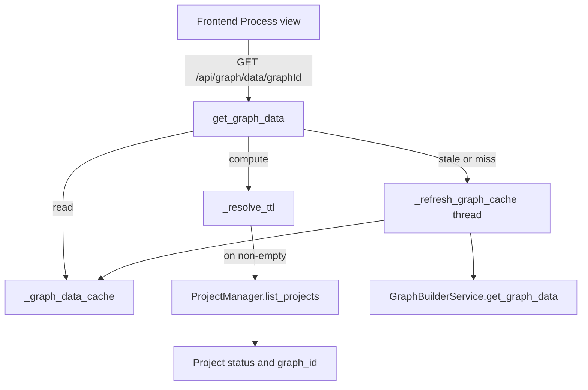
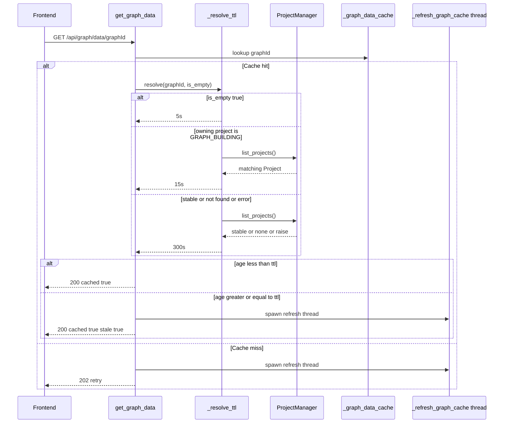

# Design Document

## Overview

**Purpose**: Replace the fixed 5-minute graph-data cache TTL in `backend/app/api/graph.py` with a TTL that adapts to the owning project's build state, so newly extracted entities surface in the graph panel within ~15 seconds while a build is in progress.

**Users**: Operators and analysts watching the graph build step of MiroFish's 5-step workflow; backend maintainers reading the cache's module-level rationale.

**Impact**: The graph data endpoint serves cached payloads with a 15s freshness window during `GRAPH_BUILDING` and the existing 300s window otherwise. The empty-result path (5s) and the stale-while-revalidate refresh path are unchanged. No other API, service, model, or frontend code is affected.

### Goals

- Selectable TTL driven by `Project.status` for cached graph fetches.
- Safe fallback to the long TTL when the owning project cannot be resolved.
- Module-level comment that explains the current (local-Neo4j, build-aware) policy.

### Non-Goals

- Eviction or size-bounding of `_graph_data_cache` / `_graph_refresh_locks`.
- Changing the empty-result TTL value, the polling endpoint contract, or any frontend code.
- Memoizing `graph_id → project` lookups.
- Touching `_refresh_graph_cache`, `GraphBuilderService.get_graph_data`, or the Graphiti adapter.

## Boundary Commitments

### This Spec Owns

- TTL selection policy for non-empty cached graph fetches in `backend/app/api/graph.py`.
- The mapping from `(graph_id, cached-payload emptiness)` to a freshness window in seconds.
- The module-level cache rationale comment in `graph.py`.

### Out of Boundary

- The cache structure (`_graph_data_cache`, `_graph_refresh_locks`) and its lack of eviction.
- The stale-while-revalidate flow, refresh locking, and the background refresh worker.
- Project lifecycle transitions (`GRAPH_BUILDING → GRAPH_COMPLETED`); this spec consumes them, it does not own them.
- Frontend polling cadence and rerender logic.

### Allowed Dependencies

- `ProjectManager.list_projects()` — already used by `_refresh_graph_cache`; reused here read-only.
- `ProjectStatus.GRAPH_BUILDING` — enum value consumed as the single trigger for the short TTL.
- `utils.logger.get_logger('mirofish.api')` — existing logger reused for fallback warnings.

### Revalidation Triggers

- `ProjectStatus` adds/removes/renames the `GRAPH_BUILDING` value, or splits "building" across multiple states.
- `Project.graph_id` ownership semantics change (e.g., multiple projects may share a `graph_id`).
- `_refresh_graph_cache` is moved out of `graph.py` or the cache state itself is relocated to a service.
- The cache-key shape changes from `graph_id: str` to something else.

## Architecture

### Existing Architecture Analysis

The graph data endpoint is implemented entirely in `backend/app/api/graph.py`:

- Module-level state at `:24-32`: `_graph_data_cache`, `_graph_refresh_locks`, `_GRAPH_CACHE_TTL = 300`, `_GRAPH_EMPTY_CACHE_TTL = 5`.
- Background refresher at `:556-576` (`_refresh_graph_cache`): per-`graph_id` lock, iterates `ProjectManager.list_projects()` to find the owning project's `ontology`, calls `GraphBuilderService.get_graph_data`, stores `{data, ts}`.
- Route at `:579-615` (`get_graph_data`): inline TTL branch at `:593-598` chooses 5s if empty else 300s, then serves fresh / stale-while-revalidate / no-cache 202 accordingly.

Existing patterns to preserve:

- API-layer state stays in `api/graph.py`; no logic moves to `services/`.
- `ProjectManager.list_projects()` is the canonical project lookup (matches `_refresh_graph_cache`).
- Per-`graph_id` refresh dedup via `_graph_refresh_locks`.
- `WARNING`-level logging for transient/recovered failures per `.kiro/steering/error-handling.md`.

### Architecture Pattern & Boundary Map



**Architecture Integration**:

- **Selected pattern**: Strategy helper at the API layer — a single private function (`_resolve_ttl`) encapsulates the TTL-selection decision, called inline from `get_graph_data`.
- **Domain/feature boundaries**: TTL policy lives next to the cache state it governs; project state ownership remains with `ProjectManager`; refresh execution remains with `_refresh_graph_cache`.
- **Existing patterns preserved**: project lookup via `list_projects()`, stale-while-revalidate, per-`graph_id` lock, response envelope, API-layer-only cache state.
- **New components rationale**: `_resolve_ttl` is the only new symbol — it replaces an inline branch with one named decision point that can be reasoned about and (in future) tested in isolation.
- **Steering compliance**: matches `api-standards.md` ("handler stays thin, dispatches to a helper"), `database.md` (`group_id`/per-project isolation unchanged — read-only `Project` consultation only), `error-handling.md` (broad `try/except` with `WARNING` log on resolution failure; safe fallback).

### Technology Stack & Alignment

| Layer | Choice / Version | Role in Feature | Notes |
|-------|------------------|-----------------|-------|
| Backend / Services | Flask 3.0 + Python ≥3.11 | Hosts the graph data endpoint | No new framework features used. |
| State / Cache | Process-local `dict` (existing `_graph_data_cache`) | Holds cached graph fetches per `graph_id` | Unchanged; only the freshness-window calculation is new. |
| Project lookup | `ProjectManager.list_projects()` (existing) | Resolves owning project for a `graph_id` | Reused; default `limit=50` retained. |

No new dependencies. No version pins change.

## File Structure Plan

### Modified Files

- `backend/app/api/graph.py` — the only file changed.
  - Remove `_GRAPH_CACHE_TTL`.
  - Add two replacement constants and one private helper.
  - Replace the inline TTL branch in `get_graph_data`.
  - Update the module-level cache comment block.

No new files, no renames, no deletions, no test files added (the project intentionally has no pytest coverage for this surface; verification is manual per Requirement 5).

## System Flows



**Key decisions captured by the diagram** (not restated in prose):

- Empty-result short-circuit happens before any project lookup.
- Resolution failure (`not found` or exception) collapses to the stable branch.
- The cache-miss path is unchanged — it never asks for a TTL because there is no cached entry to age.

## Requirements Traceability

| Requirement | Summary | Components | Interfaces | Flows |
|-------------|---------|------------|------------|-------|
| 1.1 | Expose 15s building and 300s stable TTLs | GraphAPIModule | `_GRAPH_CACHE_TTL_BUILDING`, `_GRAPH_CACHE_TTL_STABLE` | — |
| 1.2 | Use 15s TTL while owning project is `GRAPH_BUILDING` | TtlResolver | `_resolve_ttl` | get_graph_data cache-hit branch |
| 1.3 | Use 300s TTL when owning project is not `GRAPH_BUILDING` | TtlResolver | `_resolve_ttl` | get_graph_data cache-hit branch |
| 1.4 | Remove the single `_GRAPH_CACHE_TTL` constant | GraphAPIModule | module-level constants | — |
| 2.1 | Empty payload uses 5s regardless of status | TtlResolver | `_resolve_ttl` short-circuit | get_graph_data cache-hit branch |
| 2.2 | Empty TTL value unchanged | GraphAPIModule | `_GRAPH_EMPTY_CACHE_TTL` | — |
| 2.3 | Non-empty payload does not use empty TTL | TtlResolver | `_resolve_ttl` | get_graph_data cache-hit branch |
| 3.1 | Resolve owning project via `list_projects()` | TtlResolver | `ProjectManager.list_projects` | get_graph_data cache-hit branch |
| 3.2 | Fall back to stable TTL when no owner is found | TtlResolver | `_resolve_ttl` | get_graph_data cache-hit branch |
| 3.3 | Non-building status → stable TTL | TtlResolver | `_resolve_ttl` | get_graph_data cache-hit branch |
| 3.4 | Resolution exception → stable TTL, no propagation | TtlResolver | `_resolve_ttl` try/except | get_graph_data cache-hit branch |
| 4.1 | Module comment reflects local-Neo4j rationale | GraphAPIModule | module docstring/comment | — |
| 4.2 | Module comment describes build-aware policy | GraphAPIModule | module docstring/comment | — |
| 4.3 | Obsolete rate-limit framing removed | GraphAPIModule | module docstring/comment | — |
| 5.1 | New entities visible within ~15s during build | TtlResolver + existing refresh path | `_resolve_ttl`, `_refresh_graph_cache` | full sequence diagram |
| 5.2 | Stable cache: at most one refresh per 300s per `graph_id` | TtlResolver + existing refresh path | `_resolve_ttl`, `_refresh_graph_cache` | full sequence diagram |
| 5.3 | Stale-while-revalidate preserved | get_graph_data | existing route logic | full sequence diagram |

## Components and Interfaces

| Component | Domain/Layer | Intent | Req Coverage | Key Dependencies (P0/P1) | Contracts |
|-----------|--------------|--------|--------------|--------------------------|-----------|
| GraphAPIModule | Backend / API | Hosts cache state, TTL constants, route, and rationale comment for `/api/graph/data/<graph_id>` | 1.1, 1.4, 2.2, 4.1, 4.2, 4.3 | ProjectManager (P0), GraphBuilderService (P1 — existing, unaffected) | State |
| TtlResolver | Backend / API | Selects the freshness window for a cache hit | 1.2, 1.3, 2.1, 2.3, 3.1, 3.2, 3.3, 3.4 | ProjectManager.list_projects (P0), ProjectStatus.GRAPH_BUILDING (P0), logger (P1) | Service |

### Backend / API

#### GraphAPIModule

| Field | Detail |
|-------|--------|
| Intent | Single module owning cache state, TTL policy constants, route, and the cache rationale comment |
| Requirements | 1.1, 1.4, 2.2, 4.1, 4.2, 4.3 |

**Responsibilities & Constraints**

- Define `_GRAPH_CACHE_TTL_BUILDING = 15` and `_GRAPH_CACHE_TTL_STABLE = 300`; remove `_GRAPH_CACHE_TTL`.
- Preserve `_GRAPH_EMPTY_CACHE_TTL = 5` exactly as today.
- Keep cache dicts and the route's response envelope shape unchanged.
- Module-level comment near the constants must explain (a) Neo4j is co-located, (b) the cache smooths concurrent local polls, (c) non-empty TTL is build-state-aware, (d) empty TTL is a separate short window.

**Dependencies**

- Outbound: `TtlResolver` (`_resolve_ttl`) — purpose: compute effective TTL. (P0)
- Outbound: existing `_refresh_graph_cache` background worker — purpose: refresh stale/missing entries. (P1, unchanged)

**Contracts**: API [x] / State [x] / Service [ ] / Event [ ] / Batch [ ]

##### API Contract (unchanged)

| Method | Endpoint | Request | Response | Errors |
|--------|----------|---------|----------|--------|
| GET | `/api/graph/data/<graph_id>` | path param `graph_id` | `{ "success": true, "data": <graph>, "cached": true, ["stale": true]? }` on hit; `202` `{ "success": false, "error": "...", "retry": true }` on miss | `500` envelope when Neo4j is unconfigured |

The TTL change is internal to cache-hit handling and does not alter the response envelope or status codes.

##### State Management

- **State model**: `_graph_data_cache: dict[str, dict]` keyed by `graph_id` with `{data, ts}`; `_graph_refresh_locks: dict[str, threading.Lock]` keyed by `graph_id`.
- **Persistence & consistency**: process-local; unchanged by this feature.
- **Concurrency strategy**: existing per-`graph_id` lock for refresh dedup; new code reads from `_graph_data_cache` only (no writes).

**Implementation Notes**

- Integration: only the inline TTL branch at `get_graph_data` and the module-level comment block change.
- Validation: none required at this layer; validation lives inside `_resolve_ttl`.
- Risks: silent typo when removing `_GRAPH_CACHE_TTL` could leave a dangling reference — mitigated by the requirement to grep the codebase for the symbol during implementation (only one definition and one use exist today).

#### TtlResolver

| Field | Detail |
|-------|--------|
| Intent | Decide the freshness window for a cache hit, given `graph_id` and whether the cached payload is empty |
| Requirements | 1.2, 1.3, 2.1, 2.3, 3.1, 3.2, 3.3, 3.4 |

**Responsibilities & Constraints**

- Pure function in spirit: depends only on `_GRAPH_CACHE_TTL_BUILDING`, `_GRAPH_CACHE_TTL_STABLE`, `_GRAPH_EMPTY_CACHE_TTL`, and a `ProjectManager.list_projects()` snapshot.
- Empty-result short-circuit happens **before** project lookup (Requirement 2.1 + research finding).
- Project resolution failure (exception, no match, missing `graph_id` on all projects) collapses to the stable TTL (Requirements 3.2, 3.4).
- Must not raise to the caller.

**Dependencies**

- Outbound: `ProjectManager.list_projects()` — purpose: enumerate projects to find the one whose `graph_id` matches. (P0)
- Outbound: `ProjectStatus.GRAPH_BUILDING` — purpose: the single status that selects the short TTL. (P0)
- Outbound: `logger` (`mirofish.api`) — purpose: `WARNING` on resolution exception. (P1)

**Contracts**: Service [x] / API [ ] / Event [ ] / Batch [ ] / State [ ]

##### Service Interface

```python
def _resolve_ttl(graph_id: str, is_empty: bool) -> int:
    """Return the freshness window (seconds) for a cache hit.

    Selection order:
      1. is_empty == True              -> _GRAPH_EMPTY_CACHE_TTL
      2. owning Project.status == GRAPH_BUILDING -> _GRAPH_CACHE_TTL_BUILDING
      3. otherwise (other status, no owner found, resolution error)
                                       -> _GRAPH_CACHE_TTL_STABLE
    """
```

- **Preconditions**: `graph_id` is the cache key for an existing `_graph_data_cache` entry; `is_empty` reflects the cached payload's `(node_count, edge_count)`.
- **Postconditions**: returns one of `{5, 15, 300}` (the three configured constants); never raises.
- **Invariants**: empty short-circuit dominates build state; build state dominates the "other status" branch; resolution failure is observationally identical to "not found" from the request thread's perspective.

##### Error Envelope

`_resolve_ttl` does not return an error type — it absorbs all failures and returns the stable TTL. On a caught `Exception`, the implementation emits a single `logger.warning(...)` line per call so operators have a breadcrumb.

**Implementation Notes**

- Integration: called from a single site — `get_graph_data` cache-hit branch, replacing the inline conditional currently at `graph.py:595-596`.
- Validation: relies on `ProjectStatus` enum identity (`project.status == ProjectStatus.GRAPH_BUILDING`); no string comparisons.
- Risks: per-call O(projects) iteration. Bounded by `ProjectManager.list_projects()`'s default `limit=50`; documented in research as acceptable for this scale.

## Data Models

No data-model changes. The cache continues to store `{"data": <serialized graph>, "ts": <float>}` keyed by `graph_id`; the `Project` model is consulted read-only.

## Error Handling

### Error Strategy

- **Empty payload**: never an error condition — handled by short-circuit in `_resolve_ttl`.
- **Project not found for `graph_id`**: not an error — falls through to the stable TTL.
- **`ProjectManager.list_projects()` raises**: caught by a broad `try/except Exception` around the iteration; a `logger.warning(...)` records `graph_id` and `str(e)[:100]` (matching the truncation style already used by `_refresh_graph_cache` at `graph.py:574`); function returns the stable TTL.

### Error Categories and Responses

- **User errors**: none — the request never gets a different error code because of TTL selection.
- **System errors**: graceful degradation — any TTL-resolution problem yields the longer (safer) freshness window so the request still succeeds.
- **Business-logic errors**: none.

### Monitoring

- `logger.warning` on resolution exception, prefixed `TTL resolution failed for {graph_id}:` (one line, truncated message). No new metrics; the existing "Graph cache refreshed for {graph_id}" `INFO` line at `graph.py:572` already provides the build-state-aware refresh cadence signal needed for Requirement 5.2 verification.

## Testing Strategy

The project intentionally runs minimal automated tests on the Flask API surface (per `tech.md`: "pytest is wired but coverage is intentionally minimal — don't add a heavy test harness without discussing scope"). Verification for this feature is therefore manual, matching Requirement 5.

### Manual verification checklist

1. **Building TTL** — Start a new project, upload seed material, kick off graph build. While the project is in `GRAPH_BUILDING`, observe `Process.vue` graph panel: new entities surface within ~15s of being written to Neo4j (a 30s wait at any point during the build should show two new "Graph cache refreshed" log lines).
2. **Stable TTL** — Once the project transitions to `GRAPH_COMPLETED`, leave the page open for >5 minutes; the backend log should show at most one "Graph cache refreshed" line per 300s for that `graph_id`.
3. **Empty-result TTL** — Trigger the first poll right after a build starts (before any entity is extracted). Cached `{nodes: 0, edges: 0}` must be replaced within ~5s, not 15s.
4. **Safe fallback** — Manually request `/api/graph/data/<bogus-graph-id>` after the cache has been populated for it (e.g., by deleting the owning project from the in-memory manager mid-poll). Subsequent cache hits should use the stable TTL; a single `WARNING` line should appear if the lookup raised.

### Light-touch automated check (optional, only if reviewer requests)

A small pytest could exercise `_resolve_ttl` directly by stubbing `ProjectManager.list_projects()` to return synthetic `Project` objects with each `ProjectStatus`. Out of scope unless a reviewer asks — would be the project's first API-layer unit test.

## Performance & Scalability

- **Target metric**: end-to-end "entity written → visible in graph panel" latency during `GRAPH_BUILDING` drops from ≈5 min (worst case) to ≈15s + one frontend poll interval (≤25s total).
- **Trade-off**: refresh cadence during a build rises from ≈1/5min to ≈1/15s per active `graph_id`. With Neo4j on the same host and the per-`graph_id` refresh lock preventing pile-up, this is well within budget per the ticket's analysis.
- **No new scaling concerns**: cache and lock state still grow per-`graph_id` without eviction; called out in the requirements as out-of-scope.

## Supporting References

- Research log and full alternatives matrix: `.kiro/specs/graph-cache-ttl-build-aware/research.md`.
- Ticket #44 snapshot: `.ticket/44.md`.
- Existing reference implementation of `ProjectManager.list_projects()` lookup: `backend/app/api/graph.py:556-576` (`_refresh_graph_cache`).
- `ProjectStatus` enum definition: `backend/app/models/project.py:18-24`.
