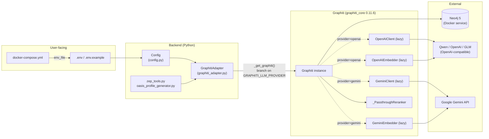
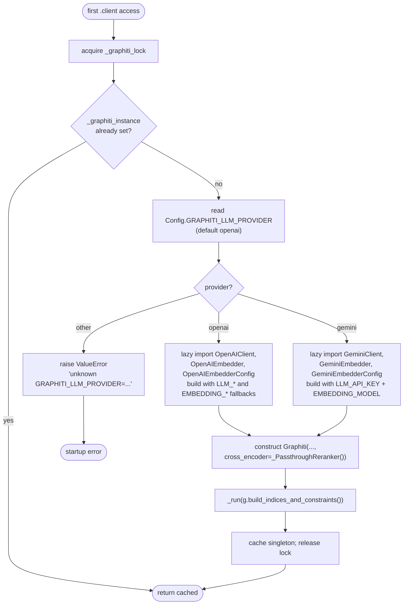
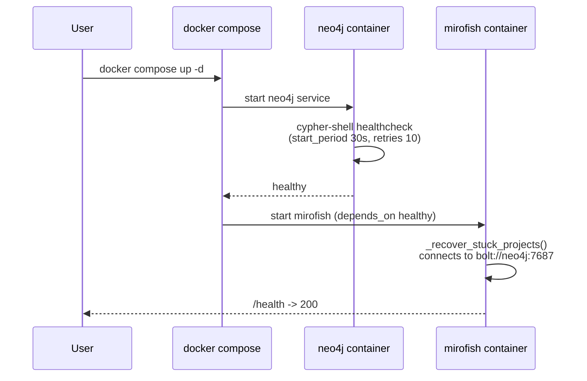
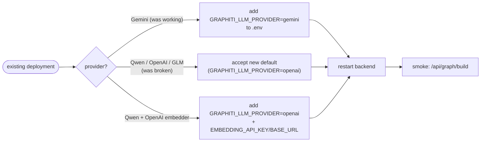

# Design — graphiti-neo4j-finalize

## Overview

**Purpose**: This feature finalises the Zep → Graphiti/Neo4j migration so that a fresh checkout following the README works end-to-end with the documented default LLM provider (Qwen via Dashscope), without regressing the existing Gemini path. It closes two functional gaps left by commit `6264828`: (a) `docker compose up -d` cannot bring up the stack because Neo4j is missing from `docker-compose.yml`, and (b) Step 1 of the pipeline cannot succeed for Qwen because the Graphiti adapter is hard-wired to Gemini for both the LLM client and the embedder.

**Users**: Developers cloning the repo for the first time (Docker path), operators running with Qwen/Dashscope (the documented default), and existing Gemini operators who must keep working unchanged after a one-line `.env` opt-in.

**Impact**: Adds a `neo4j` service to Compose; introduces a `GRAPHITI_LLM_PROVIDER` switch in `Config`; decouples embedder credentials from chat credentials; replaces the no-op Gemini-flavoured reranker with a provider-agnostic passthrough; refreshes `.env.example` to mirror the README.

### Goals
- A fresh checkout configured with a Qwen `LLM_API_KEY` completes Step 1 (Graph Build) end-to-end via Docker.
- `docker compose up -d` boots Neo4j + the Flask app together with no manual Neo4j install.
- Existing Gemini operators keep working with a single `GRAPHITI_LLM_PROVIDER=gemini` opt-in.
- The reranker code path is honest: either does work or doesn't claim to.
- `.env.example` matches what the code reads; the README is unchanged (already correct).

### Non-Goals
- Implementing a real per-provider reranker (deferred to a follow-up).
- Pagination cleanup of `_NodeNamespace.get_by_graph_id` / `_EdgeNamespace.get_by_graph_id` (low priority, deferred).
- Renaming `zep_*` files (tracked separately).
- Migrating data from existing Zep Cloud deployments (project is local-only by design now).
- Adding automated tests (steering rule: minimal pytest coverage by design; smoke test is manual).

## Boundary Commitments

### This Spec Owns
- The Compose definition for the `neo4j` service and its wiring with `mirofish` (`docker-compose.yml`).
- The Graphiti provider switch (`Config.GRAPHITI_LLM_PROVIDER`) and its default value.
- The optional embedding-credentials fallback (`EMBEDDING_API_KEY`, `EMBEDDING_BASE_URL`).
- The `_get_graphiti()` factory body in `backend/app/services/graphiti_adapter.py`.
- The reranker layer (replace stub; remove ignored `reranker=` kwarg + caller usages).
- `.env.example` content (best-effort under env-guard hook).

### Out of Boundary
- Per-project `group_id` isolation logic (preserved unchanged).
- The `Task` background-task model and `_recover_stuck_projects` recovery logic (verified to still work behind a healthchecked Neo4j; no changes).
- Frontend code (no changes).
- Simulation IPC (`services/simulation_ipc.py`) and CAMEL-OASIS subprocesses.
- Retry / pagination logic outside the touched files.

### Allowed Dependencies
- `graphiti-core>=0.3` (resolved 0.11.6) — already declared in `backend/pyproject.toml`.
- `openai` SDK (already present, used by `LLMClient`).
- Neo4j 5.x Community image — declared in `docker-compose.yml`.
- `python-dotenv` — already used by `Config`.

### Revalidation Triggers
- New `LLM_*` env var: forces `Config` and `.env.example` to update together.
- Graphiti major version bump: forces re-verification of `OpenAIClient`/`OpenAIEmbedder`/`OpenAIRerankerClient` signatures.
- Switching the default reranker: forces re-checking every search call site.

## Architecture

### Existing Architecture Analysis

The system already has a clean adapter boundary: all graph reads/writes go through `backend/app/services/graphiti_adapter.py`. Feature code does not import `graphiti_core` or call Neo4j drivers directly (steering rule). The adapter is a singleton initialised on first use via `_get_graphiti()` (`graphiti_adapter.py:89-119`), with all async work running on a dedicated `graphiti-event-loop` thread to keep the Neo4j driver bound to one event loop.

`Config` (`backend/app/config.py`) is the single source of truth for env-var reads. Graph isolation is enforced via `group_id` on every read and write.

This design extends those patterns rather than introducing new ones.

### Architecture Pattern & Boundary Map



**Architecture Integration**:
- **Selected pattern**: Single-adapter façade with provider-strategy switch, encapsulated inside the existing `_get_graphiti()` factory.
- **Domain/feature boundaries**: Adapter (`graphiti_adapter.py`) owns Graphiti construction; `Config` owns env-var reads; Compose owns runtime wiring; no domain bleed.
- **Existing patterns preserved**: Singleton + persistent event loop, `group_id` isolation, single-source-of-truth `Config`, env-driven provider selection (matches the steering rule "new providers are integrated by changing `LLM_BASE_URL`/`LLM_MODEL_NAME`, not by adding a second SDK").
- **New components rationale**: `_PassthroughReranker` is a renamed replacement for `_GeminiReranker` — same shape, no provider dependency. No other new components.
- **Steering compliance**: Single Python config file; lazy imports keep optional dependencies optional; backwards-compatible env vars.

### Technology Stack

| Layer | Choice / Version | Role in Feature | Notes |
|-------|------------------|-----------------|-------|
| Frontend / CLI | n/a | not touched | |
| Backend / Services | Python 3.11+, Flask 3.0 | Hosts `Config` and `GraphitiAdapter` | No new Python deps |
| Data / Storage | Neo4j 5-community via `graphiti-core` 0.11.6 | Knowledge graph backend | Now containerised via Compose |
| Messaging / Events | n/a | | |
| Infrastructure / Runtime | Docker Compose v2 | Adds `neo4j` service + healthcheck + named volumes | Drops `version:` key (already absent today; we keep it absent) |

## File Structure Plan

### Directory Structure

```
.
├── docker-compose.yml                         # MODIFIED: add neo4j service + depends_on + NEO4J_URI override
├── .env.example                               # MODIFIED (best-effort): add NEO4J_*, EMBEDDING_*, GRAPHITI_LLM_PROVIDER
└── backend/
    └── app/
        ├── config.py                          # MODIFIED: + GRAPHITI_LLM_PROVIDER, EMBEDDING_API_KEY, EMBEDDING_BASE_URL
        └── services/
            ├── graphiti_adapter.py            # MODIFIED: provider switch, passthrough reranker, drop ignored kwarg
            ├── zep_tools.py                   # MODIFIED: drop reranker="cross_encoder" arg (line 504)
            └── oasis_profile_generator.py     # MODIFIED: drop reranker="rrf" args (lines 324, 349)
```

### Modified Files
- `docker-compose.yml` — add `neo4j:5-community` service with auth, healthcheck, named volumes, port 7474/7687; wire `mirofish` with `depends_on: { neo4j: { condition: service_healthy } }` and `environment: NEO4J_URI=bolt://neo4j:7687`.
- `.env.example` — drop `ZEP_API_KEY` (or comment as deprecated); add `NEO4J_URI`, `NEO4J_USER`, `NEO4J_PASSWORD`, `EMBEDDING_MODEL`, optional `GRAPHITI_LLM_PROVIDER`, optional `EMBEDDING_API_KEY`, optional `EMBEDDING_BASE_URL`. **Best-effort under `pre_tool_env_guard.sh`; if blocked, README documentation is the canonical surface (acceptable per Requirement 6 fallback).**
- `backend/app/config.py` — add three new class attributes (`GRAPHITI_LLM_PROVIDER`, `EMBEDDING_API_KEY`, `EMBEDDING_BASE_URL`). Keep `ZEP_API_KEY` as today.
- `backend/app/services/graphiti_adapter.py` — replace `_GeminiReranker` with `_PassthroughReranker` (no GeminiClient dep); branch in `_get_graphiti()` on `Config.GRAPHITI_LLM_PROVIDER`; lazy-import provider-specific Graphiti classes inside their branch; drop `reranker` kwarg from `_GraphNamespace.search`. Preserve persistent-event-loop and singleton patterns exactly.
- `backend/app/services/zep_tools.py:504` — remove `reranker="cross_encoder"` from the `client.graph.search(...)` call.
- `backend/app/services/oasis_profile_generator.py:324, :349` — remove `reranker="rrf"` from the two `client.graph.search(...)` calls.

## System Flows

### Flow 1: Adapter initialisation with provider switch



**Decision points**: The provider read is one-shot at construction time. Re-reading mid-process is unnecessary because changing provider mid-run requires Neo4j re-init anyway. The passthrough reranker is always injected explicitly (never let Graphiti default to `OpenAIRerankerClient`).

### Flow 2: Compose boot order



## Requirements Traceability

| Requirement | Summary | Components | Interfaces | Flows |
|-------------|---------|------------|------------|-------|
| 1.1 | `neo4j` service named, image `neo4j:5-community` | `docker-compose.yml` | Compose service | Flow 2 |
| 1.2 | Expose 7474 + 7687 | `docker-compose.yml` | Compose ports | Flow 2 |
| 1.3 | `NEO4J_AUTH` from `${NEO4J_PASSWORD:-mirofish123}` | `docker-compose.yml`, `.env.example` | Compose env | Flow 2 |
| 1.4 | Named volumes for `/data` + `/logs` | `docker-compose.yml` | Compose volumes | Flow 2 |
| 1.5 | Healthcheck via `cypher-shell` | `docker-compose.yml` | Compose healthcheck | Flow 2 |
| 1.6 | `mirofish.depends_on.neo4j.condition: service_healthy` | `docker-compose.yml` | Compose depends_on | Flow 2 |
| 1.7 | In-stack `NEO4J_URI=bolt://neo4j:7687` | `docker-compose.yml` | Compose environment override | — |
| 1.8 | No top-level `version:` key | `docker-compose.yml` | — | — |
| 1.9 | E2E graph build inside Docker | end-to-end smoke | — | manual |
| 2.1 | Default `bolt://localhost:7687` | `Config.NEO4J_URI` | env var | — |
| 2.2 | `npm run dev` regression-free | host-mode dev | — | manual |
| 2.3 | Docker override scoped to compose only | `docker-compose.yml` | env var | — |
| 3.1 | `Config.GRAPHITI_LLM_PROVIDER` exists | `Config` | class attr | — |
| 3.2 | Default `openai` | `Config.GRAPHITI_LLM_PROVIDER` | class attr | — |
| 3.3 | Branch builds OpenAI client | `_get_graphiti()` | Python | Flow 1 |
| 3.4 | Branch builds Gemini client | `_get_graphiti()` | Python | Flow 1 |
| 3.5 | Raise on unknown value | `_get_graphiti()` | Python | Flow 1 |
| 3.6 | Qwen E2E pipeline | end-to-end smoke | — | manual |
| 4.1 | OpenAI embedder branch | `_get_graphiti()` | Python | Flow 1 |
| 4.2 | Gemini embedder branch | `_get_graphiti()` | Python | Flow 1 |
| 4.3 | Lazy import per branch | `_get_graphiti()` | Python | Flow 1 |
| 5.1 | `EMBEDDING_API_KEY` / `EMBEDDING_BASE_URL` exist | `Config` | class attr | — |
| 5.2 | Fallback `LLM_API_KEY` | `Config.embedding_credentials()` helper | Python | — |
| 5.3 | Fallback `LLM_BASE_URL` | `Config.embedding_credentials()` helper | Python | — |
| 5.4 | Embedder uses embedding key | `_get_graphiti()` openai branch | Python | Flow 1 |
| 5.5 | `EMBEDDING_MODEL` independent | `Config` (already true) | class attr | — |
| 6.1 | `.env.example` has Neo4j vars | `.env.example` | doc | — |
| 6.2 | `.env.example` has `EMBEDDING_MODEL` | `.env.example` | doc | — |
| 6.3 | `.env.example` has new optional vars | `.env.example` | doc | — |
| 6.4 | Embedder note for Qwen users | `.env.example` | doc | — |
| 6.5 | Drop or comment `ZEP_API_KEY` | `.env.example` | doc | — |
| 6.6 | No real secrets in example | `.env.example` | doc | — |
| 6.7 | README and `.env.example` agree | both | doc | — |
| 7.1 | Drop `_GeminiReranker` (rename) | `graphiti_adapter.py` | Python class | — |
| 7.2 | Remove `reranker=` kwarg | `_GraphNamespace.search` | Python | — |
| 7.3 | Drop `reranker="cross_encoder"` | `zep_tools.py:504` | Python | — |
| 7.4 | All search paths return default-ranked | adapter + callers | Python | — |
| 8.1 | Gemini path identical | `_get_graphiti()` gemini branch | Python | Flow 1 |
| 8.2 | Default = openai | `Config.GRAPHITI_LLM_PROVIDER` | class attr | — |
| 8.3 | No env vars removed | `Config` | class attr | — |
| 9.1 | Qwen E2E completes | smoke | — | manual |
| 9.2 | Graph data endpoint nonzero | smoke | — | manual |
| 9.3 | Report tools nonzero | smoke | — | manual |
| 9.4 | Provider error surfaces | adapter exception path | Python | Flow 1 |

## Components and Interfaces

| Component | Domain/Layer | Intent | Req Coverage | Key Dependencies (P0/P1) | Contracts |
|-----------|--------------|--------|--------------|--------------------------|-----------|
| `docker-compose.yml` (extended) | Infra | Containerise full stack | 1.1–1.9, 2.3 | Neo4j 5-community (P0) | Service |
| `Config` (extended) | Backend / config | Single source of truth for env reads | 3.1, 3.2, 5.1, 5.2, 5.3, 5.5, 8.3 | `python-dotenv` (P0) | State |
| `_PassthroughReranker` | Backend / adapter | Provider-agnostic no-op cross-encoder | 7.1, 7.4 | `graphiti_core.cross_encoder.client.CrossEncoderClient` (P0) | Service |
| `_get_graphiti()` (refactored) | Backend / adapter | Build singleton Graphiti from Config | 3.3, 3.4, 3.5, 4.1, 4.2, 4.3, 5.4, 8.1, 9.4 | `graphiti_core` (P0), `Config` (P0) | Service |
| `_GraphNamespace.search` (cleaned) | Backend / adapter | Honest signature; no dead kwarg | 7.2 | `Graphiti.search`, `Graphiti.search_` (P0) | Service |
| Search callers (zep_tools, oasis_profile_generator) | Backend / services | Drop ignored `reranker=` kwarg | 7.3 | `_GraphNamespace.search` (P0) | Service |

### Backend / Configuration

#### `Config` (extended)

| Field | Detail |
|-------|--------|
| Intent | Add three new env-var-driven class attributes; preserve all existing ones. |
| Requirements | 3.1, 3.2, 5.1, 5.2, 5.3, 5.5, 8.3 |

**Responsibilities & Constraints**
- Reads env vars at module import time via `python-dotenv` (existing behaviour).
- Provides typed defaults consistent with `README-EN.md` env section.
- New attributes do not mutate or replace existing ones.

**Dependencies**
- Inbound: `graphiti_adapter._get_graphiti()` reads the new fields (P0).
- External: `python-dotenv` (P0).

**Contracts**: State [x]

##### State Management

```python
# Additions to backend/app/config.py — Config class

GRAPHITI_LLM_PROVIDER: str = os.environ.get("GRAPHITI_LLM_PROVIDER", "openai")
"""Provider for Graphiti's LLM client and embedder. Allowed: 'openai', 'gemini'."""

EMBEDDING_API_KEY: Optional[str] = os.environ.get("EMBEDDING_API_KEY")
"""Optional override for the embedder's API key. Falls back to LLM_API_KEY."""

EMBEDDING_BASE_URL: Optional[str] = os.environ.get("EMBEDDING_BASE_URL")
"""Optional override for the embedder's base URL. Falls back to LLM_BASE_URL."""
```

- **State model**: Plain Python class attributes; immutable after import. Same pattern as the rest of `Config`.
- **Persistence & consistency**: None — read-only.
- **Concurrency strategy**: Read-only after import; safe.

**Implementation Notes**
- Integration: Adapter resolves `EMBEDDING_API_KEY or LLM_API_KEY`, `EMBEDDING_BASE_URL or LLM_BASE_URL` at the openai-branch construction site.
- Validation: `_get_graphiti()` validates `GRAPHITI_LLM_PROVIDER` against `{"openai", "gemini"}` and raises `ValueError` on unknown.
- Risks: Existing Gemini deployments default to `openai`. Documented in `.env.example` and PR description.

### Backend / Adapter

#### `_PassthroughReranker`

| Field | Detail |
|-------|--------|
| Intent | Replace `_GeminiReranker` with a provider-agnostic no-op so Graphiti doesn't fall back to its OpenAI-only default. |
| Requirements | 7.1, 7.4 |

**Responsibilities & Constraints**
- Conform to `graphiti_core.cross_encoder.client.CrossEncoderClient`.
- Return passages in the order Graphiti supplied them, with synthetic descending scores so any consumer that sorts on score still gets stable order.
- Hold no state; no provider dependency; thread-safe.

**Dependencies**
- External: `graphiti_core.cross_encoder.client.CrossEncoderClient` (P0).

**Contracts**: Service [x]

##### Service Interface

```python
class _PassthroughReranker(CrossEncoderClient):
    """No-op reranker — preserves input order and avoids provider lock-in.

    Graphiti's default cross-encoder is `OpenAIRerankerClient` with a
    hard-coded `gpt-4.1-nano` model that requires logprobs from
    OpenAI directly. That default 401s for Qwen / Dashscope users, so
    we inject this explicit passthrough.
    """

    async def rank(self, query: str, passages: list[str]) -> list[tuple[str, float]]:
        ...
```

- Preconditions: `passages` is a (possibly empty) list of strings.
- Postconditions: returns `[(passages[i], 1.0 - 0.01 * i) for i in range(len(passages))]`.
- Invariants: order preservation; deterministic.

**Implementation Notes**
- Integration: Always injected by `_get_graphiti()` regardless of provider.
- Validation: None.
- Risks: Search results are still un-reranked. Same behaviour as today; future ticket may introduce a real per-provider reranker.

#### `_get_graphiti()` (refactored)

| Field | Detail |
|-------|--------|
| Intent | Construct the singleton `Graphiti` instance using the configured provider. |
| Requirements | 3.3, 3.4, 3.5, 4.1, 4.2, 4.3, 5.4, 8.1, 9.4 |

**Responsibilities & Constraints**
- Singleton via double-checked locking (`_graphiti_lock`) — preserved exactly.
- Read provider from `Config.GRAPHITI_LLM_PROVIDER` once.
- Lazy-import provider-specific classes inside their branch.
- Always inject `_PassthroughReranker()` for `cross_encoder`.
- Run `g.build_indices_and_constraints()` on the persistent loop — preserved exactly.

**Dependencies**
- External: `graphiti_core.Graphiti`, `graphiti_core.llm_client.config.LLMConfig` (P0).
- External (openai branch): `graphiti_core.llm_client.openai_client.OpenAIClient`, `graphiti_core.embedder.openai.OpenAIEmbedder`, `graphiti_core.embedder.openai.OpenAIEmbedderConfig` (P0).
- External (gemini branch): `graphiti_core.llm_client.gemini_client.GeminiClient`, `graphiti_core.embedder.gemini.GeminiEmbedder`, `graphiti_core.embedder.gemini.GeminiEmbedderConfig` (P0).
- Internal: `Config` (P0), `_PassthroughReranker` (P0).

**Contracts**: Service [x]

##### Service Interface

```python
def _get_graphiti() -> Graphiti:
    """Lazily construct the singleton Graphiti instance.

    Reads Config.GRAPHITI_LLM_PROVIDER and branches between OpenAI-
    compatible and Gemini implementations. Provider-specific classes
    are imported inside their branch so a missing optional dep on one
    provider does not break the other.

    Raises:
        ValueError: if GRAPHITI_LLM_PROVIDER is not one of
            {'openai', 'gemini'}.
    """
```

- **Preconditions**: `Config.LLM_API_KEY`, `Config.NEO4J_*` set; `Config.GRAPHITI_LLM_PROVIDER` ∈ `{"openai", "gemini"}`.
- **Postconditions**: returns a built and indexed `Graphiti` instance bound to the persistent event loop.
- **Invariants**: Idempotent; one Graphiti per process; thread-safe under double-checked lock.

**Branch logic (illustrative)**:

```python
provider = (Config.GRAPHITI_LLM_PROVIDER or "openai").lower()

if provider == "openai":
    from graphiti_core.llm_client.openai_client import OpenAIClient
    from graphiti_core.embedder.openai import OpenAIEmbedder, OpenAIEmbedderConfig

    llm_client = OpenAIClient(
        config=LLMConfig(
            api_key=Config.LLM_API_KEY,
            base_url=Config.LLM_BASE_URL,
            model=Config.LLM_MODEL_NAME,
        )
    )
    embedder = OpenAIEmbedder(
        config=OpenAIEmbedderConfig(
            api_key=Config.EMBEDDING_API_KEY or Config.LLM_API_KEY,
            base_url=Config.EMBEDDING_BASE_URL or Config.LLM_BASE_URL,
            embedding_model=Config.EMBEDDING_MODEL,
        )
    )
elif provider == "gemini":
    from graphiti_core.llm_client.gemini_client import GeminiClient
    from graphiti_core.embedder.gemini import GeminiEmbedder, GeminiEmbedderConfig

    llm_client = GeminiClient(
        config=LLMConfig(api_key=Config.LLM_API_KEY, model=Config.LLM_MODEL_NAME)
    )
    embedder = GeminiEmbedder(
        config=GeminiEmbedderConfig(
            api_key=Config.LLM_API_KEY,
            embedding_model=Config.EMBEDDING_MODEL,
        )
    )
else:
    raise ValueError(
        f"Unknown GRAPHITI_LLM_PROVIDER={provider!r}; allowed: 'openai', 'gemini'"
    )

g = Graphiti(
    Config.NEO4J_URI,
    Config.NEO4J_USER,
    Config.NEO4J_PASSWORD,
    llm_client=llm_client,
    embedder=embedder,
    cross_encoder=_PassthroughReranker(),
)
```

**Implementation Notes**
- Integration: No behavioural change for existing Gemini deployments that opt in via `GRAPHITI_LLM_PROVIDER=gemini`. Default flips to OpenAI-compatible, matching documented default provider.
- Validation: Single `if/elif/else` raise; the error includes the offending value and the allowed set (Requirement 3.5, 9.4).
- Risks: Lazy imports rely on `graphiti_core` shipping both client modules. Confirmed in 0.11.6.

#### `_GraphNamespace.search` (cleaned)

| Field | Detail |
|-------|--------|
| Intent | Drop the misleading `reranker` kwarg the adapter accepted but ignored. |
| Requirements | 7.2 |

**Responsibilities & Constraints**
- Same query-dispatch logic as today.
- New signature drops `reranker: Optional[str] = None`.

**Dependencies**
- Inbound: `zep_tools.py`, `oasis_profile_generator.py`, `graph_builder.py`, `report_agent` tools.
- External: `graphiti_core.Graphiti.search`, `Graphiti.search_` (P0).

**Contracts**: Service [x]

##### Service Interface

```python
def search(
    self,
    graph_id: str,
    query: str,
    limit: int = 10,
    scope: str = "edges",
) -> _SearchResults:
    """Semantic search over the per-project graph. scope='edges'|'nodes'|'both'."""
```

- Preconditions: caller no longer passes `reranker=...`. **Breaking change** for the three known call sites; they are updated in this spec.
- Postconditions: identical behaviour to today (the dropped kwarg was already ignored).
- Invariants: `group_id` isolation enforced by Graphiti via `group_ids=[graph_id]`.

**Implementation Notes**
- Integration: Three call sites updated in this PR (`zep_tools.py:504`, `oasis_profile_generator.py:324, :349`). A `Grep` for `\.graph\.search\(` will confirm no other callers slipped in.
- Validation: Caller breakage will surface immediately as `TypeError: unexpected keyword argument 'reranker'` — caught at first request.
- Risks: External callers that import this adapter would also need updating. None known; the adapter is internal.

### Infrastructure

#### `docker-compose.yml` (extended)

| Field | Detail |
|-------|--------|
| Intent | Bring up Neo4j + the app together with healthchecked startup ordering. |
| Requirements | 1.1–1.9, 2.3 |

**Compose definition (illustrative)**:

```yaml
services:
  neo4j:
    image: neo4j:5-community
    container_name: mirofish-neo4j
    environment:
      NEO4J_AUTH: neo4j/${NEO4J_PASSWORD:-mirofish123}
    ports:
      - "7474:7474"
      - "7687:7687"
    volumes:
      - neo4j-data:/data
      - neo4j-logs:/logs
    healthcheck:
      test: ["CMD-SHELL", "cypher-shell -u neo4j -p ${NEO4J_PASSWORD:-mirofish123} 'RETURN 1' || exit 1"]
      interval: 10s
      timeout: 5s
      retries: 10
      start_period: 30s
    restart: unless-stopped

  mirofish:
    image: ghcr.io/666ghj/mirofish:latest
    container_name: mirofish
    env_file:
      - .env
    environment:
      NEO4J_URI: bolt://neo4j:7687
    depends_on:
      neo4j:
        condition: service_healthy
    ports:
      - "3000:3000"
      - "5001:5001"
    restart: unless-stopped
    volumes:
      - ./backend/uploads:/app/backend/uploads

volumes:
  neo4j-data:
  neo4j-logs:
```

- Preconditions: `.env` exists at repo root; `NEO4J_PASSWORD` set there or default substitution applies.
- Postconditions: `docker compose up -d` exits with both services healthy; `mirofish` reaches Bolt at `bolt://neo4j:7687` once `neo4j` is healthy.
- Invariants: No top-level `version:` key (Compose v2). Bolt healthcheck → no race against driver init.

**Implementation Notes**
- Integration: Existing kept-alive image reference and volumes preserved. Comment block above `mirofish` is preserved in Chinese (steering rule: don't translate existing Chinese comments).
- Validation: `docker compose config` must parse cleanly. `docker compose up -d` then `docker compose ps` shows both `running` (and `neo4j` `healthy`).
- Risks: Default password (`mirofish123`) is intentionally weak for local dev. README already calls this out. Production deployments override via `.env`.

### Documentation

#### `.env.example` (best-effort)

| Field | Detail |
|-------|--------|
| Intent | Mirror the README env section so a `cp .env.example .env` produces a working config. |
| Requirements | 6.1–6.7 |

**Target content (compact)**:

```env
# LLM (OpenAI-SDK-compatible — Qwen via Dashscope is the default)
LLM_API_KEY=
LLM_BASE_URL=https://dashscope.aliyuncs.com/compatible-mode/v1
LLM_MODEL_NAME=qwen-plus

# Optional: pick the Graphiti provider explicitly. 'openai' is the
# default and works for any OpenAI-compatible endpoint (Qwen, GLM,
# OpenAI itself). Set to 'gemini' to use Google Gemini directly.
# GRAPHITI_LLM_PROVIDER=openai

# Optional: dedicated embedder credentials. Default to LLM_* values.
# Useful when chat is Dashscope/Qwen (no OpenAI-compatible embeddings)
# but you want to point the embedder at OpenAI directly.
# EMBEDDING_API_KEY=
# EMBEDDING_BASE_URL=
EMBEDDING_MODEL=text-embedding-3-small

# Knowledge graph — Neo4j (default works for both Docker and host modes)
NEO4J_URI=bolt://localhost:7687
NEO4J_USER=neo4j
NEO4J_PASSWORD=mirofish123

# Optional: accelerated LLM for high-volume calls (omit if not used)
# LLM_BOOST_API_KEY=
# LLM_BOOST_BASE_URL=
# LLM_BOOST_MODEL_NAME=

# Deprecated — kept for backwards compatibility only
ZEP_API_KEY=
```

- Preconditions: file is writeable. (`pre_tool_env_guard.sh` may block.)
- Postconditions: `cp .env.example .env` + filling in `LLM_API_KEY` produces a working stack.
- Invariants: No real secret values. New vars are commented when optional, uncommented when required.

**Implementation Notes**
- Integration: README is already correct (`README-EN.md:154-167`); `.env.example` was the surface that drifted.
- Validation: Diff against README. If env-guard blocks the Write, fall back to documenting in README only and note in PR description.
- Risks: Hook block. Mitigation in `research.md` Decision: ".env.example fallback path".

## Data Models

No data-model changes. The `Entity` / `RELATES_TO` Cypher schema, the `_NodeResult`/`_EdgeResult`/`_SearchResults` adapter dataclasses, and the in-memory `Project` / `Task` models are all preserved.

## Error Handling

### Error Strategy
- **Misconfiguration (boot)**: `_get_graphiti()` raises `ValueError` immediately if `GRAPHITI_LLM_PROVIDER` is unrecognised. The adapter singleton is built lazily on first use, so the error propagates to the first request and is logged via the existing `mirofish.graphiti_adapter` logger.
- **Provider auth failure (runtime)**: Errors from the OpenAI / Gemini clients propagate up the existing `_run(coro)` path; the existing `try/except` in `_GraphNamespace.search` (`graphiti_adapter.py:462-464`) downgrades to an empty `_SearchResults` and logs at `WARNING`. Same behaviour as today — no change.
- **Neo4j unreachable (boot)**: `Graphiti(...)` driver init fails; the existing `_recover_stuck_projects` startup hook already wraps this in `try/except` (`backend/app/__init__.py:91-104`). No change required.

### Error Categories and Responses
- **User Errors**: Wrong `GRAPHITI_LLM_PROVIDER` → `ValueError` with offending value and allowed set. Wrong API key → 401 from provider, surfaced at first call.
- **System Errors**: Neo4j down → driver error caught at startup; per-request errors flow through existing handlers.
- **Business Logic Errors**: None new.

### Monitoring
- Existing `mirofish.graphiti_adapter` logger covers init + search paths. No new metrics; matches steering's "minimal observability" posture.

## Testing Strategy

Per steering rule "pytest coverage is intentionally minimal," no new automated tests are added. Acceptance is structural review + manual smoke:

### Manual smoke checklist (Requirement 9)

1. **Compose boot (no LLM keys needed)**:
   - `docker compose up -d`
   - Wait for `docker compose ps` to show both services as running and `neo4j` healthy.
   - `curl localhost:5001/health` → `{"status":"ok"}`.
2. **Neo4j connectivity**:
   - `docker compose exec neo4j cypher-shell -u neo4j -p mirofish123 'RETURN 1'` returns `1`.
3. **Provider switch unit-style sanity**:
   - With `GRAPHITI_LLM_PROVIDER=invalid` and an LLM key set, hit `/api/graph/build` and expect a `ValueError` in logs naming the offending value.
4. **Qwen pipeline (with real keys, run by ticket reviewer)**:
   - Set `LLM_API_KEY=<qwen>`, `EMBEDDING_API_KEY=<openai>` in `.env`.
   - Upload a ~1 KB `.txt`, run ontology generation, run graph build. Confirm completion and >0 nodes/edges.
5. **Gemini regression (with Gemini key)**:
   - Set `GRAPHITI_LLM_PROVIDER=gemini`, `LLM_API_KEY=<gemini>`, `EMBEDDING_MODEL=text-embedding-004`.
   - Same upload+build flow. Confirm completion.

### Verification of "no regression"
- Grep for `reranker=` after edits — must return zero hits in `backend/app/services/`.
- Grep for `_GeminiReranker` — zero hits after rename.
- `docker compose config` parses cleanly.

## Migration Strategy



- **Phase**: One-step migration; no schema migration; no data movement.
- **Rollback trigger**: If a Gemini deployment fails to migrate, revert `.env` (remove `GRAPHITI_LLM_PROVIDER`) — but it would default to `openai`, which is the bug being fixed for everyone else. The cleaner rollback is to pin to the previous git SHA. Documented in PR description.
- **Validation checkpoint**: `/api/graph/build` against a small `.txt` is the canonical smoke.

## Supporting References (Optional)

Detailed investigation notes (Graphiti class signatures, env-guard hook scope, healthcheck choice) live in `research.md`. Trade-off rationale for "passthrough vs. drop-the-stub" is captured under `research.md` → "Design Decisions → Replace `_GeminiReranker` with `_PassthroughReranker`".
