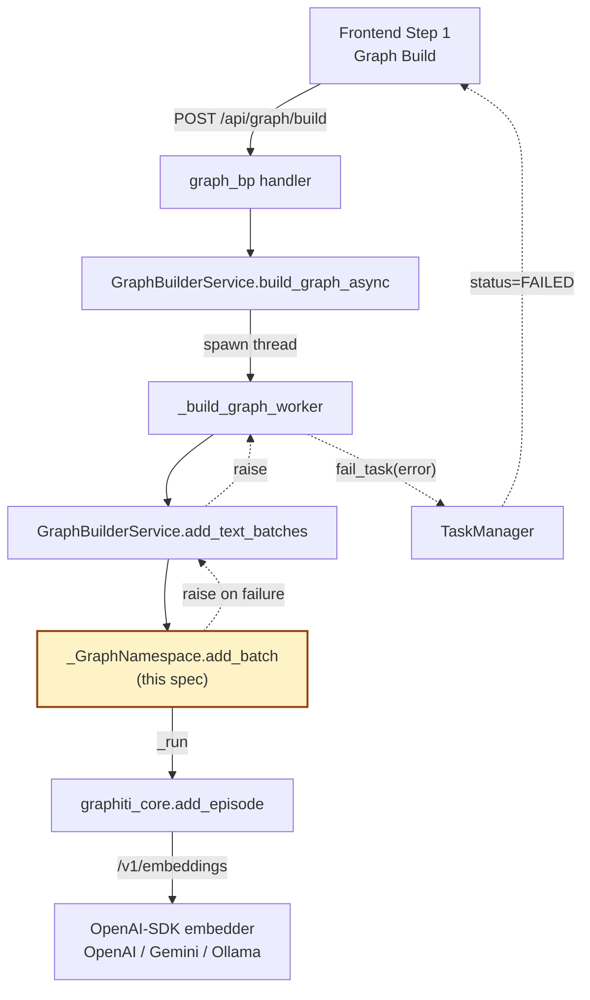

# Design Document — graphiti-ollama-embedder

## Overview

**Purpose**: Add first-class documentation for using a local Ollama embedder (`mxbai-embed-large`) with the Graphiti adapter, and remove the silent placeholder-UUID fallback in `_GraphNamespace.add_batch` so embedding failures terminate the surrounding graph-build `Task` with the underlying error visible.

**Users**: Self-hosting MiroFish operators who run the LLM/embedder stack locally on Ollama, and any operator hitting a misconfigured embedder (which currently produces an empty graph that *looks* successfully built).

**Impact**: The graph-build pipeline becomes correctly observable: invalid `EMBEDDING_*` configuration produces a `Task.status = FAILED` with the underlying error, instead of `COMPLETED` with no nodes. The change is invisible on the OpenAI/Gemini happy path.

### Goals
- R1 — `.env.example`, `CLAUDE.md`, `README.md`, `docker-compose.yml` document Ollama as a supported embedder configuration with `mxbai-embed-large` and a `curl` smoke test.
- R2 — embedding failures in `_GraphNamespace.add_batch` propagate to the calling background task, which terminates with `status=FAILED` and a non-empty `error`. ERROR-level logging instead of `WARNING`.
- R3 — OpenAI- and Gemini-based deployments are unchanged; no new env var; the 1024-dim constraint is documented.

### Non-Goals
- Adding a startup-time embedder health probe.
- Making `EMBEDDING_DIM` env-configurable to support 768-dim models.
- Adding an `ollama` provider literal in `_build_llm_and_embedder` (Ollama uses the existing `openai` branch with a different `EMBEDDING_BASE_URL`).
- Generic retry/backoff for transient embedder errors. Tracked as an explicit follow-up.

## Boundary Commitments

### This Spec Owns
- The documentation surface for Ollama embedder configuration in `.env.example`, `CLAUDE.md`, `README.md`, and `docker-compose.yml` comments.
- The error-propagation contract of `_GraphNamespace.add_batch` in `backend/app/services/graphiti_adapter.py`.
- Adapter-level ERROR-log emission for failed `add_episode` calls.

### Out of Boundary
- Behavior of `_GraphNamespace.add(...)` (single-episode path; already correct).
- Behavior of `_GraphNamespace.search(...)` (still allowed to log-and-return-empty per steering).
- The `_build_graph_worker` outer `try/except` and `fail_task` plumbing — already implements the contract this spec depends on.
- Any change to `_build_llm_and_embedder` (no provider literal added; existing `openai` branch is sufficient).
- Generic retry policy.

### Allowed Dependencies
- `app.utils.logger.get_logger(...)` for ERROR-level emission.
- The existing `_run` helper that drives async Graphiti calls on the persistent loop.
- The existing `Task` lifecycle methods (`fail_task`) called from `_build_graph_worker` — relied on, not modified.
- `graphiti_core.embedder.openai.OpenAIEmbedder` configured with arbitrary `base_url`.

### Revalidation Triggers
- Any future provider literal added to `_build_llm_and_embedder` (would change which env vars feed which embedder).
- Any change to the contract that `_GraphNamespace.add_batch` returns one `_EpisodeResult` per input episode in input order.
- Any change to how `_build_graph_worker` translates exceptions into `Task` failures (would invalidate the assumption that propagating from the adapter is sufficient).

## Architecture

### Existing Architecture Analysis
- The Graphiti adapter (`backend/app/services/graphiti_adapter.py`) is the **single** read/write surface for Neo4j (`tech.md`: "All graph reads/writes go through the `graphiti_adapter`").
- Graph build runs as a background `Task` (`models/task.py`), tracked through the `Task` model with `status`, `progress`, `error`, polled by the frontend.
- `error-handling.md` mandates that long-running tasks always reach `COMPLETED` or `FAILED`. The current silent-swallow path violates this by producing `COMPLETED` with no nodes.
- The `OpenAIEmbedder` from `graphiti_core` accepts an arbitrary `base_url` / `api_key` / `embedding_model`. Ollama's `/v1/embeddings` is OpenAI-compatible. No new client class is needed.

### Architecture Pattern & Boundary Map



**Architecture Integration**:
- **Selected pattern**: minimal extension of the existing adapter pattern — fix one method's failure semantics, add no new layer.
- **Domain/feature boundaries**: error propagation stays at the adapter; task-state translation stays in the worker; UI rendering of failed tasks is unchanged.
- **Existing patterns preserved**: single-surface graph adapter; background-task `Task` lifecycle; `_run` async-loop helper; `OpenAIEmbedder` reuse for any OpenAI-SDK target.
- **New components rationale**: none — no new module is introduced.
- **Steering compliance**:
  - `error-handling.md` § Background Task Errors — failure now terminates the task with a real error.
  - `error-handling.md` § Logging — ERROR level for unrecoverable; WARNING reserved for retry/recovered.
  - `tech.md` § Key Libraries — adapter remains the single graph read/write surface.

### Technology Stack & Alignment

| Layer | Choice / Version | Role in Feature | Notes |
|-------|------------------|-----------------|-------|
| Frontend / CLI | Vue 3.5 (unchanged) | Polls `Task` status; renders failure | No code change. |
| Backend / Services | Python ≥3.11, Flask 3.0, `graphiti-core ≥ 0.3` | `_GraphNamespace.add_batch` failure propagation | One method edited. |
| Data / Storage | Neo4j 5.x via `bolt://` (unchanged) | Same writes attempted; failed writes never partially commit because the adapter is the only path. | — |
| Messaging / Events | None | — | — |
| Infrastructure / Runtime | Optional Ollama daemon at `http://host.docker.internal:11434/v1` | Source of `mxbai-embed-large` embeddings (1024-dim). | Documented, not enforced. |

## File Structure Plan

### Modified Files
- `backend/app/services/graphiti_adapter.py` — replace the broad `except Exception` in `_GraphNamespace.add_batch` (lines ~471–473) with `logger.exception(...)` + `raise`. Remove the placeholder-UUID fallback. ~5 LOC delta.
- `.env.example` — add a commented Ollama embedder block (3 commented env-var lines + a 1-line comment about `ollama pull`).
- `CLAUDE.md` — extend the "Required Environment Variables" section to list three supported embedder providers (OpenAI, Gemini, Ollama) and the 1024-dim constraint.
- `README.md` — replace the single Gemini hint comment in the Required Environment Variables block with a short three-option block (OpenAI, Gemini, Ollama) and append a one-line `curl` smoke-test snippet inside the same setup section.
- `docker-compose.yml` — one comment line above the `mirofish` service noting that Ollama on the host is reached via `host.docker.internal:11434`.

### New Files
- None.

> No code is moved or split. All edits are local and additive except the 5-line deletion in `_GraphNamespace.add_batch`.

## System Flows

### Failure flow (the change)

```mermaid
sequenceDiagram
    autonumber
    participant W as _build_graph_worker
    participant A as add_text_batches
    participant NS as _GraphNamespace.add_batch
    participant G as graphiti_core.add_episode
    participant E as Embedder (Ollama / OpenAI)
    participant TM as TaskManager

    W->>A: chunks, batch_size
    loop per batch
        A->>NS: add_batch(group_id, episodes)
        loop per episode
            NS->>G: _run(add_episode(...))
            G->>E: POST /v1/embeddings
            alt embedder OK
                E-->>G: 200, vector(1024)
                G-->>NS: EpisodeResult
            else embedder error (404 / 401 / connection)
                E-->>G: 4xx/5xx
                G-->>NS: raise exception
                Note right of NS: logger.exception(...); raise
            end
        end
    end

    Note over A: try/except wraps add_batch and re-raises
    NS-->>A: raise
    A-->>W: raise
    W->>TM: fail_task(task_id, str(e) + traceback)
    TM-->>W: Task.status = FAILED
```

Decisions reflected in the diagram:
- The adapter raises immediately on any exception from `_g.add_episode`.
- The single-episode `add()` path (not shown) is unchanged because it already raises naturally.
- `add_text_batches` already re-raises after a localized progress message — no edit needed there.

## Requirements Traceability

| Requirement | Summary | Components | Interfaces | Flows |
|-------------|---------|------------|------------|-------|
| 1.1 | `.env.example` Ollama block | `.env.example` (modified file) | n/a | n/a |
| 1.2 | `CLAUDE.md` lists three providers + 1024-dim constraint | `CLAUDE.md` (modified file) | n/a | n/a |
| 1.3 | docker-compose / README note about `host.docker.internal:11434` | `docker-compose.yml`, `README.md` (modified files) | n/a | n/a |
| 1.4 | `curl` smoke-test snippet | `README.md` (modified file) | n/a | n/a |
| 1.5 | End-to-end build with `mxbai-embed-large` | `graphiti_adapter._build_llm_and_embedder` (unchanged) | `OpenAIEmbedderConfig` | Failure flow (happy path is identical to today) |
| 2.1 | No placeholder UUID on failure | `_GraphNamespace.add_batch` | `_EpisodeResult` (only emitted on success) | Failure flow |
| 2.2 | Propagate exception | `_GraphNamespace.add_batch` | n/a | Failure flow |
| 2.3 | `Task.FAILED` with non-empty error | `_build_graph_worker` (unchanged) | `TaskManager.fail_task` | Failure flow |
| 2.4 | Log at ERROR level | `_GraphNamespace.add_batch` | `logger.exception(...)` | Failure flow |
| 2.5 | UI shows error, no fake-success placeholder | Frontend Step 1 (unchanged) | Task polling | Failure flow |
| 2.6 | Preserve happy-path UUID contract | `_GraphNamespace.add_batch` | `_EpisodeResult.uuid_` | n/a |
| 3.1 | OpenAI/Gemini behavior unchanged | `_build_llm_and_embedder` (unchanged) | n/a | n/a |
| 3.2 | No new env var | scope rule | n/a | n/a |
| 3.3 | 1024-dim constraint documented | `CLAUDE.md` (modified file) | n/a | n/a |

## Components and Interfaces

| Component | Domain/Layer | Intent | Req Coverage | Key Dependencies (P0/P1) | Contracts |
|-----------|--------------|--------|--------------|--------------------------|-----------|
| `_GraphNamespace.add_batch` | services / graph-adapter | Ingest a batch of text episodes; raise on first failure; preserve UUIDs on success | 2.1, 2.2, 2.4, 2.6 | `graphiti_core.add_episode` (P0), `app.utils.logger` (P0) | Service |
| Documentation set (`.env.example`, `CLAUDE.md`, `README.md`, `docker-compose.yml`) | docs | Describe Ollama embedder configuration and constraints | 1.1, 1.2, 1.3, 1.4, 3.3 | none | Doc |

### graph-adapter / `_GraphNamespace.add_batch`

| Field | Detail |
|-------|--------|
| Intent | Ingest each episode through `graphiti_core.add_episode`; propagate the first failure to the caller; never substitute a placeholder UUID. |
| Requirements | 2.1, 2.2, 2.4, 2.6 |

**Responsibilities & Constraints**
- Iterate `episodes` in input order.
- For each episode, call `_run(self._g.add_episode(...))` and append a `_EpisodeResult` whose `uuid_` matches the Graphiti-assigned episode UUID.
- On any exception from `_run(...)`, emit `logger.exception(...)` (ERROR level with traceback) including the `graph_id` and the index of the failing episode for diagnosability, then `raise`.
- Do **not** swallow the exception. Do **not** return a `_EpisodeResult` for the failed episode. Do **not** continue the loop after a failure.
- Domain boundary: the method speaks Graphiti and Python exceptions; it does not know about `Task` lifecycles.
- Data ownership: emits `_EpisodeResult` instances only for successfully ingested episodes.

**Dependencies**
- Inbound: `GraphBuilderService.add_text_batches` (P0, sole production caller for this method).
- Outbound: `graphiti_core.add_episode` via `_run(...)` (P0).
- External: `app.utils.logger.get_logger("mirofish.graph_builder")` (P0).

**Contracts**: Service [x] / API [ ] / Event [ ] / Batch [ ] / State [ ]

##### Service Interface
```python
class _GraphNamespace:
    def add_batch(self, graph_id: str, episodes: List[Any]) -> List[_EpisodeResult]:
        """Add a batch of episodes.

        Returns a list of _EpisodeResult, one per successfully ingested
        episode, in input order. Raises the underlying exception on the
        first failure; partial results are not returned.

        Preconditions:
            - graph_id is a non-empty per-project group_id.
            - Each item in `episodes` exposes a `data` attribute (str)
              or stringifies to a meaningful body.

        Postconditions:
            - On success: len(returned list) == len(episodes), each
              `_EpisodeResult.uuid_` is the Graphiti-assigned UUID.
            - On failure: an exception is raised; no `_EpisodeResult`
              is returned for the failing episode and no further episodes
              are attempted; partial successes prior to the failure are
              committed in Neo4j (this matches today's behavior because
              `add_episode` is invoked synchronously per episode).

        Invariants:
            - Never returns a `_EpisodeResult` whose UUID was generated
              locally as a placeholder.
        """
```

- Preconditions: as above.
- Postconditions: as above.
- Invariants: never emit a placeholder UUID.

**Implementation Notes**
- Integration: the method is called from `GraphBuilderService.add_text_batches` (graph_builder.py:289–308), which already wraps the call in `try/except Exception: progress_callback(...); raise`. No caller-side change.
- Validation: input shape unchanged.
- Risks: an environment that was producing "successful" empty graphs because of the silent fallback will now produce a failed `Task`. This is the intended correction; PR description must call it out.

### Documentation set

**Edits (verbatim intent)**:
- `.env.example` — add an opt-in commented block, e.g.:
  ```env
  # Local embeddings via Ollama (run: ollama pull mxbai-embed-large).
  # mxbai-embed-large is 1024-dim, matching Graphiti's default EMBEDDING_DIM.
  # EMBEDDING_BASE_URL=http://host.docker.internal:11434/v1
  # EMBEDDING_API_KEY=ollama
  # EMBEDDING_MODEL=mxbai-embed-large
  ```
- `CLAUDE.md` — extend the embedder note to enumerate OpenAI / Gemini / Ollama and call out the 1024-dim constraint.
- `README.md` — keep the existing Gemini comment, add the Ollama three-line example, append the `curl` smoke-test below the env block.
- `docker-compose.yml` — one comment above the `mirofish` service: `# Note: Ollama on the host is reachable from this container via host.docker.internal:11434`.

These edits are doc-only; they do not affect the runtime contract.

## Data Models

No new data models. The `_EpisodeResult` dataclass shape is unchanged. The `Task` model is unchanged. The `Project.status` lifecycle is unchanged.

## Error Handling

### Error Strategy
- The adapter raises on first failure; the worker catches and routes to `Task.fail_task`. This is the existing project pattern (`error-handling.md` § Background Task Errors), and this spec aligns the adapter with it.
- No retries inside `add_batch`. Transient resilience, if added later, belongs at a layer that owns idempotency considerations (out of scope).

### Error Categories and Responses
- **Embedder configuration errors** (404 unknown model, 401 unauthorized, connection refused) → adapter raises → worker fails the task with the exception's `str()` plus traceback → frontend renders `Task.error`. Operator action: fix `EMBEDDING_*` env vars per the new docs and re-run the build.
- **Embedder transient errors** (timeouts, intermittent 5xx) → today, treated identically to configuration errors (task fails). Future follow-up may narrow this with `retry_with_backoff`.
- **Graphiti-internal errors** unrelated to embeddings (e.g., Neo4j unavailable) → already raised by `_run(...)` and currently swallowed; this fix surfaces them too. Treated as a positive side effect.

### Monitoring
- `logger.exception(...)` in `_GraphNamespace.add_batch` adds a full traceback at ERROR level, enabling existing log-aggregation setups to alert on adapter-level errors.
- `_build_graph_worker` already calls `logger.exception(f"task {task_id} failed")`; the two log lines are complementary (adapter-context vs. task-context).

## Testing Strategy

This is an extension feature — the project's testing stance is intentionally minimal (`tech.md`: "pytest is wired ... but coverage is intentionally minimal. Don't add a heavy test harness without discussing scope.").

### Unit Tests (lightweight, optional)
- If we add a test, the right scope is a single pytest case for `_GraphNamespace.add_batch` that monkeypatches `self._g.add_episode` to raise, calls `add_batch`, and asserts the exception propagates and no `_EpisodeResult` is returned. Do not add a heavier harness.

### Manual / End-to-End
1. **Happy path (OpenAI)**: existing setup — verify graph build still completes with real nodes/edges (no behavior change expected).
2. **Happy path (Ollama)**: `ollama pull mxbai-embed-large`; set the three `EMBEDDING_*` env vars per `.env.example`; run the smoke-test `curl` to confirm 1024-dim response; run a graph build through the UI; verify Neo4j has nodes/edges.
3. **Failure path (typo'd model)**: set `EMBEDDING_MODEL=text-embedding-3-small-typo` against an Ollama base URL; trigger a graph build; verify the task transitions to `FAILED` with the underlying 404 message visible in `Task.error` and the UI; verify backend logs include the ERROR-level traceback.

### Performance / Load
- Not applicable. No throughput change expected on the happy path. Failure path returns earlier than today (bonus).

## Security Considerations
- No new secrets introduced. `EMBEDDING_API_KEY=ollama` is documented as a placeholder string ignored by Ollama; this is consistent with the project's existing handling of `ZEP_API_KEY` (empty string acceptable).
- `error-handling.md` § Logging forbids logging API keys / full prompts. `logger.exception(...)` includes the exception message and traceback — Graphiti's exceptions do not echo API keys, but the ERROR log line should not include the request body. Implementation note: log only `graph_id` and episode index alongside the exception.

## Migration Strategy
- None. The fix is purely additive on documentation and a strictly-more-correct behavior change in `add_batch`. Operators do not need to take action unless their graphs were silently empty, in which case this surfacing IS the migration trigger.
