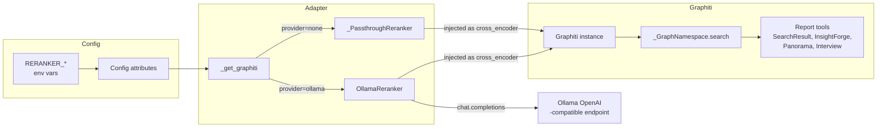
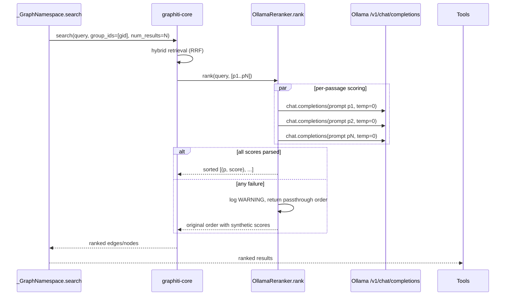

# Design — graphiti-ollama-reranker

## Overview
**Purpose**: Replace the no-op `_PassthroughReranker` injected into Graphiti with a real Ollama-backed `CrossEncoderClient`, so that hybrid search results consumed by the ReportAgent tools (`SearchResult`, `InsightForge`, `Panorama`, `Interview`) are ordered by model-judged relevance rather than Graphiti's RRF fallback ordering. Configuration is env-driven (`RERANKER_PROVIDER`, `RERANKER_MODEL`, `RERANKER_BASE_URL`, `RERANKER_API_KEY`) with Ollama-aligned defaults; an explicit `RERANKER_PROVIDER=none` preserves the passthrough for CI and slim containers.

**Users**: Backend developers running the local-first stack against Ollama; operators deploying MiroFish behind any OpenAI-compatible reranker endpoint; CI users who explicitly disable reranking.

**Impact**: Adds one new module under `backend/app/services/`, four `Config` attributes, a small selection branch in `_get_graphiti()`, and documentation in `.env.example`, `CLAUDE.md`, `README.md`. No data schema, no API, no UI changes. Behavior under `RERANKER_PROVIDER=none` is identical to today.

### Goals
- Default Ollama-backed reranker producing one `(passage, score)` tuple per input passage, sorted descending by score.
- Env-driven configuration with sensible Ollama defaults inherited from existing `EMBEDDING_*` settings.
- Graceful degradation: Flask boots and graph search keeps working even when the Ollama service or the configured model is unavailable.
- Documentation parity with `EMBEDDING_*` knobs in `.env.example`, `CLAUDE.md`, and `README.md`.

### Non-Goals
- Building a Dashscope/OpenAI/Gemini reranker (out of scope per ticket #39).
- Changing `LLM_MODEL_NAME` or `EMBEDDING_MODEL` defaults.
- Upstream contributions to `graphiti-core`.
- Adding a `sentence-transformers` or other non-`openai` reranker dependency.

## Boundary Commitments

### This Spec Owns
- The Ollama reranker implementation and its prompt/parse logic.
- The `RERANKER_PROVIDER`, `RERANKER_MODEL`, `RERANKER_BASE_URL`, `RERANKER_API_KEY` settings and their defaults.
- The branch in `_get_graphiti()` that selects between the Ollama reranker and the passthrough.
- The startup INFO log line that announces the selected reranker.
- Documentation entries in `.env.example`, `CLAUDE.md` "Required Environment Variables", and `README.md` Ollama prerequisites.

### Out of Boundary
- Graphiti's own search ranking, hybrid retrieval, or embedding pipeline.
- Per-passage retrieval (still owned by `_GraphNamespace.search` and Graphiti).
- The `group_id` scoping rules.
- Any change to the four ReportAgent tools (`SearchResult`, `InsightForge`, `Panorama`, `Interview`) — they receive reranked output transparently.
- Implementation of additional reranker providers; this design covers only `ollama` and `none`.

### Allowed Dependencies
- Upstream library: `graphiti_core.cross_encoder.client.CrossEncoderClient` (P0).
- In-repo: `Config` (`backend/app/config.py`), `get_logger` (`backend/app/utils/logger.py`), `openai.AsyncOpenAI` (already installed).
- Existing factory: `_get_graphiti()` continues to be the singleton chokepoint.

### Revalidation Triggers
- If `graphiti-core` changes the `CrossEncoderClient.rank` signature, this design must be revisited.
- If a future spec adds a third reranker provider, the inline branch should be considered for promotion to a registry (Option C in `research.md`).
- If `Config.GRAPHITI_LLM_PROVIDER` semantics change in a way that re-couples LLM and reranker, this design must be checked.

## Architecture

### Existing Architecture Analysis
- `_get_graphiti()` already injects an explicit `cross_encoder=_PassthroughReranker()` (line 156). The pattern of double-checked-locking singleton with provider switch (`GRAPHITI_LLM_PROVIDER`) is mature and must be preserved.
- The persistent event loop (`_get_loop`, `_run`) is used for Graphiti async calls from the synchronous Flask layer. The reranker itself runs inside Graphiti's own awaited path; the new reranker therefore does **not** need to schedule work onto `_get_loop()`.
- All four ReportAgent tools call `_GraphNamespace.search`, which already swallows reranker exceptions into a logged warning. The new reranker tightens this further by handling its own errors internally so it never raises.

### Architecture Pattern & Boundary Map



**Architecture Integration**:
- **Selected pattern**: Strategy pattern with two implementations selected at factory time. Same shape as the existing `GRAPHITI_LLM_PROVIDER` branch.
- **Domain/feature boundaries**: Reranker construction and prompt/parse live in `ollama_reranker.py`. Wiring lives in `graphiti_adapter.py`. Config lives in `config.py`. No overlap.
- **Existing patterns preserved**: Double-checked-locking singleton; explicit `cross_encoder` injection (Graphiti never falls back to its OpenAI default); persistent event loop unchanged; `Config` reads via `os.environ.get(..., default)`.
- **New components rationale**: `OllamaReranker` is a new boundary because it owns external I/O against a different endpoint (the Ollama chat surface), separate from the existing OpenAI embedder/LLM clients.
- **Steering compliance**: Single OpenAI-SDK convention preserved; per-project `group_id` scoping unaffected; no new dependency.

### Technology Stack

| Layer | Choice / Version | Role in Feature | Notes |
|-------|------------------|-----------------|-------|
| Backend / Services | Python ≥3.11, async via `asyncio` | Hosts the new reranker class. | Inherits project minimum. |
| LLM client | `openai` SDK (already pinned, v2.x) | `AsyncOpenAI` chat completions against Ollama's `/v1`. | No new dependency. |
| Model | Ollama-served chat model, default `qwen2.5:3b` | Produces a numeric relevance score per passage. | Operator may override via `RERANKER_MODEL`. |
| Endpoint | Ollama's OpenAI-compatible `/v1` | Default `http://localhost:11434/v1`. | Reuses `EMBEDDING_BASE_URL` semantics. |
| Graph layer | `graphiti-core ≥ 0.3` | Consumes the new `CrossEncoderClient`. | No upstream change. |

## File Structure Plan

### Directory Structure
```
backend/app/
├── services/
│   ├── graphiti_adapter.py        # MODIFIED — factory branches on RERANKER_PROVIDER
│   └── ollama_reranker.py         # NEW — OllamaReranker(CrossEncoderClient)
├── config.py                      # MODIFIED — adds RERANKER_* attrs
└── utils/
    └── logger.py                  # unchanged

repo-root/
├── .env.example                   # MODIFIED — adds RERANKER_* block
├── CLAUDE.md                      # MODIFIED — Required Environment Variables
└── README.md                      # MODIFIED — Ollama prerequisites note
```

### Modified Files
- `backend/app/services/graphiti_adapter.py` — Add small branch in `_get_graphiti()` that picks `OllamaReranker()` or `_PassthroughReranker()` based on `Config.RERANKER_PROVIDER`. Log the selection at INFO. `_PassthroughReranker` class is unchanged.
- `backend/app/config.py` — Add four new class attributes with documented defaults. No change to existing `validate()` (reranker has no mandatory key).
- `.env.example` — Add a four-line `RERANKER_*` block with comments mirroring the `EMBEDDING_*` style.
- `CLAUDE.md` — Extend the "Required Environment Variables" code block under "Architecture" with the four new vars.
- `README.md` — Update the Ollama prerequisite section to mention `ollama pull qwen2.5:3b` alongside the existing `ollama pull mxbai-embed-large`.

> `_PassthroughReranker` stays in `graphiti_adapter.py` (unchanged contract); only the wiring around it changes.

## System Flows



**Decision points after diagram**:
- `temperature=0.0` makes the score deterministic per (query, passage, model) tuple.
- Per-passage failures (one bad parse out of N) downrank that passage to `0.0 - 0.001 * index` and continue; only whole-call exceptions degrade to passthrough.
- The reranker never raises; this isolates Graphiti from upstream noise even when `_GraphNamespace.search`'s existing exception swallow is removed in a future refactor.

## Requirements Traceability

| Requirement | Summary | Components | Interfaces | Flows |
|-------------|---------|------------|------------|-------|
| 1.1 | Default reranker is Ollama-backed | `_get_graphiti()`, `OllamaReranker` | Inline factory branch | Adapter init |
| 1.2 | No dependency on `OpenAIRerankerClient` | `_get_graphiti()` | Explicit `cross_encoder=` injection (unchanged behavior) | — |
| 1.3 | Unset → defaults to `ollama` | `Config.RERANKER_PROVIDER` | `os.environ.get('RERANKER_PROVIDER', 'ollama')` | — |
| 1.4 | No `gpt-4.1-nano` reference | All new files | — | — |
| 2.1 | Subclass `CrossEncoderClient.rank` | `OllamaReranker` | `async rank(query, passages) -> list[tuple[str, float]]` | Per-passage scoring |
| 2.2 | Uses `openai.AsyncOpenAI` | `OllamaReranker.__init__` | `AsyncOpenAI(base_url, api_key)` | — |
| 2.3 | Returns passages sorted descending | `OllamaReranker.rank` | Postcondition: descending by score | — |
| 2.4 | Empty input → empty output, no model call | `OllamaReranker.rank` | Guard at method entry | — |
| 2.5 | Preserves passage strings byte-for-byte | `OllamaReranker.rank` | Strings are echoed, never rewritten | — |
| 2.6 | Unparseable score → deterministic low fallback | `OllamaReranker.rank` | Internal `_parse_score` helper | Failure branch |
| 3.1 | `RERANKER_PROVIDER` env knob | `Config` | Class attr, default `ollama`, validated `{ollama, none}` | Adapter init |
| 3.2 | `RERANKER_MODEL` env knob | `Config` | Class attr, default `qwen2.5:3b` | — |
| 3.3 | `RERANKER_BASE_URL` defaults to `EMBEDDING_BASE_URL` | `Config` | Class attr resolves at read time | — |
| 3.4 | `RERANKER_API_KEY` defaults to `EMBEDDING_API_KEY` | `Config` | Class attr | — |
| 3.5 | Unknown value → `ValueError` | `_get_graphiti()` | `_ALLOWED_RERANKER_PROVIDERS` validation | Adapter init |
| 3.6 | Reads via `os.environ.get` only | `Config` | — | — |
| 4.1 | `none` keeps `_PassthroughReranker` | `_get_graphiti()` | Factory branch | Adapter init |
| 4.2 | Graph search remains functional under `none` | `_PassthroughReranker.rank` (unchanged) | — | — |
| 4.3 | INFO log announces selected provider | `_get_graphiti()` | `logger.info` line | Adapter init |
| 5.1 | WARNING log on rerank failure | `OllamaReranker.rank` | `logger.warning` with model + error class | Failure branch |
| 5.2 | No exception propagation to HTTP callers | `OllamaReranker.rank` (never raises) | — | — |
| 5.3 | Original order on whole-call failure | `OllamaReranker.rank` | Passthrough fallback inside method | Failure branch |
| 5.4 | `__init__` never raises | `OllamaReranker.__init__` | `AsyncOpenAI()` lazy I/O | Adapter init |
| 6.1 | `.env.example` documents the four vars | `.env.example` | — | — |
| 6.2 | `CLAUDE.md` lists the four vars | `CLAUDE.md` | — | — |
| 6.3 | `README.md` mentions `ollama pull <model>` | `README.md` | — | — |
| 6.4 | Old "follow-up" claim updated | `graphiti-neo4j-finalize/research.md` (or design.md) | — | — |
| 7.1 | Reranked order reaches `_GraphNamespace.search` | `OllamaReranker`, `_get_graphiti()` | Through Graphiti's own `search()` | End-to-end |
| 7.2 | No changes to report tools | n/a | n/a | — |
| 7.3 | `group_id` scoping unchanged | `_GraphNamespace.search` (unchanged) | — | — |

## Components and Interfaces

| Component | Domain/Layer | Intent | Req Coverage | Key Dependencies (P0/P1) | Contracts |
|-----------|--------------|--------|--------------|--------------------------|-----------|
| `OllamaReranker` | Backend / Services | Score passages against a query via Ollama chat completions. | 1.1, 1.4, 2.1–2.6, 5.1–5.4, 7.1 | `graphiti_core.cross_encoder.client.CrossEncoderClient` (P0); `openai.AsyncOpenAI` (P0); `Config` (P0); `get_logger` (P1) | Service |
| `Config` (extended) | Backend / Config | Expose four new reranker attrs with documented defaults. | 1.3, 3.1–3.6, 4.1 | `os.environ.get` (P0) | State (configuration) |
| `_get_graphiti()` (extended) | Backend / Adapter | Pick reranker implementation; validate provider; log selection. | 1.1, 1.2, 3.5, 4.1, 4.3 | `Config` (P0); `OllamaReranker` (P0); `_PassthroughReranker` (P0); `Graphiti` (P0) | Service |
| `.env.example`, `CLAUDE.md`, `README.md` | Docs | Communicate new knobs and Ollama prerequisite. | 6.1–6.4 | — | — |

---

### Backend / Services

#### `OllamaReranker`

| Field | Detail |
|-------|--------|
| Intent | Score each passage's relevance to a query via an Ollama-served chat model, returning passages sorted descending by score. |
| Requirements | 1.1, 1.4, 2.1–2.6, 5.1–5.4, 7.1 |

**Responsibilities & Constraints**
- Subclass `graphiti_core.cross_encoder.client.CrossEncoderClient`; implement only `rank`.
- Use `openai.AsyncOpenAI`; no second SDK; no top-level network I/O in `__init__`.
- Preserve passage strings byte-for-byte; never rewrite or truncate.
- Never raise from `rank()`. On any failure path, log once at WARNING and fall back to passthrough order with deterministic synthetic scores.
- Deterministic scoring: `temperature=0.0`, no randomness in fallback scores.
- Thread-safety: stateless beyond the immutable `AsyncOpenAI` client and string config; safe under Graphiti's concurrent search.

**Dependencies**
- Inbound: `_get_graphiti()` — instantiates a single instance and passes it as `cross_encoder=` to `Graphiti(...)` (P0).
- Outbound: `Ollama /v1/chat/completions` via `openai.AsyncOpenAI` (P0).
- External: `graphiti_core.cross_encoder.client.CrossEncoderClient` (P0); `openai` SDK (P0).

**Contracts**: Service [x]

##### Service Interface

```python
class OllamaReranker(CrossEncoderClient):
    def __init__(
        self,
        *,
        model: str,
        base_url: str,
        api_key: str,
    ) -> None: ...

    async def rank(
        self,
        query: str,
        passages: list[str],
    ) -> list[tuple[str, float]]:
        """
        Score each passage's relevance to `query` and return
        `(passage, score)` tuples sorted in descending order of score.

        Preconditions:
            - `passages` is a (possibly empty) list of strings.

        Postconditions:
            - len(return) == len(passages).
            - return is sorted by score descending.
            - For all i, return[i][0] is byte-identical to one of the inputs.
            - For any rank() call, this method does not raise.

        Invariants:
            - Successfully-parsed scores fall in [0.0, 1.0].
            - Fallback scores assigned to unparseable passages fall in [-1.0, 0.0)
              and are strictly less than every successfully-parsed score.
        """
```

**Implementation Notes**
- **Integration**: Constructed inside `_get_graphiti()` when `Config.RERANKER_PROVIDER == "ollama"`; injected into `Graphiti(..., cross_encoder=...)`.
- **Validation**:
  - Reject empty `passages` immediately with `return []`.
  - Clip parsed `score` to `[0.0, 1.0]`.
  - Treat any uncaught per-passage exception as parse failure and assign deterministic fallback `-0.001 * passage_index`.
  - Treat any whole-call exception (e.g. connection refused) as graceful degrade: return `[(p, 1.0 - 0.01 * i) for i, p in enumerate(passages)]`.
- **Risks**: Default `qwen2.5:3b` must be `ollama pull`-ed by operators; documented in README. If absent, R5 path kicks in.

---

### Backend / Config

#### `Config` (extended)

| Field | Detail |
|-------|--------|
| Intent | Surface env-driven configuration for the reranker with Ollama-aligned defaults. |
| Requirements | 1.3, 3.1–3.6, 4.1 |

**Responsibilities & Constraints**
- Read from `os.environ.get` only; no new dependency.
- `RERANKER_PROVIDER` default `ollama`; valid values: `ollama`, `none`.
- `RERANKER_MODEL` default `qwen2.5:3b`.
- `RERANKER_BASE_URL` default = `EMBEDDING_BASE_URL` value at module load time.
- `RERANKER_API_KEY` default = `EMBEDDING_API_KEY` value at module load time.
- Validation of `RERANKER_PROVIDER` happens in `_get_graphiti()` (not `Config.validate()`) to keep the validate-at-boot list focused on credential presence.

**Contracts**: State [x]

##### State Management
- **State model**: Read-only class attributes resolved once at import.
- **Persistence & consistency**: None; values come from environment.
- **Concurrency strategy**: Immutable after import; safe.

**Implementation Notes**
- **Integration**: Defaults for `RERANKER_BASE_URL` / `RERANKER_API_KEY` should reference the corresponding `EMBEDDING_*` env vars (not the resolved `Config.EMBEDDING_BASE_URL` constant) so an operator setting only `EMBEDDING_BASE_URL` still gets the reranker pointed at the same Ollama host without needing to set `RERANKER_BASE_URL` explicitly. Implementation reads `os.environ.get('RERANKER_BASE_URL', os.environ.get('EMBEDDING_BASE_URL', 'http://localhost:11434/v1'))`.
- **Validation**: None at config-load time. Provider value is validated by `_get_graphiti()`.
- **Risks**: An operator who overrides `EMBEDDING_BASE_URL` but not `RERANKER_BASE_URL` will silently retarget the reranker too. This is intentional (single-host Ollama deployment) and documented.

---

### Backend / Adapter

#### `_get_graphiti()` (extended)

| Field | Detail |
|-------|--------|
| Intent | Select and inject the appropriate `CrossEncoderClient` based on `Config.RERANKER_PROVIDER`; log the choice. |
| Requirements | 1.1, 1.2, 3.5, 4.1, 4.3 |

**Responsibilities & Constraints**
- Preserve double-checked locking and singleton semantics exactly.
- Read `Config.RERANKER_PROVIDER` once at construction; do not re-read.
- For `ollama`: construct `OllamaReranker(model=..., base_url=..., api_key=...)`.
- For `none`: construct `_PassthroughReranker()` (current behavior preserved).
- For any other value: raise `ValueError("Unknown RERANKER_PROVIDER=%r; allowed: ('ollama', 'none')")` — mirrors the existing `_ALLOWED_GRAPHITI_PROVIDERS` validation pattern.
- Log at INFO once: `f"Initializing Graphiti reranker (provider={provider})..."`.

**Contracts**: Service [x]

##### Service Interface

```python
def _get_graphiti() -> Graphiti:
    """Singleton Graphiti factory; selects reranker via Config.RERANKER_PROVIDER."""
```

**Implementation Notes**
- **Integration**: Replaces the unconditional `cross_encoder=_PassthroughReranker()` at `graphiti_adapter.py:156` with a `cross_encoder=_build_reranker(provider)` call. The factory helper lives next to `_build_llm_and_embedder` in the same file.
- **Validation**: Provider validation raises before constructing the Graphiti instance, so misconfiguration fails fast and obvious.
- **Risks**: A typo such as `RERANKER_PROVIDER=Ollama` (capitalized) would raise; the helper lowercases the value before comparison, matching `_get_graphiti`'s existing `(... or "openai").lower()` pattern.

---

### Documentation

| File | Change | Requirements |
|------|--------|--------------|
| `.env.example` | Add commented block with the four `RERANKER_*` vars and their defaults. Position adjacent to the existing `EMBEDDING_*` block. | 6.1 |
| `CLAUDE.md` | Extend the "Required Environment Variables" code fence under "Architecture" → "Required Environment Variables" with the four new vars and a one-line note about `RERANKER_PROVIDER=none`. | 6.2 |
| `README.md` | In the "Install Ollama and pull the default embedding model" section, add `ollama pull qwen2.5:3b` step (or reference the model variable). In the `.env` snippet, add the four `RERANKER_*` lines with brief comments. | 6.3 |
| `.kiro/specs/graphiti-neo4j-finalize/research.md` | Update the "A real per-provider reranker is a follow-up" claim to point at this spec. | 6.4 |

> README also has `README-EN.md` and `README-ZH.md` — the canonical user-facing README is `README.md` per the existing structure. Other localized READMEs are out of scope unless a quick parity edit fits without translation work; if a Chinese translation already exists for the embedder section, the Chinese README receives the same one-line addition.

## Data Models
Not applicable. No persistent storage, no schema changes, no API payloads. The only structured value flowing through the system is the `list[tuple[str, float]]` already defined by `CrossEncoderClient.rank`.

## Error Handling

### Error Strategy
- **Construction errors**: None possible (no network in `__init__`; no required keys to validate).
- **Per-passage errors**: Caught inside `OllamaReranker.rank`. Logged at DEBUG once per failed passage (suppress spam). Passage receives a deterministic fallback score that places it after all successfully-scored passages but keeps it in the output exactly once.
- **Whole-call errors** (connection refused, 404 model not found, timeout, OpenAI SDK exception): Caught at the outermost `try/except` in `rank`. Logged at WARNING with model name and error class. Returns `[(p, 1.0 - 0.01 * i) for i, p in enumerate(passages)]` — same shape as `_PassthroughReranker` so consumers cannot tell the difference structurally.
- **Configuration errors**: `_get_graphiti()` raises `ValueError` at startup if `RERANKER_PROVIDER` is unknown. The Flask app fails to boot — preferred over silent misconfiguration.

### Error Categories and Responses
| Category | Trigger | Response |
|----------|---------|----------|
| System (5xx-equivalent) | Ollama unreachable, timeout | WARNING log; passthrough order; search succeeds. |
| User input (4xx-equivalent) | Unknown `RERANKER_PROVIDER` value | `ValueError` at startup; clear message naming allowed values. |
| Business rule | Model emits unparseable score | DEBUG log; per-passage fallback score; passage retained. |

### Monitoring
- INFO log at startup states the selected provider.
- WARNING log on whole-call failure includes model and error class; aggregation systems can alert on rate.
- No metrics surface yet; can be added if the reranker becomes a hot path.

## Testing Strategy

This project intentionally keeps the test surface minimal (`backend/scripts/test_profile_format.py` is the lone pytest target). Per `steering/tech.md`, do **not** add a heavy test harness.

- **Unit-level verification** (manual, by the implementer, no committed test files unless small and clearly worth keeping):
  1. Constructing `OllamaReranker` with a bad host does not raise; first `rank()` call logs WARNING and returns passthrough output.
  2. `rank(query, [])` returns `[]` and does not call the client.
  3. Successful path returns the correct number of passages, sorted descending, every input echoed byte-for-byte.
  4. Bad JSON output for one passage out of N leaves that passage at the bottom; other passages keep their parsed scores.
- **Integration smoke** (manual): With `qwen2.5:3b` pulled, run a graph build and a report-tool search; confirm the WARNING log is absent and the result order changes vs. `RERANKER_PROVIDER=none`.
- **Boundary verification**: Grep that `gpt-4.1-nano` and `OpenAIRerankerClient` do not appear in any new code path.

## Supporting References
- `research.md` — Discovery findings, alternative scoring strategies, model-choice rationale, defensive parse pattern.
- `gap-analysis.md` — Requirement-to-asset map.
- `.ticket/39.md` — Source ticket text.
