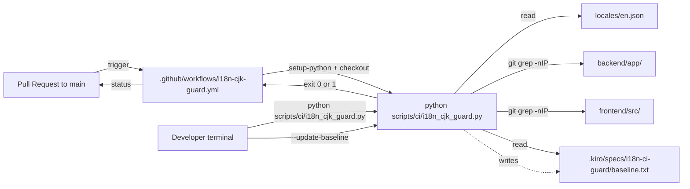
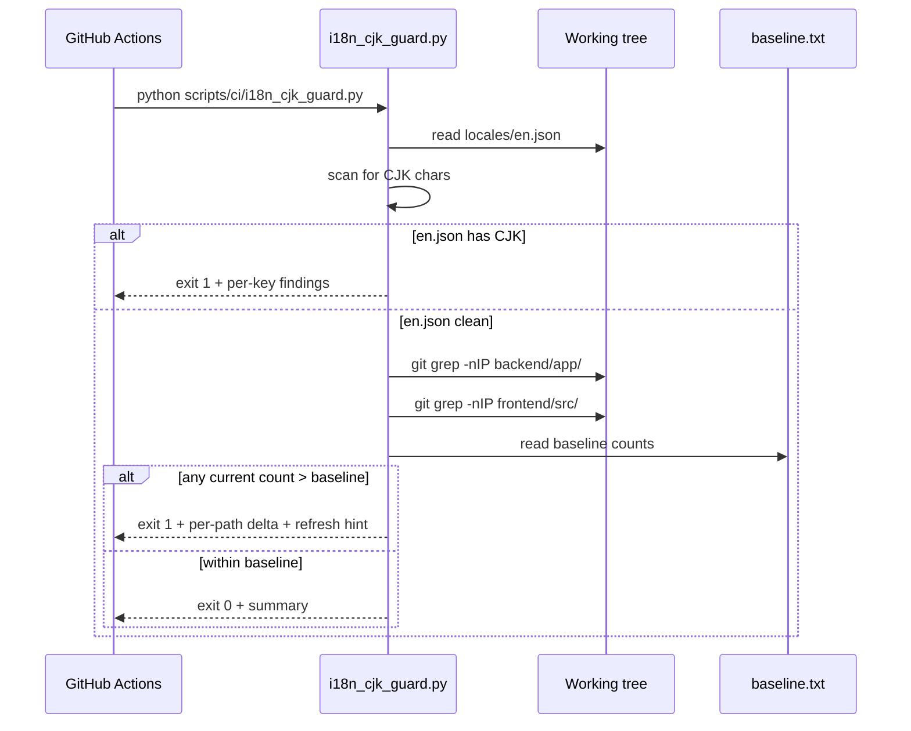
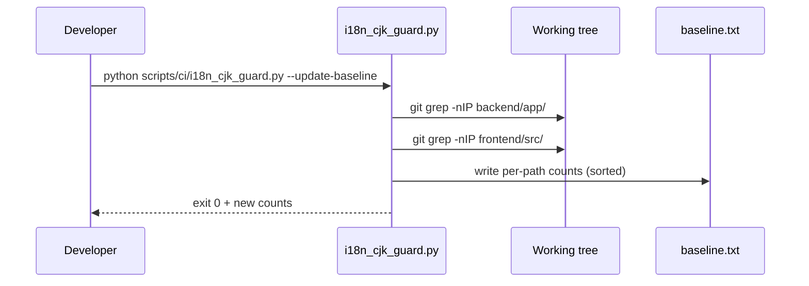

# Design — i18n-ci-guard

## Overview

This feature installs a permanent, PR-time CI guard that blocks
regressions of the project's English-by-default state. It performs two
checks: `locales/en.json` must contain zero CJK characters, and the
total CJK match count under `backend/app/` and `frontend/src/` must not
exceed a committed per-path baseline. The guard is a single Python
script invoked by a single GitHub Actions workflow.

**Purpose**: This feature delivers an automatic regression gate to the
i18n initiative so reviewers do not have to spot CJK reintroductions
by eye.
**Users**: Project maintainers and PR authors. Maintainers gain a
hard regression gate; PR authors gain a script they can run locally to
catch regressions before pushing.
**Impact**: Adds the project's first `pull_request`-triggered CI
workflow. No production source under `backend/app/`, `frontend/src/`,
or `locales/` is modified by this spec — only new files are added.

### Goals

- Fail any PR that introduces a CJK character into `locales/en.json`.
- Fail any PR whose CJK match count under `backend/app/` or
  `frontend/src/` exceeds the committed baseline.
- Print a single actionable failure message that includes the exact
  command a contributor must run if the regression is intentional.
- Run end-to-end under sixty seconds on `ubuntu-latest`.
- Be reproducible verbatim on a developer machine with Python ≥3.11
  and `git`.

### Non-Goals

- Re-implementing the full classification pipeline from
  `.kiro/specs/i18n-e2e-english-verification/` (that work belongs to
  PR #27).
- Auto-updating the baseline on `main`.
- Translating any production source to satisfy a higher baseline. The
  initial baseline is recorded against `main` and only ratchets down
  over time.
- Gating commits at pre-commit time. The guard is CI-only; a future
  spec may wrap it in a hook.

## Boundary Commitments

### This Spec Owns

- The guard script `scripts/ci/i18n_cjk_guard.py` and its CLI
  contract.
- The workflow `.github/workflows/i18n-cjk-guard.yml` and its
  trigger configuration.
- The baseline file `.kiro/specs/i18n-ci-guard/baseline.txt` and its
  format.
- The pass/fail semantics of both checks.

### Out of Boundary

- Any change to files under `backend/app/`, `frontend/src/`, or
  `locales/` — except `locales/en.json` if it is found to contain CJK
  during initial baseline calibration (a remediation translation would
  be a separate spec/PR).
- The classification heuristics in PR #27's `classify.py`.
- Pre-commit hooks; IDE integrations; alternative scoped paths beyond
  `backend/app/` and `frontend/src/`.

### Allowed Dependencies

- Python ≥3.11 standard library.
- `git` (for `git grep -nIP` invocation).
- `actions/checkout@v4` and `actions/setup-python@v5` from the
  GitHub Actions Marketplace.

### Revalidation Triggers

- Adding a third scoped path → baseline file format changes; consumers
  (none today) re-check.
- Changing the regex range → audit pipeline alignment must be
  re-confirmed.
- Switching from `pull_request` to `merge_group` or other event →
  required-status-check rules in branch protection must be re-checked.

## Architecture

### Existing Architecture Analysis

- **Repo layout**: monorepo split by runtime (`backend/`, `frontend/`)
  with shared `locales/` at root. The guard scopes its scan to
  `backend/app/`, `frontend/src/`, and `locales/en.json`, matching the
  audit pipeline's canonical scope.
- **Existing scripts pattern**: `scripts/<purpose>.py` for developer
  tools. The new `scripts/ci/` subdirectory introduces a clear,
  CI-only home without disturbing the existing developer scripts.
- **Existing CI**: `.github/workflows/docker-image.yml` is tag-only.
  No `pull_request` workflow exists. The new workflow is additive and
  does not affect the docker-image workflow.

### Architecture Pattern & Boundary Map



**Architecture Integration**:

- **Selected pattern**: single-purpose script + thin workflow.
  Matches the project's existing `scripts/<purpose>.py` convention.
- **Domain boundaries**: the guard is a pure verification tool with no
  side effects on production code. Its only writeable surface is the
  baseline file, and only when explicitly invoked with
  `--update-baseline`.
- **Existing patterns preserved**: stdlib-only Python tooling
  (precedent: `scripts/check_i18n_logs.py`); single-file workflows in
  `.github/workflows/`.
- **New components rationale**: a new file rather than an extension of
  an existing script — the existing script is scoped to a fixed
  module list and is not a regression gate.
- **Steering compliance**: respects layer-based structure (script
  lives at repo root in `scripts/ci/`, not under `backend/` or
  `frontend/`), no new heavy dependencies, no `os.getenv` calls
  outside `backend/app/config.py`.

### Technology Stack

| Layer | Choice / Version | Role in Feature | Notes |
|-------|------------------|-----------------|-------|
| Frontend / CLI | Python 3.11 stdlib (`argparse`, `json`, `re`, `subprocess`, `pathlib`, `sys`) | Guard CLI | Stdlib only — Req 5.5 |
| Backend / Services | n/a | — | Guard does not touch backend services |
| Data / Storage | Plain-text baseline file under `.kiro/specs/` | Per-path count store | One line per path, `<path>\t<count>` |
| Messaging / Events | n/a | — | — |
| Infrastructure / Runtime | GitHub Actions `ubuntu-latest`, `actions/checkout@v4`, `actions/setup-python@v5` | PR-time runner | `fetch-depth: 1` is sufficient |

## File Structure Plan

### Directory Structure

```
scripts/
└── ci/
    └── i18n_cjk_guard.py            # Guard CLI (new)

.github/
└── workflows/
    └── i18n-cjk-guard.yml           # PR-time workflow (new)

.kiro/specs/i18n-ci-guard/
├── spec.json                        # (existing, updated)
├── requirements.md                  # (existing)
├── gap-analysis.md                  # (existing)
├── research.md                      # (existing)
├── design.md                        # (this file)
├── tasks.md                         # (created in next phase)
└── baseline.txt                     # Per-path CJK match counts (new)
```

### Modified Files

- `.kiro/specs/i18n-ci-guard/spec.json` — phase / approval fields
  updated by Kiro flow only.
- No production source files are modified by this spec.

## System Flows

### Guard execution (default mode)



### Baseline refresh



The two checks run in fixed order: en.json first (cheap, decisive),
then per-path counts. Both run under all conditions; the script does
not short-circuit after the first failure so the contributor sees the
complete diagnostic in one CI log.

## Requirements Traceability

| Requirement | Summary | Components | Interfaces | Flows |
|-------------|---------|------------|------------|-------|
| 1.1 | Scan en.json for CJK | `i18n_cjk_guard.py` | CLI default mode | Guard execution |
| 1.2 | Fail with key:line per offender | `i18n_cjk_guard.py` | CLI stderr output | Guard execution |
| 1.3 | Report clean state | `i18n_cjk_guard.py` | CLI stdout summary | Guard execution |
| 1.4 | Hard error if file missing | `i18n_cjk_guard.py` | CLI stderr + exit 1 | Guard execution |
| 2.1 | Count CJK matches per scoped path | `i18n_cjk_guard.py` | `git grep -nIP` invocation | Guard execution |
| 2.2 | Read baseline counts | `i18n_cjk_guard.py`, `baseline.txt` | File read | Guard execution |
| 2.3 | Fail on regression | `i18n_cjk_guard.py` | Exit 1 | Guard execution |
| 2.4 | Pass when within baseline | `i18n_cjk_guard.py` | Exit 0 | Guard execution |
| 2.5 | Skip binary files | `git grep -I` | — | Guard execution |
| 2.6 | Tracked-only scope | `git grep` default | — | Guard execution |
| 3.1 | Per-key locale failure detail | `i18n_cjk_guard.py` | CLI stderr lines | Guard execution |
| 3.2 | Per-path regression detail | `i18n_cjk_guard.py` | CLI stderr lines | Guard execution |
| 3.3 | Print refresh command | `i18n_cjk_guard.py` | CLI stderr footer | Guard execution |
| 3.4 | Success summary lines | `i18n_cjk_guard.py` | CLI stdout | Guard execution |
| 4.1 | Baseline under spec dir | `baseline.txt` | File path | — |
| 4.2 | Diff-friendly text format | `baseline.txt` | File format | — |
| 4.3 | Refresh via flag | `i18n_cjk_guard.py` | `--update-baseline` | Baseline refresh |
| 4.4 | No implicit baseline writes | `i18n_cjk_guard.py` | CLI default mode | Guard execution |
| 4.5 | Hard error if baseline missing | `i18n_cjk_guard.py` | Exit 1 + message | Guard execution |
| 5.1 | PR-only trigger to main | `i18n-cjk-guard.yml` | `on.pull_request.branches` | — |
| 5.2 | Checkout PR head | `i18n-cjk-guard.yml` | `actions/checkout@v4` | — |
| 5.3 | Surface output on failure | `i18n-cjk-guard.yml` | Default GH log | — |
| 5.4 | Pass on exit 0 | `i18n-cjk-guard.yml` | Default | — |
| 5.5 | Stdlib-only, no third-party | `i18n_cjk_guard.py`, `i18n-cjk-guard.yml` | — | — |
| 5.6 | ≤60s runtime | `i18n-cjk-guard.yml` | `timeout-minutes: 1` | — |
| 6.1 | Same result locally | `i18n_cjk_guard.py` | CLI | — |
| 6.2 | Single stable entry point | `scripts/ci/i18n_cjk_guard.py` | Path | — |
| 6.3 | No env vars / secrets | `i18n_cjk_guard.py` | CLI | — |

## Components and Interfaces

| Component | Domain/Layer | Intent | Req Coverage | Key Dependencies | Contracts |
|-----------|--------------|--------|--------------|------------------|-----------|
| `i18n_cjk_guard.py` | CI script | Two-check guard CLI | 1.1–6.3 | `git`, Python stdlib | Service (CLI) |
| `i18n-cjk-guard.yml` | CI workflow | Run guard on every PR to main | 5.1–5.6 | `actions/checkout@v4`, `actions/setup-python@v5` | Batch / Job |
| `baseline.txt` | Data | Per-path baseline counts | 4.1, 4.2, 2.2 | — | State (file) |

### CI Script

#### `i18n_cjk_guard.py`

| Field | Detail |
|-------|--------|
| Intent | Run two CJK-regression checks; optionally refresh the baseline |
| Requirements | 1.1, 1.2, 1.3, 1.4, 2.1, 2.2, 2.3, 2.4, 2.5, 2.6, 3.1, 3.2, 3.3, 3.4, 4.1, 4.3, 4.4, 4.5, 5.5, 6.1, 6.2, 6.3 |
| Owner / Reviewers | i18n maintainers |

**Responsibilities & Constraints**

- Owns the canonical guard semantics: which paths are scoped, which
  regex is canonical, what counts as a regression.
- Runs in pure Python 3.11 stdlib + a single `git` subprocess per
  scoped path.
- Never modifies any file other than the baseline file, and only when
  invoked with `--update-baseline`.
- Always runs both checks (does not short-circuit), so a single CI log
  shows every failure mode at once.

**Dependencies**

- Inbound: `i18n-cjk-guard.yml` workflow; developers running locally.
- Outbound: `git` subprocess (`git grep`, `git rev-parse`).
- External: none.

**Contracts**: Service [x] / API [ ] / Event [ ] / Batch [ ] / State [x]

##### Service Interface (CLI)

```text
i18n_cjk_guard.py [--update-baseline] [--baseline PATH] [--repo-root PATH]
```

Type-annotated module signature (Python type hints, public functions
only):

```python
def main(argv: list[str]) -> int: ...

def run_check(repo_root: pathlib.Path, baseline_path: pathlib.Path) -> int:
    """Run both checks; return 0 on success, 1 on any failure."""

def update_baseline(repo_root: pathlib.Path, baseline_path: pathlib.Path) -> int:
    """Refresh the baseline file with current per-path counts; return 0."""

def scan_locale_cjk(en_json_path: pathlib.Path) -> list[LocaleFinding]:
    """Return a list of (key, line_number, snippet) tuples for every
    CJK occurrence in locales/en.json. Empty list when clean."""

def count_path_cjk(repo_root: pathlib.Path, scoped_path: str) -> int:
    """Return the number of CJK match lines under scoped_path,
    using `git grep -nIP '[\\x{4e00}-\\x{9fff}]' -- <scoped_path>`."""

def read_baseline(baseline_path: pathlib.Path) -> dict[str, int]:
    """Parse the baseline file. Each non-empty, non-comment line is
    '<path>\\t<count>'. Raise BaselineError on any malformed input
    or missing file."""

def write_baseline(baseline_path: pathlib.Path, counts: dict[str, int]) -> None:
    """Atomically overwrite the baseline file with sorted entries
    and a single trailing newline."""
```

Where:

```python
LocaleFinding = tuple[str, int, str]   # (dotted_key, line_number, snippet)
SCOPED_PATHS: tuple[str, ...] = ("backend/app", "frontend/src")
EN_JSON_REL_PATH: str = "locales/en.json"
CJK_PATTERN: str = "[\\x{4e00}-\\x{9fff}]"   # passed to git grep -P
CJK_RE: re.Pattern[str] = re.compile(r"[一-鿿]")
SNIPPET_MAX_LEN: int = 80
```

- **Preconditions**: invoked with CWD at the repo root or
  `--repo-root` set; `git` is on `$PATH`; the working tree is the
  intended scan target.
- **Postconditions** (default mode): exit 0 iff both checks pass;
  exit 1 otherwise. Stdout receives the success summary; stderr
  receives findings on failure. The baseline file is unchanged.
- **Postconditions** (`--update-baseline`): the baseline file is
  rewritten to current per-path counts and exit 0 is returned.
- **Invariants**: regex range, scoped paths, and baseline file path
  are constants — no env-var override.

##### State Management

- **State model**: a dict `{<scoped_path>: <count>}` parsed from
  the baseline file.
- **Persistence**: plain-text file at
  `.kiro/specs/i18n-ci-guard/baseline.txt`. Atomic write via
  `tmp + os.replace`.
- **Concurrency**: single-writer (developer running
  `--update-baseline`); CI workers only read.

**Implementation Notes**

- Output format mirrors `scripts/check_i18n_logs.py`:
  `<file>:<line>: <reason>: <snippet>` on stderr, summary on stdout,
  trailing `OK` or `N issues`.
- The exact refresh command printed on regression failure is:
  `python scripts/ci/i18n_cjk_guard.py --update-baseline`.
- `count_path_cjk` invokes `git grep` via `subprocess.run` with
  `check=False`; `git grep` exits 1 when there are zero matches, so
  the function treats exit codes 0 and 1 as success and any other
  code as a hard error.
- Localised key extraction for `en.json` walks the parsed JSON dict;
  line numbers are obtained by re-reading the file as text and
  matching the value's first textual occurrence.
- Risks: see `research.md` § Risks & Mitigations.

### CI Workflow

#### `i18n-cjk-guard.yml`

| Field | Detail |
|-------|--------|
| Intent | Run the guard on every PR to `main` |
| Requirements | 5.1, 5.2, 5.3, 5.4, 5.5, 5.6 |
| Owner / Reviewers | i18n maintainers |

**Contracts**: Batch / Job [x]

##### Batch / Job Contract

- **Trigger**: `on: pull_request: branches: [main]`.
- **Input / validation**: PR head ref checkout via
  `actions/checkout@v4` with `fetch-depth: 1`. Python set up via
  `actions/setup-python@v5` with `python-version: '3.11'`.
- **Output / destination**: pass/fail status surfaced as a GitHub
  Actions check on the PR. Script stdout/stderr appears in the
  workflow log.
- **Idempotency & recovery**: re-running the workflow re-evaluates the
  same working tree; no persistent side effects on the runner.

##### Workflow shape (sketch)

```yaml
name: i18n CJK Guard
on:
  pull_request:
    branches: [main]
jobs:
  guard:
    runs-on: ubuntu-latest
    timeout-minutes: 1
    steps:
      - uses: actions/checkout@v4
        with:
          fetch-depth: 1
      - uses: actions/setup-python@v5
        with:
          python-version: '3.11'
      - run: python scripts/ci/i18n_cjk_guard.py
```

### Baseline Data File

#### `baseline.txt`

| Field | Detail |
|-------|--------|
| Intent | Persist the per-path CJK match-count baseline |
| Requirements | 2.2, 4.1, 4.2 |

**Contracts**: State [x]

##### Format

```text
# Per-path CJK baseline for the i18n CI guard.
# Format: <path>\t<count>. Sorted lexicographically.
# Refresh via: python scripts/ci/i18n_cjk_guard.py --update-baseline
backend/app	<int>
frontend/src	<int>
```

- One header block of `#`-prefixed comments (parser ignores).
- Blank lines ignored.
- Lines must match `^(?P<path>[^\t\n]+)\t(?P<count>\d+)$`.
- Trailing newline mandatory.

## Data Models

### Domain Model

- `LocaleFinding` — value object
  `(dotted_key: str, line_number: int, snippet: str)`.
- `PathCount` — pair `(scoped_path: str, count: int)`. The full
  baseline is a `dict[str, int]` keyed by scoped path.

Invariants:

- `count` is a non-negative integer.
- `scoped_path` is one of `SCOPED_PATHS`.
- `LocaleFinding.snippet` is at most `SNIPPET_MAX_LEN` characters,
  truncated with an ellipsis when needed.

## Error Handling

### Error Strategy

- All non-zero exits are accompanied by a stderr message identifying
  the failing check, the offending file or path, and (for regressions)
  the refresh command. The script never raises uncaught exceptions
  past `main()` in normal flow; unexpected I/O errors propagate as
  `OSError` with a clear traceback so CI logs surface them clearly.

### Error Categories and Responses

- **Locale failure** (Req 1.2): one stderr line per offending key
  (`locales/en.json:<line>: cjk-in-en: <key> = <snippet>`), then a
  trailing `N issues` summary.
- **Regression failure** (Req 3.2): one stderr line per regressed
  path (`<path>: cjk-regression: baseline=<b> current=<c> delta=+<d>`)
  followed by a one-line refresh hint:
  `# refresh via: python scripts/ci/i18n_cjk_guard.py --update-baseline`.
- **Missing en.json** (Req 1.4): stderr `locales/en.json: missing
  catalogue file`, exit 1.
- **Missing or malformed baseline** (Req 4.5): stderr
  `<baseline-path>: missing or malformed; refresh via …`, exit 1.
- **`git grep` unavailable / non-PCRE**: stderr
  `git grep failed: <stderr>`, exit 1.

### Monitoring

- The guard is a single short-lived script. All observability is
  delegated to GitHub Actions logs (stdout/stderr, run duration).
  No external telemetry.

## Testing Strategy

### Unit Tests (Python)

Place tests under `scripts/ci/tests/test_i18n_cjk_guard.py` (or invoke
the script directly via subprocess in a tmp git repo). The project's
test runner is `pytest` (already used by `backend/`), but the new
tests must be runnable with `python -m pytest` from the repo root
without backend dependencies. Tests are scoped to:

1. `scan_locale_cjk` — clean catalogue returns empty list; planted CJK
   value returns a single `LocaleFinding` with the correct key and
   line number.
2. `count_path_cjk` — given a tmp git repo with N planted CJK lines,
   returns N; binary file matches are excluded; untracked file
   matches are excluded.
3. `read_baseline` / `write_baseline` round-trip — write counts,
   re-read, equal.
4. `read_baseline` malformed input — non-tab line → `BaselineError`.
5. `run_check` end-to-end — passing baseline → exit 0; regressed
   baseline → exit 1 and stderr contains the refresh command.

### Integration Tests

1. Workflow shape — `actionlint` (optional, if installed locally) on
   `i18n-cjk-guard.yml`. At minimum, `python -c "import yaml;
   yaml.safe_load(open('.github/workflows/i18n-cjk-guard.yml'))"` for
   YAML validity.
2. Local end-to-end — run
   `python scripts/ci/i18n_cjk_guard.py` from the repo root with the
   committed baseline; expect exit 0 on a clean checkout of `main`.
3. Refresh end-to-end — run with `--update-baseline`; verify
   baseline file is rewritten and a second default run is exit 0.

### Performance / Load

- Single-pass `git grep` over the scoped paths runs in <2 s on the
  current repo. The workflow's `timeout-minutes: 1` is a hard ceiling
  per Req 5.6.

## Optional Sections

### Security Considerations

- The guard reads only tracked text files; no secrets are accessed.
- The workflow uses `GITHUB_TOKEN` only implicitly via
  `actions/checkout`; no additional permissions are requested
  (`permissions:` block omitted relies on the repo default of
  `contents: read`, which is sufficient).
