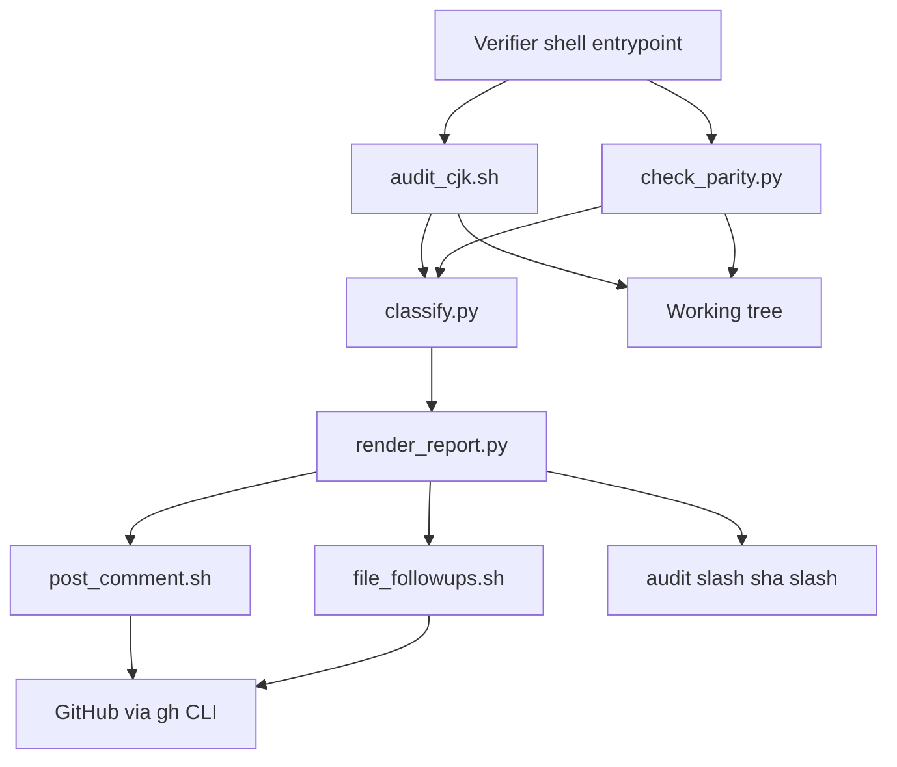
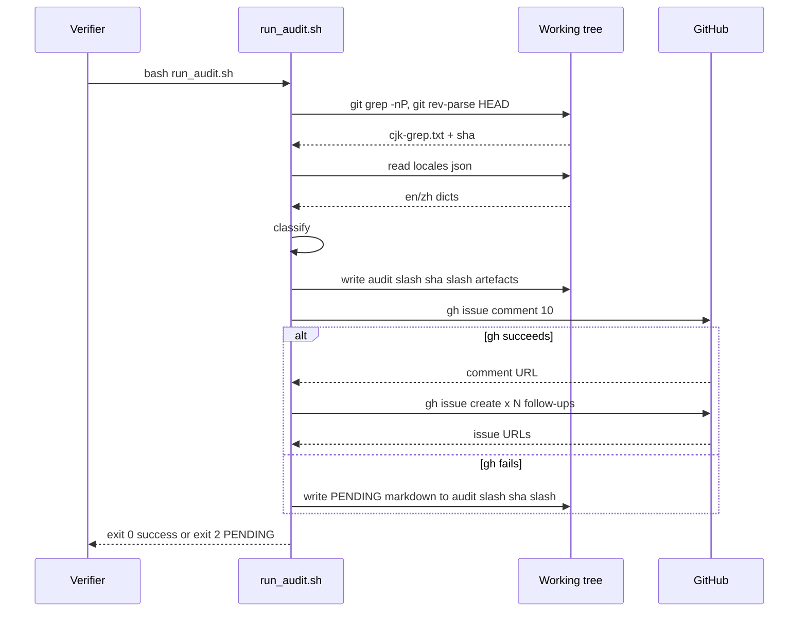

# Design — i18n-e2e-english-verification

## Overview

**Purpose**: This spec produces a deterministic, re-runnable verification pass that proves (or disproves) the MiroFish 5-step pipeline runs cleanly in English, and posts a structured report on issue #10 with a `pass` / `gap` / `manual-pending` status per checklist item.

**Users**: i18n maintainers reviewing the epic (#11), and any future verifier re-running the audit after subsequent merges. The deliverable is read by humans on GitHub (issue comment) and re-run by humans (or CI in a future iteration) to confirm parity.

**Impact**: No production code is modified. The repository gains one new directory tree (`.kiro/specs/i18n-e2e-english-verification/`) containing the spec, the audit scripts, and the captured outputs. One GitHub comment is posted on #10. Up to four follow-up issues are filed.

### Goals

- Static-audit `backend/app`, `frontend/src`, `locales/en.json` for CJK characters; classify every match.
- Verify EN / ZH locale catalogue parity and flag suspect untranslated entries.
- Verify LLM-prompt assets respect the requested locale.
- Document locale-propagation gaps across Flask → `Task` → OASIS subprocess → ReACT agent.
- Post a single canonical comment on issue #10 with per-checklist statuses.
- File follow-up issues for every gap (no inline fixes).
- Make the audit re-runnable by capturing artefacts under `.kiro/specs/.../audit/<commit-sha>/`.

### Non-Goals

- Patching any `gap` discovered (R7.3 — strictly verification).
- Performance / load testing.
- Adding new locales beyond EN / ZH.
- Building a permanent CI guard (filed as a follow-up issue, not implemented here).
- Live UI / Docker walkthrough — captured as `manual-pending` in this run's report.

## Boundary Commitments

### This Spec Owns

- The audit scripts and the captured audit outputs under `.kiro/specs/i18n-e2e-english-verification/audit/`.
- The `gap-report.md` artefact and the comment body posted on issue #10.
- The grouping rule for follow-up issues (one per category — UI strings, backend log strings, backend LLM-prompt labels, suggested CI guard).
- The `pass` / `gap` / `manual-pending` / `review-needed` classification scheme.

### Out of Boundary

- Any modification of files under `backend/app/`, `frontend/src/`, or `locales/`.
- Fixing the gaps the audit discovers — those land in their own follow-up issues.
- Live UI walkthrough, Docker run, or LLM execution.
- A permanent CI check — filed as a separate follow-up issue.

### Allowed Dependencies

- `git` (for `git grep`, capturing HEAD sha).
- `gh` CLI (for the comment + follow-up issues; with documented fallback when unavailable).
- `python3` (for the catalogue parity diff).
- The repo working tree at HEAD of the working branch.

### Revalidation Triggers

- Any merge to `main` that touches `locales/`, `backend/app/`, or `frontend/src/` invalidates the captured audit; a re-run should produce a new `audit/<commit-sha>/` directory.
- A change to issue #10's checklist body (e.g. a new sub-item) requires re-mapping in `gap-report.md`.
- A change to the four follow-up categories (e.g. project decides to file one issue per file) requires re-running the issue-filing script with new grouping.

## Architecture

### Existing Architecture Analysis

- The MiroFish backend is Flask + Python `Task` workers + an OASIS subprocess (per CLAUDE.md). i18n surfaces are: `vue-i18n` for the SPA, `locales/*.json` shared by both ends, a backend logger that resolves keys per locale, and inline LLM prompts in `backend/app/services/*.py`.
- The verification pass does **not** hook into any of these — it reads files only. No Flask blueprint, no `Task` model, no Neo4j query.

### Architecture Pattern & Boundary Map



**Architecture Integration**:

- **Selected pattern**: Linear pipeline of read-only scripts that each emit a single artefact, composed by a thin shell entrypoint. No mutable state outside `audit/<sha>/`.
- **Domain boundaries**: `audit_cjk.sh` owns the raw grep; `check_parity.py` owns the catalogue diff; `classify.py` owns the four-class labels; `render_report.py` owns the comment body; `post_comment.sh` and `file_followups.sh` own GitHub side effects.
- **Existing patterns preserved**: Shell + Python script pair (matches the project's existing `setup`/`run` style); no new test runner, no new linter.
- **New components rationale**: Each script is single-purpose so failures (e.g. `gh` permission issues) are isolated and the pipeline can resume from the failed step.
- **Steering compliance**: No production-code touch (R7.3); 4-space indent in any committed Python; double quotes; `snake_case`; reserved Bash exits with a non-zero status on any uncaught error.

### Technology Stack

| Layer | Choice / Version | Role in Feature | Notes |
|-------|------------------|-----------------|-------|
| CLI / Audit runner | Bash 5+, `git grep -P` (PCRE) | Run the canonical CJK audit | `\x{...}` ranges require PCRE — `git grep -E` will fail on this regex (verified). |
| Static checks | Python 3.11 (project minimum per CLAUDE.md) | Catalogue parity + classification + report rendering | Standard library only — no new deps. |
| GitHub integration | `gh` CLI | Post the comment, file follow-ups | Falls back to `audit/<sha>/PENDING-*` files when missing. |
| Output formats | Plain text + Markdown | Captures + comment body | No HTML, no JSON beyond `gh`'s own. |

## File Structure Plan

### Directory Structure

```
.kiro/specs/i18n-e2e-english-verification/
├── spec.json
├── requirements.md
├── gap-analysis.md
├── research.md
├── design.md
├── tasks.md
├── HANDOFF.md          # only if implementation hits the 3-cycle remediation cap
└── audit/
    ├── scripts/
    │   ├── run_audit.sh          # entrypoint - chains the steps below
    │   ├── audit_cjk.sh          # git grep PCRE + bucket counts
    │   ├── check_parity.py       # locales/en.json vs zh.json key + identical-value diff
    │   ├── classify.py           # apply 4-class labels to grep matches
    │   ├── render_report.py      # produce gap-report.md + comment-body.md
    │   ├── post_comment.sh       # gh issue comment 10 with comment-body.md (or PENDING-*)
    │   └── file_followups.sh     # gh issue create per category (or PENDING-*)
    └── <commit-sha>/             # captured outputs of one verification run
        ├── cjk-grep.txt          # raw `git grep -nP ...` output
        ├── cjk-grep-bucketed.txt # the same, partitioned by top-level path
        ├── parity.txt            # en/zh diff summary
        ├── classified.csv        # match-by-match label
        ├── gap-report.md         # the canonical structured report
        ├── comment-body.md       # the markdown posted to issue #10
        ├── PENDING-issue-10-comment.md          # only if gh comment failed
        └── PENDING-followups/                   # only if gh issue create failed
            ├── 01-frontend-ui-strings.md
            ├── 02-backend-log-strings.md
            ├── 03-backend-prompt-labels.md
            └── 04-permanent-ci-guard.md
```

### Modified Files

- *(None.)* The spec explicitly forbids touching production source.

## System Flows



**Key flow decisions**:

- The audit always writes the captured artefacts to disk first (idempotent, re-runnable). The GitHub side effects are the *last* steps so any earlier failure leaves a complete capture for inspection.
- A non-zero `gh` exit shifts the pipeline to PENDING mode rather than failing the whole run; the script exits `2` to flag "audit ran but GitHub side-effects didn't apply".

## Requirements Traceability

| Requirement | Summary | Components | Interfaces / Artefacts | Flows |
|-------------|---------|------------|------------------------|-------|
| 1.1 | Run canonical `git grep` | audit_cjk.sh | `cjk-grep.txt` | Audit step |
| 1.2 | Classify each match | classify.py | `classified.csv` | Audit step |
| 1.3 | Record file:line + step tag for `gap` | classify.py | `classified.csv` (`step` column) | Audit step |
| 1.4 | No file modifications during audit | run_audit.sh | scripts are read-only | — |
| 1.5 | `en.json` CJK = always `gap` | classify.py | hard rule in classifier | Audit step |
| 2.1 | Enumerate keys recursively | check_parity.py | `parity.txt` | Audit step |
| 2.2 | Missing-key gaps recorded | check_parity.py | `parity.txt` (missing-key block) | Audit step |
| 2.3 | EN catalogue CJK = `gap` | check_parity.py | `parity.txt` (cjk-in-en block) | Audit step |
| 2.4 | EN/ZH identical = `review-needed` | check_parity.py | `parity.txt` (identical-value block) | Audit step |
| 2.5 | No catalogue edits | check_parity.py | read-only stdlib JSON load | — |
| 3.1 | Enumerate prompt files | classify.py (heuristic — known files list) | `gap-report.md` Section 3 | — |
| 3.2 | Confirm locale-aware or EN-only | classify.py | `gap-report.md` Section 3 | — |
| 3.3 | Hard-coded ZH directive = `gap` | classify.py | `classified.csv` (`category=prompt-label`) | — |
| 3.4 | #3, #4, #5 prompts post-merge check | classify.py | `gap-report.md` Section 3 | — |
| 4.1 | Identify handoff boundaries | render_report.py | `gap-report.md` Section 4 | — |
| 4.2 | Confirm explicit or re-derived locale | render_report.py | `gap-report.md` Section 4 | — |
| 4.3 | Silent default = `gap` | classify.py | `classified.csv` (`category=propagation`) | — |
| 4.4 | Backend logger EN under EN | classify.py | `classified.csv` (`category=backend-log`) | — |
| 5.1 | Comment lists every checklist item | render_report.py | `comment-body.md` | Comment-post |
| 5.2 | Each `gap` includes file:line + follow-up link | render_report.py | `comment-body.md` | Comment-post |
| 5.3 | `manual-pending` items state repro steps | render_report.py | `comment-body.md` | Comment-post |
| 5.4 | Comment includes raw audit (or path) | render_report.py | `comment-body.md` (path reference) | Comment-post |
| 5.5 | Post via `gh issue comment 10` | post_comment.sh | `comment-body.md` | Comment-post |
| 6.1 | ZH covers every EN key | check_parity.py | (already passes per gap-analysis) | — |
| 6.2 | Locale-aware prompts symmetric | render_report.py | `gap-report.md` Section 6 | — |
| 6.3 | EN-only ZH value = `review-needed` | check_parity.py | `parity.txt` (identical-value block) | — |
| 6.4 | ZH regression filed as gap | classify.py | `classified.csv` | — |
| 7.1 | File issue per gap | file_followups.sh | `gh issue create` | Follow-up |
| 7.2 | Group by category | file_followups.sh | one body per category in `PENDING-followups/` | Follow-up |
| 7.3 | No production-code edits | run_audit.sh | only writes under `.kiro/specs/.../` | — |
| 7.4 | Label follow-ups `i18n` | file_followups.sh | `gh issue create --label i18n` | Follow-up |
| 7.5 | Fallback inline list when no `gh` | file_followups.sh | `PENDING-followups/*.md` | Follow-up |
| 8.1 | Capture raw output | run_audit.sh | `audit/<sha>/` directory | Audit step |
| 8.2 | Preserve previous run | run_audit.sh | `<sha>` subdirectory naming | Audit step |
| 8.3 | Record HEAD sha | run_audit.sh | `git rev-parse HEAD` | Audit step |
| 8.4 | Idempotent re-run | run_audit.sh | re-running on same sha overwrites that sha's dir | Audit step |

## Components and Interfaces

| Component | Domain | Intent | Req Coverage | Key Dependencies (P0/P1) | Contracts |
|-----------|--------|--------|--------------|--------------------------|-----------|
| run_audit.sh | Verification pipeline | Compose the audit and route artefacts | 1.4, 7.3, 8.1, 8.2, 8.3, 8.4 | git (P0), python3 (P0), gh (P1) | Batch |
| audit_cjk.sh | Static audit | Run `git grep -nP` and bucket | 1.1, 1.5 | git (P0) | Batch |
| check_parity.py | Catalogue diff | Diff en/zh + identical-value heuristic | 2.1, 2.2, 2.3, 2.4, 2.5, 6.1, 6.3 | python3 stdlib (P0) | Batch |
| classify.py | Classification | Apply the 4-class label per match | 1.2, 1.3, 1.5, 3.1, 3.2, 3.3, 3.4, 4.3, 4.4, 6.4 | cjk-grep.txt (P0), parity.txt (P0) | Batch |
| render_report.py | Report assembly | Produce gap-report.md + comment-body.md | 4.1, 4.2, 5.1, 5.2, 5.3, 5.4, 6.2 | classified.csv (P0) | Batch |
| post_comment.sh | GitHub side-effect | Post the comment on #10 | 5.5 | gh (P0), comment-body.md (P0) | Service |
| file_followups.sh | GitHub side-effect | Open follow-up issues | 7.1, 7.2, 7.4, 7.5 | gh (P0), PENDING-followups/* (P0) | Service |

### Verification pipeline

#### `run_audit.sh`

| Field | Detail |
|-------|--------|
| Intent | Single shell entrypoint that runs every step in order and persists artefacts under `audit/<commit-sha>/` |
| Requirements | 1.4, 7.3, 8.1, 8.2, 8.3, 8.4 |

**Responsibilities & Constraints**

- Must NOT modify any file outside `.kiro/specs/i18n-e2e-english-verification/`.
- Must capture HEAD sha before any other step (so the artefact path is set).
- Must exit `0` on full success (audit + GitHub side effects) and `2` on PENDING (audit succeeded, side effects didn't).
- Must be safely re-runnable on the same sha (overwriting that sha's directory is acceptable).

**Dependencies**

- Inbound: invoked manually by the verifier (`bash run_audit.sh`) — Criticality: P0.
- Outbound: `audit_cjk.sh`, `check_parity.py`, `classify.py`, `render_report.py`, `post_comment.sh`, `file_followups.sh` — Criticality: P0 each.
- External: `git`, `python3`, `gh` (P1 — fallback supported).

**Contracts**: Service [ ] / API [ ] / Event [ ] / Batch [x] / State [ ]

##### Batch / Job Contract

- **Trigger**: manual `bash .kiro/specs/i18n-e2e-english-verification/audit/scripts/run_audit.sh`.
- **Input / validation**: working tree at any commit; rejects detached non-clean trees? — no, the audit reads tracked files only via `git grep`, so unstaged edits are ignored deliberately.
- **Output / destination**: `.kiro/specs/i18n-e2e-english-verification/audit/<commit-sha>/`.
- **Idempotency & recovery**: Re-running on the same sha overwrites that sha's directory. PENDING outputs survive across runs until a `gh`-enabled run replaces them.

**Implementation Notes**

- Integration: invoked by humans only — no CI hookup in this spec.
- Validation: confirm `gh auth status` before attempting comment/issue posts; on failure, branch to PENDING.
- Risks: shell quoting around the PCRE pattern (`[\x{4e00}-\x{9fff}]`) — use single-quoted argument to `git grep -P`.

#### `audit_cjk.sh`

| Field | Detail |
|-------|--------|
| Intent | Run the canonical PCRE grep + per-bucket counts |
| Requirements | 1.1, 1.5 |

**Responsibilities & Constraints**

- Output: `cjk-grep.txt` (raw `git grep -nP` lines) and `cjk-grep-bucketed.txt` (one section per top-level path: `backend/app`, `frontend/src`, `locales/en.json`).
- Excludes binary file matches (e.g. `.jpeg` false positives).

**Dependencies**

- Inbound: `run_audit.sh` (P0).
- External: `git` 2.x (P0 — must support `-P` for PCRE).

**Contracts**: Batch [x]

##### Batch / Job Contract

- **Trigger**: invoked by `run_audit.sh`.
- **Input / validation**: receives the target output directory as argv[1]; aborts if missing.
- **Output / destination**: `cjk-grep.txt`, `cjk-grep-bucketed.txt` in `<sha>/`.
- **Idempotency & recovery**: deterministic — same tree → same output.

**Implementation Notes**

- Integration: pure read-only against `git`.
- Validation: `git --version` precondition; abort with a clear error if PCRE unsupported.
- Risks: ripgrep is NOT used (avoids a hard `rg` dependency); `git grep -P` is built-in to git's PCRE2 binding.

#### `check_parity.py`

| Field | Detail |
|-------|--------|
| Intent | Compare `locales/en.json` and `locales/zh.json`: key parity, CJK in EN, identical-value heuristic |
| Requirements | 2.1, 2.2, 2.3, 2.4, 2.5, 6.1, 6.3 |

**Responsibilities & Constraints**

- Recursively flattens nested-dict keys with dotted paths.
- Reports three blocks: `missing-keys`, `cjk-in-en`, `identical-values`.
- Treats values as `review-needed` only if (a) en value == zh value, (b) value is non-empty, (c) value is more than two ASCII words.

**Dependencies**

- Inbound: `run_audit.sh` (P0).
- External: `json` from Python stdlib (P0).

**Contracts**: Batch [x]

##### Batch / Job Contract

- **Trigger**: invoked by `run_audit.sh` with the `<sha>` directory as argv[1].
- **Input / validation**: reads `locales/en.json` and `locales/zh.json` from cwd (must be invoked from repo root); fails fast on JSON parse error.
- **Output / destination**: `parity.txt` in `<sha>/`.
- **Idempotency & recovery**: pure function of catalogue contents.

**Implementation Notes**

- Integration: invoked from repo root so relative paths resolve.
- Validation: parse-on-load, both files must be objects.
- Risks: the "more than two ASCII words" heuristic may produce noise — `review-needed` is intentionally a soft label not a `gap`.

#### `classify.py`

| Field | Detail |
|-------|--------|
| Intent | Apply the 4-class label (`deliberate` / `gap` / `non-applicable` / `review-needed`) and a category tag per match |
| Requirements | 1.2, 1.3, 1.5, 3.1, 3.2, 3.3, 3.4, 4.3, 4.4, 6.4 |

**Responsibilities & Constraints**

- Reads `cjk-grep.txt` and `parity.txt`; emits `classified.csv` with columns: `file`, `line`, `match`, `class`, `category`, `pipeline_step`.
- Categories (closed set): `frontend-ui-string`, `frontend-regex-parser`, `backend-docstring`, `backend-comment`, `backend-log`, `backend-prompt-label`, `propagation`, `catalogue-parity`, `binary-false-positive`.
- Pipeline-step tags (closed set): `Graph Build`, `Env Setup`, `Simulation`, `Report`, `Interaction`, `Logs`, `UI`, `n/a`.
- Classification rules:
  - `locales/en.json` CJK → always `gap` / `catalogue-parity` / `n/a` (R1.5).
  - File path under `frontend/src/views/` or `frontend/src/components/` AND match is inside a string literal (heuristic: enclosed in `'…'`/`"…"`/`` `…` ``) → `gap` / `frontend-ui-string`.
  - Match inside a `text.match(/.../)` call in a `.vue` file → `frontend-regex-parser` / `gap` (cause: backend emits CJK).
  - Backend `.py` file, line starts with `#` or appears inside a triple-quoted docstring → `deliberate-blocked-by-#7` / `backend-docstring` (or `backend-comment`) — counted but not filed as a fresh follow-up since #7 already covers it.
  - Backend `.py` file, line contains `logger.`, `log.`, `print(` and CJK in a string literal → `gap` / `backend-log` / appropriate step tag.
  - Backend `.py` file in `services/{ontology,oasis_profile,simulation_config,report_agent}_generator.py` and CJK appears inside an LLM-prompt context label (heuristic: a string literal not preceded by `#`) → `gap` / `backend-prompt-label`.
  - Binary files (e.g. `.jpeg` ripgrep matches): `non-applicable` / `binary-false-positive`.
  - Anything else: `review-needed` (forces a human look).

**Dependencies**

- Inbound: `audit_cjk.sh`, `check_parity.py` (P0).
- External: `csv` from Python stdlib.

**Contracts**: Batch [x]

##### Batch / Job Contract

- **Trigger**: invoked by `run_audit.sh` after the two preceding steps.
- **Input / validation**: `cjk-grep.txt` and `parity.txt` must exist in `<sha>/`.
- **Output / destination**: `classified.csv`.
- **Idempotency & recovery**: deterministic — same inputs → same csv.

**Implementation Notes**

- Integration: classification rules are heuristics, not a parser; correctness is bounded by careful regexes and an explicit "fallthrough = `review-needed`" rule.
- Validation: every input row produces an output row (no silent drops); a count-equality assertion runs at the end.
- Risks: false negatives (e.g. a Chinese log string that doesn't contain `logger.` on the same line) — `review-needed` fallthrough catches these.

#### `render_report.py`

| Field | Detail |
|-------|--------|
| Intent | Produce `gap-report.md` and `comment-body.md` |
| Requirements | 4.1, 4.2, 5.1, 5.2, 5.3, 5.4, 6.2 |

**Responsibilities & Constraints**

- `gap-report.md`: Sections: Overview, Section 1 (static audit), Section 2 (parity), Section 3 (prompt verification), Section 4 (propagation), Section 5 (issue-#10 checklist mapping), Section 6 (ZH regression), Section 7 (follow-up plan).
- `comment-body.md`: Markdown comment for issue #10 — mirrors the issue's checklist with `pass` / `gap` / `manual-pending` for each line, plus a "How to re-run" footer.
- Reads `classified.csv` and the issue body (snapshot at `.ticket/10.md`).

**Dependencies**

- Inbound: `classify.py` (P0), `.ticket/10.md` (P0).
- External: Python stdlib only.

**Contracts**: Batch [x]

##### Batch / Job Contract

- **Trigger**: `run_audit.sh` after `classify.py`.
- **Input / validation**: `classified.csv` and `.ticket/10.md` must exist.
- **Output / destination**: `gap-report.md`, `comment-body.md` in `<sha>/`.
- **Idempotency & recovery**: deterministic.

**Implementation Notes**

- Integration: the comment body must include a `Run on commit <sha>` header so the comment is traceable.
- Validation: confirm every issue-body checkbox has been mapped (count check).
- Risks: rendering CJK characters in markdown — Python writes UTF-8 by default; comment body is verified to round-trip via `gh`.

#### `post_comment.sh`

| Field | Detail |
|-------|--------|
| Intent | Post `comment-body.md` as a comment on issue #10 |
| Requirements | 5.5 |

**Responsibilities & Constraints**

- `gh issue comment 10 --repo salestech-group/MiroFish --body-file <sha>/comment-body.md`.
- On non-zero exit, copies the body to `<sha>/PENDING-issue-10-comment.md` and exits non-zero.

**Dependencies**

- External: `gh` (P0; degrades to PENDING when missing).

**Contracts**: Service [x]

##### Service Interface

```text
post_comment.sh <sha-dir>
  precondition: <sha-dir>/comment-body.md exists
  postcondition (success): comment posted; URL printed to stdout
  postcondition (failure): <sha-dir>/PENDING-issue-10-comment.md present; exit code 2
```

**Implementation Notes**

- Integration: must be the second-to-last step (so failures don't block the issue-filing fallback).
- Validation: parses `gh`'s URL output and writes it to `<sha>/comment-url.txt` on success.
- Risks: PR-time rate limits — unlikely for a single comment.

#### `file_followups.sh`

| Field | Detail |
|-------|--------|
| Intent | Open one follow-up issue per gap category |
| Requirements | 7.1, 7.2, 7.4, 7.5 |

**Responsibilities & Constraints**

- Iterates `<sha>/PENDING-followups/*.md` (which `render_report.py` always writes; the ones whose category had zero gaps stay empty placeholders).
- For each non-empty body, runs `gh issue create --repo salestech-group/MiroFish --title <title> --body-file <body> --label i18n`.
- On `gh` failure for any single category, leaves the corresponding `PENDING-followups/<n>-*.md` in place and exits non-zero at the end (after attempting all categories).

**Dependencies**

- External: `gh` (P0; degrades to PENDING).

**Contracts**: Service [x]

##### Service Interface

```text
file_followups.sh <sha-dir>
  precondition: <sha-dir>/PENDING-followups/*.md exist (possibly empty placeholders)
  postcondition (success): all non-empty bodies posted; URLs appended to <sha-dir>/followup-urls.txt; bodies removed from PENDING-followups/
  postcondition (partial): URLs in followup-urls.txt for the ones that posted; the rest stay in PENDING-followups/; exit code 2
```

**Implementation Notes**

- Integration: must be the last step.
- Validation: post-hoc count check (`gh` URLs + remaining PENDING bodies = total categories).
- Risks: a category that the spec already considers covered (e.g. backend docstrings → blocked by #7) is not re-filed; the spec's category list is closed and excludes that case.

## Data Models

### Domain Model

The audit operates on three logical concepts:

- **Match** — a single line of `git grep` output. `(file, line, raw_text)`.
- **Classification** — `(match, class ∈ {deliberate, gap, non-applicable, review-needed}, category ∈ closed-set, pipeline_step ∈ closed-set)`.
- **Follow-up** — `(category, title, body, status ∈ {posted, pending}, url?)`.

Invariant: every `Match` produces exactly one `Classification`; every `Classification` with `class == gap` belongs to exactly one `Follow-up` category (which may aggregate multiple gaps).

### Logical Data Model

**`classified.csv` schema** (CSV, UTF-8, header row):

| Column | Type | Notes |
|--------|------|-------|
| `file` | string | repo-relative path |
| `line` | int | 1-indexed |
| `match` | string | trimmed grep line |
| `class` | enum | `deliberate` / `gap` / `non-applicable` / `review-needed` |
| `category` | enum | closed set listed in classify.py rules |
| `pipeline_step` | enum | closed set listed in classify.py rules |

Natural key: `(file, line)`.

**`parity.txt` structure** (text, three labelled blocks):

```
[missing-keys]
en-only:  <key.path>
zh-only:  <key.path>
[cjk-in-en]
<key.path>: <value snippet>
[identical-values]
<key.path>: <value>   # review-needed if non-trivial English prose
```

### Data Contracts & Integration

- **`comment-body.md`** must be valid GitHub-flavoured Markdown; checkbox lines preserve the issue's original ordering.
- **Follow-up issue body** must be valid GitHub-flavoured Markdown; first line is a one-sentence summary; subsequent sections are: `## Evidence` (file:line list), `## Linked from` (#10 + comment URL), `## Acceptance` (a small checklist).

## Error Handling

### Error Strategy

- **Read-only operations** (steps 1–4): on any uncaught error (missing file, JSON parse error), the script aborts with a non-zero exit before any artefact is half-written. The orchestrator uses `set -euo pipefail`.
- **GitHub side effects** (steps 5–6): wrapped — failure routes to PENDING outputs and the orchestrator exits `2`.

### Error Categories and Responses

- **User errors**: invoked from wrong directory → fail fast with "must be run from repo root".
- **System errors**: `git`/`python3`/`gh` missing → fail fast with "install <tool>"; `gh auth status` not OK → branch to PENDING.
- **Business errors**: classification produces 0 matches but `cjk-grep.txt` non-empty → assertion failure (count-equality bug).

### Monitoring

- The orchestrator prints a one-line status per step.
- Final summary block to stdout: total matches, gaps, `manual-pending`, follow-ups posted vs PENDING.

## Testing Strategy

- **Unit tests**: not introduced — the scripts are simple enough that a one-shot dry run on the live tree is the canonical validation.
- **Integration test**: a single `bash run_audit.sh` against the working tree; success criteria below.
- **Validation checklist** (run during implementation):
  - The audit produces a non-empty `cjk-grep.txt`.
  - `parity.txt` reports 0 missing keys (matches the live state at HEAD).
  - `classified.csv` row count == `cjk-grep.txt` line count.
  - `gap-report.md` and `comment-body.md` parse as valid markdown (manual eyeball — no toolchain required).
  - The classifier marks every `locales/en.json` CJK as `gap` (currently zero such matches, so this asserts the negative).
  - With `gh` available: a comment is posted on #10 and follow-up issues are created.
  - With `gh` simulated as absent (e.g. `PATH=/dev/null`): PENDING outputs appear under `<sha>/`.

### Out of scope for testing

- The live UI walkthrough is `manual-pending` (R5.3) and not part of the test plan.
- Performance, scalability, security: nothing to test — read-only single-shot scripts.
