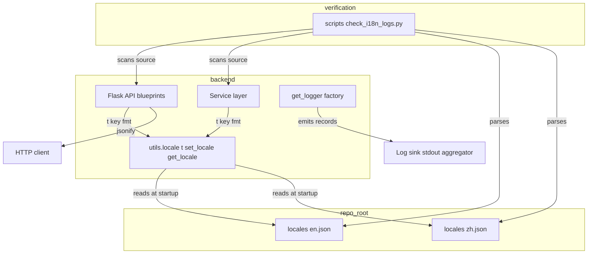
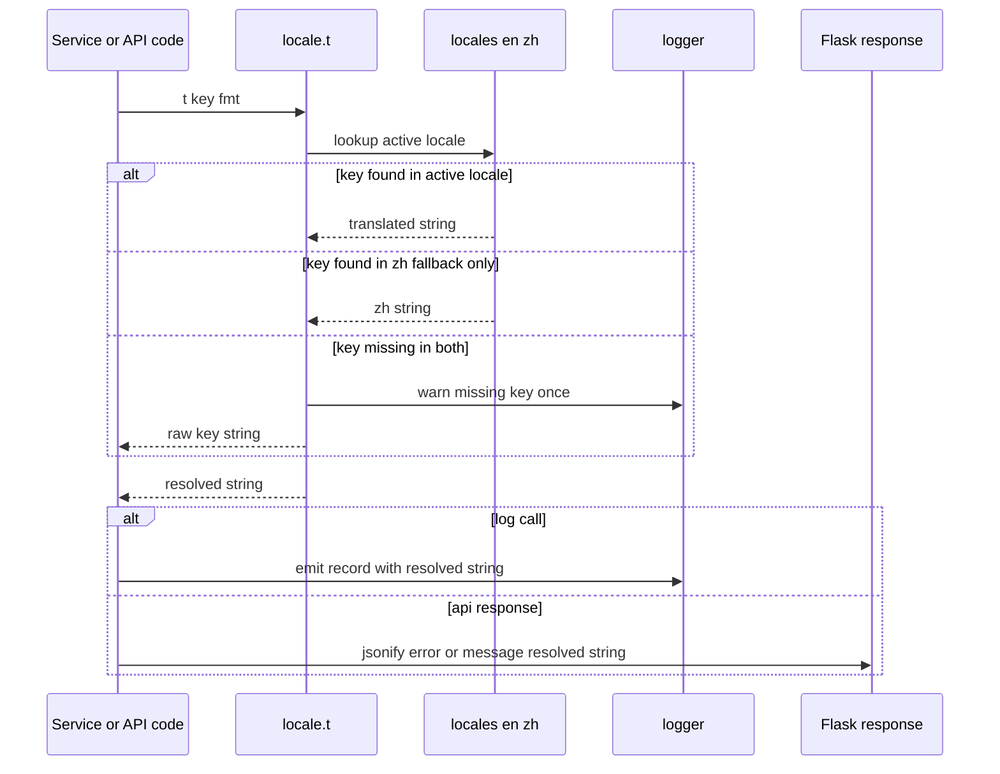
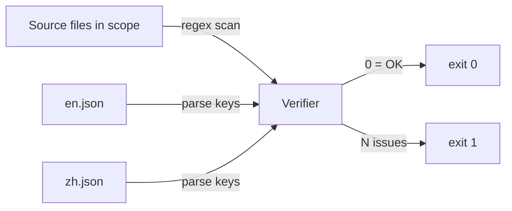

# Design — i18n-externalize-backend-logs

## Overview

**Purpose**: Externalize the ~250 Chinese strings inside backend `logger.{info,warning,error,debug,exception}(...)` calls and the ~79 Chinese strings inside user-facing `jsonify({"error|message": ...})` responses across 14 backend modules into the existing `locales/{en,zh}.json` dictionaries, so logs and API responses honor the active locale.

**Users**: Backend operators monitoring Flask logs in English; API clients sending `Accept-Language: en` (frontend, integration tests, future ops dashboards).

**Impact**: Switches the backend from emitting Chinese-only strings to locale-aware lookups via the existing `t()` helper. Adds ~330 new key/value pairs to `locales/en.json` and `locales/zh.json` under nested namespaces (`log.<module>.<key>`, `api.error.<scope>`, `api.message.<scope>`). Adds a deduplicated missing-key warning inside `t()` so unknown keys are visible without crashing requests. No public API contract or HTTP behavior changes.

### Goals
- Every `logger.*` call in the in-scope modules (R1) emits via `t("log.…", **fmt)`; every `jsonify({"error|message": ...})` (R2) emits via `t("api.error|message.…", **fmt)`.
- `locales/en.json` and `locales/zh.json` remain structurally identical (R3): same key tree, same nesting, same ordering.
- `t()` warns on missing keys but never raises (R4).
- A re-runnable verifier (`scripts/check_i18n_logs.py`) makes R5 mechanically checkable from CI/dev.

### Non-Goals
- Prompt strings (handled by sibling specs `i18n-report-agent-prompts` already on this branch + #2/#3/#4/#5).
- Chinese docstrings/comments (#7).
- Re-architecting `t()` (no ICU, no pluralization, no new framework).
- Frontend `vue-i18n` changes beyond the new keys it does not consume (the frontend continues to read its existing flat `log.<key>` and `api.<key>` entries unchanged).
- Changing log levels, log structure, HTTP status codes, response field shapes.

## Boundary Commitments

### This Spec Owns
- Translation of every Chinese string literal that appears as a string argument of `logger.{info,warning,error,debug,exception}(...)` in the 14 in-scope modules.
- Translation of the `error` and `message` field values of every `jsonify({...})` (and equivalent `make_response(jsonify(...))` / `Response(json.dumps(...))`) call in `backend/app/api/{simulation,report,graph}.py`.
- All new keys placed under `log.<module>.*`, `api.error.<scope>.*`, `api.message.<scope>.*` in both `locales/en.json` and `locales/zh.json`.
- Missing-key warning behavior of `backend/app/utils/locale.py::t`.
- The verification script `scripts/check_i18n_logs.py`.

### Out of Boundary
- Prompt template strings inside the same files — owned by `i18n-report-agent-prompts` and tickets #2/#3/#4/#5.
- Chinese docstrings, function-name docstrings, and inline `#` comments — owned by ticket #7.
- The existing flat frontend keys in `locales/{en,zh}.json` (e.g. `log.preparingGoBack`, `api.projectNotFound`) — these are consumed by Vue components and must remain untouched at their current paths.
- New locale languages, language detection rules, or `Accept-Language` parsing changes.
- The `success`, `traceback`, `data`, `progress`, `status` fields in API responses (only `error` / `message` are translated).

### Allowed Dependencies
- `backend/app/utils/locale.py` (`t`, `set_locale`, `get_locale`).
- `backend/app/utils/logger.py` (`get_logger`).
- Standard library only for the verifier (`json`, `re`, `pathlib`, `sys`).
- Existing Flask request context for `Accept-Language`-driven locale resolution.

### Revalidation Triggers
- Adding a new in-scope file (e.g. a new service module that emits Chinese log strings) → re-run verifier; extend script's file list if needed.
- Renaming the existing top-level `log` / `api` namespaces in the locale dictionaries → frontend code coupled to those keys breaks; coordinate with frontend specs.
- Changing `t()` placeholder syntax (`{name}`) or fallback behavior → all call sites and the verifier need re-checking.
- Adding a new locale file (e.g. `de.json`) → the parity check must be extended to every `*.json` in `/locales/`, not just `en` and `zh`.

## Architecture

### Existing Architecture Analysis
- `backend/app/utils/locale.py` is the single source for translation. It exposes `set_locale(locale)`, `get_locale()`, `t(key, **kwargs)`, and `get_language_instruction()`. Translations are loaded once at process start from every `*.json` in `/locales/` (excluding `languages.json`).
- `t()` resolves a dotted key, falls back to the `zh` dictionary if missing in the active locale, then returns the raw key string if both are missing. Today it is **silent** on miss.
- Locale is request-scoped via `Accept-Language` and background-thread-scoped via `set_locale(...)` / `_thread_local.locale`. Background threads (`SimulationRunner`, `OasisProfileGenerator`, `ZepGraphMemoryUpdater`, `GraphBuilder`, `report.py` task threads) already call `set_locale(...)` at entry — current coverage is sufficient and not extended by this spec.
- `report.py` is a precedent: it already imports `from ..utils.locale import t, get_locale, set_locale` and uses `t("api.…")` in 27 jsonify call sites. The work in this spec mirrors that pattern across the remaining files.
- Existing keys at `log.*` and `api.*` (depth 2) are consumed by the Vue frontend. New backend keys live one level deeper (`log.<module>.<key>`, `api.error.<scope>.<key>`) and therefore do not shadow or conflict.

### Architecture Pattern & Boundary Map



**Architecture Integration**:
- **Selected pattern**: Centralized translation registry (single helper, file-backed dictionaries) — already in place. This spec extends the registry's contents, not its shape.
- **Domain/feature boundaries**: Locale dict is the only shared resource. Each in-scope module owns its own keys (`log.<module>.*`); collisions are prevented by per-module sub-namespaces.
- **Existing patterns preserved**: `from ..utils.locale import t` import shape; `logger = get_logger("mirofish.<area>")` factory; per-thread `set_locale(...)` propagation; `report.py`-style `jsonify({"error": t("api.…", id=...)})`.
- **New components rationale**: The verifier (`scripts/check_i18n_logs.py`) is the only new file. It exists because R5 demands a re-runnable mechanical check, and lives outside `backend/app` so it doesn't ship with the runtime.
- **Steering compliance**: 4-space indentation, snake_case, double quotes (Python steering); no new dependencies; no new lint/format tooling; structure preserved.

### Technology Stack

| Layer | Choice / Version | Role in Feature | Notes |
|-------|------------------|-----------------|-------|
| Backend / Services | Python ≥3.11 + Flask 3.0 | Hosts `t()` calls and translated `jsonify` responses | No new deps |
| Backend / i18n | `backend/app/utils/locale.py` (in-tree, ~70 LoC) | Resolves keys against per-thread / per-request locale | Extended with deduped missing-key warning |
| Data / Storage | `locales/en.json`, `locales/zh.json` (file-backed, JSON, loaded at process start) | Holds new `log.<module>.*` and `api.{error,message}.<scope>.*` entries | Both files must stay structurally identical |
| Tooling / Verification | Python stdlib (`json`, `re`, `pathlib`, `argparse`) | Implements the R5 verifier | Runs from repo root: `python scripts/check_i18n_logs.py` |

## File Structure Plan

### Modified Files

Backend service modules — replace Chinese-bearing `logger.*` calls with `t("log.<module>.<key>", **fmt)`:
- `backend/app/services/zep_tools.py` (~51 sites)
- `backend/app/services/simulation_runner.py` (~40 sites)
- `backend/app/services/oasis_profile_generator.py` (~23 sites)
- `backend/app/services/simulation_config_generator.py` (~14 sites)
- `backend/app/services/zep_graph_memory_updater.py` (~14 sites)
- `backend/app/services/zep_entity_reader.py` (~10 sites)
- `backend/app/services/simulation_ipc.py` (~5 sites)
- `backend/app/services/simulation_manager.py` (~3 sites)
- `backend/app/services/report_agent.py` (~1 site)
- `backend/app/services/ontology_generator.py` — already clean (no rewrites; verify only)
- `backend/app/services/graph_builder.py` — already clean (no rewrites; verify only)

Backend API modules — rewrite both `logger.*` and `jsonify({"error|message": ...})` strings:
- `backend/app/api/simulation.py` (~55 logger + ~59 jsonify sites)
- `backend/app/api/report.py` (~19 logger sites; jsonify already i18n-ized)
- `backend/app/api/graph.py` (~15 logger + ~20 jsonify sites)

Locale dictionaries:
- `locales/en.json` — add new nested entries; keep file structurally identical to `zh.json`.
- `locales/zh.json` — add new nested entries with the original Chinese verbatim; keep file structurally identical to `en.json`.

Locale helper:
- `backend/app/utils/locale.py` — extend `t()` with a deduplicated `logger.warning(...)` on missing-key fallback.

### New Files
- `scripts/check_i18n_logs.py` — R5 verifier. Two modes: `--logs` (regex-scan in-scope files) and `--parity` (compare key trees of `en.json` and `zh.json`). Default runs both.

> No new directories. No new packages. The script lives under the existing top-level `scripts/` path (alongside conventions used elsewhere in the repo).

## Requirements Traceability

| Req | Summary | Components | Interfaces | Flows |
|-----|---------|------------|------------|-------|
| 1.1 | logger.* uses t() | All in-scope service + api modules | `t("log.<module>.<key>", **fmt)` | n/a |
| 1.2 | en locale → English log line | locale.py, en.json | `t()` resolves `_translations["en"]` | request → t() → log |
| 1.3 | zh locale → original Chinese log line | locale.py, zh.json | `t()` resolves `_translations["zh"]` (default) | request → t() → log |
| 1.4 | Interpolation via kwargs | locale.py, all rewritten call sites | `t(key, name=value)` with `{name}` placeholder | n/a |
| 1.5 | Zero ZH literals in logger calls in-scope | All in-scope modules | regex `logger\.[a-z]+\([\"'][^\"']*[一-鿿]` returns 0 | verifier flow |
| 2.1 | jsonify error/message via t() | api.simulation, api.report, api.graph | `jsonify({"error": t("api.error.…", **fmt)})` | n/a |
| 2.2 | en locale → English error/message | locale.py, en.json | `t()` resolves `en` for `api.*` keys | request → t() → jsonify |
| 2.3 | zh locale → original Chinese | locale.py, zh.json | `t()` resolves `zh` fallback | request → t() → jsonify |
| 2.4 | Zero ZH literals in jsonify error/message in-scope | api.simulation, api.report, api.graph | verifier mode `--logs` extended to jsonify regex | verifier flow |
| 2.5 | HTTP status / response shape unchanged | All in-scope api modules | unchanged tuple/jsonify return signatures | request → handler |
| 3.1 | Every new key present in en.json | locales/en.json | nested JSON tree under `log.<module>`, `api.error/message.<scope>` | n/a |
| 3.2 | Every new key present in zh.json verbatim | locales/zh.json | mirrored nested JSON tree | n/a |
| 3.3 | Namespace organization | locales/{en,zh}.json | top-level `log` and `api` extended with sub-namespaces | n/a |
| 3.4 | Structural parity en vs zh | locales/{en,zh}.json | verifier mode `--parity` walks both trees | verifier flow |
| 3.5 | No collision with existing flat frontend keys | locales/{en,zh}.json | new keys live at depth ≥3 under `log` / `api` | n/a |
| 4.1 | Missing key returns non-empty string | locale.py | `t()` returns the raw key string | request → t() (miss) |
| 4.2 | Missing key emits warning | locale.py | `logger.warning(...)` with `(key, locale)` | request → t() (miss) → log |
| 4.3 | t() never raises | locale.py | guarded `dict.get()` chain; no unguarded indexing | n/a |
| 4.4 | Background thread locale honored | locale.py, all background entrypoints | existing `set_locale(...)` calls | thread start → set_locale → t() |
| 5.1 | Logger regex returns zero matches in scope | scripts/check_i18n_logs.py | `--logs` mode | verifier flow |
| 5.2 | jsonify error/message regex returns zero matches in scope | scripts/check_i18n_logs.py | `--logs` mode (jsonify branch) | verifier flow |
| 5.3 | Locale parity check returns zero diffs | scripts/check_i18n_logs.py | `--parity` mode | verifier flow |
| 5.4 | No new dependencies | scripts/check_i18n_logs.py | stdlib only | n/a |
| 5.5 | pytest stays green | All in-scope modules | regression check | `uv run python -m pytest` |

## Components and Interfaces

| Component | Domain/Layer | Intent | Req Coverage | Key Dependencies (P0/P1) | Contracts |
|-----------|--------------|--------|--------------|--------------------------|-----------|
| `LocaleHelper` (`backend/app/utils/locale.py`) | shared utility | Resolves dotted keys to translated strings; warns on miss | 1.2, 1.3, 1.4, 4.1, 4.2, 4.3, 4.4 | `_translations` dict (P0), `logging` (P0) | Service |
| `BackendLogTranslations` (in-scope service + api modules, logger.* sites) | service + api | Emit translated log records via `t("log.…")` | 1.1, 1.5 | LocaleHelper (P0), `get_logger` (P0) | Service |
| `BackendApiResponseTranslations` (`backend/app/api/{simulation,report,graph}.py`, jsonify sites) | api | Emit translated `error`/`message` JSON fields | 2.1, 2.2, 2.3, 2.4, 2.5 | LocaleHelper (P0), Flask `jsonify` (P0) | API |
| `LocaleDictionary` (`locales/en.json`, `locales/zh.json`) | data | Source of truth for translation keys/values | 1.2, 1.3, 2.2, 2.3, 3.1, 3.2, 3.3, 3.4, 3.5 | filesystem at process start (P0) | State |
| `I18nLogVerifier` (`scripts/check_i18n_logs.py`) | tooling | Re-runnable check that R1/R2/R3 still hold | 1.5, 2.4, 3.4, 5.1, 5.2, 5.3, 5.4 | Python stdlib (P0) | Batch |

### Shared Utility

#### LocaleHelper

| Field | Detail |
|-------|--------|
| Intent | Resolve dotted translation keys via `t(key, **kwargs)` against the active locale; warn-once on missing keys |
| Requirements | 1.2, 1.3, 1.4, 4.1, 4.2, 4.3, 4.4 |

**Responsibilities & Constraints**
- Owns the in-process translation cache (`_translations`) and the per-thread locale (`_thread_local.locale`).
- Active-locale lookup order: thread-local override → request `Accept-Language` header → default `zh`.
- Substitutes `{name}` placeholders with stringified `kwargs[name]`. Other placeholder syntaxes are not supported.
- On a missing key (no value in active locale **and** no value in `zh` fallback): returns the raw key string (existing behavior) **and** emits `logger.warning("missing translation key: %s (locale=%s)", key, locale)` exactly once per `(locale, key)` pair using a process-lifetime memoization set.
- Never raises for any string `key` value — invalid path segments resolve to "missing" and trigger the warning path.

**Dependencies**
- Inbound: every backend caller of `t()`. (Criticality: P0)
- Outbound: `logging.getLogger("mirofish.locale")` for missing-key warnings. (P0)
- External: Python stdlib only. (P2)

**Contracts**: Service [x]

##### Service Interface
```python
def set_locale(locale: str) -> None: ...
def get_locale() -> str: ...
def t(key: str, **kwargs: object) -> str: ...
def get_language_instruction() -> str: ...
```
- Preconditions: `key` is a non-empty `str`; `kwargs` values are stringifiable.
- Postconditions: returns a non-empty `str`. If the key is unresolved, the return value equals `key` and exactly one warning is emitted per `(locale, key)`.
- Invariants: thread-safe for read-only translation lookups (the `_translations` dict is built once at import and never mutated). The dedup memoization set is mutated under the GIL only — adequate for the Flask + threaded-task usage pattern.

**Implementation Notes**
- Integration: extend the existing function in `backend/app/utils/locale.py`; no new file. Keep `set_locale` / `get_locale` / `get_language_instruction` signatures unchanged.
- Validation: a tiny inline assertion (or unit test, see Testing Strategy) confirming `t("nonexistent.key.path")` returns `"nonexistent.key.path"` and emits a warning record.
- Risks: duplicate-warning storm if dedup set is forgotten — mitigated by the per-process memoization set; risk that the dedup set grows unbounded (bounded by total distinct missing keys = small).

### Service & API Layer

#### BackendLogTranslations (covers Req 1)

| Field | Detail |
|-------|--------|
| Intent | Replace every Chinese string in `logger.*` calls with `t("log.<module>.<key>", **fmt)` across the in-scope modules |
| Requirements | 1.1, 1.5 |

**Responsibilities & Constraints**
- Per-module sub-namespace under `log` chosen from this fixed list so reviewers can predict the key path:
  - `log.zep_tools.*`
  - `log.simulation_runner.*`
  - `log.simulation_manager.*`
  - `log.simulation_ipc.*`
  - `log.simulation_config.*` (for `simulation_config_generator.py`)
  - `log.profile_generator.*` (for `oasis_profile_generator.py`)
  - `log.zep_entity_reader.*`
  - `log.zep_graph_memory_updater.*`
  - `log.report_agent.*`
  - `log.report_api.*` (for `backend/app/api/report.py` logger calls — the `report` namespace is reserved for the existing flat `report.*` UI keys, so backend-API logs use a `report_api` sibling)
  - `log.simulation_api.*` (for `backend/app/api/simulation.py`)
  - `log.graph_api.*` (for `backend/app/api/graph.py`)
- Key naming: `<snake_case_summary>` of the message intent, ≤6 words, no message-ID style. Example: `log.zep_tools.entity_count_loaded` for `logger.info("加载了 5 个实体")`.
- Interpolation rule: every dynamic value moves to a `{name}` placeholder and a matching kwarg. f-strings around the `t()` call are not allowed; values are passed through `t()`'s formatter.
  - Before: `logger.info(f"加载了 {n} 个实体")` → After: `logger.info(t("log.zep_tools.entity_count_loaded", n=n))`.
- For exception messages where `str(e)` is appended, use `{error}` placeholder: `logger.error(t("log.zep_tools.entity_fetch_failed", error=str(e)))`.

**Dependencies**
- Inbound: existing service callers; no signature changes. (P2)
- Outbound: `LocaleHelper.t` (P0); module-level `logger` from `get_logger` (P0).

**Contracts**: Service [x]

**Implementation Notes**
- Integration: add `from ..utils.locale import t` at top of each modified file (already present in some). Avoid wildcard imports.
- Validation: I18nLogVerifier `--logs` mode catches any missed Chinese literal.
- Risks: missing a `logger.exception(...)` call (these are sometimes formatted differently) — mitigated by including `exception` in the verifier regex.
- Risks: shadowing of `t` by loop/comprehension variables (e.g. `[t.strip() for t in ...]`). Python 3 comprehension scope is local, so the module-level `t()` is unaffected — leave the existing variable names as-is.

#### BackendApiResponseTranslations (covers Req 2)

| Field | Detail |
|-------|--------|
| Intent | Replace every Chinese string assigned to the `error` or `message` field in `jsonify({...})` calls in the API blueprints with `t("api.error|message.<scope>.<key>", **fmt)` |
| Requirements | 2.1, 2.2, 2.3, 2.4, 2.5 |

**Responsibilities & Constraints**
- Sub-namespaces under existing `api`:
  - `api.error.simulation.*`
  - `api.error.graph.*`
  - `api.error.report.*` (only for *new* report-api keys; existing flat `api.requireSimulationId`-style keys stay where they are since `report.py` already uses them)
  - `api.message.simulation.*`
  - `api.message.graph.*`
  - `api.message.report.*`
- Translated fields are limited to `error` and `message`. Other fields (`success`, `traceback`, `data`, `progress`, `status`) are not localized — this preserves the current contract for clients that key off them.
- HTTP status codes are preserved verbatim (the second tuple element of the return statement is left untouched).
- For dynamic content like `f"模拟不存在: {sid}"`, parameterize via `id=sid`: `jsonify({"error": t("api.error.simulation.not_found", id=sid)})`.
- Where `report.py` already uses a flat key (e.g. `t("api.simulationNotFound", id=...)`) — leave those alone and do not duplicate them under `api.error.report.*`. Only **new** translations introduced by this spec adopt the new sub-namespacing.

**Dependencies**
- Inbound: HTTP clients (frontend, integration tests, external consumers). (P0 — must not break response shape.)
- Outbound: `LocaleHelper.t` (P0), Flask `jsonify` (P0).

**Contracts**: API [x]

##### API Contract (illustrative)
| Method | Endpoint | Before (Chinese) | After (i18n key) | Status |
|--------|----------|------------------|------------------|--------|
| GET | `/api/simulation/entities/<graph_id>` | `{"error": "NEO4J未配置"}` | `{"error": t("api.error.simulation.neo4j_not_configured")}` | 500 |
| GET | `/api/simulation/entities/<graph_id>/<entity_uuid>` | `{"error": f"实体不存在: {entity_uuid}"}` | `{"error": t("api.error.simulation.entity_not_found", id=entity_uuid)}` | 404 |
| POST | `/api/graph/...` | `{"error": "..."}` | `{"error": t("api.error.graph.<scope>")}` | unchanged |

(The full call-site list is the rewrite work; the table illustrates the pattern.)

**Implementation Notes**
- Integration: where `success` lives alongside `error`, only `error`'s value changes. Where `message` is the only payload (e.g. `{"message": "..."}`), only `message`'s value changes.
- Validation: I18nLogVerifier `--logs` mode also scans `jsonify(...)` for Chinese characters inside `"error"` / `"message"` value strings.
- Risks: rewriting an `error` value that was being string-built across multiple lines — must use `{name}` placeholders; revisit if any call site assembles the message from a list comprehension.

### Data Layer

#### LocaleDictionary

| Field | Detail |
|-------|--------|
| Intent | Source of truth for backend log/API translations |
| Requirements | 1.2, 1.3, 2.2, 2.3, 3.1, 3.2, 3.3, 3.4, 3.5 |

**Responsibilities & Constraints**
- `locales/en.json` and `locales/zh.json` retain their existing top-level keys (`common`, `meta`, `nav`, `home`, `main`, `step1-5`, `graph`, `history`, `api`, `progress`, `log`, `report`, `console`).
- New backend keys appear under the existing `log` and `api` namespaces, but always at depth ≥3:
  - `log.<module>.<key>` for logger calls.
  - `api.error.<scope>.<key>` and `api.message.<scope>.<key>` for jsonify responses.
- Within each new sub-namespace, keys are sorted alphabetically to keep diffs reviewable.
- `en.json` carries the English translation; `zh.json` carries the original Chinese verbatim (no rewriting).
- Both files end with a single trailing newline (project convention) and use 2-space JSON indentation (matching the existing files).

**Contracts**: State [x]

**Implementation Notes**
- Integration: edits must add only the new sub-namespaces; touching existing flat keys is forbidden (regression risk for the Vue frontend).
- Validation: I18nLogVerifier `--parity` mode confirms key paths match between `en.json` and `zh.json`.
- Risks: drift between en/zh shapes — mitigated by parity check and by adding both files in the same edit operation.

### Tooling Layer

#### I18nLogVerifier (`scripts/check_i18n_logs.py`)

| Field | Detail |
|-------|--------|
| Intent | Re-runnable mechanical check for R5 |
| Requirements | 1.5, 2.4, 3.4, 5.1, 5.2, 5.3, 5.4 |

**Responsibilities & Constraints**
- Two checks, both run by default; either can be selected via flag:
  1. **Source scan** (`--logs`): for every in-scope file (constant list embedded in the script), ensure no Chinese character (`U+4E00`–`U+9FFF`) appears inside the string-literal argument of any `logger.{info,warning,error,debug,exception}(...)` call OR inside the value of any `error` / `message` field of a `jsonify(...)` call. Reports each offending file:line:snippet.
  2. **Parity** (`--parity`): walk every `*.json` file in `/locales/` (excluding `languages.json`), pairwise-diff the recursive key set (path strings only, ignoring values), and report any key path that exists in one file but not the other.
- Exit code: 0 if both checks pass, non-zero (1) otherwise. Suitable for CI invocation.
- Implementation: pure stdlib (`json`, `re`, `pathlib`, `argparse`). No new packages, no project imports — runs from a clean checkout.

**Contracts**: Batch [x]

##### Batch / Job Contract
- Trigger: `python scripts/check_i18n_logs.py [--logs|--parity]` (default both) from repo root.
- Input / validation: scans the embedded file list and `/locales/*.json`. Stops with a clear error if a listed file is missing.
- Output / destination: stdout. Each finding line: `<file>:<lineno>: <reason>: <snippet>`. Final summary: `OK` or `N issues`.
- Idempotency & recovery: read-only; safe to re-run.

**Implementation Notes**
- Integration: not wired into CI by this spec (steering doesn't have CI configured). Documented in the spec's HANDOFF if needed; otherwise just available as a one-liner.
- Validation: developer runs the script before committing.
- Risks: regex on raw source can match Chinese inside docstrings or comments adjacent to `logger.*` lines; mitigated by anchoring the regex to the call expression `logger\.[a-z]+\(...[一-鿿]...\)` and limiting the match to the line itself.

## System Flows





## Error Handling

### Error Strategy
- The translation lookup itself never raises. A missing key triggers a single deduplicated `logger.warning` and falls back to the raw key string. Callers see no exception.
- Existing API error paths (`try/except` returning `jsonify({"error": str(e)}), 500`) continue to use `str(e)` for the dynamic exception part — only the static surrounding text moves into a translation key. Where appropriate, callers can wrap the dynamic part: `t("api.error.<scope>.<key>", error=str(e))`.

### Error Categories and Responses
- **Translation miss (warning, not error)**: `logger.warning("missing translation key: %s (locale=%s)", key, locale)` — emitted once per `(locale, key)` pair.
- **No new HTTP status codes** are introduced. Existing `404`/`500`/`400` paths return the same status with translated `error` field.
- **Verifier failure**: exits non-zero with a list of offending lines. The author re-runs after fixing.

### Monitoring
- Missing translation warnings appear in the standard backend log stream. No new metrics or alerting are introduced.

## Testing Strategy

### Unit Tests
- `t()` returns the active-locale value for a known key (`set_locale("en")` then `t("log.zep_tools.entity_count_loaded", n=5)` matches the en.json template with `5` substituted).
- `t()` falls back to `zh` when the active locale lacks a key.
- `t()` returns the raw key and emits exactly one `logger.warning` for an unknown key, even on multiple invocations (`caplog`-style assertion).
- `t()` does not raise for invalid nesting (e.g. `t("log.zep_tools.entity_count_loaded.deeper")`).

### Integration Tests
- A representative API endpoint that previously returned a Chinese error (e.g. `GET /api/simulation/entities/<unknown>`) now returns the translated string when called with `Accept-Language: en`.
- The same endpoint returns the Chinese string when called with `Accept-Language: zh` (regression check that no behavior changed for existing zh consumers).
- A representative service-layer log call emits the en string when the background thread set `set_locale("en")`.

> Pytest coverage is currently small (`scripts/test_profile_format.py` only). Add the four-or-five new tests to a single test module under `backend/tests/` (created as part of this spec) to keep the scope contained.

### Mechanical Verification (R5)
- `python scripts/check_i18n_logs.py` succeeds with exit 0.
- `grep -rEn "logger\.[a-z]+\([\"'][^\"']*[一-鿿]" backend/app/` returns no matches.
- `python -c "import json; e=json.load(open('locales/en.json')); z=json.load(open('locales/zh.json')); ..."` parity check returns empty diff.

## Optional Sections

### Migration Strategy
None required — the change is non-breaking for both the frontend and external API consumers:
- Existing flat `log.*` and `api.*` keys remain at their current paths and values.
- New keys live at deeper paths and only the backend reads them.
- Default locale (`zh`) returns the same strings as before (preserved verbatim in `zh.json`).
