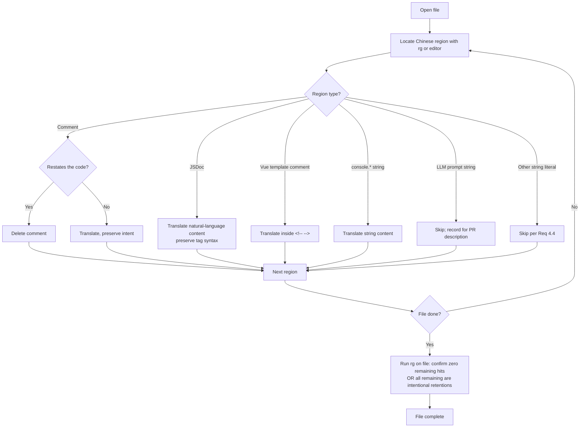

# Design Document — i18n-frontend-comments

## Overview

**Purpose**: Translate Chinese developer comments in `frontend/src/` to English so non-Chinese-reading maintainers can understand intent without translation tooling. Strictly documentation-only; no behavior change.

**Users**: Frontend maintainers and reviewers of MiroFish — developers who read and modify `frontend/src/` but do not read Chinese.

**Impact**: 20 files in `frontend/src/` change; the compiled bundle is byte-equivalent modulo source-map comment lines. The `vue-i18n` user-facing translation surface (`/locales/*.json`) is unaffected.

### Goals

- Eliminate Chinese characters (U+4E00–U+9FFF) from `frontend/src/` comments and dev-facing string literals (`console.*`).
- Preserve every comment's *why* (semantic intent) when translating; delete comments that merely restate the code per `dev-guidelines.md`.
- Append `(#9)` ticket reference to any TODO/FIXME marker that lacks one.
- Keep `npm run build` green and the rendered UI byte-equivalent on a smoke check.

### Non-Goals

- Translating user-facing strings (those live in `/locales/*.json`; tracked separately).
- Translating LLM prompt template strings (translation would change model input — retained and documented in PR per Requirement 1.5).
- Restructuring comments into JSDoc (only keep JSDoc when already JSDoc-shaped).
- Reformatting code, renaming identifiers, or any change to `<script>` / `<template>` semantics.
- Touching backend Python comments (covered by ticket #7) or repo-root configuration files.

## Boundary Commitments

### This Spec Owns

- All comment text inside files under `frontend/src/`: line comments (`//`), block comments (`/* */`), JSDoc (`/** */`), and Vue template comments (`<!-- -->`).
- The natural-language portion of JSDoc tags (`@param`, `@returns`, etc.) — not the tag syntax itself.
- Chinese-content string literals passed to `console.error`, `console.warn`, and `console.log` (developer-facing, not in i18n locales).
- The PR-level documentation listing any deliberately-retained bilingual content.

### Out of Boundary

- Any change inside `/locales/*.json` (covered by issues #8 and #11).
- Any change in `backend/`, `static/`, repo root, or anywhere outside `frontend/src/`.
- LLM prompt template string literals (e.g. `Step5Interaction.vue:725-727`) — retained as documented exceptions.
- New tooling (linters, formatters, translation scripts).
- Any executable change: identifier names, import paths, expression edits, Vue template structure outside `<!-- -->` text, or `<style>` selectors / values.

### Allowed Dependencies

- Existing Vite build (`npm run build`) and Vue dev server (`npm run dev`) for verification.
- `ripgrep` for the verification command.
- No runtime dependencies — this is text-only editing.

### Revalidation Triggers

- Discovery during implementation that a category of Chinese content beyond comments + `console.*` strings exists in `frontend/src/` → update the design's String-Literal Decision Matrix and add residuals to the PR description rather than silently expanding scope.
- Discovery that a JSDoc block carries semantically-load-bearing Chinese (e.g. an idiom that does not have a 1:1 English rendering) → keep both languages, document in PR per Req 1.5.

## Architecture

### Existing Architecture Analysis

Per `structure.md`, `frontend/src/` is layered into `views/`, `components/`, `api/`, `store/`, plus `App.vue`. This spec does not change the layering. Per `tech.md`, the project uses no enforced linter/formatter and existing files mix English and Chinese comments — this spec is the explicit ask to normalize the comment language to English in this directory.

### Architecture Pattern & Boundary Map

This is a documentation-only change — no architectural pattern to choose. The relevant boundary is purely *which textual regions of which files are eligible for edit*. The decision matrix below is the architecture for this spec.

#### Region eligibility matrix

| Region | Action |
| --- | --- |
| `//` line comment | Translate; delete if it restates the code per Req 2.1 |
| `/* */` block comment | Translate; delete if redundant per Req 2.1 |
| `/** */` JSDoc block | Translate the natural-language content; preserve tag syntax (`@param`, `@returns`, etc.) per Req 1.4 |
| `<!-- -->` Vue template comment | Translate per Req 1.3 |
| `console.error|warn|log('… 中文 …')` | Translate the string content (developer-facing, not in i18n locales) |
| LLM prompt template string literal | **Do not translate**; document in PR per Req 1.5 |
| Any other string literal containing Chinese | **Do not translate** (Req 4.4); document if non-empty |
| Identifiers, imports, exports, expressions | **Do not change** (Req 4.2) |
| Vue template structure (tags, attributes, bindings) | **Do not change** (Req 4.2) |

### Technology Stack

| Layer | Choice / Version | Role in Feature | Notes |
|---|---|---|---|
| Frontend | Vue 3.5 + Vite 7 (existing) | Build target — must continue to compile | No version change |
| Verification | `ripgrep` (already present in repo workflows) | Acceptance gate via `rg '[\x{4e00}-\x{9fff}]' frontend/src/` | No new dependency |
| No new tooling | — | — | Per `tech.md` steering: "No enforced linter or formatter… match the surrounding file's style" |

## File Structure Plan

No directory or file additions. All edits are in-place inside the 20 files identified by ripgrep:

```
frontend/src/
├── App.vue                        # 4 hits — translate
├── api/
│   ├── graph.js                   # 10 hits
│   ├── index.js                   # 8 hits (incl. JSDoc-light line comments)
│   ├── report.js                  # 8 hits
│   └── simulation.js              # 29 hits (JSDoc-heavy)
├── components/
│   ├── GraphPanel.vue             # 84 hits — D3 logic comments + template
│   ├── HistoryDatabase.vue        # 124 hits
│   ├── Step1GraphBuild.vue        # 5 hits + 3 console.error strings
│   ├── Step2EnvSetup.vue          # 76 hits
│   ├── Step3Simulation.vue        # 52 hits
│   ├── Step4Report.vue            # 176 hits
│   └── Step5Interaction.vue       # 34 hits + LLM prompt strings (RETAIN)
├── store/
│   └── pendingUpload.js           # 2 hits
└── views/
    ├── Home.vue                   # 43 hits
    ├── InteractionView.vue        # 6 hits
    ├── MainView.vue               # 4 hits
    ├── Process.vue                # 191 hits — largest file (2067 lines)
    ├── ReportView.vue             # 6 hits
    ├── SimulationRunView.vue      # 18 hits
    └── SimulationView.vue         # 22 hits
```

### Modified Files

All 20 files above receive comment translation (and, for `Step1GraphBuild.vue` and any others discovered during implementation, `console.*` string translation). No file is created, deleted, or moved.

## System Flows

### Per-file translation sequence



### TODO/FIXME sweep

```mermaid
flowchart LR
    A[rg 'TODO|FIXME' frontend/src/] --> B{Any hits?}
    B -->|None| C[Document in PR: no markers found]
    B -->|Has hits| D[For each hit]
    D --> E{Already has #N reference?}
    E -->|Yes| F[Leave unchanged]
    E -->|No, was Chinese| G[Translate description AND append #9]
    E -->|No, was already English| H[Out of scope; leave unchanged]
```

## Requirements Traceability

| Requirement | Summary | Realized by |
|---|---|---|
| 1.1 | Zero Chinese in `frontend/src/` per ripgrep | Per-file translation pass; verification command in PR |
| 1.2 | Preserve semantic intent | Translator judgment per region; Req 2.3 enforces conservative-on-ambiguity |
| 1.3 | Handle SFC blocks correctly | Region eligibility matrix (`<script>` / `<template>` / `<style>` rows) |
| 1.4 | Preserve JSDoc structure | Region matrix: "Translate the natural-language content; preserve tag syntax" |
| 1.5 | Document retained bilingual content | PR description lists `Step5Interaction.vue` LLM prompts (and any others) |
| 2.1 | Delete redundant comments | Per-file flowchart `D → E` branch |
| 2.2 | Translate intent-bearing comments | Per-file flowchart `D → F` branch |
| 2.3 | Conservative on ambiguity | Translator rule encoded in research.md Decision; default is *translate, not delete* |
| 2.4 | No new explanatory comments | Translation rule: never add comments not present in original (except `(#9)` ticket ref) |
| 3.1 | Keep TODO/FIXME marker, translate trailing text | TODO sweep flowchart `G` branch |
| 3.2 | Append `(#9)` ticket ref where missing | TODO sweep flowchart `G` branch |
| 3.3 | Preserve existing ticket refs | TODO sweep flowchart `E → F` branch |
| 4.1 | `npm run build` exit 0 | Build run as part of acceptance check |
| 4.2 | No executable change | Region matrix: identifiers/imports/expressions are *not eligible* |
| 4.3 | UI smoke-check identical | Manual smoke after build |
| 4.4 | Leave string literals untouched (except `console.*`) | Region matrix; documented exception for `console.*` is the sole carve-out |
| 5.1 | Verification command in PR | PR template hand-off |
| 5.2 | List retained bilingual files | PR template hand-off |
| 5.3 | Branch + commit naming | `docs/i18n-9-translate-frontend-comments` and `docs(i18n): translate chinese comments in frontend src to english` |
| 5.4 | No edits outside `frontend/src/` | `git diff --name-only main..HEAD` review at PR time |

## Components and Interfaces

This is a documentation-only change — there are no software components, services, or APIs to design. The "interfaces" of this spec are textual:

| Interface | Owner | Contract |
| --- | --- | --- |
| `frontend/src/**/*.{vue,js}` comments | This spec | All comment text is English. Chinese is permitted only when explicitly listed in the PR description as a deliberately-retained bilingual case. |
| `frontend/src/**/*.{vue,js}` `console.*` string literals | This spec | All `console.error|warn|log` argument strings are English. |
| `frontend/src/**/*.{vue,js}` non-`console` string literals | Out of scope | Unchanged from baseline. Any Chinese in these strings (e.g. LLM prompt templates) is documented in the PR. |
| `frontend/src/**/*.{vue,js}` executable code | Out of scope | Byte-identical except for surrounding comment lines. |

## Data Models

Not applicable — no data structures change.

## Error Handling

Not applicable — no runtime code path changes. The "errors" of this spec are reviewer-detectable issues:

| Issue | Detection | Response |
|---|---|---|
| Translation drift (wrong meaning) | Reviewer reads English comment against surrounding code | Reviewer flags; translator revises |
| Accidental edit to executable code | `git diff` review filtered to non-comment lines | Revert; restart that file |
| Residual Chinese in non-LLM string | Verification ripgrep returns unexpected file | Either translate (if `console.*`) or move LLM exception to PR description |
| Build failure on `npm run build` | CI / local build | Bisect: most likely accidental edit to a `<script>` or `<template>` block; revert |

## Testing Strategy

No automated tests added. The spec's verification surface is:

- **Acceptance ripgrep**: `rg '[\x{4e00}-\x{9fff}]' frontend/src/` returns no files (or only files listed as retained in the PR description).
- **Vite build**: `npm run build` exits 0.
- **Manual UI smoke**: `npm run dev`, navigate Home → Process → each Step component → Interaction → Report; confirm rendering matches pre-change baseline. (Cannot be fully proven; explicit acknowledgment of "manual smoke" per the steering note that "type-check/test passes do not prove feature correctness here".)
- **Diff hygiene check**: `git diff --stat main..HEAD` shows only `frontend/src/` files modified.

## Implementation Notes

- Per the project's manual-style ethos, do this in an editor with rg-driven navigation. No new scripts.
- For each file, do all edits in one pass, then re-run `rg '[\x{4e00}-\x{9fff}]' <file>` to confirm zero residual (or only the deliberately-retained string literals, which the implementer should know about ahead of time per the design's eligibility matrix).
- The largest 6 files (`Process.vue`, `Step4Report.vue`, `HistoryDatabase.vue`, `GraphPanel.vue`, `Step2EnvSetup.vue`, `Step3Simulation.vue`) account for ~80% of the work; budget time accordingly.
- Reviewer aid: the PR description should list, in order, the verification command, the verification result, the file count, and any retained-bilingual exceptions. Keep the description short — the diff itself carries the work.
