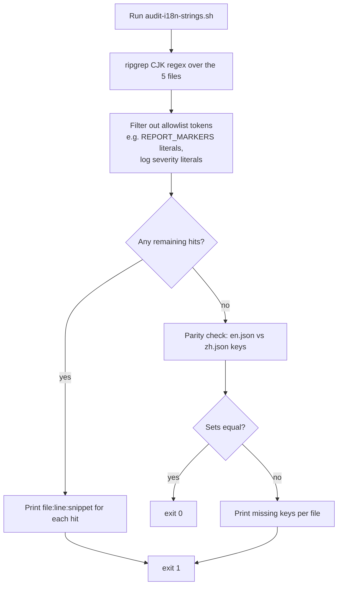

# Technical Design — `i18n-frontend-ui-strings`

## Overview

**Purpose**: Externalize the remaining hard-coded Chinese UI strings in five frontend Vue files (`Process.vue`, `Step2EnvSetup.vue`, `Step3Simulation.vue`, `Step4Report.vue`, `Step5Interaction.vue`) to `vue-i18n` keys, restructure backend-coupled regex parsers in `Step4Report.vue` so they survive the upcoming backend prompt translation, and add a small audit script to verify acceptance.

**Users**: English-locale users of the MiroFish UI (the production tablet/desktop dashboard). No backend or API consumer is affected.

**Impact**: Translates ~50 user-visible strings, refactors three string-equality stage checks into a lookup, and centralizes 29 backend-coupled regexes into a top-of-file constants block. No behaviour change for Chinese-locale users.

### Goals

- Every flagged `file:line` from issue #23 either substituted with a `t()` call backed by entries in both `locales/en.json` and `locales/zh.json`, **or** explicitly classified as a deliberate Chinese token (parser marker for backend compatibility) and added to the audit allowlist.
- `Step4Report.vue` parsers continue to function while the backend remains 100% Chinese, **and** are positioned for a single-file update when the backend prompt translation lands.
- `Step2EnvSetup.vue` stage-watcher tolerates legacy Chinese display strings, current snake_case identifiers, and any future English display strings without further frontend edits.
- A `frontend/scripts/audit-i18n-strings.sh` (or `.js`) check runs in under a minute, requires no backend, and reports zero unallowlisted CJK literals across the five files.

### Non-Goals

- Translating backend log messages, ontology/report agent prompts, or other backend code (covered by issues #24, #25 and the open `i18n-*-prompts` specs).
- Translating Chinese comments in source files (covered by issues #7 and #9).
- Frontend changes outside the five named files.
- Adding a CI gate for this audit (tracked under issue #26).
- Restoring the missing `.kiro/specs/i18n-e2e-english-verification/audit/scripts/run_audit.sh`.

## Boundary Commitments

### This Spec Owns

- `frontend/src/views/Process.vue`: every user-visible Chinese literal flagged in the ticket and any sibling Chinese literal discovered while editing the same block.
- `frontend/src/components/Step2EnvSetup.vue`: stage-watcher logic at lines 678–692 (`STAGE_PHASE_MAP`).
- `frontend/src/components/Step3Simulation.vue`: the `'启动失败'` fallback at line 423/427.
- `frontend/src/components/Step4Report.vue`: all 29 regex parser markers (lines 555–943), the no-reply marker checks (lines 850/854/1325), the `'选择理由'` literal (line 1464), the `'等待开始'` literal (line 1774), and the log-classification literals (lines 2005–2006).
- `frontend/src/components/Step5Interaction.vue`: the chat-history templating (lines 721, 723).
- `locales/en.json` and `locales/zh.json`: new keys added by this spec, mirrored across both files with structurally aligned shape.
- `frontend/scripts/audit-i18n-strings.sh` (new): the small grep-based verifier for Requirement 6.

### Out of Boundary

- Backend prompt strings in `backend/app/services/zep_tools.py`, `report_agent.py`, etc. — the responsibility of `i18n-report-agent-prompts` and issue #25.
- Other Vue files. Even if their templates also contain Chinese literals, they are out of scope for this spec.
- Vue Router, auth, telemetry, accessibility — not affected.
- A more elaborate keys-parity tool — explicit non-goal; the existing `wc -l` agreement and a one-liner `jq` diff suffice.

### Allowed Dependencies

- `vue-i18n` 11 (already adopted; default and fallback locale `'zh'`; messages loaded from `/locales/*.json`).
- `frontend/src/i18n/index.js` (no changes).
- `locales/{en,zh,languages}.json` (new keys only).
- The structure of backend-emitted markers in `zep_tools.py` (read-only reference; not modified here).

### Revalidation Triggers

- The downstream backend prompt translation (issue #25 / `i18n-report-agent-prompts`) lands. → Update `REPORT_MARKERS` in `Step4Report.vue` to alternate Chinese/English wording (single-file edit).
- A new pipeline stage is added in `Step2EnvSetup.vue`. → Add a row to `STAGE_PHASE_MAP`.
- `locales/en.json` or `locales/zh.json` shape changes (new namespace, key removal). → Re-run `audit-i18n-strings.sh` and the parity diff.

## Architecture

### Existing Architecture Analysis

The frontend already uses `vue-i18n` 11 throughout four of the five files. The pattern is uniform: `<template>` uses `$t()`, `<script setup>` uses `const { t } = useI18n()` then `t()`. The file `frontend/src/i18n/index.js` constructs the `createI18n` instance from `import.meta.glob('/locales/*.json')`. There is **no SSR**, no async-loaded translation chunks, and no per-route message-tree splitting — all keys are eagerly loaded.

`Process.vue` is the sole outlier: it has zero i18n adoption today. It will receive the entire pattern (a `useI18n()` import, then template + script substitutions). No structural change to the file beyond the substitutions and the new import.

### Architecture Pattern & Boundary Map

```mermaid
flowchart LR
    subgraph FE[Frontend (Vue 3 + vue-i18n 11)]
        direction TB
        Process[views/Process.vue]
        Step2[components/Step2EnvSetup.vue]
        Step3[components/Step3Simulation.vue]
        Step4[components/Step4Report.vue]
        Step5[components/Step5Interaction.vue]
        i18nIdx[i18n/index.js]
        Audit[scripts/audit-i18n-strings.sh]
    end
    subgraph Locales[/locales/]
        En[en.json]
        Zh[zh.json]
    end
    subgraph BE[Backend (Python)]
        ZepTools[services/zep_tools.py]
    end

    Process -->|t-key lookup| i18nIdx
    Step2 -->|t-key lookup| i18nIdx
    Step3 -->|t-key lookup| i18nIdx
    Step4 -->|t-key lookup| i18nIdx
    Step5 -->|t-key lookup| i18nIdx
    i18nIdx --> En
    i18nIdx --> Zh

    ZepTools -. emits Chinese markers .-> Step4
    Step4 -- REPORT_MARKERS regex set --> Step4

    Audit -. greps CJK literals minus allowlist .-> Process
    Audit -. greps CJK literals minus allowlist .-> Step2
    Audit -. greps CJK literals minus allowlist .-> Step3
    Audit -. greps CJK literals minus allowlist .-> Step4
    Audit -. greps CJK literals minus allowlist .-> Step5
```

**Architecture Integration**:

- **Selected pattern**: pure extension of the existing `vue-i18n` pattern, with two micro-refactors: an in-file `STAGE_PHASE_MAP` constant (Step2) and an in-file `REPORT_MARKERS` constants block (Step4). Both keep responsibility inside the matching Step component, in line with the steering principle "pipeline-stage logic lives in the matching Step component."
- **Domain/feature boundaries**: each file owns its own substitutions; `locales/{en,zh}.json` are the shared translation surface; `audit-i18n-strings.sh` is the verification surface.
- **Existing patterns preserved**: `const { t } = useI18n()` in `<script setup>`; `$t()` in `<template>`; namespace structure (`step1.*`, `process.*` new, `graph.*` reused).
- **New components rationale**: `audit-i18n-strings.sh` is the only new file. It exists because the original audit script referenced in the ticket has been deleted; without a verifier, Requirement 6 cannot be discharged.
- **Steering compliance**: matches `tech.md` ("User-visible strings live in repo-root `/locales/*.json`") and `structure.md` ("Pipeline-aligned modules"). No new dependencies. No new abstractions across the layer boundary.

### Technology Stack

| Layer | Choice / Version | Role in Feature | Notes |
|-------|------------------|-----------------|-------|
| Frontend / CLI | `vue-i18n` 11 (already adopted) | Translates user-visible strings via the `t()` API | Global instance constructed in `frontend/src/i18n/index.js`; default + fallback locale `'zh'` |
| Backend / Services | (read-only reference) Python 3.11 / Flask 3 | Source of Chinese marker strings parsed by `Step4Report.vue` | `backend/app/services/zep_tools.py` is the canonical emitter; not modified by this spec |
| Data / Storage | `locales/en.json`, `locales/zh.json` | Translation source | 1031 lines each (aligned per #20); new keys added under existing namespaces |
| Messaging / Events | n/a | — | — |
| Infrastructure / Runtime | `bash` 5+ (or Node 18+) for `audit-i18n-strings.sh` | Verifies Requirement 6 | Pure ripgrep + jq one-liner |

## File Structure Plan

### Directory Structure

```
frontend/
├── src/
│   ├── components/
│   │   ├── Step2EnvSetup.vue          # MODIFIED — add STAGE_PHASE_MAP, drop Chinese stage equality checks
│   │   ├── Step3Simulation.vue        # MODIFIED — replace '启动失败' fallback with t('step3.startFailed')
│   │   ├── Step4Report.vue            # MODIFIED — add REPORT_MARKERS block, route literals through t()
│   │   └── Step5Interaction.vue       # MODIFIED — route chat-history templating through t()
│   ├── views/
│   │   └── Process.vue                # MODIFIED — add useI18n() import, route every flagged literal through t()
│   └── i18n/
│       └── index.js                   # UNCHANGED
└── scripts/
    └── audit-i18n-strings.sh          # NEW — Requirement 6 verifier

locales/
├── en.json                            # MODIFIED — add new keys for process.*, step3.startFailed (if missing), step4.*, step5.*
└── zh.json                            # MODIFIED — mirror new keys with the original Chinese wording
```

### Modified Files

- `frontend/src/views/Process.vue` — add `import { useI18n } from 'vue-i18n'` and `const { t } = useI18n()` in `<script setup>`. Replace every flagged Chinese literal in template + script with `t('process.<key>')` or `t('graph.<key>')` (where `graph.*` already covers the surface). Substitute fallback literals (`'未命名'` → `t('process.fallbackNodeName')`, `'未知'` → `t('common.unknown')` — already exists). Replace the `alert('环境搭建功能开发中...')` with `alert(t('process.envSetupComingSoon'))`.
- `frontend/src/components/Step2EnvSetup.vue` — add `const STAGE_PHASE_MAP = { 'generating_profiles': 1, '生成Agent人设': 1, 'generating_config': 2, '生成模拟配置': 2, 'copying_scripts': 2, '准备模拟脚本': 2 }` near other module constants. Rewrite the `watch(currentStage, …)` body to `phase.value = STAGE_PHASE_MAP[newStage] ?? phase.value`, with the `t('log.startGeneratingConfig')` log emission gated on the transition into phase 2 (matching today's behaviour). The Chinese console-warning strings are non-user-visible — leave alone (out of scope per ticket boundary).
- `frontend/src/components/Step3Simulation.vue` — replace `'启动失败'` literal at line 423/427 with `t('step3.startFailed')` (key already exists in `en.json` per the locale audit; confirm during implementation).
- `frontend/src/components/Step4Report.vue` — add a `REPORT_MARKERS` constants block at the top of `<script setup>`. Replace each inline Chinese regex with a reference into `REPORT_MARKERS` (e.g., `text.match(REPORT_MARKERS.analysisQuery.regex)`). Route the user-visible Chinese literals (`'选择理由'`, `'等待开始'`, `'--'` no-data placeholder if it surfaces) through `t('step4.<key>')`. The `interview.redditAnswer !== '（该平台未获得回复）'` checks become `!REPORT_MARKERS.noReply.is(interview.redditAnswer)`. Log-classifier literals stay (deliberate, allowlisted).
- `frontend/src/components/Step5Interaction.vue` — replace lines 721/723 with `t('step5.chatRolePrompter')` / `t('step5.chatRoleYou')` / `t('step5.chatHistoryPrefix', { history: historyContext })` / `t('step5.chatNewQuestionPrefix', { message })`. The Chinese phrasing is preserved exactly in `zh.json` so the production Chinese path is byte-identical.
- `locales/en.json` and `locales/zh.json` — add the new keys grouped under existing namespaces. Both files updated in lockstep; `zh.json` carries the exact Chinese wording removed from the source files.
- `frontend/scripts/audit-i18n-strings.sh` — new shell script (≤30 lines). Greps the five files for any non-allowlisted CJK code points and exits non-zero on hits.

## System Flows

### Flow 1: Audit verifier (Requirement 6)



The allowlist is encoded in the script itself (a small array of literal strings the verifier accepts). `REPORT_MARKERS` constants and the log-severity literals (`'错误'`, `'警告'`) are the only entries. Any future addition requires editing the allowlist explicitly — no implicit acceptance.

### Flow 2: Stage-watcher (Requirement 4)

```mermaid
flowchart LR
    Backend[Backend emits stage string<br/>e.g. '生成Agent人设' or 'generating_profiles'] --> Watch[Step2EnvSetup.vue watcher]
    Watch --> Map[STAGE_PHASE_MAP[newStage]]
    Map --> Found{Match?}
    Found -- yes --> Update[phase.value = mapped phase]
    Found -- no --> Noop[phase.value unchanged]
    Update --> SideEffect[Trigger startConfigPolling / addLog as today]
```

The map covers all three stage names in both their Chinese display form and snake_case identifier form (six entries total). When the backend translation lands an English form (e.g. `'generating profiles'` or any other wording), one row is added to the map.

## Requirements Traceability

| Requirement | Summary | Components | Interfaces | Flows |
|-------------|---------|------------|------------|-------|
| 1.1 | `Process.vue` template/script literals routed through `t()` | `Process.vue` | `useI18n().t` | — |
| 1.2 | `Process.vue` renders no Chinese under `en` locale | `Process.vue`, `audit-i18n-strings.sh` | `t()` lookup | Flow 1 |
| 1.3 | `Process.vue` Chinese unchanged under `zh` locale | `Process.vue`, `locales/zh.json` | `t()` fallback | — |
| 1.4 | Fallback names use translated keys | `Process.vue` | `t('process.fallbackNodeName')` | — |
| 1.5 | New literals added to both locales | `locales/{en,zh}.json` | — | Flow 1 (parity check) |
| 2.1 | Step3 `'启动失败'` routed through `t()` | `Step3Simulation.vue` | `t('step3.startFailed')` | — |
| 2.2 | Step4 user-visible literals routed through `t()` | `Step4Report.vue` | `t('step4.*')` | — |
| 2.3 | Step5 chat-history templating routed through `t()` | `Step5Interaction.vue` | `t('step5.chat*')` | — |
| 2.4 | Step components render no Chinese under `en` | All four | `t()` | Flow 1 |
| 2.5 | Step2 stage transitions preserved | `Step2EnvSetup.vue` | `STAGE_PHASE_MAP` | Flow 2 |
| 2.6 | Existing `useI18n()` is the translation utility | All four | — | — |
| 3.1 | New keys exist in both locale files | `locales/{en,zh}.json` | — | Flow 1 |
| 3.2 | `zh.json` preserves exact Chinese wording | `locales/zh.json` | — | — |
| 3.3 | `en.json` carries idiomatic English | `locales/en.json` | — | — |
| 3.4 | Keys grouped under existing namespaces | `locales/{en,zh}.json` | — | — |
| 3.5 | Locale files structurally aligned | `locales/{en,zh}.json` | — | Flow 1 |
| 4.1 | Stage matcher accepts Chinese, snake_case, future English | `Step2EnvSetup.vue` | `STAGE_PHASE_MAP` | Flow 2 |
| 4.2 | Chinese builds keep current behaviour | `Step2EnvSetup.vue` | `STAGE_PHASE_MAP` | Flow 2 |
| 4.3 | Removing Chinese stage names later doesn't break | `Step2EnvSetup.vue` | `STAGE_PHASE_MAP` | Flow 2 |
| 4.4 | Single source of truth for stage matching | `Step2EnvSetup.vue` | `STAGE_PHASE_MAP` | Flow 2 |
| 5.1–5.11 | Bilingual / future-bilingual parser tolerance | `Step4Report.vue` | `REPORT_MARKERS` | — |
| 6.1 | Verifier reports zero hard-coded Chinese | `audit-i18n-strings.sh` | shell exit code | Flow 1 |
| 6.2 | Verifier check documented | `design.md` (this section), `audit-i18n-strings.sh` header | — | Flow 1 |
| 6.3 | Deliberate Chinese tokens allowlisted | `audit-i18n-strings.sh` | inline allowlist | Flow 1 |
| 6.4 | Verifier runs locally in <1 minute, no backend | `audit-i18n-strings.sh` | shell | Flow 1 |

## Components and Interfaces

| Component | Domain/Layer | Intent | Req Coverage | Key Dependencies (P0/P1) | Contracts |
|-----------|--------------|--------|--------------|--------------------------|-----------|
| `Process.vue` (modified) | Frontend / view | Workflow orchestrator; rendering pipeline-stage UI | 1.1–1.5, 3.1–3.5 | `vue-i18n` (P0); `locales/*.json` (P0) | State |
| `Step2EnvSetup.vue` (modified) | Frontend / step component | Setup step; tracks backend stage transitions | 2.5, 2.6, 4.1–4.4 | `vue-i18n` (P0) | State |
| `Step3Simulation.vue` (modified) | Frontend / step component | Simulation runner UI | 2.1, 2.4, 2.6 | `vue-i18n` (P0) | State |
| `Step4Report.vue` (modified) | Frontend / step component | Report renderer; parses backend report markdown | 2.2, 2.4, 2.6, 5.1–5.11 | `vue-i18n` (P0); `backend/app/services/zep_tools.py` markers (P0, read-only) | State |
| `Step5Interaction.vue` (modified) | Frontend / step component | Chat / interview UI | 2.3, 2.4, 2.6 | `vue-i18n` (P0) | State |
| `locales/en.json`, `locales/zh.json` | Frontend / data | Translation source; structurally aligned | 3.1–3.5 | — | Data |
| `audit-i18n-strings.sh` | Frontend / tooling | Local verification of remaining CJK literals across the 5 files | 6.1–6.4 | bash 5 + ripgrep + jq (P0) | CLI |

### Frontend / Step component

#### `Step4Report.vue` — `REPORT_MARKERS` constants block

| Field | Detail |
|-------|--------|
| Intent | Centralise the 29 backend-coupled Chinese marker strings/regexes into a single top-of-file constant block, so future backend translation requires a single-file edit. |
| Requirements | 5.1, 5.2, 5.3, 5.4, 5.5, 5.6, 5.7, 5.8, 5.9, 5.10, 5.11 |

**Responsibilities & Constraints**

- The constants block owns every regex that pattern-matches against backend-emitted markdown structure (section headers, counter lines, interview fields, no-reply markers, search-query markers, log-severity tokens).
- Each constant carries an inline comment naming the canonical backend source line in `zep_tools.py` so future maintainers can find it.
- Each constant exposes either `.regex` (a `RegExp`) or `.is(value)` (an exact-match predicate).
- For markers whose translated wording is decided (today: only `noReply`'s English equivalent if/when it lands), use a single `RegExp` with alternation: `/(?:（该平台未获得回复）|\(该平台未获得回复\)|\[无回复\])/`. For markers whose translated wording is undecided, encode the Chinese form only and document the backend coordination point.
- The constants block does **not** import anything from `vue-i18n` — these are *backend-coupled patterns*, not user-visible strings.

**Dependencies**

- Inbound: every parser function in `Step4Report.vue` (P0)
- Outbound: none
- External: read-only knowledge of backend-emitted markers in `backend/app/services/zep_tools.py:47-1720` (P0)

**Contracts**: State [x]

##### State Management

```js
// In <script setup>:
const REPORT_MARKERS = Object.freeze({
  // backend: zep_tools.py:175 — f"分析问题: {self.query}"
  analysisQuery:    { regex: /分析问题:\s*(.+?)(?:\n|$)/ },
  // backend: zep_tools.py:176 — f"预测场景: {self.simulation_requirement}"
  predictionScene:  { regex: /预测场景:\s*(.+?)(?:\n|$)/ },
  // backend: zep_tools.py:178 — f"- 相关预测事实: {self.total_facts}条"
  factsCount:       { regex: /相关预测事实:\s*(\d+)/ },
  entitiesCount:    { regex: /涉及实体:\s*(\d+)/ },
  relationsCount:   { regex: /关系链:\s*(\d+)/ },
  subQueriesHeader: { regex: /### 分析的子问题\n/ },
  keyFactsHeader:   { regex: /### 【关键事实】/ },
  coreEntitiesHdr:  { regex: /### 【核心实体】\n/ },
  entitySummary:    { regex: /摘要:\s*"?(.+?)"?(?:\n|$)/ },
  relatedFactsCnt:  { regex: /相关事实:\s*(\d+)/ },
  relationChainHdr: { regex: /### 【关系链】\n/ },
  activeFactsCnt:   { regex: /当前有效事实:\s*(\d+)/ },
  activeFactsHdr:   { regex: /### 【当前有效事实】/ },
  historicalHdr:    { regex: /### 【历史\/过期事实】/ },
  involvedEntities: { regex: /### 【涉及实体】\n/ },
  interviewTopic:   { regex: /\*\*采访主题:\*\*\s*(.+?)(?:\n|$)/ },
  interviewCount:   { regex: /\*\*采访人数:\*\*\s*(\d+)\s*\/\s*(\d+)/ },
  selectionReason:  { regex: /### 采访对象选择理由\n/ },
  agentBio:         { regex: /_简介:\s*([\s\S]*?)_\n/ },
  twitterAnswer:    { regex: /【Twitter平台回答】\n?/ },
  redditAnswer:     { regex: /【Reddit平台回答】\n?/ },
  keyQuotesHeader:  { regex: /\*\*关键引言:\*\*\n/ },
  interviewSummary: { regex: /### 采访摘要与核心观点\n/ },
  searchQuery:      { regex: /搜索查询:\s*(.+?)(?:\n|$)/ },
  relatedFactsHdr:  { regex: /### 相关事实:\n/ },
  relatedEdgesHdr:  { regex: /### 相关边:\n/ },
  relatedNodesHdr:  { regex: /### 相关节点:\n/ },
  // No-reply marker — checked as exact-match predicate, not a regex.
  // backend: zep_tools.py:1424-1425
  noReply: {
    is(value) {
      return value === '（该平台未获得回复）'
          || value === '(该平台未获得回复)'
          || value === '[无回复]'
    },
  },
  // Log severity classification — backend logs may interleave English and Chinese severity
  // markers (e.g. Python's logging emits 'ERROR' but legacy logs include '错误'/'警告').
  // Kept bilingual; deliberate per Requirement 5.11.
  logSeverity: {
    isError(line)   { return line.includes('ERROR')   || line.includes('错误') },
    isWarning(line) { return line.includes('WARNING') || line.includes('警告') },
  },
})
```

- **Preconditions**: `REPORT_MARKERS` is constructed once at module-evaluation time (`Object.freeze` to prevent accidental mutation).
- **Postconditions**: every parser function in the file references this object instead of literal regex/string. The diff for each parser is mechanical (`text.match(/分析问题:\s*…/) → text.match(REPORT_MARKERS.analysisQuery.regex)`).
- **Invariants**: the file contains no Chinese regex literals outside this block. The audit allowlist (`audit-i18n-strings.sh`) explicitly accepts the literals inside this block; any new Chinese literal added elsewhere in the file is flagged.

**Implementation Notes**

- Integration: replace each call site one at a time; a quick `npm run dev` smoke test (open a finished project, view its report, scroll through interviews and search results) confirms parity. No unit tests are added — the project's testing posture is "exercise the feature in a browser" per `tech.md`.
- Validation: a sentinel regex for the audit (e.g. `/[一-鿿]/u`) confirms zero CJK literals outside the allowlist.
- Risks: missing a parser site → silent regression. Mitigation: audit script catches any inline Chinese regex; manual smoke test confirms a real report renders identically.

#### `Step2EnvSetup.vue` — `STAGE_PHASE_MAP`

| Field | Detail |
|-------|--------|
| Intent | Replace three string-equality checks with a single source-of-truth lookup, accepting Chinese, snake_case, and future English stage names. |
| Requirements | 4.1, 4.2, 4.3, 4.4, 2.5, 2.6 |

**State Management**

```js
const STAGE_PHASE_MAP = Object.freeze({
  '生成Agent人设':       1,
  'generating_profiles': 1,
  '生成模拟配置':        2,
  'generating_config':   2,
  '准备模拟脚本':        2,
  'copying_scripts':     2,
})

watch(currentStage, (newStage, oldStage) => {
  const newPhase = STAGE_PHASE_MAP[newStage]
  if (newPhase === undefined) return
  phase.value = newPhase
  if (newPhase === 2 && STAGE_PHASE_MAP[oldStage] !== 2 && !configTimer) {
    addLog(t('log.startGeneratingConfig'))
    startConfigPolling()
  }
})
```

- **Preconditions**: `currentStage` is a string emitted by the backend stage tracker.
- **Postconditions**: `phase.value` updates exactly when `currentStage` is a recognised stage name; otherwise unchanged.
- **Invariants**: adding a new stage requires only adding a row to `STAGE_PHASE_MAP`; no other change to `Step2EnvSetup.vue`.

### Frontend / data

#### `locales/en.json`, `locales/zh.json` — new keys

The new keys are listed below as a single design contract. Implementation sequences them by file (Process → Step3 → Step4 → Step5) to keep PR review chunks reviewable.

```json
{
  "process": {
    "buildTitle": "Graph Build / 图谱构建",
    "graphPanelTitle": "Real-time Knowledge Graph / 实时知识图谱",
    "nodes": "nodes / 节点",
    "edges": "relations / 关系",
    "refreshGraph": "Refresh graph / 刷新图谱",
    "exitFullscreen": "Exit fullscreen / 退出全屏",
    "enterFullscreen": "Fullscreen / 全屏显示",
    "realtimeUpdating": "Updating in real time… / 实时更新中…",
    "graphLoading": "Loading graph data… / 图谱数据加载中…",
    "waitingOntology": "Waiting for ontology generation / 等待本体生成",
    "waitingOntologyHint": "Graph build will start automatically once ontology generation completes / 生成完成后将自动开始构建图谱",
    "graphBuildingTitle": "Graph build in progress / 图谱构建中",
    "graphBuildingHint": "Data will appear shortly… / 数据即将显示…",
    "buildFlow": "Build flow / 构建流程",
    "ontologyGeneration": "Ontology generation / 本体生成",
    "interfaceNote": "Interface / 接口说明",
    "ontologyDescription": "Upload documents; the LLM analyses them and automatically generates an ontology (entity types + relation types) suitable for opinion simulation / 上传文档后，LLM分析文档内容，自动生成适合舆论模拟的本体结构（实体类型 + 关系类型）",
    "generationProgress": "Generation progress / 生成进度",
    "generatedEntityTypes": "Generated entity types / 生成的实体类型",
    "generatedRelationTypes": "Generated relation types / 生成的关系类型",
    "waitingOntologyShort": "Waiting for ontology generation… / 等待本体生成…",
    "graphBuildSection": "Graph build / 图谱构建",
    "graphBuildDescription": "Using the generated ontology, chunks the documents and calls the Zep API to build the knowledge graph (entities + relations) / 基于生成的本体，将文档分块后调用 Zep API 构建知识图谱，提取实体和关系",
    "waitingOntologyComplete": "Waiting for ontology generation to finish… / 等待本体生成完成…",
    "entityNodes": "Entity nodes / 实体节点",
    "relationEdges": "Relation edges / 关系边",
    "entityTypes": "Entity types / 实体类型",
    "buildComplete": "Build complete / 构建完成",
    "buildCompleteHint": "Ready to proceed to the next step / 准备进入下一步骤",
    "enterEnvSetup": "Enter environment setup / 进入环境搭建",
    "projectInfo": "Project info / 项目信息",
    "projectName": "Project name / 项目名称",
    "projectId": "Project ID / 项目ID",
    "graphId": "Graph ID / 图谱ID",
    "simulationRequirement": "Simulation requirement / 模拟需求",
    "buildFailed": "Build failed / 构建失败",
    "buildSuccess": "Build complete / 构建完成",
    "buildInProgress": "Graph build in progress / 图谱构建中",
    "ontologyInProgress": "Ontology generation in progress / 本体生成中",
    "buildInitializing": "Initializing… / 初始化中",
    "envSetupComingSoon": "Environment setup feature coming soon… / 环境搭建功能开发中…",
    "stepCompleted": "Completed / 已完成",
    "stepInProgress": "In progress / 进行中",
    "stepWaiting": "Waiting / 等待中",
    "noFilesError": "No pending uploads. Please return to the home page and start over. / 没有待上传的文件，请返回首页重新操作",
    "uploadingFiles": "Uploading files and analysing documents… / 正在上传文件并分析文档...",
    "ontologyGenerationFailed": "Ontology generation failed / 本体生成失败",
    "projectInitFailedPrefix": "Project initialization failed: / 项目初始化失败: ",
    "loadProjectFailed": "Failed to load project / 加载项目失败",
    "loadProjectFailedPrefix": "Failed to load project: / 加载项目失败: ",
    "processingFailed": "Processing failed / 处理失败",
    "graphBuildStarting": "Starting graph build… / 正在启动图谱构建...",
    "graphBuildTaskStarted": "Graph build task started… / 图谱构建任务已启动...",
    "graphBuildStartFailed": "Failed to start graph build / 启动图谱构建失败",
    "graphBuildStartFailedPrefix": "Failed to start graph build: / 启动图谱构建失败: ",
    "graphProcessing": "Processing… / 处理中...",
    "graphBuildComplete": "Build complete; loading graph… / 构建完成，正在加载图谱...",
    "graphBuildFailedPrefix": "Graph build failed: / 图谱构建失败: ",
    "waitingGraphData": "Waiting for graph data… / 等待图谱数据...",
    "fallbackNodeName": "Unnamed / 未命名"
  },
  "step3": {
    "startFailed": "Failed to start / 启动失败"
  },
  "step4": {
    "selectionReason": "Selection reason / 选择理由",
    "awaitingStart": "Awaiting start / 等待开始"
  },
  "step5": {
    "chatRolePrompter": "Questioner / 提问者",
    "chatRoleYou": "You / 你",
    "chatHistoryPrefix": "Here is our previous conversation:\n{history}\n\nMy new question is: {message} / 以下是我们之前的对话：\n{history}\n\n现在我的新问题是：{message}"
  }
}
```

> Note: the **above table** is a *content sketch* — the actual `en.json` and `zh.json` entries each carry their own language only (no "/ 中文" sidecars). The table format is purely for reviewer convenience; the implementation tasks split it into language-specific entries.

### Frontend / tooling

#### `frontend/scripts/audit-i18n-strings.sh`

| Field | Detail |
|-------|--------|
| Intent | Local verifier; greps the five files for non-allowlisted CJK literals and confirms en.json/zh.json key parity. |
| Requirements | 6.1, 6.2, 6.3, 6.4 |

**Responsibilities & Constraints**

- Greps a regex matching CJK code points (`[一-鿿　-〿＀-￯]`) over the five files only.
- Filters out lines whose grep match is fully contained in the allowlist (the `REPORT_MARKERS` constants block range, the bilingual log-severity helper, the i18n message tables in `locales/`, and any other deliberate token annotated with a `// i18n-allow:<reason>` trailing comment).
- Runs `jq -S 'paths(scalars) | join(".")' locales/en.json | sort -u` against the same for `zh.json` and diffs the result; reports missing keys.
- Exits 0 on success, 1 with a human-readable list on failure.

**Dependencies**

- External: bash 5+, ripgrep, jq.

**Contracts**: CLI [x]

##### CLI Contract

```sh
$ bash frontend/scripts/audit-i18n-strings.sh
# (no output) → exit 0
# OR
# frontend/src/views/Process.vue:42: <some Chinese literal>
# locale parity: missing in en.json: foo.bar
# exit 1
```

**Implementation Notes**

- Integration: invoked manually before opening a PR. Not added to CI by this spec (out of boundary).
- Validation: dogfooded by running it before and after the file changes — the diff between the two runs is the spec's progress meter.
- Risks: the allowlist mechanism could be abused. Mitigation: keep the allowlist short and explicit (no glob patterns; the exact literal strings only).

## Data Models

### Logical Data Model

The only "data" introduced by this spec is the new entries in `locales/en.json` and `locales/zh.json`. Their structure follows the existing namespaced JSON shape (`{ namespace: { key: "value", … } }`). No schema changes; no new namespaces beyond `process.*`.

### Data Contracts & Integration

**API Data Transfer**: none.

**Event Schemas**: none.

**Cross-Service Data Management**: none.

The only cross-component "data contract" is the implicit shape of `REPORT_MARKERS` (each entry exposes either `.regex` or `.is(...)`). It is private to `Step4Report.vue`.

## Error Handling

### Error Strategy

This spec is presentation-layer only; there is no new error path. Existing error paths are preserved:

- A missing translation key falls back through `vue-i18n`'s built-in fallback chain to the `'zh'` fallback locale; if the key is missing in both files, `vue-i18n` returns the key string itself. The audit script catches the structural divergence before runtime.
- A backend marker that doesn't match any `REPORT_MARKERS.*` regex returns `null` from the parser, which the existing rendering logic handles (renders the section as-is or skips it). No new error class.

### Error Categories and Responses

- **User Errors**: n/a.
- **System Errors**: n/a.
- **Business Logic Errors**: an unrecognised stage name in `STAGE_PHASE_MAP` is silently ignored (today's behaviour). The watcher does not throw.

### Monitoring

No new logs. The existing `addLog(t('log.startGeneratingConfig'))` call is preserved.

## Testing Strategy

The project's testing posture is "exercise the feature in a browser" (per `tech.md`). The implementation tasks include:

- **Smoke tests (manual)**:
  1. Switch to `en` locale; load a finished project; walk Step1 → Step5; visually confirm no Chinese in DOM (excluding backend-emitted content currently in Chinese).
  2. Switch to `zh` locale; same walkthrough; visually confirm everything matches the production Chinese text.
  3. Open a finished project's report; scroll through key facts, core entities, relation chains, sub-queries, interview answers (Twitter + Reddit), and search results. Confirm parity with `main` branch behaviour.
  4. Trigger the chat flow in Step5 with one or two follow-up messages on each locale; confirm the prompt strings the LLM sees are well-formed.

- **Audit verification**:
  1. Run `bash frontend/scripts/audit-i18n-strings.sh`; expect exit 0 and no output.
  2. Run `wc -l locales/en.json locales/zh.json`; expect equal line counts (pre-#20 invariant maintained).

- **Regression (automated)**: none added — the project doesn't have a frontend test harness, and adding one is explicitly an out-of-scope decision per `tech.md`.

## Optional Sections

(Security, performance, scalability, migration are not relevant to this spec.)

## Supporting References

- `research.md` — discovery findings, design decisions, risk register.
- `requirements.md` — EARS-format acceptance criteria.
- `backend/app/services/zep_tools.py:47-1720` — canonical source of every backend marker the frontend parses.
- `frontend/src/i18n/index.js` — the `vue-i18n` instance configuration (no changes).
- Issue #25 / `.kiro/specs/i18n-report-agent-prompts/` — the downstream backend prompt translation; future trigger for editing `REPORT_MARKERS`.
