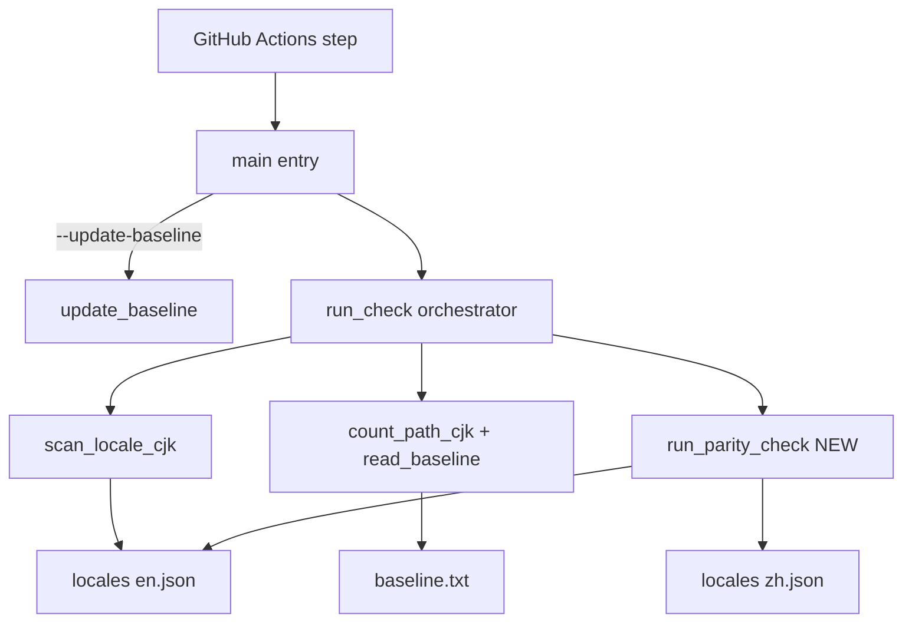
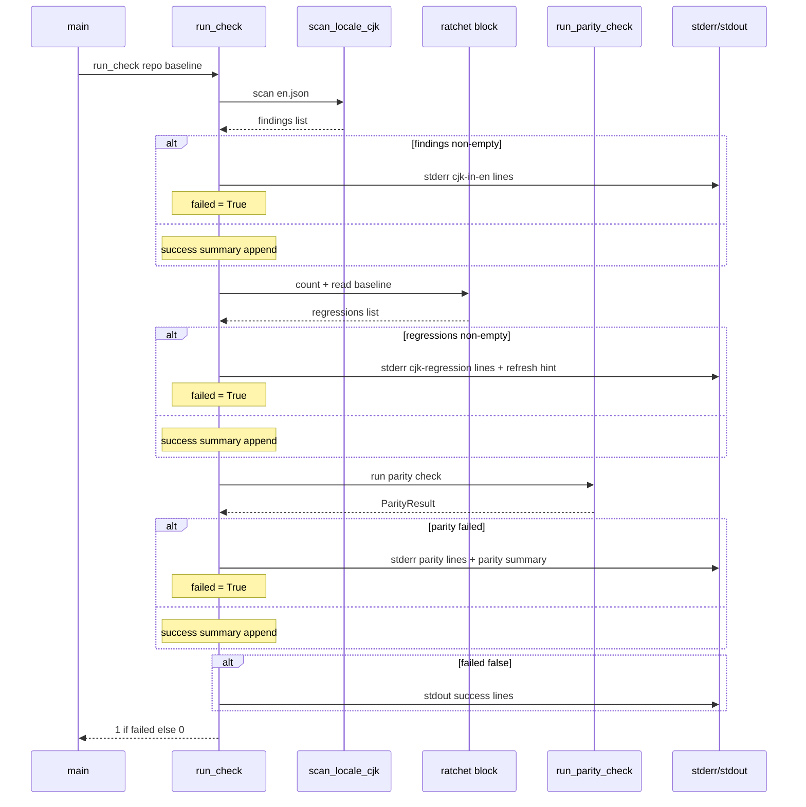

# Design — i18n-locale-parity-guard

## Overview

This feature extends the project's PR-time i18n CI guard so that any pull request which introduces a key in only one of `locales/en.json` / `locales/zh.json` fails. It satisfies acceptance criterion #4 of epic #11 (locale-key parity) with a permanent automated check.

**Purpose**: Lock in locale-catalogue key parity as a permanent CI invariant so that AC #4 of epic #11 cannot regress as new strings are added.
**Users**: Project maintainers and PR authors. Maintainers gain a hard regression gate; PR authors gain a script they can run locally to confirm parity before pushing.
**Impact**: Adds a third check to the existing PR-time guard `scripts/ci/i18n_cjk_guard.py`. No production source under `backend/app/`, `frontend/src/`, or `locales/` is modified by this spec.

### Goals

- Fail any PR whose flattened-key set in `locales/en.json` differs from that of `locales/zh.json`.
- Print actionable failure lines (`<file>:<line>: parity-<en|zh>-only: <dotted-key>`) and a summary count.
- Compose with the existing CJK-clean and per-path-ratchet checks in a single CLI invocation, with a single exit code, no short-circuit.
- Run end-to-end in well under one second on the live catalogues; stdlib-only.
- Pass on `main` at the moment this spec ships (live catalogues are already parity-clean).

### Non-Goals

- Re-implementing the manual audit pipeline at `.kiro/specs/i18n-e2e-english-verification/audit/scripts/`. The new check is the CI extract; the audit retains its own copy of `check_parity.py`.
- Cross-locale value-equality, identical-value heuristics, or ICU-placeholder-shape checks.
- Auto-creating missing keys, suggesting translations, or reformatting the catalogues.
- Modifying the `locales/` schema, the `vue-i18n` runtime, or `backend/app/utils/locale.py`.
- Adding a new GitHub Actions workflow or workflow step.

## Boundary Commitments

### This Spec Owns

- The new parity-check helpers (`_flatten_keys`, `_locate_key_line`, `_format_parity_finding`, `run_parity_check`) and constants (`ZH_JSON_REL_PATH`) inside `scripts/ci/i18n_cjk_guard.py`.
- The new third block of `run_check` that invokes `run_parity_check` and integrates its result into the existing `failed` accumulator and `success_summary` collector.
- The pass/fail semantics of the locale-key parity check.
- New unit / integration tests under `scripts/ci/tests/` covering the parity check and its composition.

### Out of Boundary

- The audit pipeline at `.kiro/specs/i18n-e2e-english-verification/audit/scripts/check_parity.py` (independent, manual-only).
- The structure or format of the baseline file `.kiro/specs/i18n-ci-guard/baseline.txt` (parity is binary; no baseline needed).
- The workflow file `.github/workflows/i18n-cjk-guard.yml` (unchanged; same `python scripts/ci/i18n_cjk_guard.py` invocation already covers the new check).
- Any change to `locales/en.json` or `locales/zh.json` content.
- Open follow-up issues #7, #23, #25 (out-of-scope translation work).

### Allowed Dependencies

- Python ≥3.11 standard library (`json`, `os`, `pathlib`, `re`, `subprocess`, `sys`, `argparse`, `unittest`).
- The existing helpers `_flatten`, `_value_line_number`, `_truncate`, the `EN_JSON_REL_PATH` constant, and the `run_check`/`update_baseline` functions in `scripts/ci/i18n_cjk_guard.py`.
- `git` (for the existing CJK-counting block, untouched here).

### Revalidation Triggers

- Adding a third locale catalogue → parity becomes pairwise; design must be revisited.
- Changing the `flatten` contract (e.g. encoding non-dict containers like lists) → the parity check's "exact match with `check_parity.py`" clause must be re-asserted against the new contract.
- Splitting the guard into multiple CLI scripts → Requirement 3 ("one invocation") must be re-anchored.

## Architecture

### Existing Architecture Analysis

The guard is a single-file Python CLI: `scripts/ci/i18n_cjk_guard.py` (~393 lines, stdlib-only) invoked by one workflow step in `.github/workflows/i18n-cjk-guard.yml`. Its `run_check(repo_root, baseline_path) -> int` function is the orchestrator; today it composes two checks without short-circuit:

1. `scan_locale_cjk(en_json_path)` — fail when `locales/en.json` contains any CJK character.
2. Per-path baseline ratchet — fail when `count_path_cjk(repo_root, p)` exceeds `read_baseline(...)[p]` for any `p` in `("backend/app", "frontend/src")`.

A `failed: bool` accumulator is set independently by each block; a `success_summary: list[str]` collects "OK …" lines that print only on full success. This design extends it with a third block.

The audit pipeline at `.kiro/specs/i18n-e2e-english-verification/audit/scripts/check_parity.py` already implements the algorithm we need (recursive `flatten` + symmetric difference). Its logic is the canonical reference for Requirement 1.1.

### Architecture Pattern & Boundary Map



**Architecture Integration**:

- **Selected pattern**: Composed checks inside a single orchestrator (`run_check`). Each check is an independent function that returns a pass/fail signal and a list of human-readable lines; the orchestrator accumulates them.
- **Domain/feature boundaries**: Parity logic is internal to the guard module. It does not depend on the audit pipeline, the per-path ratchet, or the locale runtime.
- **Existing patterns preserved**: No-short-circuit composition, stderr-for-failure / stdout-for-success, lexicographic ordering for determinism, atomic-write / tmp-rename for any new persistence (none added here).
- **New components rationale**: `run_parity_check` is the only new orchestrator-level function; small private helpers (`_flatten_keys`, `_locate_key_line`, `_format_parity_finding`) keep `run_parity_check`'s body short and individually testable.
- **Steering compliance**: Stdlib-only; explicit type hints (PEP 604 union syntax already in use in this module); single-responsibility helpers; module dependency direction unchanged (still no imports from `backend/`, `frontend/`, or `locales/` runtime code).

### Technology Stack

| Layer | Choice / Version | Role in Feature | Notes |
|-------|------------------|-----------------|-------|
| Backend / Services | n/a | n/a | This is a CI tool; no backend or service code is touched. |
| Infrastructure / Runtime | Python 3.11 stdlib (`json`, `pathlib`, `re`, `subprocess`, `sys`, `argparse`); GitHub Actions `ubuntu-latest`; `actions/checkout@v4`; `actions/setup-python@v5` | Runtime for the guard script and its new parity check. | Versions match the existing guard. No new dependencies; `pyproject.toml` and CI image unchanged. |
| Test Tooling | Python `unittest` (stdlib) | Drives parity check unit + integration tests. | Same framework as existing tests in `scripts/ci/tests/test_i18n_cjk_guard.py`. |

## File Structure Plan

### Directory Structure

```
scripts/
└── ci/
    ├── i18n_cjk_guard.py         # Extended: adds parity helpers + third block in run_check
    └── tests/
        └── test_i18n_cjk_guard.py # Extended: adds ParityCheckTests + composition test
```

### Modified Files

- `scripts/ci/i18n_cjk_guard.py`
  - Add module-level constants: `ZH_JSON_REL_PATH = "locales/zh.json"`.
  - Add private helpers: `_flatten_keys`, `_locate_key_line`, `_format_parity_finding`.
  - Add public function: `run_parity_check(repo_root: Path) -> ParityResult`.
  - Add a new `NamedTuple` (or `@dataclass(frozen=True, slots=True)`) `ParityResult` with fields `(passed: bool, failure_lines: list[str], success_summary: str | None)`.
  - Edit `run_check`: insert the parity block after the per-path-ratchet block, before the final `if not failed: print(success_summary)` block. Match the existing accumulator idiom.
  - Update the module docstring to list three checks.
- `scripts/ci/tests/test_i18n_cjk_guard.py`
  - Extend `_make_full_repo` (or add a sibling `_make_full_repo_with_zh`) to write a `locales/zh.json` alongside the existing `locales/en.json`. Keep the default ZH a parity-clean mirror of the EN fixture so existing tests do not need to change semantically.
  - Add new test class `ParityCheckTests` covering Requirements 1.1, 1.2, 1.3, 1.4, 1.5, 2.1, 2.2, 2.3, 2.5.
  - Add one composition test (Requirement 5.1.f) inside `RunCheckEndToEndTests` (or a new `RunCheckCompositionTests` class) that plants a CJK string and a parity divergence in the same repo and asserts both failure lines + exit 1.
  - Update existing `RunCheckEndToEndTests.test_*` to either commit a parity-clean `locales/zh.json` or assert the parity check now also runs but does not flip the test outcome.

### Files Not Created

- No new source file is created. Option C (separate `locale_parity.py` helper module) was rejected in `gap-analysis.md` and `research.md`.
- No new workflow file. The existing `.github/workflows/i18n-cjk-guard.yml` is invoked unchanged.

## Requirements Traceability

| Requirement | Summary | Components | Interfaces | Flows |
|-------------|---------|------------|------------|-------|
| 1.1 | Flatten EN/ZH into matching dotted-key sets | `i18n_cjk_guard._flatten_keys` (new), reuses `_flatten` | `_flatten_keys(data: dict) -> set[str]` | n/a |
| 1.2 | Pass on identical key sets, success line includes shared count | `run_parity_check`, `run_check` | `ParityResult.success_summary` | Run-Check Composition |
| 1.3 / 1.4 | Fail on en-only or zh-only keys | `run_parity_check` | `ParityResult.passed`, `ParityResult.failure_lines` | Run-Check Composition |
| 1.5 | Dict leaves are non-leaves; scalar leaves are leaves | `_flatten_keys` (no type narrowing) | n/a | n/a |
| 2.1 | `<file>:<line>: parity-<side>-only: <key>` lines | `_format_parity_finding`, `_locate_key_line` | `_format_parity_finding(file, line, key, side) -> str` | n/a |
| 2.2 | Line-1 fallback when key not located | `_locate_key_line` | `_locate_key_line(text_lines, key) -> int` (returns 1 on miss) | n/a |
| 2.3 | Final `parity: en-only=N, zh-only=M` summary | `run_parity_check` | Last entry of `ParityResult.failure_lines` on failure | n/a |
| 2.4 | All parity output to stderr | `run_check` integration block | `print(..., file=sys.stderr)` | Run-Check Composition |
| 2.5 | Lexicographic ordering | `run_parity_check` | `sorted(...)` over symmetric difference | n/a |
| 3.1 | All checks run, no short-circuit | `run_check` (existing accumulator pattern) | `failed: bool` accumulator | Run-Check Composition |
| 3.2 / 3.3 | Single exit code: 1 on any fail, 0 otherwise | `run_check` | Returns `1 if failed else 0` | Run-Check Composition |
| 3.4 / 3.5 | `--update-baseline`, `--baseline`, `--repo-root` flags unchanged | `main`, `_build_parser` | Existing argparse surface | n/a |
| 3.6 | Workflow file unchanged | `.github/workflows/i18n-cjk-guard.yml` | n/a (no edit) | n/a |
| 4.1 | Stdlib-only | `i18n_cjk_guard` imports | No new imports | n/a |
| 4.2 | Sub-second runtime | `_flatten_keys` is O(keys); set-diff is O(keys) | n/a | n/a |
| 4.3 | Deterministic output | All sorts lexicographic | n/a | n/a |
| 5.1 (a–f) | Tests for success, en-only, zh-only, both, scalar-leaf, composition | `scripts/ci/tests/test_i18n_cjk_guard.py:ParityCheckTests` + composition test | n/a | n/a |
| 5.2 / 5.3 / 5.4 | Match existing test style; isolated fixtures; clean run on parity-clean repo | Same test file | n/a | n/a |
| 6.1 | Guard passes on live catalogues at HEAD | Manual run at implementation time | `python scripts/ci/i18n_cjk_guard.py` exit 0 | n/a |
| 6.2 | If divergence found, document in tasks.md and fix | n/a (does not trigger; live parity holds) | n/a | n/a |

## System Flows

### Run-Check Composition



**Key decisions**:

- The parity block is appended last so its (potentially long) failure list is contiguous in the failure stream.
- The `failed` accumulator is shared with the prior two blocks; this is the only mechanism for cross-block signalling.
- The summary line `parity: en-only=N, zh-only=M` is appended to `ParityResult.failure_lines` (last entry) so the orchestrator can print all failure lines uniformly without a special-case branch.

## Components and Interfaces

| Component | Domain/Layer | Intent | Req Coverage | Key Dependencies (P0/P1) | Contracts |
|-----------|--------------|--------|--------------|--------------------------|-----------|
| `_flatten_keys` | Guard / helper | Return the dotted-key set of a parsed JSON catalogue, mirroring `check_parity.py.flatten`. | 1.1, 1.5 | `_flatten` (P0, existing) | Service |
| `_locate_key_line` | Guard / helper | Best-effort line-number resolution for a dotted key in raw JSON text, with line-1 fallback. | 2.1, 2.2 | none | Service |
| `_format_parity_finding` | Guard / helper | Format one failure line as `<file>:<line>: parity-<side>-only: <key>`. | 2.1 | none | Service |
| `ParityResult` | Guard / DTO | Carry parity-check outcome (passed flag, failure lines, success-summary line). | 1.2, 2.3, 2.5 | none | State |
| `run_parity_check` | Guard / orchestrator-leaf | Read both catalogues, compute symmetric difference, build `ParityResult`. | 1.1–1.5, 2.1–2.5 | `_flatten_keys` (P0), `_locate_key_line` (P0), `_format_parity_finding` (P0) | Service |
| `run_check` (modified) | Guard / orchestrator | Compose the three checks with a single `failed` accumulator and exit code. | 3.1–3.3 | All three checks (P0) | Service |
| `ParityCheckTests` (test) | Tests | Unit + integration coverage for parity. | 5.1 (a–f), 5.2–5.4 | `run_parity_check`, `run_check` (P0) | Service |

### Guard / helper layer

#### `_flatten_keys`

| Field | Detail |
|-------|--------|
| Intent | Return the set of dotted-key paths of a parsed JSON object, mirroring `check_parity.py.flatten`. |
| Requirements | 1.1, 1.5 |

**Responsibilities & Constraints**

- Iterate via the existing `_flatten(prefix, value, out)` helper to guarantee identical path semantics.
- Descend only into `dict`. Any non-dict (string, number, bool, null, list) at a leaf produces a key.
- Return a `set[str]` so the parity caller can compute symmetric differences without re-deduplicating.

**Dependencies**

- Inbound: `run_parity_check` (P0).
- Outbound: `_flatten` (P0, existing private helper in same module).

**Contracts**: Service [x]

##### Service Interface

```python
def _flatten_keys(data: dict[str, object]) -> set[str]:
    ...
```

- Preconditions: `data` is the result of `json.loads` over a catalogue file (i.e., a `dict` at the top level).
- Postconditions: every dotted path returned corresponds to a non-`dict` leaf in `data`. The set is unordered; callers must sort before formatting output (Requirement 2.5).
- Invariants: `_flatten_keys({}) == set()`. For any catalogue `c`, `_flatten_keys(c)` is identical to the set of keys produced by `check_parity.py.flatten(c)`.

**Implementation Notes**

- Integration: One call site (`run_parity_check`).
- Validation: Unit-test against a hand-rolled fixture with mixed leaf types (string, number, bool, null) and at least three nesting levels (Requirement 5.1.e).
- Risks: None. Reuses the existing flatten primitive verbatim.

#### `_locate_key_line`

| Field | Detail |
|-------|--------|
| Intent | Best-effort line-number resolution for a dotted key in the raw JSON source text, with a deterministic line-1 fallback. |
| Requirements | 2.1, 2.2 |

**Responsibilities & Constraints**

- Accept the splitlines view of a JSON file (`text_lines: list[str]`) and a dotted key (`dotted_key: str`).
- Search for the leaf segment of the dotted key (after the last `.`) wrapped in JSON quotes, e.g. `"missingKey"`. Return the 1-based line number of the first match.
- Fall back to `1` when no match is found (mirrors `_value_line_number`).
- Performance must remain linear in the number of lines.

**Dependencies**

- Inbound: `run_parity_check` (P0).
- Outbound: none.

**Contracts**: Service [x]

##### Service Interface

```python
def _locate_key_line(text_lines: list[str], dotted_key: str) -> int:
    ...
```

- Preconditions: `dotted_key` non-empty; `text_lines` is the result of `Path.read_text(...).splitlines()`.
- Postconditions: returns an integer ≥ 1.
- Invariants: When the leaf segment appears in `text_lines` wrapped in `"..."`, the return is the (1-based) line number of the first occurrence. Otherwise the return is `1`.

**Implementation Notes**

- Integration: One call site (`run_parity_check`).
- Validation: Unit-test the exact-match path, the multi-occurrence path (first match wins), and the not-found fallback.
- Risks: A leaf segment that also appears as part of another (unrelated) key or in a value text could yield a slightly misleading line number. Acceptable: the dotted key in the failure message is the source of truth; the line is a navigation aid. Documented in the docstring.

#### `_format_parity_finding`

| Field | Detail |
|-------|--------|
| Intent | Format a single parity-failure line in the canonical layout used by the guard. |
| Requirements | 2.1 |

**Responsibilities & Constraints**

- Produce strings of the exact form `<file>:<line>: parity-en-only: <dotted-key>` or `<file>:<line>: parity-zh-only: <dotted-key>`.
- Mirror the existing `_format_locale_finding` style (`<file>:<line>: <category>: <payload>`).

**Dependencies**

- Inbound: `run_parity_check` (P0).
- Outbound: none.

**Contracts**: Service [x]

##### Service Interface

```python
def _format_parity_finding(file_rel_path: str, line_no: int, dotted_key: str, side: str) -> str:
    ...
```

- Preconditions: `side in {"en-only", "zh-only"}`; `file_rel_path` is one of `EN_JSON_REL_PATH` / `ZH_JSON_REL_PATH`; `line_no >= 1`.
- Postconditions: returns a single line with no embedded newline.
- Invariants: The category token in the line is exactly `parity-en-only` or `parity-zh-only` so log greps match deterministically.

### Guard / DTO layer

#### `ParityResult`

| Field | Detail |
|-------|--------|
| Intent | Immutable carrier for parity-check outcome consumed by `run_check`. |
| Requirements | 1.2, 2.3, 2.5 |

**Contracts**: State [x]

##### State Management

- State model:

```python
class ParityResult(NamedTuple):
    passed: bool
    failure_lines: list[str]  # already-formatted lines, including the trailing "parity: en-only=N, zh-only=M" summary on failure
    success_summary: str | None  # populated only when passed is True
```

- Persistence & consistency: in-memory only; constructed by `run_parity_check` and consumed by `run_check`.
- Concurrency strategy: n/a (single-process, single-call).

### Guard / orchestrator-leaf

#### `run_parity_check`

| Field | Detail |
|-------|--------|
| Intent | Compute the locale-key parity outcome and produce a `ParityResult`. |
| Requirements | 1.1–1.5, 2.1–2.5 |

**Responsibilities & Constraints**

- Read both `locales/en.json` and `locales/zh.json` from `repo_root`.
- Flatten each via `_flatten_keys` and compute the symmetric difference.
- For each en-only key (sorted lexicographically): resolve its line via `_locate_key_line` over the EN catalogue's source-text lines, and emit a `parity-en-only` line via `_format_parity_finding`.
- For each zh-only key (sorted lexicographically, after en-only): resolve its line via `_locate_key_line` over the ZH catalogue's source-text lines, and emit a `parity-zh-only` line.
- On failure, append a final `parity: en-only=N, zh-only=M` summary line to `failure_lines`.
- On success, build the success summary `OK locale-parity: <count> keys per side`.
- If either catalogue file is missing, return a `ParityResult(passed=False, failure_lines=[<single error line>], success_summary=None)` and let `run_check` fold the error into the global `failed` flag.

**Dependencies**

- Inbound: `run_check` (P0).
- Outbound: `_flatten_keys`, `_locate_key_line`, `_format_parity_finding` (all P0).

**Contracts**: Service [x]

##### Service Interface

```python
def run_parity_check(repo_root: Path) -> ParityResult:
    ...
```

- Preconditions: `repo_root` is a valid working-tree directory; `locales/en.json` and `locales/zh.json` are expected at the relative paths defined by `EN_JSON_REL_PATH` and `ZH_JSON_REL_PATH`.
- Postconditions: returns a `ParityResult`. When `passed`, `failure_lines == []` and `success_summary` is non-`None`. When not `passed`, `failure_lines` is non-empty and ends with a `parity: en-only=…` summary line; `success_summary` is `None`.
- Invariants: Flattened-key-set computation matches `check_parity.py.flatten` byte-for-byte for any input. Output is deterministic across runs for identical inputs.

**Implementation Notes**

- Integration: Called once per `run_check` invocation. Skipped entirely in `--update-baseline` mode (covered by Requirement 3.4 — `update_baseline` is invoked from `main` instead of `run_check`).
- Validation: Unit-test all required outcomes (Requirement 5.1 a–e); integration-test composition (5.1 f).
- Risks: A malformed JSON catalogue raises `json.JSONDecodeError`. The function should treat this the same as a missing file (return `ParityResult(passed=False, …)`), so the guard reports a clean failure rather than crashing CI with a Python traceback.

### Guard / orchestrator (modified)

#### `run_check` (modification)

| Field | Detail |
|-------|--------|
| Intent | Compose all three checks (CJK-clean, per-path ratchet, parity) into one exit code. |
| Requirements | 3.1, 3.2, 3.3 |

**Responsibilities & Constraints**

- After the existing per-path-ratchet block (existing line ~258–293) and before the final `if not failed` block (existing line ~295–298), call `run_parity_check(repo_root)`.
- If the result is not passed, set `failed = True`, print every entry of `result.failure_lines` to `sys.stderr`, one line per `print(...)` call.
- If passed, append `result.success_summary` to `success_summary`.
- Return `1 if failed else 0` (unchanged).

**Dependencies**

- Inbound: `main` (P0, via either standalone CLI or test invocation).
- Outbound: `scan_locale_cjk`, per-path ratchet helpers, `run_parity_check` (all P0).

**Contracts**: Service [x] / State [x]

##### Service Interface

Unchanged signature: `def run_check(repo_root: Path, baseline_path: Path) -> int`.

- Preconditions: unchanged.
- Postconditions: exit code reflects all three checks (was: two checks).
- Invariants: still no short-circuit between checks.

**Implementation Notes**

- Integration: One inserted block of ~10 lines in the existing function.
- Validation: Existing CLI smoke tests continue to pass; new `RunCheckEndToEndTests` cases assert correct fail/pass propagation when only the parity check fails, only an existing check fails, or both fail.
- Risks: A future maintainer could accidentally short-circuit by inserting an early `return` between blocks. Mitigated by the composition test (Requirement 5.1.f) which fails if any block is skipped.

### Tests

#### `ParityCheckTests`

| Field | Detail |
|-------|--------|
| Intent | Unit + integration coverage for the parity check, matching the style of existing `RunCheckEndToEndTests`. |
| Requirements | 5.1 (a–f), 5.2, 5.3, 5.4 |

**Responsibilities & Constraints**

- Use `unittest`, `tempfile.TemporaryDirectory`, and the existing `_make_repo` / `_commit_file` test helpers.
- Each test owns its own ephemeral repo. No reliance on the live `locales/` content for negative paths (Requirement 5.3).
- Assertions check exit code AND substring presence of the failure category tokens (`parity-en-only`, `parity-zh-only`) AND that the summary line is the last failure line.

**Dependencies**

- Inbound: `unittest.main`.
- Outbound: `i18n_cjk_guard.run_parity_check`, `i18n_cjk_guard.run_check` (both P0).

**Implementation Notes**

- Test cases (one per Requirement 5.1 sub-bullet):
  - (a) `test_passes_when_keys_match` — both catalogues identical → `run_parity_check` returns `passed=True`; `run_check` returns 0.
  - (b) `test_fails_on_en_only_key` — `en.json` has an extra key → `run_parity_check` returns `passed=False`, failure includes `parity-en-only`, summary is `parity: en-only=1, zh-only=0`.
  - (c) `test_fails_on_zh_only_key` — symmetric of (b).
  - (d) `test_fails_on_both_sided_divergence` — failure list contains both `parity-en-only` and `parity-zh-only` lines, ordered en-first then zh, each lex-sorted within its group.
  - (e) `test_passes_with_scalar_leaves_at_same_path` — both catalogues have a scalar (e.g. `null`, `42`, `false`) at the same dotted path → parity passes (Requirement 1.5).
  - (f) `test_run_check_no_short_circuit` — one repo plants both a CJK in `en.json` and a parity-divergent key. Expect: exit 1; stderr contains both `cjk-in-en` and `parity-en-only` (or `parity-zh-only`); the per-path-ratchet success summary is suppressed (since failed).
- Risks: Test fixtures must use `ensure_ascii=False` JSON to match the live catalogue style.

## Error Handling

### Error Strategy

- **Missing catalogue file** → `run_parity_check` returns `ParityResult(passed=False, failure_lines=[<missing-file-line>], success_summary=None)`. `run_check` flips `failed`, prints the line to stderr, returns 1.
- **Malformed JSON** → same path as missing catalogue. `json.JSONDecodeError` is caught inside `run_parity_check`; the line printed names the offending file and the parser's `msg`.
- **Parity divergence** (the expected unhappy path) → fail per Requirements 1.3 / 1.4 / 2.1–2.5.
- **`_locate_key_line` cannot find the key** → fall back to line 1 (Requirement 2.2). Not an error; the caller proceeds.
- **No-short-circuit invariant** → enforced by the orchestrator's accumulator pattern; covered by Requirement 5.1.f.

### Monitoring

CI workflow logs (GitHub Actions) are the sole observability surface. Failure lines are designed to be greppable: `parity-en-only`, `parity-zh-only`, `parity: en-only=`, `parity: zh-only=` are stable tokens.

## Testing Strategy

### Unit Tests

- `_flatten_keys`: empty input, flat input, mixed-type leaves, three-level nesting, `null` and scalar leaves.
- `_locate_key_line`: exact match, multi-occurrence (first wins), not found (line-1 fallback).
- `_format_parity_finding`: en-only and zh-only sides, embedded special characters in key names (e.g. underscores, digits).
- `ParityResult`: pass-shape and fail-shape construction.

### Integration Tests

- All six `ParityCheckTests` sub-cases listed above.
- The composition case (Requirement 5.1.f) inside `RunCheckCompositionTests` (or appended to `RunCheckEndToEndTests`).
- A regression of the existing `RunCheckEndToEndTests` cases after extending `_make_full_repo` to write a default parity-clean `locales/zh.json`.

### Performance / Load

- One sanity case: parity check on a synthetic 10 000-key catalogue completes in well under one second on the CI runner. Asserted by a `time.perf_counter()` budget of 1.0 s in the integration test.

## Performance & Scalability

- Catalogue size: ~1000 keys today; growth bounded by the number of UI strings + log keys. Even at 10× the current size, `_flatten` + set-diff remains negligible (<100 ms).
- The CI workflow timeout is 1 minute (`.github/workflows/i18n-cjk-guard.yml:timeout-minutes: 1`); the new check adds at most tens of milliseconds.

## Supporting References

- `gap-analysis.md` (this spec) — implementation-approach options A/B/C with rationale.
- `research.md` (this spec) — design decision records.
- `.kiro/specs/i18n-ci-guard/design.md` — prior CI guard's design doc (style and boundary precedents).
- `.kiro/specs/i18n-e2e-english-verification/audit/scripts/check_parity.py` — reference parity algorithm.
