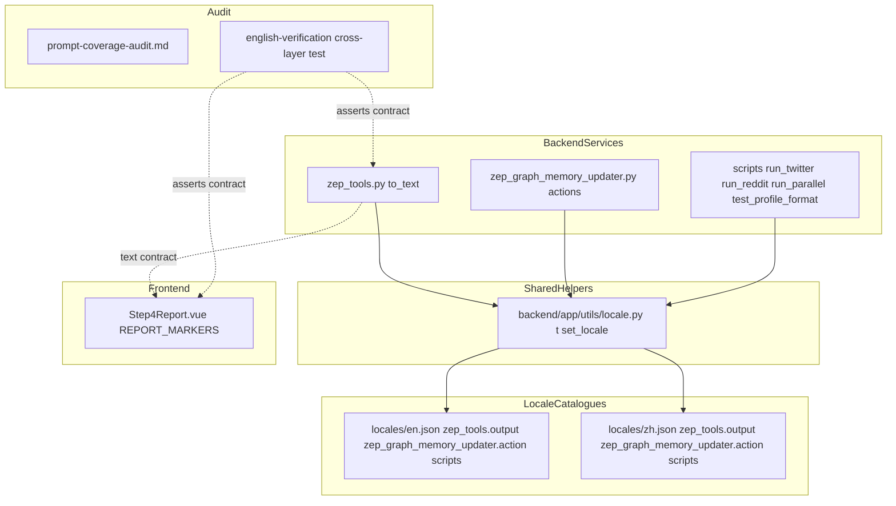
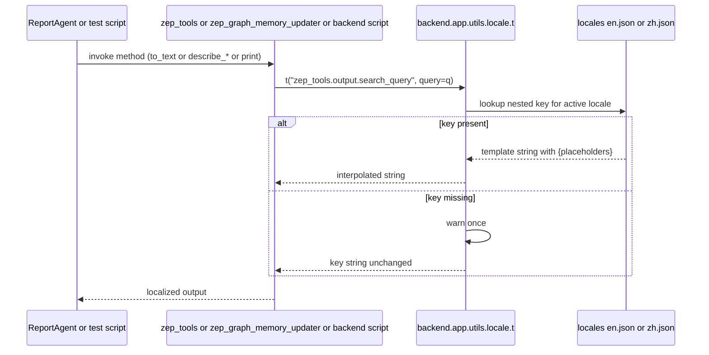
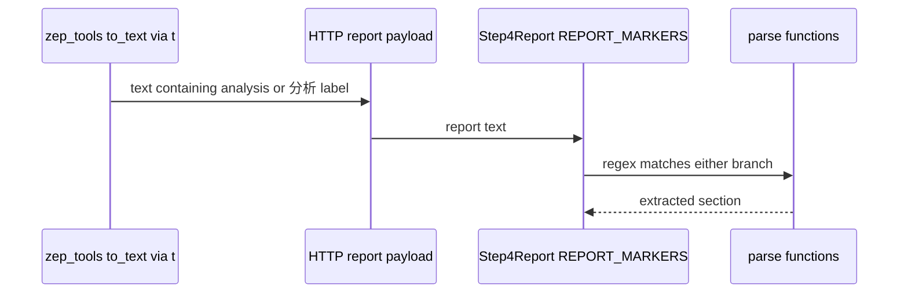

# Design — i18n-mandarin-gap-coverage

## Overview

**Purpose**: Close the four remaining "Gaps" enumerated by the i18n umbrella tracker (GitHub #46) so the listed backend files emit user-facing text through the established `t()` helper, the Step 4 report view continues to parse correctly when the backend emits English, and the existing CJK CI guard mechanically proves the result.

**Users**: Operators (English- and Chinese-locale alike) running the MiroFish stack via the UI; contributors running the backend simulation/test scripts; reviewers and CI infrastructure that enforce the no-hardcoded-Mandarin invariant.

**Impact**: Removes ~390 Han-character literal lines from six backend files; adds ~200 locale keys to both `locales/en.json` and `locales/zh.json`; extends `Step4Report.vue:550-643` `REPORT_MARKERS` so every regex accepts both the legacy Chinese and new English variants; ships a fixture-driven verification test under `.kiro/specs/i18n-e2e-english-verification/audit/` that gates future drift.

### Goals
- Externalize every previously hardcoded Mandarin literal in the six in-scope backend files via `t()`.
- Keep the Step 4 report view working under both `en` and `zh` backend output, atomically.
- Produce a written audit of inline-prompt-string coverage across the three prompt-generator specs.
- Add a cross-layer English-verification test so future drift fails CI.
- Make the existing CJK CI guard pass on all six in-scope files.

### Non-Goals
- Translating LLM-facing system/user prompts inside `zep_tools.py` into locale catalogues — those follow the project convention of "English body + `get_language_instruction()`" already established by `i18n-report-agent-prompts`.
- Modifying the three prompt-generator source files (`oasis_profile_generator.py`, `ontology_generator.py`, `simulation_config_generator.py`). R6 produces an audit artefact only; any source remediation lands in the originating specs.
- Translating Han characters that are punctuation embedded in regex character classes (`[。！？]`, `[，,；;：:、]`, `[「」]`) — these drive segmentation, not display.
- Touching `report_agent.py` (owned by `i18n-report-agent-prompts`) or other files already routed through `t()`.
- Adding the cross-layer test to CI itself — R5 ships the test but wiring it into pipeline is owned by `i18n-ci-guard`.

## Boundary Commitments

### This Spec Owns
- The `to_text()` and inline-return-string output of `backend/app/services/zep_tools.py`.
- The 16 action-description methods of `backend/app/services/zep_graph_memory_updater.py` and its `PLATFORM_DISPLAY_NAMES` map.
- The operator-facing console output (`print`, `argparse`) of:
  - `backend/scripts/run_twitter_simulation.py`
  - `backend/scripts/run_reddit_simulation.py`
  - `backend/scripts/run_parallel_simulation.py`
  - `backend/scripts/test_profile_format.py`
- The `REPORT_MARKERS` literal block in `frontend/src/components/Step4Report.vue:540-643` (alternation-branch update) and the `logSeverity.isError`/`isWarning` dual-token guards.
- New keys under three locale-catalogue namespaces: `zep_tools.output.*`, `zep_graph_memory_updater.action.*`, `scripts.*`.
- The cross-layer English-verification test artefact under `.kiro/specs/i18n-e2e-english-verification/audit/`.
- The prompt-coverage audit artefact `.kiro/specs/i18n-mandarin-gap-coverage/prompt-coverage-audit.md`.

### Out of Boundary
- `backend/app/utils/locale.py` (the `t()` helper itself).
- `backend/app/services/report_agent.py` (owned by `i18n-report-agent-prompts`).
- Generator source files: `oasis_profile_generator.py`, `ontology_generator.py`, `simulation_config_generator.py`.
- The CJK CI guard implementation (owned by `i18n-ci-guard`).
- The locale-parity guard (`i18n-locale-parity-guard`).
- Any markdown/README, env-example, or comment-only file (other i18n specs cover those).

### Allowed Dependencies
- `backend/app/utils/locale.py` — `t`, `set_locale`, `get_locale`, `get_language_instruction`.
- `backend/app/utils/logger.py` — unchanged consumer.
- `vue-i18n` runtime for the frontend marker-source (read-only; we do not import a locale into the regex itself, but we use `useI18n()` to optionally log warnings on missing markers).
- `locales/en.json` and `locales/zh.json` — additive only; key removals are out of scope.

### Revalidation Triggers
- Changing the `t()` helper signature → revalidate every site this spec touched.
- Renaming any of `zep_tools.output.*` or `zep_graph_memory_updater.action.*` keys → revalidate `Step4Report.vue` (only insofar as the literal strings themselves change).
- Removing the `i18n-allow-block` annotation in `Step4Report.vue` → revalidate that the CJK guard still passes there.
- Adding a new section header to `zep_tools.py` `to_text()` output → require a matching marker alternate in `Step4Report.vue` (gated by R5 test).

## Architecture

### Existing Architecture Analysis

- All user-visible string externalization in this project routes through `backend/app/utils/locale.py`'s `t()` helper with per-locale JSON catalogues at the repo root (`locales/{en,zh}.json`). Both frontend (via the `@locales` Vite alias) and backend read the same files. The locale-parity guard already enforces key-coverage symmetry.
- `Step4Report.vue` is the only frontend consumer that *parses* (rather than displays) backend output. Its `REPORT_MARKERS` block sits inside a deliberate `i18n-allow-block` annotation that the CJK CI guard recognizes as an exception.
- The CJK CI guard scans the codebase for Han codepoints in source files and fails on hits outside the allow-list. Verifying its scan set covers the in-scope files is a paper exercise, not a code change.

### Architecture Pattern & Boundary Map



**Architecture Integration**:
- Selected pattern: extension of the existing string-externalization pipeline; the new code shares the same data path as every prior `i18n-*` spec.
- Domain boundary: backend services and scripts own the source-of-truth phrasing; the frontend parser merely matches it.
- Existing patterns preserved: `t(key, **kwargs)`, `set_locale()` thread-local, `_languages` registry, `i18n-allow-block` CJK guard exception, alternation-branch regex evolution as documented in `Step4Report.vue:541-548`.
- New components rationale: none — every component is an extension or modification of an existing module.
- Steering compliance: 4-space indent, snake_case Python, no new dependencies, `vue-i18n` reused, double-quoted Python strings preferred per dev-guidelines.

### Technology Stack

| Layer | Choice / Version | Role in Feature | Notes |
|-------|------------------|-----------------|-------|
| Backend / Services | Python ≥3.11 | host of the six modified files | uses existing `t()` helper |
| Backend / Helpers | `backend/app/utils/locale.py` (unchanged) | `t(key, **kwargs)`, `set_locale(locale)` | dependency, no modifications |
| Frontend | Vue 3.5 + `vue-i18n` 11 | `Step4Report.vue` marker source | uses existing `useI18n()` for optional missing-marker warnings only |
| Data / Storage | `locales/{en,zh}.json` | catalogue of new keys | additive only |
| Infrastructure / Runtime | `scripts/check_i18n_logs.py` (or equivalent CJK guard) | passes on all six files post-change | scan-set verified, not changed |

## File Structure Plan

### Directory Structure
```
backend/
├── app/
│   ├── services/
│   │   ├── zep_tools.py                    # MODIFIED — to_text() / return-strings via t()
│   │   └── zep_graph_memory_updater.py     # MODIFIED — action descriptions via t()
│   └── utils/
│       └── locale.py                        # UNCHANGED — dependency
├── scripts/
│   ├── run_twitter_simulation.py            # MODIFIED — set_locale + print via t()
│   ├── run_reddit_simulation.py             # MODIFIED — set_locale + print via t()
│   ├── run_parallel_simulation.py           # MODIFIED — set_locale + print via t()
│   └── test_profile_format.py               # MODIFIED — set_locale + print via t()
frontend/
└── src/components/
    └── Step4Report.vue                      # MODIFIED — REPORT_MARKERS alternation branches
locales/
├── en.json                                  # MODIFIED — new keys added (additive)
└── zh.json                                  # MODIFIED — same keys added (Chinese values)
.kiro/specs/
├── i18n-mandarin-gap-coverage/
│   └── prompt-coverage-audit.md             # NEW — R6 artefact
├── i18n-e2e-english-verification/audit/
│   └── scripts/
│       └── verify_step4_markers.py          # NEW — R5 cross-layer test
├── i18n-oasis-profile-generator-prompts/
│   └── tasks.md                             # MODIFIED — append uncovered-string follow-ups (R6)
├── i18n-ontology-generator-prompts/
│   └── tasks.md                             # MODIFIED — append uncovered-string follow-ups (R6)
└── i18n-simulation-config-generator-prompts/
    └── tasks.md                             # MODIFIED — append uncovered-string follow-ups (R6)
```

### Modified Files
- `backend/app/services/zep_tools.py` — every Chinese `to_text()` literal, return string, and helper string routed through `t("zep_tools.output.<symbol>", …)`. The four inline LLM prompt blocks rewritten in English with `get_language_instruction()` appended to the system message. Punctuation regex char-classes left intact.
- `backend/app/services/zep_graph_memory_updater.py` — 16 `_describe_*` methods route to `t("zep_graph_memory_updater.action.<verb>", …)`. `PLATFORM_DISPLAY_NAMES` (currently Chinese) replaced with `t()` lookups at usage sites.
- `backend/scripts/run_twitter_simulation.py`, `run_reddit_simulation.py`, `run_parallel_simulation.py`, `test_profile_format.py` — call `set_locale(os.environ.get("MIROFISH_LOCALE", "zh"))` once at module/main entry; every `print(...)` and `argparse(description=..., help=...)` argument routes through `t("scripts.<stem>.<symbol>", …)` or stays in plain English where the text is fully ASCII today.
- `frontend/src/components/Step4Report.vue` — every regex literal in `REPORT_MARKERS` extends to a non-capturing alternation `(?:CN|EN)` covering both the legacy Chinese phrase and the new English phrase; `logSeverity.isError`/`isWarning` already dual-token, no change needed; `noReply.is(value)` adds English variants.
- `locales/en.json` and `locales/zh.json` — three new top-level namespaces under each: `zep_tools.output.*`, `zep_graph_memory_updater.action.*`, `scripts.*`.

## System Flows

### Backend text emission path



### Frontend marker matching path



Key flow note: the parser is **locale-agnostic**. It matches whichever literal is present; both `分析问题:` and `Analysis question:` resolve to the same `analysisQuery` field on the parser output. The active `vue-i18n` locale plays no role in pattern selection.

## Requirements Traceability

| Requirement | Summary | Components | Interfaces | Flows |
|-------------|---------|------------|------------|-------|
| 1.1 | English `to_text()` returns English text | ZepTools | `t("zep_tools.output.*")` | Backend text emission |
| 1.2 | Chinese `to_text()` preserves Chinese wording | ZepTools | same | Backend text emission |
| 1.3 | All `to_text()` literals routed via `t()` under one namespace | ZepTools | `zep_tools.output.*` | — |
| 1.4 | Missing-key fallback safe | Locale | `t()` semantics | Backend text emission |
| 1.5 | Zero Han in `zep_tools.py` | ZepTools | n/a | CJK guard |
| 2.1 | English action description under English locale | Updater | `t("zep_graph_memory_updater.action.*")` | Backend text emission |
| 2.2 | Deterministic key per action type | Updater | namespace mapping | — |
| 2.3 | Interpolation preserved | Updater | `t(key, **kwargs)` | Backend text emission |
| 2.4 | Zero Han in updater file | Updater | n/a | CJK guard |
| 3.1 | Scripts emit via `t()` | Scripts | `t("scripts.*")` | Backend text emission |
| 3.2 | `set_locale()` called at boot | Scripts | `MIROFISH_LOCALE` env var | — |
| 3.3 | Scripts use `scripts.<name>.*` namespace | Scripts | namespace mapping | — |
| 3.4 | Zero Han in scripts | Scripts | n/a | CJK guard |
| 3.5 | `set_locale()` absence handled | Scripts | import guard | — |
| 4.1 | English report still parses every section | Step4Marker | alternation-branch regex | Frontend marker matching |
| 4.2 | Locale-aware marker source from single place | Step4Marker | `REPORT_MARKERS` constant | — |
| 4.3 | `isError` dual-token | Step4Marker | existing dual-check | — |
| 4.4 | Missing-marker safe behavior | Step4Marker | regex falls through | Frontend marker matching |
| 4.5 | No hardcoded Chinese outside the marker source | Step4Report.vue | structural | CJK guard |
| 5.1 | Cross-layer e2e test runs every marker | E2eTest | `verify_step4_markers.py` | — |
| 5.2 | Test fails with named marker on mismatch | E2eTest | assertion messages | — |
| 5.3 | Invokable as standalone command | E2eTest | `python <script>` | — |
| 5.4 | No Neo4j/Graphiti/LLM dependency | E2eTest | fixture-driven | — |
| 6.1 | Audit lists coverage per prompt spec | AuditDoc | `prompt-coverage-audit.md` | — |
| 6.2 | Uncovered strings appended to original specs | Three prompt-spec `tasks.md` | task-list edits | — |
| 6.3 | Audit lives at fixed path | AuditDoc | path constant | — |
| 6.4 | Generator sources unchanged | (omission) | structural | — |
| 7.1 | Guard scan-set includes six files | CJK guard config | structural | — |
| 7.2 | Guard exits 0 post-change | CJK guard | structural | — |
| 7.3 | Guard fails on reintroduction | CJK guard | structural | — |

## Components and Interfaces

### Summary

| Component | Domain / Layer | Intent | Req Coverage | Key Dependencies | Contracts |
|---|---|---|---|---|---|
| ZepTools | Backend service | Externalize `to_text()` and inline-prompt output | 1.1–1.5 | locale.t (P0) | Service |
| Updater | Backend service | Externalize 16 action descriptions | 2.1–2.4 | locale.t (P0) | Service |
| Scripts | Backend CLI | Externalize operator-facing console output | 3.1–3.5 | locale.t, locale.set_locale (P0) | Service |
| Step4Marker | Frontend constant | Alternation-branch `REPORT_MARKERS` accepts both locales | 4.1–4.5 | none new | State |
| E2eTest | Audit harness | Cross-layer matcher-vs-output verification | 5.1–5.4 | fixture file (P0) | Batch |
| AuditDoc | Documentation | Prompt-coverage audit artefact | 6.1–6.4 | — | — |
| GuardScope | CI configuration | Confirm guard scan-set covers six files | 7.1–7.3 | CJK guard (P0) | — |

### Backend

#### ZepTools

| Field | Detail |
|---|---|
| Intent | Route every Chinese `to_text()` literal, return string, and helper string in `backend/app/services/zep_tools.py` through `t("zep_tools.output.<symbol>", …)`; rewrite the four inline LLM prompt blocks in English with `get_language_instruction()` suffixed. |
| Requirements | 1.1, 1.2, 1.3, 1.4, 1.5 |

**Responsibilities & Constraints**
- Single responsibility: produce the LLM-facing and report-facing text surface for graph retrieval tools.
- Boundary: writes no new files; modifies only the existing module.
- Invariants: every section header observed today in `to_text()` corresponds to a `REPORT_MARKERS` entry in `Step4Report.vue`; the English and Chinese values must differ only in the natural-language literal, not in structure (markdown headers, indent, numbering).

**Dependencies**
- Inbound: `report_agent.py` invokes `to_text()` via tool plumbing — P0.
- Outbound: `backend/app/utils/locale.t` — P0.
- External: none new.

**Contracts**: Service [x].

##### Service Interface
```python
# Public methods on dataclasses unchanged; only return-string content moves to t().
class SearchResult:
    def to_text(self) -> str: ...
class NodeInfo:
    def to_text(self) -> str: ...
class EdgeInfo:
    def to_text(self, include_temporal: bool = False) -> str: ...
class InsightForgeResult:
    def to_text(self) -> str: ...
class PanoramaResult:
    def to_text(self) -> str: ...
class AgentInterview:
    def to_text(self) -> str: ...
class InterviewResult:
    def to_text(self) -> str: ...
```
- Preconditions: `t()` is import-resolvable (already true).
- Postconditions: each `to_text()` returns a non-empty string for any non-empty input; if a locale key is missing, returns text containing the key name and emits a warning once.
- Invariants: structural markdown (headers, dashes, numbering) preserved across locales.

**Implementation Notes**
- Integration: replace every Han-character literal with `t("zep_tools.output.<symbol>", …)`. Where the literal joins variable interpolation (e.g. `f"实体: {self.name}"`), the locale template uses `{name}` placeholders and `t(..., name=self.name)` passes them through.
- Validation: post-change, `grep -nP '[\p{Han}]' backend/app/services/zep_tools.py` returns only punctuation matches inside `re.split`/`re.sub`/`re.findall` patterns and the CJK-quote codepoint normalizer at lines 307-313 (which uses `“`/`”`/`「`/`」` escapes, not literal Han characters — these escapes are already in source).
- Risks: inline LLM prompts at lines 1095–1101, 1574–1597, 1638–1656, 1692–1713 are model-facing. Translation must preserve every JSON-schema key, every numerical range, and every example pairing — same constraint the prompt-generator specs already observe.

#### Updater

| Field | Detail |
|---|---|
| Intent | Route the 16 `_describe_*` methods of `backend/app/services/zep_graph_memory_updater.py` and the `PLATFORM_DISPLAY_NAMES` map through `t()`. |
| Requirements | 2.1, 2.2, 2.3, 2.4 |

**Responsibilities & Constraints**
- Single responsibility: render simulated-agent activity as a natural-language episode for graph ingestion.
- Boundary: 16 action keys plus 2 platform names — no other surface.
- Invariants: every interpolated variable (`content`, `post_author`, `target_user_name`, `query`, `comment_content`, `comment_author`) preserved.

**Dependencies**
- Inbound: simulation runner → activity batches → `to_episode_text()` — P0.
- Outbound: `backend/app/utils/locale.t` — P0.

**Contracts**: Service [x].

##### Service Interface
```python
class AgentActivity:
    def to_episode_text(self) -> str: ...   # unchanged signature

class GraphMemoryUpdater:
    # The legacy PLATFORM_DISPLAY_NAMES class-level dict is removed.
    # Consumers call the classmethod, which resolves under the active locale.
    @classmethod
    def display_name(cls, platform: str) -> str:
        return t(f"zep_graph_memory_updater.platform.{platform}")
```
- Preconditions: `set_locale()` previously called or thread-default `zh` acceptable.
- Postconditions: returned text contains no Han characters under `en` locale; preserves Chinese phrasing under `zh`.
- Invariants: variable interpolation lossless.

**Implementation Notes**
- Integration: each `_describe_*` method becomes a `t(key, ...)` call. The action-key map flips from method-reference table to key-string table; `to_episode_text()` looks up the verb key and calls `t()` with the kwargs derived from `action_args`.
- Validation: `grep -nP '[\p{Han}]' backend/app/services/zep_graph_memory_updater.py` returns zero hits.
- Risks: `PLATFORM_DISPLAY_NAMES` is currently a class-level dict. Removing it in favour of `display_name(platform)` is a breaking change for any consumer that imports the dict directly. The task list must enumerate every consumer (`grep -n PLATFORM_DISPLAY_NAMES backend/app frontend/src`) and migrate each to the classmethod call in the same commit as the dict removal.

#### Scripts

| Field | Detail |
|---|---|
| Intent | Add `set_locale(...)` at script entry; route every `print()` and `argparse` description/help through `t("scripts.<stem>.<symbol>", …)`. |
| Requirements | 3.1, 3.2, 3.3, 3.4, 3.5 |

**Responsibilities & Constraints**
- Single responsibility: operator-facing CLI feedback for the four simulation/test scripts.
- Boundary: only the four files listed; no shared utility introduced.
- Invariants: progress flow, exit codes, and argparse argument names unchanged.

**Dependencies**
- Inbound: contributor running the script directly.
- Outbound: `backend/app/utils/locale.t`, `backend/app/utils/locale.set_locale` — P0.
- External: `os.environ["MIROFISH_LOCALE"]` — P1, optional.

**Contracts**: Service [x].

##### Service Interface
```python
# Bind the symbols at module top level (unconditional). The set_locale()
# call lives under __main__ so importing the script for tests does not
# clobber a prior set_locale() in the host process.
try:
    from app.utils.locale import t, set_locale
except ImportError:                                  # R3.AC5: graceful degradation
    def t(key, **kwargs): return key
    def set_locale(_): pass

if __name__ == "__main__":
    set_locale(os.environ.get("MIROFISH_LOCALE", "zh"))
```
- Preconditions: importing the locale module is best-effort.
- Postconditions: a key-missing fallback prints the key string rather than raising.
- Invariants: existing CLI flag parsing unchanged.

**Implementation Notes**
- Integration: each `print(f"配置文件: {path}")` becomes `print(t("scripts.run_twitter_simulation.config_path", path=path))` with the catalogue value `"Config file: {path}"` (en) and `"配置文件: {path}"` (zh).
- Validation: `grep -nP '[\p{Han}]' backend/scripts/run_*_simulation.py backend/scripts/test_profile_format.py` returns zero hits.
- Risks: the four scripts duplicate many similar phrases ("LLM model:", "Total rounds:", etc.). Decide per-key whether to share under `scripts.common.*` or namespace per script. Default to per-script namespacing for clarity; promote shared keys only when ≥3 scripts use them verbatim.

### Frontend

#### Step4Marker

| Field | Detail |
|---|---|
| Intent | Extend every regex inside `REPORT_MARKERS` (and the small helper functions `noReply.is`, `logSeverity.isError`, `logSeverity.isWarning`) so it matches either the legacy Chinese label or the new English label produced after `ZepTools` lands. |
| Requirements | 4.1, 4.2, 4.3, 4.4, 4.5 |

**Responsibilities & Constraints**
- Single responsibility: own the contract between backend-emitted report text and the Step 4 view.
- Boundary: only the `REPORT_MARKERS` constant and the parsing helpers immediately around it (lines 540–643); zero changes to the rendering Vue templates.
- Invariants: marker keys (object property names) stay stable; parser functions downstream do not need any change because they index by key.

**Dependencies**
- Inbound: parser helpers (`parseInsightForge`, `parsePanorama`, `parseInterview`, etc.) — P0; these continue to read `REPORT_MARKERS.<key>.regex`.
- Outbound: none new.

**Contracts**: State [x].

##### State Management
- State model: a single frozen object literal at module scope (already exists).
- Persistence & consistency: the object is built once at module load; no runtime mutation; React-style re-render does not touch it.
- Concurrency strategy: n/a (single thread, module init).

**Implementation Notes**
- Integration: every regex of the shape `/Chinese-label:...content.../` rewrites to `/(?:Chinese-label|English label):...content.../`. Section-header regexes like `/### 【关键事实】.../` become `/### (?:【关键事实】|Key facts).../`. The English literals must match the catalogue values used in `zep_tools.output.*`; the spec keeps both sides in sync by referencing the same English phrasing in both `Step4Report.vue` comments and `locales/en.json` (the canonical source — Vue is downstream).
- Validation: R5 test fixture renders an `InsightForgeResult.to_text()` and a `PanoramaResult.to_text()` under `en`, then asserts every marker matches at least once.
- Risks: alternation branches widen the regex acceptance set; a degenerate marker could match unintended text. Mitigate by anchoring section-header alternates on `### ` or other unambiguous prefix.

### Audit

#### E2eTest

| Field | Detail |
|---|---|
| Intent | Provide a standalone Python script `verify_step4_markers.py` that loads a fixture report (or builds one from a stubbed `to_text()` call) and asserts each `REPORT_MARKERS` regex matches at least one section. |
| Requirements | 5.1, 5.2, 5.3, 5.4 |

**Responsibilities & Constraints**
- Single responsibility: detect any drift between backend English emission and frontend marker patterns.
- Boundary: lives under `.kiro/specs/i18n-e2e-english-verification/audit/scripts/`; does not run inside CI yet (wiring is owned by `i18n-ci-guard`).
- Invariants: no Neo4j, no Graphiti, no LLM call.

**Dependencies**
- Inbound: contributor or future CI job runs it.
- Outbound: reads the literal `REPORT_MARKERS` text out of `Step4Report.vue` (regex source as a string) and a fixture stored alongside the test.
- External: none.

**Contracts**: Batch [x].

##### Batch / Job Contract
- Trigger: `cd backend && uv run python ../.kiro/specs/i18n-e2e-english-verification/audit/scripts/verify_step4_markers.py` or, equivalently, `python` invoked from repo root.
- Input / validation: a Python fixture file containing canonical English-locale `to_text()` outputs (one per result type: `SearchResult`, `InsightForgeResult`, `PanoramaResult`, `InterviewResult`) — produced by importing the dataclasses and calling `to_text()` under `set_locale("en")`.
- Output / destination: stdout. Exit `0` on full coverage; non-zero with a `marker not matched: <key>` line for each failure.
- Idempotency & recovery: stateless; rerun freely.

**Implementation Notes**
- Integration: read the `REPORT_MARKERS` block out of `Step4Report.vue` via a fixed line-range slice (lines 550–642, anchored by the `i18n-allow-block` markers) and re-parse each pattern in Python `re`. This keeps a single source of truth — there is no Python-side mirror to drift.
- Pattern compatibility: skip markers whose regex source contains JS-only features (named groups, `\p{}` Unicode escapes, `/y` sticky flag, lookbehind variants Python lacks). Each skipped marker is recorded with reason in a `skipped.txt` file alongside the fixture so reviewers can see what is excluded; the test asserts `len(skipped) == known_skip_count` to surface accidental new skips.
- Validation: under the current tree (pre-implementation), the test fails — confirming it is functional. Post-implementation, the test exits 0.
- Risks: the JS-to-Python regex translation must preserve non-capturing groups and Python-supported lookaheads. Limit the markers to those that use plain syntax compatible with Python `re`; document the skip set explicitly to prevent silent drift.

#### AuditDoc

| Field | Detail |
|---|---|
| Intent | One markdown artefact at `.kiro/specs/i18n-mandarin-gap-coverage/prompt-coverage-audit.md` listing, per the three prompt-generator specs, the inline prompt-builder strings that exist in source, whether each is covered by the spec's `tasks.md`, and a one-line follow-up task to append to that spec if it is not. |
| Requirements | 6.1, 6.2, 6.3, 6.4 |

**Responsibilities & Constraints**
- Single responsibility: produce the audit artefact.
- Boundary: read-only against generator source; write-only against the audit doc and the three sibling specs' `tasks.md` (append-only).
- Invariants: do not touch `oasis_profile_generator.py`, `ontology_generator.py`, or `simulation_config_generator.py`.

**Dependencies**
- Inbound: reviewers, future maintainers.
- Outbound: spec `tasks.md` files (append-only).

**Contracts**: none (documentation).

**Implementation Notes**
- Integration: a manual or scripted scan per spec; the audit doc records `file:line literal` and a covered/uncovered verdict.
- Validation: cross-check by running `grep -nP '[\p{Han}]'` against each of the three generator files and confirming every hit appears in the audit doc.

### CI

#### GuardScope

| Field | Detail |
|---|---|
| Intent | Confirm the existing CJK CI guard scans every in-scope file. |
| Requirements | 7.1, 7.2, 7.3 |

**Implementation Notes**
- Integration: read the guard's scan-glob; verify the six paths fall under it. If any path is excluded, add it.
- Validation: run the guard once before and once after implementation. The expected delta is: before, the six files report 396+ hits; after, zero. Reintroducing a Han literal in any of those files must cause a non-zero exit.

## Data Models

### Locale catalogue extensions

**Domain Model**: each new key is a triple `(namespace, symbol, locale)` → template string.

**Logical Data Model**: nested JSON dicts in `locales/{en,zh}.json`. Example fragment (illustrative, not exhaustive):

```jsonc
{
  "zep_tools": {
    "output": {
      "search_query":          "Search query: {query}",
      "search_count":          "Found {count} relevant facts",
      "related_facts_header":  "### Relevant facts:",
      "entity_line":           "Entity: {name} (type: {type})\nSummary: {summary}",
      "edge_relation_line":    "Relation: {source} --[{name}]--> {target}\nFact: {fact}",
      "insightforge_title":    "## In-depth prediction analysis",
      "insightforge_question": "Analysis question: {query}",
      "insightforge_scene":    "Prediction scenario: {scenario}",
      "panorama_title":        "## Breadth-search result (full prediction landscape)",
      "panorama_query":        "Query: {query}",
      "interview_title":       "## In-depth interview report",
      "interview_topic":       "**Interview topic:** {topic}",
      "interview_count":       "**Interviewees:** {count} / {total} simulated Agents",
      "no_reply":              "(no reply on this platform)"
    }
  },
  "zep_graph_memory_updater": {
    "action": {
      "create_post":           "Posted: \"{content}\"",
      "create_post_empty":     "Posted a tweet",
      "like_post":             "Liked {author}'s post: \"{content}\"",
      "follow":                "Followed user \"{target}\"",
      "search":                "Searched for \"{query}\""
    },
    "platform": {
      "twitter":               "World 1",
      "reddit":                "World 2"
    }
  },
  "scripts": {
    "run_twitter_simulation": {
      "header":                "OASIS Twitter Simulation",
      "config_file":           "Config file: {path}"
    }
  }
}
```

**Consistency & Integrity**: `i18n-locale-parity-guard` already enforces key-set equality between `en.json` and `zh.json`; adding keys to one without the other will fail CI. New keys must therefore land in both catalogues in the same commit.

### Persisted state

None. All changes are in-process (Python module loads) and on-disk JSON.

## Error Handling

### Error Strategy

- **Missing locale key**: `t()` returns the key string and emits one warning per `(locale, key)` pair. R1.AC4, R2.*, R3.AC5 covered.
- **Backend script run without locale package on path**: scripts fall through to a no-op `t()` stub that returns the key (R3.AC5). The script still runs to completion.
- **Frontend marker fails to match**: parser sets the corresponding field to its empty default (already the existing behavior — `if (match)` guards every read). Optional: emit a `console.warn` once per missing marker for developer feedback. (Acceptable to omit if it introduces console noise in production; design-time decision tied to R4.AC4.)
- **Cross-layer test failure**: exits non-zero with `marker not matched: <key>` per failing marker. R5.AC2 covered.

### Error Categories and Responses

| Category | Symptom | Response |
|---|---|---|
| Missing locale key | `t()` returns key string | warn-once log line; UI shows the key (visible defect, easy to fix) |
| Marker mismatch (frontend) | `text.match(regex)` returns null | parser returns default; section absent in the rendered view |
| Cross-layer drift (CI) | R5 test exits non-zero | reviewer must add an English alternate or a new locale key |

### Monitoring

- `mirofish.locale` Python logger emits the missing-key warnings (`backend/app/utils/locale.py:_warn_missing_key_once`).
- Frontend warnings flow through `console.warn`; not aggregated.
- CJK CI guard run on every CI invocation (owned by `i18n-ci-guard`).

## Testing Strategy

### Unit Tests
- `tests/test_zep_tools_to_text_locale.py` (new under `backend/scripts/` if pytest collection allows, or under the audit harness): verify `SearchResult.to_text()`, `InsightForgeResult.to_text()`, `PanoramaResult.to_text()`, `InterviewResult.to_text()` produce non-empty strings under both `en` and `zh`, with no Han characters in the `en` case.
- `test_updater_describe_methods`: each `_describe_*` method renders the expected English template; Chinese rendering unchanged for `zh` locale.

### Integration Tests
- `verify_step4_markers.py` (R5): asserts every `REPORT_MARKERS` regex matches at least one section in the fixture English output. This is the cross-layer gate.

### Manual / Smoke
- Run `python backend/scripts/test_profile_format.py` under `MIROFISH_LOCALE=en` and under unset (defaults to `zh`); verify both render correctly.
- Open Step 4 view in the running stack with a report generated under English locale and confirm every section is populated (Insight Forge query, Panorama totals, Interview topic, etc.).

## Security Considerations
- None new. All new keys are static templates; user-input interpolation already uses `str.replace`, not `str.format`, so format-string injection vectors do not exist.

## Performance & Scalability
- Negligible. `t()` is a dict lookup; alternation regexes add O(1) overhead per match.
