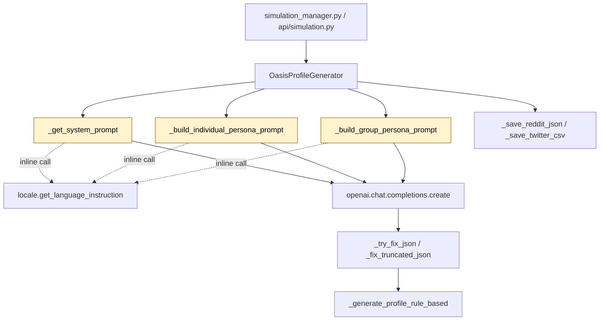

# Design Document — i18n-oasis-profile-generator-prompts

## Overview

**Purpose**: Translate the Chinese prompt strings in
`backend/app/services/oasis_profile_generator.py` (the system prompt
inside `_get_system_prompt`, the individual-persona f-string template
inside `_build_individual_persona_prompt`, the group-persona f-string
template inside `_build_group_persona_prompt`, and the four
`attrs_str`/`context_str` fallback literals) to English while
preserving every functional contract — JSON output keys, the `gender`
English enum, the `age` integer rule, the `persona` no-newline rule,
all `{variable}` interpolations, and every `get_language_instruction()`
call site. The goal is to remove the Chinese-language base-prompt bias
that currently leaks Chinese structure and word choice into persona
output even when `Accept-Language: en`.

**Users**: MiroFish operators running the Step 2 environment-setup
pipeline under any locale; downstream Step 3 (CAMEL-OASIS subprocess)
which consumes the produced persona dictionaries.

**Impact**: Replaces approximately one one-line system prompt and two
large f-string templates with English equivalents inside one file. No
API change, no new dependencies, no new files. The two production
callers (`backend/app/services/simulation_manager.py:316` and
`backend/app/api/simulation.py:1413`) and the OASIS subprocess are
unaffected.

### Goals

- Zero CJK characters in any prompt string literal contributed by
  `oasis_profile_generator.py` to the system prompt or the two
  user-message bodies (including the `attrs_str`/`context_str`
  fallback literals).
- English persona prose (`bio`, `persona`, `profession`,
  `interested_topics`) under `Accept-Language: en`.
- Continued Chinese persona prose under `Accept-Language: zh`, of
  equivalent quality to the pre-change behaviour.
- `gender` field stays exactly one of `"male"`/`"female"`/`"other"`
  regardless of locale.
- No diff to public signatures, taxonomy lists, LLM-call parameters,
  or call sites.

### Non-Goals

- Externalizing prompts to `/locales/*.json` (out of scope per ticket).
- Translating logger calls in this file (covered by issue #6).
- Translating module/class/method docstrings or inline comments
  (covered by issue #7).
- Refactoring the `OasisAgentProfile` schema, `MBTI_TYPES` /
  `COUNTRIES` lists, or the `INDIVIDUAL_ENTITY_TYPES` /
  `GROUP_ENTITY_TYPES` taxonomies.
- Modifying the rule-based fallback (`_generate_profile_rule_based`)
  including its Chinese country defaults.
- Modifying the resilience helpers `_fix_truncated_json` /
  `_try_fix_json` and the Chinese persona fallback fragments inside
  them (e.g. `f"{entity_name}是一个{entity_type}。"`).
- Modifying `backend/app/utils/locale.py`, the locale registries, or
  any non-target file.
- Modifying `backend/scripts/test_profile_format.py`.

## Boundary Commitments

### This Spec Owns

- The English content of `_get_system_prompt`'s `base_prompt` literal.
- The English content of the f-string template body in
  `_build_individual_persona_prompt`.
- The English content of the f-string template body in
  `_build_group_persona_prompt`.
- The English replacements for the four `"无"` / `"无额外上下文"`
  fallback literals (in both individual and group builders).

### Out of Boundary

- Locale resolution machinery (`backend/app/utils/locale.py`).
- Per-locale `llmInstruction` definitions
  (`/locales/languages.json`).
- Reasoning-model output stripping inside `_fix_truncated_json` /
  `_try_fix_json`.
- Logger calls and translation keys (`t("log.profile_generator.*")`)
  inside `oasis_profile_generator.py` (issue #6, already merged).
- Module / class / method docstrings and inline comments inside
  `oasis_profile_generator.py` (issue #7).
- Rule-based fallback (`_generate_profile_rule_based`) including its
  Chinese country defaults `"中国"`.
- Chinese persona fragments inside the resilience helpers (e.g.
  `f"{entity_name}是一个{entity_type}。"`) — those are runtime data
  fallbacks, not LLM prompts.
- All callers of `OasisProfileGenerator`
  (`simulation_manager.py`, `api/simulation.py`).
- Tests, scripts, and frontend code.
- The `print(...)` banner at line 945 (closely associated with logger
  externalization #6).

### Allowed Dependencies

- Existing imports in the target file (no additions). Specifically:
  `get_language_instruction`, `get_locale`, `set_locale`, `t` from
  `..utils.locale` are already imported and remain unchanged.
- Existing LLM transport via `self.client.chat.completions.create`
  (unchanged).

### Revalidation Triggers

The following changes elsewhere would invalidate this design:

- A change to the JSON contract emitted by the LLM (`bio`, `persona`,
  `age`, `gender`, `mbti`, `country`, `profession`,
  `interested_topics` keys).
- A change to the `OasisAgentProfile` dataclass field set or the
  Reddit/Twitter serializers.
- A change to `get_language_instruction()` semantics or the per-locale
  `llmInstruction` strings.
- A change to OASIS subprocess profile-format expectations (verified
  via `backend/scripts/test_profile_format.py`).

## Architecture

### Existing Architecture Analysis

`OasisProfileGenerator` lives in `backend/app/services/`, follows the
in-process service pattern, and is invoked from a Flask handler inside
a background task. The relevant flow:

1. The Flask handler resolves the request locale via `Accept-Language`;
   `set_locale()` is propagated into worker threads in
   `generate_profiles_for_entities` (locale captured at line ~910 and
   restored inside `generate_single_profile` at line ~914).
2. For each entity, `generate_profile_from_entity` decides between the
   individual or group prompt builder via
   `self._is_individual_entity(entity_type)`.
3. The chosen builder produces a user-message string; `_get_system_prompt`
   produces a system-message string. Both are sent to the LLM via
   `self.client.chat.completions.create(..., response_format={"type": "json_object"})`.
4. The LLM response is JSON-decoded; on failure, `_try_fix_json` and
   `_fix_truncated_json` attempt recovery; on terminal failure,
   `_generate_profile_rule_based` produces a rule-based persona.
5. The result is wrapped in an `OasisAgentProfile` dataclass and
   serialized to Reddit JSON or Twitter CSV via `_save_reddit_json` /
   `_save_twitter_csv`.

This design preserves all of the above. The change is purely lexical
inside three method bodies and four literal defaults.

### Architecture Pattern & Boundary Map



The three highlighted nodes (`_get_system_prompt`,
`_build_individual_persona_prompt`,
`_build_group_persona_prompt`) are the only nodes whose **string
contents** change. Every edge — including each call to
`get_language_instruction()` — remains intact.

**Architecture Integration**:

- **Selected pattern**: In-place lexical translation of the three
  prompt builders (Option A from `gap-analysis.md` / `research.md`).
- **Domain/feature boundaries**: Same as today; `OasisProfileGenerator`
  remains the sole owner of persona prompt content. `LocaleService`
  remains the sole owner of locale-postfix steering.
- **Existing patterns preserved**: locale-thread propagation, retry
  logic with temperature decay, JSON resilience helpers, rule-based
  fallback, two-platform serialization.
- **New components rationale**: none — no new components.
- **Steering compliance**: aligns with `tech.md` ("LLM prompts use the
  `get_language_instruction()` postfix mechanism, not key files") and
  `structure.md` ("services own their own prompt strings").

### Technology Stack & Alignment

| Layer | Choice / Version | Role in Feature | Notes |
|-------|------------------|-----------------|-------|
| Backend / Services | Python ≥3.11 | Hosts the prompt builders | No version change |
| LLM transport | `openai` SDK against any OpenAI-compatible endpoint | Sends translated prompts | Unchanged |
| i18n | `backend/app/utils/locale.py` | Resolves locale and provides `get_language_instruction()` postfix | Unchanged |
| Storage | None | — | No persistence change |

No new dependencies. No version bumps. The locale infrastructure used
by the change is the same one used by every sibling i18n spec already
merged.

## File Structure Plan

### Modified Files

- `backend/app/services/oasis_profile_generator.py` — only file that
  changes.
  - `_get_system_prompt(self, is_individual: bool) -> str` — translate
    `base_prompt` literal to English. Keep
    `f"{base_prompt}\n\n{get_language_instruction()}"` shape.
  - `_build_individual_persona_prompt(self, entity_name, entity_type,
    entity_summary, entity_attributes, context) -> str` — translate
    the f-string body to English; replace `"无"` and `"无额外上下文"`
    defaults; keep every `{variable}` interpolation and the inline
    `{get_language_instruction()}` call.
  - `_build_group_persona_prompt(self, entity_name, entity_type,
    entity_summary, entity_attributes, context) -> str` — same
    treatment as the individual builder.

No other files in the repository are touched by this change.

## System Flows

The runtime flow does not change. The only way to demonstrate this is
to compare the call graph before and after — and the call graph is
already shown in the Architecture diagram above. Skipping a separate
sequence diagram.

## Requirements Traceability

| Requirement | Summary | Components | Interfaces | Flows |
|-------------|---------|------------|------------|-------|
| 1.1 | `base_prompt` contains zero Chinese characters | `_get_system_prompt` | `(self, is_individual: bool) -> str` | system-message construction |
| 1.2 | Preserve `f"{base_prompt}\n\n{get_language_instruction()}"` | `_get_system_prompt` | inline `get_language_instruction()` | system-message construction |
| 1.3 | Preserve role/intent semantics | `_get_system_prompt` | — | — |
| 1.4 | Preserve signature `_get_system_prompt(self, is_individual: bool) -> str` | `_get_system_prompt` | (signature) | — |
| 2.1 | Individual prompt body in English | `_build_individual_persona_prompt` | f-string body | user-message construction |
| 2.2 | Preserve `{entity_name}`, `{entity_type}`, `{entity_summary}`, `{attrs_str}`, `{context_str}`, `{get_language_instruction()}` | `_build_individual_persona_prompt` | f-string interpolations | — |
| 2.3 | Preserve JSON keys `bio, persona, age, gender, mbti, country, profession, interested_topics` | `_build_individual_persona_prompt` | prompt content | — |
| 2.4 | Preserve field-level constraints (lengths, MBTI, gender enum, age int) | `_build_individual_persona_prompt` | prompt content | — |
| 2.5 | Preserve trailing-rules block semantics | `_build_individual_persona_prompt` | prompt content | — |
| 2.6 | Preserve method signature | `_build_individual_persona_prompt` | (signature) | — |
| 2.7 | Translate `"无"` and `"无额外上下文"` defaults | `_build_individual_persona_prompt` | literal defaults | — |
| 2.8 | Zero Chinese in assembled body | `_build_individual_persona_prompt` | — | — |
| 3.1 | Group prompt body in English | `_build_group_persona_prompt` | f-string body | user-message construction |
| 3.2 | Preserve interpolations | `_build_group_persona_prompt` | f-string interpolations | — |
| 3.3 | Preserve JSON keys | `_build_group_persona_prompt` | prompt content | — |
| 3.4 | Preserve field-level constraints (age=30, gender="other", etc.) | `_build_group_persona_prompt` | prompt content | — |
| 3.5 | Preserve trailing-rules semantics | `_build_group_persona_prompt` | prompt content | — |
| 3.6 | Preserve method signature | `_build_group_persona_prompt` | (signature) | — |
| 3.7 | Translate `"无"` / `"无额外上下文"` defaults | `_build_group_persona_prompt` | literal defaults | — |
| 3.8 | Zero Chinese in assembled body | `_build_group_persona_prompt` | — | — |
| 4.1 | Preserve every `get_language_instruction()` call site | all three builders | inline call | system + user message construction |
| 4.2 | Preserve locale-thread plumbing | `generate_profiles_for_entities` (untouched) | `set_locale(current_locale)` | worker thread spawn |
| 4.3 | Locale=zh produces Chinese personas | runtime behaviour | locale postfix | LLM call |
| 4.4 | Locale=en produces English personas | runtime behaviour | locale postfix | LLM call |
| 4.5 | `gender` ∈ {male, female, other} regardless of locale | prompt content | — | — |
| 4.6 | Don't alter locale.py / locales/ | (none) | — | — |
| 5.1 | Preserve `OasisAgentProfile` dataclass | (untouched) | dataclass | — |
| 5.2 | Preserve method signatures | (untouched) | signatures | — |
| 5.3 | Preserve LLM invocation parameters | (untouched) | `chat.completions.create(...)` | — |
| 5.4 | Preserve `MBTI_TYPES`, `COUNTRIES`, taxonomy lists | (untouched) | class constants | — |
| 6.1 | Preserve `_fix_truncated_json` / `_try_fix_json` | (untouched) | helpers | — |
| 6.2 | Reasoning-model recovery still works | (untouched) | resilience helpers | — |
| 6.3 | No new prompt-language-dependent pre-processing | (none added) | — | — |
| 6.4 | Round-trip yields non-empty `bio` and `persona` | runtime behaviour | LLM call | — |
| 7.1 | `pytest test_profile_format.py` passes | runtime behaviour | serializers | — |
| 7.2 | Reddit format schema preserved | (untouched) | `to_reddit_format` | — |
| 7.3 | Twitter format schema preserved | (untouched) | `to_twitter_format` | — |
| 7.4 | `gender` enum preserved | prompt content | — | — |
| 8.1 | No logger edits | (untouched) | — | — |
| 8.2 | No docstring/comment edits | (untouched) | — | — |
| 8.3 | No rule-based fallback edits | (untouched) | — | — |
| 8.4 | No edits outside the target file | (none) | — | — |
| 8.5 | No new dependencies | (none) | `pyproject.toml` / `uv.lock` untouched | — |
| 8.6 | No edits to `test_profile_format.py` | (untouched) | — | — |

## Components and Interfaces

| Component | Domain/Layer | Intent | Req Coverage | Key Dependencies (P0/P1) | Contracts |
|-----------|--------------|--------|--------------|--------------------------|-----------|
| `_get_system_prompt` | backend service / prompt builder | Produce the system message (English base + locale postfix) | 1.1, 1.2, 1.3, 1.4, 4.1, 4.5 | `get_language_instruction` (P0) | Service |
| `_build_individual_persona_prompt` | backend service / prompt builder | Produce the individual-entity user message in English | 2.x, 4.1, 4.5 | `get_language_instruction` (P0); JSON encoder (P1) | Service |
| `_build_group_persona_prompt` | backend service / prompt builder | Produce the group/institution user message in English | 3.x, 4.1, 4.5 | `get_language_instruction` (P0); JSON encoder (P1) | Service |

Only the three prompt-builder methods change. They all live inside the
single class `OasisProfileGenerator` in
`backend/app/services/oasis_profile_generator.py`. No new components.

### Backend / Services

#### `_get_system_prompt`

| Field | Detail |
|-------|--------|
| Intent | Build the `system` message: a one-line English directive that frames the model as a social-media persona expert + the per-locale postfix. |
| Requirements | 1.1, 1.2, 1.3, 1.4, 4.1, 4.5 |

**Responsibilities & Constraints**

- Construct and return a single string of the form
  `f"{base_prompt}\n\n{get_language_instruction()}"`.
- Preserve the signature
  `_get_system_prompt(self, is_individual: bool) -> str`.
- The English `base_prompt` MUST convey: (a) expert role in
  social-media persona generation; (b) intent to produce detailed,
  realistic personas for opinion-simulation, faithful to existing
  reality; (c) the JSON-output requirement and the no-unescaped-newline
  rule.
- The English `base_prompt` MUST NOT contain any CJK codepoint.

**Dependencies**

- Outbound: `get_language_instruction()` from
  `backend/app/utils/locale.py` (P0, criticality high — the entire
  locale-steering chain depends on it).

**Contracts**: Service [x] / API [ ] / Event [ ] / Batch [ ] / State [ ]

##### Service Interface

```python
def _get_system_prompt(self, is_individual: bool) -> str:
    """Return the LLM system message: English base + locale postfix."""
    ...
```

- Preconditions: none.
- Postconditions: returns a non-empty string ending with the locale
  postfix produced by `get_language_instruction()`.
- Invariants: contains zero CJK codepoints.

**Implementation Notes**

- Integration: called only from `_call_llm_with_retry` (line ~523)
  with `is_individual` decided upstream. The `is_individual` flag is
  reserved for future divergence between system prompts; the current
  implementation does not branch on it, and this design preserves
  that.
- Validation: a CJK regex audit on the method body after the edit must
  match zero codepoints.
- Risks: dropping one of the three role/intent pieces (expert framing,
  JSON output requirement, no-newline rule). Implementation task lists
  all three explicitly.

#### `_build_individual_persona_prompt`

| Field | Detail |
|-------|--------|
| Intent | Build the user-message string for an individual entity in English. Preserve every `{variable}` interpolation, the inline `{get_language_instruction()}` call, every JSON-output key, and every locale-independent constraint. |
| Requirements | 2.1, 2.2, 2.3, 2.4, 2.5, 2.6, 2.7, 2.8, 4.1, 4.5 |

**Responsibilities & Constraints**

- Preserve signature
  `_build_individual_persona_prompt(self, entity_name: str, entity_type: str, entity_summary: str, entity_attributes: Dict[str, Any], context: str) -> str`.
- Preserve `attrs_str = json.dumps(entity_attributes, ensure_ascii=False) if entity_attributes else <fallback>` with `<fallback>` translated to English (`"None"`).
- Preserve `context_str = context[:3000] if context else <fallback>` with `<fallback>` translated to English (`"No additional context"`).
- Translate the f-string body to English with these structural sections (mirror the original Chinese intent):
  1. **Lead sentence** — instruct the model to generate a detailed
     social-media persona for the entity, faithful to existing reality.
  2. **Entity context block** — labelled lines for `entity_name`,
     `entity_type`, `entity_summary`, `entity_attributes` (English
     labels; values via `{...}` interpolation).
  3. **Context information block** — `Context information:` heading
     followed by `{context_str}`.
  4. **JSON-fields enumeration** — `Generate JSON with the following
     fields:` followed by the eight numbered items (`bio`, `persona`,
     `age`, `gender`, `mbti`, `country`, `profession`,
     `interested_topics`) with English descriptions matching
     Requirement 2.4.
  5. **Trailing rules block** — `Important:` followed by:
     - `All field values must be strings or numbers; do not use newlines.`
     - `persona must be a single coherent block of text.`
     - `{get_language_instruction()} (gender field MUST use English values: "male" or "female")`
     - `Content must remain consistent with the entity information.`
     - `age must be a valid integer; gender must be exactly "male" or "female".`
- Preserve every `{variable}` interpolation present in the original by
  name: `{entity_name}`, `{entity_type}`, `{entity_summary}`,
  `{attrs_str}`, `{context_str}`, `{get_language_instruction()}`.
- The translated body MUST NOT contain any CJK codepoint.

**Dependencies**

- Outbound: `json.dumps(..., ensure_ascii=False)` (P1, formatting the
  attributes dict) — unchanged.
- Outbound: `get_language_instruction()` (P0) — interpolated inline.

**Contracts**: Service [x] / API [ ] / Event [ ] / Batch [ ] / State [ ]

##### Service Interface

```python
def _build_individual_persona_prompt(
    self,
    entity_name: str,
    entity_type: str,
    entity_summary: str,
    entity_attributes: Dict[str, Any],
    context: str,
) -> str:
    """Return the LLM user message for an individual-entity persona."""
    ...
```

- Preconditions: `entity_name`, `entity_type`, `entity_summary`
  are strings (may be empty); `entity_attributes` is a dict (may be
  empty); `context` is a string (may be empty).
- Postconditions: returns a non-empty English string with all six
  interpolations resolved.
- Invariants: contains zero CJK codepoints; preserves every
  `{variable}` interpolation by name.

**Implementation Notes**

- Integration: called from `_call_llm_with_retry` (line ~506) when
  `is_individual` is true.
- Validation: post-edit CJK regex audit; interpolation-set audit
  (verify the multiset of `{...}` tokens equals the pre-change set);
  smoke import + `pytest backend/scripts/test_profile_format.py`.
- Risks: dropping the `gender` enum lock when translating; dropping
  the inline `{get_language_instruction()}` call. The implementation
  task list calls these out as discrete checks.

#### `_build_group_persona_prompt`

| Field | Detail |
|-------|--------|
| Intent | Build the user-message string for a group/institution entity in English. Preserve every `{variable}` interpolation, the inline `{get_language_instruction()}` call, every JSON-output key, and every locale-independent constraint (notably `age == 30` and `gender == "other"`). |
| Requirements | 3.1, 3.2, 3.3, 3.4, 3.5, 3.6, 3.7, 3.8, 4.1, 4.5 |

**Responsibilities & Constraints**

- Preserve signature
  `_build_group_persona_prompt(self, entity_name: str, entity_type: str, entity_summary: str, entity_attributes: Dict[str, Any], context: str) -> str`.
- Preserve the `attrs_str` and `context_str` fallback handling with
  English defaults (`"None"`, `"No additional context"`), identical to
  the individual builder.
- Translate the f-string body to English with these structural
  sections (mirror the original Chinese intent for institutions):
  1. **Lead sentence** — instruct the model to generate a detailed
     social-media account profile for the institution/group, faithful
     to existing reality.
  2. **Entity context block** — labelled lines for `entity_name`,
     `entity_type`, `entity_summary`, `entity_attributes`.
  3. **Context information block** — `Context information:` heading
     followed by `{context_str}`.
  4. **JSON-fields enumeration** — `Generate JSON with the following
     fields:` followed by the eight numbered items as defined in
     Requirement 3.4: `bio` (~200 chars, official voice), `persona`
     (~2000 chars, single coherent text covering institutional
     basics, account positioning, voice, publishing pattern, stance,
     special notes, institutional memory), `age` (= integer 30,
     institutional virtual age), `gender` (= literal `"other"`),
     `mbti` (e.g. ISTJ for strict/conservative), `country` (country
     name string), `profession` (institutional function),
     `interested_topics` (array).
  5. **Trailing rules block** — `Important:` followed by:
     - `All field values must be strings or numbers; null is not allowed.`
     - `persona must be a single coherent block of text without newlines.`
     - `{get_language_instruction()} (gender field MUST use English value "other")`
     - `age must be the integer 30; gender must be the string "other".`
     - `Account voice must match its identity positioning.`
- Preserve every `{variable}` interpolation present in the original.
- The translated body MUST NOT contain any CJK codepoint.

**Dependencies**

- Outbound: same as individual builder.

**Contracts**: Service [x] / API [ ] / Event [ ] / Batch [ ] / State [ ]

##### Service Interface

```python
def _build_group_persona_prompt(
    self,
    entity_name: str,
    entity_type: str,
    entity_summary: str,
    entity_attributes: Dict[str, Any],
    context: str,
) -> str:
    """Return the LLM user message for a group/institution persona."""
    ...
```

- Preconditions / Postconditions / Invariants: same shape as the
  individual builder.

**Implementation Notes**

- Integration: called from `_call_llm_with_retry` (line ~510) when
  `is_individual` is false.
- Validation: same checks as the individual builder, plus an explicit
  audit that the institutional sentinels (`age == 30`,
  `gender == "other"`) appear in English in the trailing-rules block.
- Risks: same as the individual builder; additionally, the `country`
  language hint (`"使用中文，如\"中国\""`) is intentionally dropped
  during translation — the validation task verifies that under
  `Accept-Language: en` a sample run produces an English country
  name.

## Data Models

No data-model changes. The persona JSON schema, the
`OasisAgentProfile` dataclass, the Reddit/Twitter serializers, and the
OASIS subprocess profile-format expectations are all preserved
verbatim.

## Error Handling

### Error Strategy

No new error paths. The existing flow is preserved:

- `json.JSONDecodeError` → `_try_fix_json` → `_fix_truncated_json` →
  partial-extract via regex → `_generate_profile_rule_based`.
- LLM call failure → retry with temperature decay (`0.7 - attempt * 0.1`)
  up to `max_attempts = 3`.
- Terminal failure → rule-based fallback persona.
- Per-entity worker exception → fallback `OasisAgentProfile` produced
  inside `generate_single_profile` at line ~932.

The translated prompts do not introduce new failure modes. Translating
prompt language has no semantic effect on JSON parsing or on the
`response_format={"type": "json_object"}` constraint.

### Error Categories and Responses

- **User errors**: not applicable (this is an internal pipeline).
- **System errors**: LLM transport errors are retried; logger emits
  `t("log.profile_generator.m011")` etc. Logger keys already exist in
  `locales/{en,zh}.json`.
- **Business-logic errors**: `gender` not in the English enum, `age`
  not an integer — the prompt explicitly mandates them; the validator
  inside `_try_fix_json` does not enforce these but the OASIS
  subprocess does. No change in either direction.

### Monitoring

Existing logger calls are unchanged. Logger keys already i18n-keyed via
`t("log.profile_generator.*")`.

## Testing Strategy

### Unit Tests

- **(Existing)**
  `backend/scripts/test_profile_format.py::test_profile_formats` —
  must continue to pass without modification.
- **(Manual)** Smoke import:
  `cd backend && uv run python -c "from app.services.oasis_profile_generator import OasisProfileGenerator"`
  — confirms no syntax errors after editing f-strings.

### Integration Tests

- **(Manual)** Run the prompt builders directly under each locale:
  - `set_locale("en")` →
    `OasisProfileGenerator()._build_individual_persona_prompt("Alice", "Student", "summary", {"k": "v"}, "ctx")`
    — assert no CJK codepoints in the output, assert the English
    locale postfix appears via `get_language_instruction()` (which is
    `"Please respond in English."`).
  - `set_locale("zh")` → same call → assert the locale postfix is
    `"请使用中文回答。"`.
- These do not require an LLM call; they only verify the rendered
  prompt string.

### E2E Tests

- **(Manual, optional, preferred but skippable when no LLM key
  present)** Run `npm run dev` and trigger Step 2 profile generation
  from the UI under English locale on a small entity set; spot-check
  that bios and persona prose are in English. Skip if a live LLM key
  is unavailable in CI; sibling specs #2/#4/#5 used the same manual
  E2E approach.

### Performance / Load

Not applicable. Prompt translation has no measurable performance
impact.

## Optional Sections

### Security Considerations

No security implications. No new external surfaces; no new data
retention; no change to authentication or authorization.

### Migration Strategy

No migration required. The change is forward-compatible: a deployment
that picks up the translated prompts continues to serve users on the
`zh` locale via the unchanged
`get_language_instruction()` postfix mechanism.

## Supporting References

- `gap-analysis.md` — option evaluation and effort/risk sizing.
- `research.md` — discovery findings, design decisions (in particular
  the "drop the country language hint" decision), and risk register.
- `requirements.md` — EARS requirements with numeric IDs.
- Sibling specs `i18n-ontology-generator-prompts`,
  `i18n-simulation-config-generator-prompts`,
  `i18n-report-agent-prompts` — same translation pattern, already
  merged.
