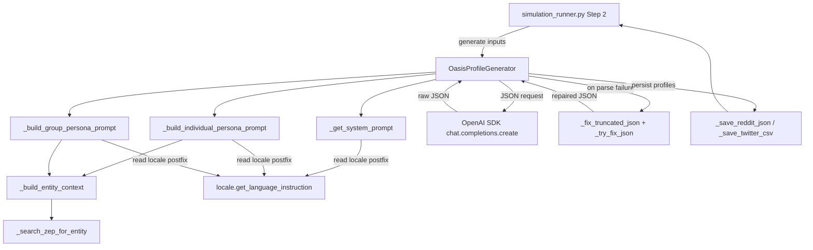

# Design Document — i18n-oasis-profile-generator-prompts

## Overview

**Purpose**: Translate the Chinese prompt strings in `backend/app/services/oasis_profile_generator.py` (the system prompt, the two user-message templates for individual and group personas, and the context-building strings inlined into them) to English while preserving every functional contract — JSON output keys, gender enum, all f-string interpolations, the `get_language_instruction()` postfix at three call sites, the JSON-repair helpers, the OpenAI SDK call shape, the `set_locale(current_locale)` thread-pool propagation, and the `_normalize_gender` Chinese-to-English mapping. The goal is to remove the Chinese-language base-prompt bias that currently leaks Chinese structure and word choice into `bio`, `persona`, `profession`, `interested_topics`, and `country` outputs even when `Accept-Language: en`.

**Users**: MiroFish operators running the Step 2 environment-setup pipeline (entity → OASIS profile) under any locale; the OASIS subprocess (CAMEL-OASIS) consuming the generated Reddit JSON / Twitter CSV in Step 3.

**Impact**: Replaces five string-literal regions across four functions in one file with English equivalents, plus adds one new test script under `backend/scripts/`. No API surface change. No new dependencies. The OASIS profile schema is preserved (R6, R8). The single production caller (`simulation_runner.py` Step 2) and `test_profile_format.py` are unaffected.

### Goals

- Zero CJK characters in any prompt-bearing string literal contributed by `oasis_profile_generator.py` to the system prompt, the two user-message templates, or the `_build_entity_context` / `_search_zep_for_entity` strings inlined into the prompts.
- English `bio`, `persona`, `profession`, `interested_topics`, and `country` under `Accept-Language: en`.
- Continued Chinese persona output under `Accept-Language: zh`, of equivalent quality to the pre-change behaviour.
- No diff to public/private signatures, dataclass fields, retry/temperature schedule, OpenAI SDK call shape, or call sites.
- An AST-based regression test that fails on any CJK character in the in-scope prompt literals.

### Non-Goals

- Externalizing prompts to `/locales/*.json` (out of scope per ticket; conflicts with sibling pattern).
- Translating logger calls, `print(...)` console-progress strings, or the section labels in `_print_generated_profile` in this file (covered by issue #6).
- Translating module/class/method docstrings or inline comments in this file (covered by issue #7).
- Changing the Chinese fallback persona strings (`f"{entity_name}是一个{entity_type}。"`) at the JSON-repair call sites (out of scope; persona-generation flow refactor).
- Modifying the `MBTI_TYPES`, `COUNTRIES`, `INDIVIDUAL_ENTITY_TYPES`, `GROUP_ENTITY_TYPES`, or `_normalize_gender` lists/maps.
- Modifying the `country: "中国"` defaults in the rule-based fallback or `_save_reddit_json`.
- Modifying `backend/app/utils/locale.py`, the locale registries, or any non-target file (other than the new test script).

## Boundary Commitments

### This Spec Owns

- The English content of the `base_prompt` literal in `_get_system_prompt`.
- The English content of the f-string body of `_build_individual_persona_prompt`, including the inline gloss after `{get_language_instruction()}`.
- The English content of the f-string body of `_build_group_persona_prompt`, including the inline gloss after `{get_language_instruction()}`.
- The English content of the section headings and inline placeholders emitted by `_build_entity_context` (`### 实体属性`, `### 相关事实和关系`, `### 关联实体信息`, `### Zep检索到的事实信息`, `### Zep检索到的相关节点`, `(相关实体)`).
- The English content of the section labels and inline placeholders emitted by `_search_zep_for_entity` that feed the prompt context (`事实信息:\n`, `相关实体:\n`, `f"相关实体: {node_name}"`).
- The English content of the empty-state fallbacks `"无"` (no attributes) and `"无额外上下文"` (no context) interpolated into the prompts.
- The new test script `backend/scripts/test_oasis_profile_prompts_no_cjk.py`.

### Out of Boundary

- Locale resolution machinery (`backend/app/utils/locale.py`).
- Per-locale `llmInstruction` definitions (`/locales/languages.json`).
- The OpenAI SDK transport in `_generate_profile_with_llm` (call shape, retry schedule, `response_format`, temperature schedule).
- The JSON-repair helpers (`_fix_truncated_json`, `_try_fix_json`).
- The `_normalize_gender` Chinese-to-English mapping (required for `zh`-locale outputs to satisfy the OASIS gender enum).
- Logger calls and `print(...)` console-progress strings in this file (issue #6).
- The section labels in `_print_generated_profile` (`【简介】`, `【详细人设】`, `【基本属性】`, etc.) (issue #6).
- Module/class/method docstrings and inline comments in this file (issue #7).
- Chinese fallback persona strings (`f"{entity_name}是一个{entity_type}。"`) at lines ~547, ~644, ~659.
- The `MBTI_TYPES`, `COUNTRIES`, `INDIVIDUAL_ENTITY_TYPES`, `GROUP_ENTITY_TYPES` lists.
- The `country: "中国"` defaults in `_generate_profile_rule_based` and `_save_reddit_json`.
- All callers of `OasisProfileGenerator` and `OasisAgentProfile`, including `simulation_runner.py` and `test_profile_format.py`.
- Frontend code, locale JSON files, and other backend services.

### Allowed Dependencies

- Existing `get_language_instruction`, `get_locale`, `set_locale`, `t` imports from `..utils.locale` (already imported; unchanged).
- Existing OpenAI SDK call (unchanged).
- Existing JSON-repair helpers in this file (unchanged).
- No new imports.

### Revalidation Triggers

The following changes elsewhere would invalidate this design and require revisiting the prompt:

- A change to the OASIS profile schema (`bio`, `persona`, `age`, `gender`, `mbti`, `country`, `profession`, `interested_topics`, or the gender enum).
- A change to `_normalize_gender` semantics or its Chinese-to-English mapping.
- A change to `get_language_instruction()` semantics or the per-locale `llmInstruction` strings.
- A change to the OpenAI SDK contract for `response_format={"type": "json_object"}`.
- A change to the JSON-repair helpers (`_fix_truncated_json`, `_try_fix_json`).
- A change to `set_locale(current_locale)` semantics for thread-pool worker propagation.

## Architecture

### Existing Architecture Analysis

`OasisProfileGenerator` lives in `backend/app/services/`, follows the in-process service pattern, and is invoked by `simulation_runner.py` inside a background `Task` (Step 2). The relevant flow is:

1. The Flask handler resolves the request locale via `Accept-Language`; locale is captured into the background thread.
2. `generate_profiles_from_entities` captures `current_locale = get_locale()` before spawning a `ThreadPoolExecutor` (`parallel_count=5` by default).
3. Each worker thread calls `set_locale(current_locale)` first, then `generate_profile_from_entity`. This invokes either `_generate_profile_with_llm` (preferred) or `_generate_profile_rule_based` (fallback).
4. `_generate_profile_with_llm` builds the system prompt via `_get_system_prompt(is_individual)`, builds the user prompt via `_build_individual_persona_prompt` or `_build_group_persona_prompt` (each of which interpolates context via `_build_entity_context`, which itself calls `_search_zep_for_entity`), then calls the OpenAI SDK directly with `response_format={"type": "json_object"}` and a temperature schedule of `0.7 - (attempt * 0.1)` over 3 attempts.
5. The JSON response is parsed via `json.loads` with fallback through `_fix_truncated_json` and `_try_fix_json`.
6. The validated profile is saved as `OasisAgentProfile` and serialized via `_save_reddit_json` or `_save_twitter_csv`.

This design preserves all of the above. The change is purely lexical inside five string-literal regions across four functions of one file (plus one new test script).

### Architecture Pattern & Boundary Map



**Architecture Integration**:

- Selected pattern: **In-place lexical translation** of five string-literal regions across four functions, plus a new AST-based static guard test script. No structural change.
- Domain/feature boundaries: locale machinery vs. service prompt vs. transport (OpenAI SDK + JSON-repair helpers) vs. profile serialization remain cleanly separated.
- Existing patterns preserved: prompt-as-f-string-inside-builder; `set_locale(current_locale)` thread-pool propagation; OpenAI SDK direct call with `response_format={"type": "json_object"}`; JSON-repair fallback; `_normalize_gender` post-LLM safety net.
- New components rationale: one new test script (`test_oasis_profile_prompts_no_cjk.py`) — pattern-matched to the just-merged sibling test for issue #2.
- Steering compliance: matches `tech.md` ("translate keys, not raw log lines, when adding new logs that surface to users") for what is in-scope here, and respects the steering note that "existing files mix English and Chinese in comments/docstrings — preserve both; do not translate one into the other unless asked." This ticket is the explicit ask for the prompt strings, scoped to exclude comments/docstrings.

### Technology Stack

| Layer | Choice / Version | Role in Feature | Notes |
|-------|------------------|-----------------|-------|
| Backend / Services | Python 3.11+ | Hosts `OasisProfileGenerator` | Existing — unchanged. |
| Backend / Services | `openai` SDK | Issues persona-generation prompts; returns JSON object via `response_format` | Existing — unchanged. |
| Backend / Services | `backend/app/utils/locale.py` | Resolves `Accept-Language` → `llmInstruction` postfix; thread-local propagation | Existing — unchanged. |
| Backend / Tests | Python `ast` (stdlib) | New: AST-based no-CJK guard test | New script; no new external dep. |

No new dependencies. No version changes.

## File Structure Plan

### Modified Files

- `backend/app/services/oasis_profile_generator.py` — Replace the `base_prompt` body in `_get_system_prompt`; replace the f-string body of `_build_individual_persona_prompt`; replace the f-string body of `_build_group_persona_prompt`; replace the section headings and Chinese inline placeholders in `_build_entity_context`; replace the section labels and inline placeholders in `_search_zep_for_entity` that feed prompt context; preserve every other character of the file.

### New Files

- `backend/scripts/test_oasis_profile_prompts_no_cjk.py` — AST-based static guard. Walks `_get_system_prompt`, `_build_individual_persona_prompt`, `_build_group_persona_prompt`, `_build_entity_context`, and the in-scope literals of `_search_zep_for_entity`. Uses regex `[一-鿿]` (same as sibling test). Excludes docstrings via `ast.get_docstring` filtering. Excludes the contents of logger-call argument literals via function-scope filtering. Returns non-zero on any CJK character found.

No deletions. No moves.

## System Flows

The control-flow diagram in *Architecture Pattern & Boundary Map* covers the relevant flow; no additional diagrams are needed for this string-literal change.

## Requirements Traceability

| Requirement | Summary | Components | Interfaces | Flows |
|-------------|---------|------------|------------|-------|
| 1.1 | Zero Chinese in `base_prompt` | OasisProfileGenerator → `_get_system_prompt` | None changed | n/a |
| 1.2 | Preserve "valid JSON, no unescaped newlines" directive | OasisProfileGenerator → `_get_system_prompt` | LLM JSON contract | n/a |
| 1.3 | Preserve `get_language_instruction()` postfix at line 665 | OasisProfileGenerator → `_get_system_prompt` | `get_language_instruction()` | Architecture diagram |
| 1.4 | Preserve `_get_system_prompt(is_individual)` signature | OasisProfileGenerator → `_get_system_prompt` | Public surface | n/a |
| 2.1 | English instruction headings (individual prompt) | OasisProfileGenerator → `_build_individual_persona_prompt` | None changed | n/a |
| 2.2 | English schema description with preserved field IDs | OasisProfileGenerator → `_build_individual_persona_prompt` | Prompt-only | n/a |
| 2.3 | English persona sub-field guidance | OasisProfileGenerator → `_build_individual_persona_prompt` | Prompt-only | n/a |
| 2.4 | English trailing rules block | OasisProfileGenerator → `_build_individual_persona_prompt` | Prompt-only | n/a |
| 2.5 | Inline `{get_language_instruction()}` interpolation preserved | OasisProfileGenerator → `_build_individual_persona_prompt` | `get_language_instruction()` | Architecture diagram |
| 2.6 | f-string interpolations preserved | OasisProfileGenerator → `_build_individual_persona_prompt` | Python f-string | n/a |
| 2.7 | Country instruction locale-neutralized | OasisProfileGenerator → `_build_individual_persona_prompt` | Prompt-only | n/a |
| 2.8 | Zero Chinese in individual user message | OasisProfileGenerator → `_build_individual_persona_prompt` | n/a | n/a |
| 3.1 | English instruction headings (group prompt) | OasisProfileGenerator → `_build_group_persona_prompt` | None changed | n/a |
| 3.2 | English schema description with preserved field IDs | OasisProfileGenerator → `_build_group_persona_prompt` | Prompt-only | n/a |
| 3.3 | English persona sub-field guidance | OasisProfileGenerator → `_build_group_persona_prompt` | Prompt-only | n/a |
| 3.4 | English trailing rules block (no nulls, age=30, gender="other") | OasisProfileGenerator → `_build_group_persona_prompt` | Prompt-only | n/a |
| 3.5 | Inline `{get_language_instruction()}` interpolation preserved | OasisProfileGenerator → `_build_group_persona_prompt` | `get_language_instruction()` | Architecture diagram |
| 3.6 | f-string interpolations preserved | OasisProfileGenerator → `_build_group_persona_prompt` | Python f-string | n/a |
| 3.7 | Country instruction locale-neutralized | OasisProfileGenerator → `_build_group_persona_prompt` | Prompt-only | n/a |
| 3.8 | Zero Chinese in group user message | OasisProfileGenerator → `_build_group_persona_prompt` | n/a | n/a |
| 4.1–4.5 | English context-building section headings | OasisProfileGenerator → `_build_entity_context` | None changed | n/a |
| 4.6–4.7 | English Zep-search inline labels | OasisProfileGenerator → `_search_zep_for_entity` | None changed | n/a |
| 4.8 | English `(相关实体)` placeholder | OasisProfileGenerator → `_build_entity_context` | None changed | n/a |
| 4.9 | English empty-state fallbacks (`无`, `无额外上下文`) | OasisProfileGenerator → both prompt builders | None changed | n/a |
| 4.10 | Conditional inclusion of context sections preserved | OasisProfileGenerator → `_build_entity_context` | Python truthiness | n/a |
| 4.11 | Caps on edge facts and node summaries preserved | OasisProfileGenerator → `_build_entity_context`, `_search_zep_for_entity` | None changed | n/a |
| 5.1 | Postfix call site preserved (system prompt) | OasisProfileGenerator → `_get_system_prompt` | `get_language_instruction()` | Architecture diagram |
| 5.2 | Postfix call site preserved (individual prompt) | OasisProfileGenerator → `_build_individual_persona_prompt` | `get_language_instruction()` | Architecture diagram |
| 5.3 | Postfix call site preserved (group prompt) | OasisProfileGenerator → `_build_group_persona_prompt` | `get_language_instruction()` | Architecture diagram |
| 5.4 | Locale imports preserved | OasisProfileGenerator (module imports) | n/a | n/a |
| 5.5 | `set_locale(current_locale)` at line 914 preserved | OasisProfileGenerator → `generate_profiles_from_entities` | Thread-local | Architecture diagram |
| 5.6 | `t('progress.zepSearchQuery', ...)` preserved | OasisProfileGenerator → `_search_zep_for_entity` | `t()` from locale | n/a |
| 5.7 | `t('progress.profileGenerated', ...)` preserved | OasisProfileGenerator → `_print_generated_profile` | `t()` from locale | n/a |
| 5.8 | `zh` locale produces Chinese persona content | OasisProfileGenerator + Locale | `get_language_instruction()` | Architecture diagram |
| 5.9 | `en` locale produces English persona content | OasisProfileGenerator + Locale | `get_language_instruction()` | Architecture diagram |
| 6.1–6.9 | Public API and call-site stability | OasisProfileGenerator, OasisAgentProfile (signatures, dataclass fields, retry/temperature schedule, JSON output keys) | Public surface | n/a |
| 7.1–7.4 | Reasoning-model output compatibility | OasisProfileGenerator → `_fix_truncated_json`, `_try_fix_json` | Internal | Architecture diagram |
| 8.1–8.5 | Step 2 environment-setup parity | OasisProfileGenerator + Saver + OASIS subprocess | OASIS profile schema | n/a |
| 9.1–9.9 | Out-of-scope surfaces untouched | OasisProfileGenerator (boundary commitment) | n/a | n/a |

## Components and Interfaces

| Component | Domain/Layer | Intent | Req Coverage | Key Dependencies (P0/P1) | Contracts |
|-----------|--------------|--------|--------------|--------------------------|-----------|
| OasisProfileGenerator (modified) | Backend / Service | Render English OASIS persona-generation prompts; preserve all behaviour | 1.1–1.4, 2.1–2.8, 3.1–3.8, 4.1–4.11, 5.1–5.9, 6.1–6.9, 7.1–7.4, 9.1–9.9 | OpenAI SDK (P0), get_language_instruction (P0), set_locale (P0), `_normalize_gender` (P0), `_fix_truncated_json` / `_try_fix_json` (P0) | Service |
| test_oasis_profile_prompts_no_cjk.py (new) | Backend / Test | AST-based regression guard: assert no CJK in in-scope prompt literals | 1.1, 2.8, 3.8, 4.1–4.9 | Python `ast` (stdlib) | Service |

### Backend / Service

#### OasisProfileGenerator (modified)

| Field | Detail |
|-------|--------|
| Intent | Translate prompt strings to English while preserving every functional contract. |
| Requirements | 1.1, 1.2, 1.3, 1.4, 2.1, 2.2, 2.3, 2.4, 2.5, 2.6, 2.7, 2.8, 3.1, 3.2, 3.3, 3.4, 3.5, 3.6, 3.7, 3.8, 4.1, 4.2, 4.3, 4.4, 4.5, 4.6, 4.7, 4.8, 4.9, 4.10, 4.11, 5.1, 5.2, 5.3, 5.4, 5.5, 5.6, 5.7, 5.8, 5.9, 6.1, 6.2, 6.3, 6.4, 6.5, 6.6, 6.7, 6.8, 6.9, 7.1, 7.2, 7.3, 7.4, 9.1, 9.2, 9.3, 9.4, 9.5, 9.6, 9.7, 9.8, 9.9 |

**Responsibilities & Constraints**

- Owns: the English wording of the `base_prompt` literal in `_get_system_prompt`, the f-string bodies of `_build_individual_persona_prompt` and `_build_group_persona_prompt`, the section headings and inline placeholders in `_build_entity_context`, and the Zep-search-result labels in `_search_zep_for_entity` that feed the prompt context.
- Domain boundary: prompt content only. Does not own locale resolution, transport (OpenAI SDK), JSON-repair logic, gender normalization, or profile serialization.
- Invariants:
    - Every translated literal MUST contain zero CJK characters (regex `[一-鿿]` returns no matches).
    - The translated system prompt MUST keep the directive that the response is a valid JSON object whose string values do not contain unescaped newlines.
    - The translated user messages MUST keep the JSON output keys verbatim: `bio`, `persona`, `age`, `gender`, `mbti`, `country`, `profession`, `interested_topics`.
    - The translated user messages MUST keep the gender-enum constraints: individual → `male` or `female`; group → `other`.
    - The translated user messages MUST keep the integer-age constraint: individual → integer; group → fixed integer `30`.
    - The translated user messages MUST keep all f-string interpolations verbatim by name: `{entity_name}`, `{entity_type}`, `{entity_summary}`, `{attrs_str}`, `{context_str}`, `{get_language_instruction()}`.
    - The country instruction MUST be locale-neutral (no language qualifier; the model's response language is governed by `get_language_instruction()`).
    - The call to `get_language_instruction()` MUST remain at all three current locations (system prompt, individual prompt, group prompt) with its current return-value usage.
    - The call to `set_locale(current_locale)` at line 914 MUST remain unchanged.
    - The calls to `t('progress.zepSearchQuery', name=entity_name)` and `t('progress.profileGenerated', name=entity_name, type=entity_type)` MUST remain unchanged.
    - The OpenAI SDK call shape (`response_format={"type": "json_object"}`, retry count `max_attempts = 3`, temperature schedule `0.7 - (attempt * 0.1)`, exponential-backoff sleep `time.sleep(1 * (attempt + 1))`, no `max_tokens` set) MUST remain unchanged.
    - The JSON-repair helpers `_fix_truncated_json` and `_try_fix_json` MUST remain unchanged.
    - `_normalize_gender` and its Chinese-to-English mapping MUST remain unchanged.
    - All public/private signatures and `OasisAgentProfile` dataclass fields MUST remain unchanged.
    - Logger calls, `print(...)` console-progress strings, the section labels in `_print_generated_profile`, the docstrings, and the inline comments MUST remain unchanged (out of scope per #6 / #7).
    - The Chinese fallback persona strings (`f"{entity_name}是一个{entity_type}。"`) at lines ~547, ~644, ~659 MUST remain unchanged (out of scope; persona-generation flow refactor).

**Dependencies**

- Inbound: `simulation_runner.py` Step 2 background task (P0); `test_profile_format.py` exercises the saver helpers, not the prompts (P1).
- Outbound: `backend/app/utils/locale.get_language_instruction` — locale postfix (P0). `backend/app/utils/locale.set_locale` — thread-pool propagation (P0). `backend/app/utils/locale.t` — keyed string lookup (P0). OpenAI SDK `chat.completions.create` — JSON object response (P0). `_normalize_gender` — gender-enum safety net (P0). `_fix_truncated_json` / `_try_fix_json` — JSON-repair fallback (P0).
- External: none.

**Contracts**: Service [x] / API [ ] / Event [ ] / Batch [ ] / State [ ]

##### Service Interface

The public Python interface is unchanged:

```python
class OasisProfileGenerator:
    def __init__(
        self,
        api_key: Optional[str] = None,
        base_url: Optional[str] = None,
        model_name: Optional[str] = None,
        zep_api_key: Optional[str] = None,
        graph_id: Optional[str] = None,
    ) -> None: ...

    def generate_profile_from_entity(
        self,
        entity: EntityNode,
        user_id: int,
        use_llm: bool = True,
    ) -> OasisAgentProfile: ...

    def generate_profiles_from_entities(
        self,
        entities: List[EntityNode],
        use_llm: bool = True,
        progress_callback: Optional[callable] = None,
        graph_id: Optional[str] = None,
        parallel_count: int = 5,
        realtime_output_path: Optional[str] = None,
        output_platform: str = "reddit",
    ) -> List[OasisAgentProfile]: ...

    def save_profiles(
        self,
        profiles: List[OasisAgentProfile],
        file_path: str,
        platform: str = "reddit",
    ) -> None: ...

    def set_graph_id(self, graph_id: str) -> None: ...
```

The private prompt-building helpers retain their current signatures:

```python
def _get_system_prompt(self, is_individual: bool) -> str: ...

def _build_individual_persona_prompt(
    self,
    entity_name: str,
    entity_type: str,
    entity_summary: str,
    entity_attributes: Dict[str, Any],
    context: str,
) -> str: ...

def _build_group_persona_prompt(
    self,
    entity_name: str,
    entity_type: str,
    entity_summary: str,
    entity_attributes: Dict[str, Any],
    context: str,
) -> str: ...

def _build_entity_context(self, entity: EntityNode) -> str: ...

def _search_zep_for_entity(self, entity: EntityNode) -> Dict[str, Any]: ...
```

- Preconditions: `entities` are valid `EntityNode` instances; locale is resolvable via the existing chain.
- Postconditions: `generate_profile_from_entity()` returns an `OasisAgentProfile` with `bio` and `persona` set (either from the LLM, the JSON-repair path, or the rule-based fallback) and `gender ∈ {male, female, other}` after `_normalize_gender`.
- Invariants: see *Responsibilities & Constraints*.

**Implementation Notes**

- **Integration**: No new imports. No call-site changes. The diff is the body of one local string variable + four f-string bodies + a handful of context-building string fragments.
- **Validation**: After implementation, run the new static guard test (`uv run python backend/scripts/test_oasis_profile_prompts_no_cjk.py`) to confirm zero CJK in the in-scope literals. Run `uv run python backend/scripts/test_profile_format.py` to confirm the saver helpers still produce the expected schema. Run a manual round-trip via `OasisProfileGenerator().generate_profile_from_entity(...)` under both `en` and `zh` locales using a small entity and assert: valid `OasisAgentProfile`, `gender ∈ {male, female, other}`, persona content language matches the locale.
- **Risks**: English-base bias on `zh`-locale persona output (mitigated by the `llmInstruction` postfix at three sites and `_normalize_gender` post-LLM safety net). The country-instruction locale-neutralization may produce more diverse country values under `zh` (acceptable improvement over hard-coded `"中国"` bias).

#### test_oasis_profile_prompts_no_cjk.py (new)

| Field | Detail |
|-------|--------|
| Intent | AST-based static check that the targeted prompt-bearing literals contain no CJK characters. |
| Requirements | 1.1, 2.8, 3.8, 4.1, 4.2, 4.3, 4.4, 4.5, 4.6, 4.7, 4.8, 4.9 |

**Responsibilities & Constraints**

- Walks the source of `backend/app/services/oasis_profile_generator.py` via `ast.parse` (no production-code import; runs without Flask, Neo4j, or `LLM_API_KEY`).
- For each in-scope function, extracts every `ast.Constant` (str) and every static `ast.Constant` child of `ast.JoinedStr` (f-string), excluding the function's own docstring.
- Asserts zero matches for regex `[一-鿿]` across the extracted strings.
- Exit code `0` on success, non-zero on regression.

**Dependencies**

- Inbound: developer / CI (P0).
- Outbound: Python `ast`, `re` (stdlib) (P0). Reads source from `backend/app/services/oasis_profile_generator.py` (P0).
- External: none.

**Contracts**: Service [x] / API [ ] / Event [ ] / Batch [ ] / State [ ]

##### Service Interface

```python
# Imperative script. Entry point: `python backend/scripts/test_oasis_profile_prompts_no_cjk.py`.
# Exit code 0 on success, non-zero on any CJK character found in any in-scope literal.
```

In-scope functions (walked):

- `OasisProfileGenerator._get_system_prompt`
- `OasisProfileGenerator._build_individual_persona_prompt`
- `OasisProfileGenerator._build_group_persona_prompt`
- `OasisProfileGenerator._build_entity_context`
- `OasisProfileGenerator._search_zep_for_entity` — but only the literals that feed `results["context"]` and the `f"相关实体: {node_name}"` template.

Out-of-scope (NOT walked, even though they live in the same file):

- Logger-call argument literals (filtered by walking `ast.Call` and excluding constants whose parent is a `logger.<level>` call).
- `_print_generated_profile` (Chinese console labels — issue #6).
- `generate_profiles_from_entities` (`开始生成Agent人设`, `人设生成完成` — issue #6).
- `_generate_profile_with_llm` (the `f"{entity_name}是一个{entity_type}。"` fallback — out of scope).
- `_try_fix_json` (the `f"{entity_name}是一个{entity_type}。"` fallback — out of scope).
- `_generate_profile_rule_based` (English fallback strings; the hard-coded `"中国"` defaults — out of scope per R9).
- `_normalize_gender` (the Chinese-to-English mapping — must remain).
- Module/class/method docstrings and inline comments (issue #7).

**Implementation Notes**

- Patterns the script: `_string_literals_in_function(node)` excluding `ast.get_docstring(node)`; `_find_method(tree, "OasisProfileGenerator", "<method-name>")`. For `_search_zep_for_entity`, narrow further to only the literal string children of the lines that build `results["context"]` (the `"事实信息:\n"` and `"相关实体:\n"` joins) and the `f"相关实体: {node_name}"` template.
- A pragmatic approximation of "narrow further" is to walk the function body's literals and explicitly filter out the literals that appear as direct arguments to `logger.<level>` calls. A stricter alternative is to whitelist only specific lines, but the filter approach is simpler and matches the sibling test pattern.
- Mirrors `backend/scripts/test_ontology_prompts_no_cjk.py` in structure and idiom.
- Approx. 100 lines including docstring and `if __name__ == "__main__"` guard.

## Data Models

No data-model changes. The OASIS profile schema (`bio`, `persona`, `age`, `gender`, `mbti`, `country`, `profession`, `interested_topics`, `user_id`, `username`, `name`, `karma`, `friend_count`, `follower_count`, `statuses_count`, `created_at`, `source_entity_uuid`, `source_entity_type`) emitted by the LLM and serialized by `_save_reddit_json` / `_save_twitter_csv` is preserved verbatim.

## Error Handling

### Error Strategy

Error handling is unchanged from the existing implementation:

- OpenAI SDK errors propagate from `self.client.chat.completions.create` (wrapped by the 3-attempt retry loop with `time.sleep(1 * (attempt + 1))`).
- Truncated LLM output (`finish_reason == 'length'`) triggers `_fix_truncated_json`.
- Invalid JSON triggers `_try_fix_json`. If that also fails, the loop falls back to `_generate_profile_rule_based`.
- The final profile is post-processed via `_normalize_gender` in `_save_reddit_json` to enforce the OASIS gender enum.

### Error Categories and Responses

- **User errors (4xx)**: not applicable at this layer; surfaced by the API handler.
- **System errors (5xx)**: LLM/network failures are retried up to 3 times with decreasing temperature; on exhaustion, fall through to `_generate_profile_rule_based`.
- **Business logic errors**: invalid persona-JSON output is auto-corrected by `_fix_truncated_json` / `_try_fix_json`; non-conforming gender values are corrected by `_normalize_gender` at save time.

### Monitoring

Existing `logger.warning`, `logger.info`, and `logger.error` calls already log retry attempts, JSON-repair attempts, and per-profile completion. No new monitoring is added.

## Testing Strategy

### Unit Tests

Given the project's intentionally minimal test harness, the testing footprint stays small:

- **New static guard test**: `backend/scripts/test_oasis_profile_prompts_no_cjk.py` — AST-based assertion that the in-scope prompt-bearing literals contain zero CJK characters. Mirrors the sibling test for issue #2.
- **Existing schema test**: `backend/scripts/test_profile_format.py` — must continue to pass unchanged.

### Integration Tests

- **Round-trip smoke test**: a manual run of `OasisProfileGenerator().generate_profile_from_entity(...)` against a configured LLM, locale `en`, with a single representative entity. Assert: valid `OasisAgentProfile`, `bio`/`persona` non-empty and English, `gender ∈ {male, female, other}`. Repeat under locale `zh` and assert: valid `OasisAgentProfile`, `bio`/`persona` Chinese (sanity check that the postfix still steers Chinese output).
- **Step 2 end-to-end under EN locale**: run the full Step 2 pipeline with a representative project under `Accept-Language: en`. Assert: produced Reddit JSON / Twitter CSV is accepted by the OASIS subprocess (this is the Step 3 simulation start-up). This is documented as an operator-run verification step in the PR description; automation is not required.

### E2E/UI Tests

Not applicable — change does not affect frontend.

### Performance/Load

Not applicable — change does not alter performance characteristics. LLM call parameters (`response_format={"type": "json_object"}`, no `max_tokens`, retry schedule, temperature schedule) are unchanged.

## Optional Sections

### Security Considerations

Not applicable. Translation does not introduce new authentication, authorization, data-handling, or input-validation paths. The gender enum remains enforced via prompt and via the `_normalize_gender` post-LLM step.

### Performance & Scalability

Not applicable. Prompt token counts may differ slightly between Chinese and English renderings; the OpenAI SDK call has no `max_tokens` cap so this is not a concern.

### Migration Strategy

Not applicable. The change is a single in-place edit plus a new test script; no data migration. Rollback is `git revert`.

## Supporting References

- `backend/app/services/oasis_profile_generator.py` — current Chinese prompt content (the source of translation).
- `backend/app/utils/locale.py` — locale resolver and thread-local propagation.
- `/locales/languages.json` — per-locale `llmInstruction` postfixes.
- `backend/scripts/test_ontology_prompts_no_cjk.py` — sibling AST-based no-CJK guard (template for the new script).
- `backend/scripts/test_profile_format.py` — existing OASIS profile-format check (must continue to pass).
- `.kiro/specs/i18n-ontology-generator-prompts/` — sibling spec for issue #2 (recently merged); used as design template and pattern reference.
- `.kiro/specs/i18n-oasis-profile-generator-prompts/research.md` — discovery findings, alternatives evaluation, and design decisions.
- `.ticket/3.md` — ticket snapshot.
