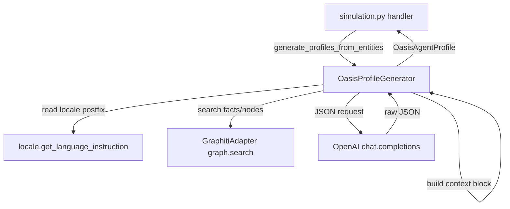

# Design Document — i18n-oasis-profile-generator-prompts

## Overview

**Purpose**: Translate the Chinese prompt strings, context-builder section labels, fallback persona templates, and console-output formatting in `backend/app/services/oasis_profile_generator.py` to English while preserving every functional contract — LLM JSON output schema, the `_normalize_gender` mapping that must continue to accept Chinese gender values, the `_generate_profile_rule_based` default `country: "中国"` data value, all f-string interpolations, and the `get_language_instruction()` locale-postfix mechanism. The goal is to remove the Chinese-language base-prompt and context-label bias that currently leaks Chinese structure and word choice into OASIS profile output even when `Accept-Language: en`.

**Users**: MiroFish operators running the Step 2 OASIS profile generation under any locale; downstream OASIS / CAMEL-OASIS consumers of the agent JSON / CSV produced by `OasisProfileGenerator`.

**Impact**: Replaces approximately one base-prompt string, two large user-message templates, four context-builder section labels, three fallback persona templates, and ten console-output strings with English equivalents inside one file. No API surface change. No new dependencies. No new files. Callers (`backend/app/api/simulation.py`, etc.) and OASIS consumers are unaffected.

### Goals

- Zero CJK characters in any prompt string literal contributed by `oasis_profile_generator.py` to the system prompt, the user message, or the context block.
- Zero CJK characters in any console-output literal in `_print_generated_profile` and the surrounding banners.
- English `bio` / `persona` output under `Accept-Language: en`.
- Continued Chinese `bio` / `persona` output under `Accept-Language: zh`, of equivalent quality to the pre-change behaviour.
- No diff to public signatures, dataclass schema, LLM-call parameters, or call sites.

### Non-Goals

- Externalizing prompts to `/locales/*.json` (out of scope per ticket and consistent with `i18n-ontology-generator-prompts`).
- Translating logger calls in this file (covered by issue #6).
- Translating module/class/method docstrings or inline comments in this file (covered by issue #7).
- Refactoring the OASIS profile JSON schema, the OASIS adapter, or the simulation flow.
- Modifying the `_normalize_gender` mapping table (it must keep accepting Chinese gender keys).
- Modifying the `_generate_profile_rule_based` default `"中国"` country value (data, not prompt).
- Modifying the `ValueError("LLM_API_KEY 未配置")` raise (covered by issue #6).
- Modifying `backend/app/utils/locale.py`, the locale registries, or any non-target file.

## Boundary Commitments

### This Spec Owns

- The English content of the `base_prompt` string in `OasisProfileGenerator._get_system_prompt` (line 664).
- The English content of every string literal in `OasisProfileGenerator._build_individual_persona_prompt` (lines 677–714).
- The English content of every string literal in `OasisProfileGenerator._build_group_persona_prompt` (lines 726–762).
- The English content of the section-label literals embedded in `OasisProfileGenerator._search_zep_for_entity` (lines 384, 390, 392) and `OasisProfileGenerator._build_entity_context` (lines 422, 438, 440, 443, 463, 472, 475).
- The English content of the fallback persona templates in `OasisProfileGenerator._generate_profile_with_llm` (line 547) and `OasisProfileGenerator._try_fix_json` (lines 644, 659).
- The English content of the no-attributes / no-context placeholder literals (`"无"`, `"无额外上下文"`) at lines 677, 678, 726, 727.
- The English content of every string literal in `OasisProfileGenerator._print_generated_profile` (lines 1011, 1017, 1019, 1022, 1025, 1026, 1027, 1028) and the surrounding banners in `OasisProfileGenerator.generate_profiles_from_entities` (lines 945, 1001).

### Out of Boundary

- Locale resolution machinery (`backend/app/utils/locale.py`).
- Per-locale `llmInstruction` definitions (`/locales/languages.json`).
- Reasoning-model output stripping (`backend/app/utils/llm_client.py`).
- All `logger.*` calls (already keyed via `t("log.profile_generator.*")`; covered by issue #6).
- Module / class / method docstrings and inline comments (covered by issue #7), including the inline comments at lines 65, 93, 641, 804–807, 816–819.
- The `_normalize_gender` mapping table (lines 1123–1132) — must continue to accept Chinese gender keys from upstream.
- The hard-coded `country: "中国"` default in `_generate_profile_rule_based` (lines 807, 819) — this is a data value, not a prompt.
- The `ValueError("LLM_API_KEY 未配置")` raise (line 194) — covered by issue #6.
- All callers of `OasisProfileGenerator`, including `backend/app/api/simulation.py`.
- Tests, scripts, and frontend code.

### Allowed Dependencies

- Existing `get_language_instruction`, `get_locale`, `set_locale`, `t` imports from `..utils.locale` (already imported; unchanged).
- Existing `OpenAI` SDK invocation (unchanged).
- No new imports.

### Revalidation Triggers

The following changes elsewhere would invalidate this design and require revisiting the prompt:

- A change to the JSON contract emitted by the LLM (`bio`, `persona`, `age`, `gender`, `mbti`, `country`, `profession`, `interested_topics`).
- A change to `OasisAgentProfile` field semantics.
- A change to `get_language_instruction()` semantics or the per-locale `llmInstruction` strings.
- A change to OASIS / CAMEL-OASIS profile field expectations (e.g. if `gender` accepts more than `male` / `female` / `other`).

## Architecture

### Existing Architecture Analysis

`OasisProfileGenerator` lives in `backend/app/services/`, follows the in-process service pattern with bounded thread-pool fan-out for batched profile generation, and is invoked from `backend/app/api/simulation.py` inside a background `Task`. It depends on:

- `OpenAI` SDK for the LLM call.
- `GraphitiAdapter` (legacy `zep_client` field name) for the Zep / Graphiti graph search.
- `get_language_instruction()` for locale steering.
- `t()` for already-keyed log strings.

The relevant flow is:

1. The Flask handler resolves the request locale via `Accept-Language`; the locale is propagated to thread-pool workers via the `set_locale(current_locale)` capture in `generate_profiles_from_entities` (line 914).
2. For each entity, `_build_entity_context()` is called: it composes a context block by concatenating headed sub-sections (entity attributes, related facts/edges, related node summaries, Graphiti-search facts, Graphiti-search nodes). Some of these labels are currently in Chinese.
3. The context string is interpolated into the user-message template by either `_build_individual_persona_prompt` or `_build_group_persona_prompt`. Both templates are currently in Chinese, with English `gender` token directives interleaved.
4. The system prompt is built by `_get_system_prompt`: a Chinese base prompt followed by the locale-appropriate `get_language_instruction()`.
5. The two messages are sent to `chat.completions.create` with `response_format={"type": "json_object"}`. The result flows through `json.loads` → `_try_fix_json` → `_fix_truncated_json` fallback chain. Synthesized fallback personas use the Chinese template `f"{entity_name}是一个{entity_type}。"` if the LLM result is unusable.
6. After per-profile completion, `_print_generated_profile` writes a Chinese-headed banner to stdout, and `generate_profiles_from_entities` writes Chinese batch banners.

This design preserves all of the above structurally. The change is purely lexical inside the seven regions of one file.

### Architecture Pattern & Boundary Map



**Architecture Integration**:

- Selected pattern: **In-place lexical translation** of seven regions of an existing service. No structural change.
- Domain/feature boundaries: locale machinery vs. prompt assembly vs. LLM transport remain cleanly separated.
- Existing patterns preserved: prompt-as-f-string user-message construction; Chinese-keyed `_normalize_gender` mapping; `t(...)` for log strings; `get_language_instruction()` postfix concatenation.
- New components rationale: none — no new components.
- Steering compliance: matches the established `i18n-*-prompts` family pattern (issues #2, #3, #4, #5) of in-place translation rather than `t()` keying for prompt bodies. Respects the steering note that "existing files mix English and Chinese in comments/docstrings — preserve both; do not translate one into the other unless asked." This ticket is the explicit ask for prompt strings, scoped to exclude comments/docstrings.

### Technology Stack

| Layer | Choice / Version | Role in Feature | Notes |
|-------|------------------|-----------------|-------|
| Backend / Services | Python 3.11+ | Hosts `OasisProfileGenerator` | Existing — unchanged. |
| Backend / Services | `openai` SDK | Issues the prompt; returns JSON | Existing — unchanged. |
| Backend / Services | `backend/app/utils/locale.py` | Resolves `Accept-Language` → `llmInstruction` postfix | Existing — unchanged. |
| Backend / Services | `GraphitiAdapter` | Provides Graphiti graph search facts/nodes | Existing — unchanged. |

No new dependencies. No version changes.

## File Structure Plan

### Modified Files

- `backend/app/services/oasis_profile_generator.py` — Replace the body of `_get_system_prompt` `base_prompt`; replace every Chinese string literal in `_build_individual_persona_prompt` and `_build_group_persona_prompt` with English equivalents; replace the four section labels in `_search_zep_for_entity` and the six section labels in `_build_entity_context`; replace the three fallback persona templates; replace the two `"无"` / `"无额外上下文"` placeholders; replace the console-output literals in `_print_generated_profile` and the two `print(...)` banners in `generate_profiles_from_entities`. Preserve every other character of the file.

No new files. No deletions. No moves.

## System Flows

The control-flow diagram in *Architecture Pattern & Boundary Map* covers the relevant flow; no additional diagrams are needed for this string-literal change.

## Requirements Traceability

| Requirement | Summary | Components | Interfaces | Flows |
|-------------|---------|------------|------------|-------|
| 1.1–1.4 | English `_get_system_prompt` `base_prompt`; preserve `get_language_instruction()` site | OasisProfileGenerator → `_get_system_prompt` | None changed | Architecture diagram |
| 2.1–2.9 | English `_build_individual_persona_prompt`; preserve interpolations and JSON keys | OasisProfileGenerator → `_build_individual_persona_prompt` | f-string interpolation | n/a |
| 3.1–3.9 | English `_build_group_persona_prompt`; preserve fixed-value rules and interpolations | OasisProfileGenerator → `_build_group_persona_prompt` | f-string interpolation | n/a |
| 4.1–4.10 | English context-builder section labels | OasisProfileGenerator → `_search_zep_for_entity`, `_build_entity_context` | Prompt-only | n/a |
| 5.1–5.3 | English fallback persona templates | OasisProfileGenerator → `_generate_profile_with_llm`, `_try_fix_json` | None changed | n/a |
| 6.1–6.7 | English console-output formatting | OasisProfileGenerator → `_print_generated_profile`, `generate_profiles_from_entities` | None changed | n/a |
| 7.1–7.4 | Locale switching preserved via `get_language_instruction()` | OasisProfileGenerator + Locale | `get_language_instruction()` | Architecture diagram |
| 8.1–8.6 | Public API and call-site stability; preserve `_normalize_gender` and `country: "中国"` data default | OasisProfileGenerator (signatures, dataclass) | Public surface | n/a |
| 9.1–9.3 | Reasoning-model compatibility | OasisProfileGenerator → `chat.completions.create` + `_try_fix_json` | OpenAI SDK | Architecture diagram |
| 10.1–10.7 | Out-of-scope surfaces untouched | OasisProfileGenerator (boundary commitment) | n/a | n/a |

## Components and Interfaces

| Component | Domain/Layer | Intent | Req Coverage | Key Dependencies (P0/P1) | Contracts |
|-----------|--------------|--------|--------------|--------------------------|-----------|
| OasisProfileGenerator (modified) | Backend / Service | Render English profile-generation prompts and context labels; preserve all behaviour | 1.1–10.7 | `OpenAI.chat.completions.create` (P0), `get_language_instruction` (P0), `GraphitiAdapter.graph.search` (P1), `_normalize_gender` (P0) | Service |

### Backend / Service

#### OasisProfileGenerator (modified)

| Field | Detail |
|-------|--------|
| Intent | Translate prompt strings, context labels, fallback persona templates, and console output to English while preserving every functional contract. |
| Requirements | 1.1, 1.2, 1.3, 1.4, 2.1–2.9, 3.1–3.9, 4.1–4.10, 5.1–5.3, 6.1–6.7, 7.1–7.4, 8.1–8.6, 9.1–9.3, 10.1–10.7 |

**Responsibilities & Constraints**

- Owns: the English wording of the system prompt body, the two user-message templates, the context-builder section labels, the fallback persona templates, the no-attributes / no-context placeholders, and the console-output formatting.
- Domain boundary: prompt content and proximate console output only. Does not own locale resolution, transport, validation, or data values like the OASIS `country` default.
- Invariants:
    - All seven owned regions after translation MUST contain zero CJK characters.
    - The translated user-message templates MUST present the same eight required JSON keys: `bio`, `persona`, `age`, `gender`, `mbti`, `country`, `profession`, `interested_topics`.
    - The translated individual-persona template MUST require `gender ∈ {"male", "female"}` and `age` to be a valid integer.
    - The translated group-persona template MUST require `age == 30` and `gender == "other"`.
    - The translated user-message templates MUST preserve the f-string interpolations: `{entity_name}`, `{entity_type}`, `{entity_summary}`, `{attrs_str}`, `{context_str}`, `{get_language_instruction()}`.
    - The translated context-builder labels MUST preserve the section structure (heading + bulleted body).
    - The translated fallback persona templates MUST preserve the `entity_summary or template` priority order.
    - The call to `get_language_instruction()` MUST remain at its current locations.
    - The call to `self.client.chat.completions.create(...)` MUST remain unchanged.
    - All public signatures, dataclass schema, and the private helper signatures MUST remain unchanged.
    - All `logger.*` calls (already keyed) and inline comments and docstrings in this file MUST remain unchanged (out of scope per #6 and #7).
    - The `_normalize_gender` mapping table MUST remain unchanged.
    - The rule-based `country: "中国"` default MUST remain unchanged.

**Dependencies**

- Inbound: `backend/app/api/simulation.py` — production caller (P0).
- Outbound: `backend/app/utils/locale.get_language_instruction` — locale postfix (P0); `backend/app/utils/locale.t` — already-keyed log strings (P0); `backend/app/services/graphiti_adapter.GraphitiAdapter.graph.search` — facts/nodes retrieval (P1); `OpenAI.chat.completions.create` — JSON LLM transport (P0).
- External: none.

**Contracts**: Service [x] / API [ ] / Event [ ] / Batch [ ] / State [ ]

##### Service Interface

The public Python interface is unchanged. Representative signatures:

```python
class OasisProfileGenerator:
    def __init__(
        self,
        api_key: Optional[str] = None,
        base_url: Optional[str] = None,
        model_name: Optional[str] = None,
        zep_api_key: Optional[str] = None,
        graph_id: Optional[str] = None,
    ) -> None: ...

    def generate_profile_from_entity(
        self,
        entity: EntityNode,
        user_id: int,
        use_llm: bool = True,
    ) -> OasisAgentProfile: ...

    def generate_profiles_from_entities(
        self,
        entities: List[EntityNode],
        use_llm: bool = True,
        progress_callback: Optional[callable] = None,
        graph_id: Optional[str] = None,
        parallel_count: int = 5,
        realtime_output_path: Optional[str] = None,
        output_platform: str = "reddit",
    ) -> List[OasisAgentProfile]: ...

    def save_profiles(
        self,
        profiles: List[OasisAgentProfile],
        file_path: str,
        platform: str = "reddit",
    ) -> None: ...
```

- Preconditions: a configured LLM provider; a configured Graphiti / Neo4j graph; a non-empty `entities` list when batching.
- Postconditions: `OasisAgentProfile` instances with English `bio` and `persona` under locale `en`, Chinese under locale `zh`, and structurally equivalent across locales.
- Invariants: see *Responsibilities & Constraints*.

**Implementation Notes**

- **Integration**: No new imports. No call-site changes. The diff is confined to seven regions of one file.
- **Validation**: After implementation, run a targeted regex check (`[一-鿿]`) over the seven owned regions to confirm zero CJK; smoke-test `_build_individual_persona_prompt(...)` and `_build_group_persona_prompt(...)` with representative inputs to confirm interpolations still work; round-trip a single profile end-to-end under both `en` and `zh` locales.
- **Risks**: English-base bias on Chinese-locale output (mitigated by the `llmInstruction` postfix already present in both system and user messages). Reduced LLM compliance with `gender ∈ {male, female}` for individual entities (mitigated by retaining the explicit English-token directive verbatim in the rules block).

## Data Models

No data-model changes. The `OasisAgentProfile` dataclass is preserved verbatim.

## Error Handling

### Error Strategy

Error handling is unchanged from the existing implementation:

- LLM transport errors propagate from `chat.completions.create`.
- Truncation (`finish_reason == "length"`) is repaired by `_fix_truncated_json`.
- Invalid JSON falls through to `_try_fix_json`, then to a synthesized fallback profile (now with English persona text).
- Per-entity exceptions are caught and a fallback `OasisAgentProfile` is constructed with English fallback strings.

### Error Categories and Responses

- **User errors (4xx)**: not applicable at this layer; surfaced by the API handler.
- **System errors (5xx)**: LLM/network failures propagate to the API handler, which converts them to JSON error responses.
- **Business logic errors**: malformed JSON is auto-repaired or replaced with a fallback profile.

### Monitoring

Existing `logger.*` calls (keyed via `t("log.profile_generator.*")`) cover progress and warnings; no new monitoring is added.

## Testing Strategy

### Unit Tests

Given the project's intentionally minimal test harness (`backend/scripts/test_profile_format.py` only), the change is verified via:

- **Static check**: a one-shot regex assertion against the patched module ensuring zero CJK characters in the seven owned regions. This can be a quick `python -c` invocation during PR review.
- **Round-trip smoke test**: instantiate `OasisProfileGenerator()`, call `_build_individual_persona_prompt(...)` and `_build_group_persona_prompt(...)` with representative inputs, and verify all required interpolations appear in the output and no CJK characters remain.
- **Fallback rendering**: simulate a JSON parse failure and verify the English fallback persona template is produced.

### Integration Tests

- **Step 2 profile generation under EN locale**: run a small batched profile generation against a real Graphiti graph with locale `en`. Verify produced profiles have English `bio` / `persona` and pass the existing OASIS profile-format check.

### E2E/UI Tests

Not applicable — change does not affect frontend.

### Performance/Load

Not applicable — token counts may differ slightly between Chinese and English renderings, but the LLM call has no `max_tokens` cap and remains within provider-acceptable limits.

## Optional Sections

### Security Considerations

Not applicable. Translation does not introduce new authentication, authorization, data-handling, or input-validation paths.

### Performance & Scalability

Not applicable.

### Migration Strategy

Not applicable. The change is a single in-place edit; no data migration. Rollback is `git revert`.

## Supporting References

- `backend/app/services/oasis_profile_generator.py` — current Chinese prompt content (the source of translation).
- `backend/app/utils/locale.py` — locale resolver.
- `backend/app/api/simulation.py` — call site.
- `.kiro/specs/i18n-ontology-generator-prompts/design.md` — adjacent reference design for in-place prompt translation.
- `.ticket/25.md` — ticket snapshot.
