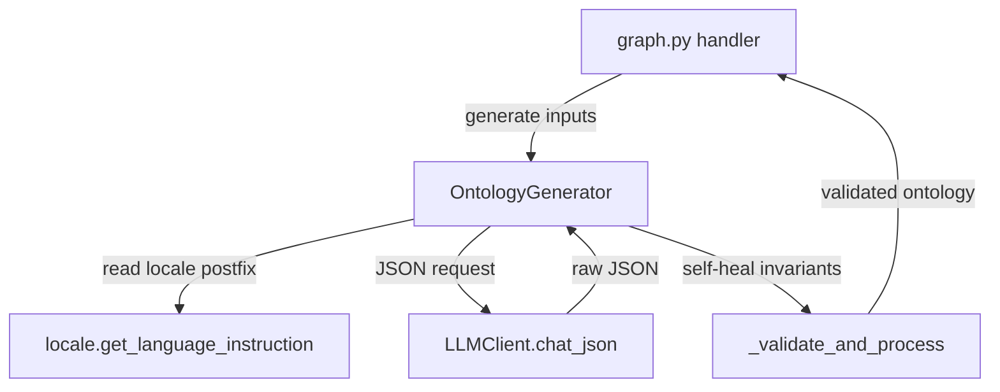

# Design Document — i18n-ontology-generator-prompts

## Overview

**Purpose**: Translate the Chinese prompt strings in `backend/app/services/ontology_generator.py` (the system prompt constant and the user-message template) to English while preserving every functional contract — JSON output schema, taxonomy lists, reserved-attribute names, fallback rules, variable interpolations, and the `get_language_instruction()` locale-postfix mechanism. The goal is to remove the Chinese-language base-prompt bias that currently leaks Chinese structure and word choice into ontology output even when `Accept-Language: en`.

**Users**: MiroFish operators running the Step 1 graph-build pipeline under any locale; downstream developers consuming the JSON ontology emitted by `OntologyGenerator.generate(...)`.

**Impact**: Replaces approximately one large module-level string constant and four embedded string literals with English equivalents. No API surface change. No new dependencies. No new files. The single production caller (`backend/app/api/graph.py:223–228`) and all consumers of the validator output are unaffected.

### Goals

- Zero CJK characters in any prompt string literal contributed by `ontology_generator.py` to the system prompt or the user message.
- English ontology descriptions and `analysis_summary` under `Accept-Language: en`.
- Continued Chinese descriptions and `analysis_summary` under `Accept-Language: zh`, of equivalent quality to the pre-change behaviour.
- No diff to public signatures, constants, LLM-call parameters, or call sites.

### Non-Goals

- Externalizing prompts to `/locales/*.json` (out of scope per ticket).
- Translating logger calls in this file (covered by issue #6).
- Translating module/class/method docstrings or inline comments in this file (covered by issue #7).
- Refactoring the ontology JSON schema, the validator, or the extraction flow.
- Changing the entity-type or relationship-type reference taxonomies.
- Modifying `backend/app/utils/locale.py`, the locale registries, or any non-target file.

## Boundary Commitments

### This Spec Owns

- The English content of `ONTOLOGY_SYSTEM_PROMPT` (module-level constant in `backend/app/services/ontology_generator.py`).
- The English content of the four string literals embedded in `OntologyGenerator._build_user_message`: section headings, additional-context block, trailing rules block, and truncation notice.

### Out of Boundary

- Locale resolution machinery (`backend/app/utils/locale.py`).
- Per-locale `llmInstruction` definitions (`/locales/languages.json`).
- Reasoning-model output stripping (`backend/app/utils/llm_client.py`).
- Logger calls and `logger.warning` strings inside `ontology_generator.py` (issue #6).
- Module/class/method docstrings and inline comments inside `ontology_generator.py` (issue #7).
- The entity / edge taxonomy itself; only its descriptive prose changes language.
- All callers of `OntologyGenerator`, including `backend/app/api/graph.py`.
- Tests, scripts, and frontend code.

### Allowed Dependencies

- Existing `get_language_instruction()` import from `..utils.locale` (already imported; unchanged).
- Existing `LLMClient.chat_json` invocation (unchanged).
- No new imports.

### Revalidation Triggers

The following changes elsewhere would invalidate this design and require revisiting the prompt:

- A change to the JSON contract emitted by the LLM (`entity_types`, `edge_types`, `analysis_summary` keys or sub-keys).
- A change to `_validate_and_process` invariants (10 entity types, fallback `Person`/`Organization`, `MAX_*` caps, description length).
- A change to `get_language_instruction()` semantics or the per-locale `llmInstruction` strings.
- A change to the reasoning-model output stripping in `LLMClient.chat`/`chat_json`.

## Architecture

### Existing Architecture Analysis

`OntologyGenerator` lives in `backend/app/services/`, follows the in-process service pattern (no IO besides the LLM call), and is invoked synchronously from `backend/app/api/graph.py` inside a background `Task`. It depends on `LLMClient` for transport and on `get_language_instruction()` for locale steering. The relevant flow is:

1. The Flask handler resolves the request locale via `Accept-Language`; locale is set via `set_locale()` for the background thread.
2. `OntologyGenerator.generate()` builds a user message from inputs, prepends the (currently Chinese) system prompt with the locale postfix and the English identifier-format directive, calls `chat_json`, then runs the response through `_validate_and_process`.
3. The validator self-heals invariants (count, fallback types, length, deduplication).

This design preserves all of the above. The change is purely lexical inside two regions of one file.

### Architecture Pattern & Boundary Map



**Architecture Integration**:

- Selected pattern: **In-place lexical translation** of two regions of an existing service. No structural change.
- Domain/feature boundaries: locale machinery vs. service prompt vs. transport stripping remain cleanly separated.
- Existing patterns preserved: prompt-as-constant; `f"..."` user-message construction; locale-postfix concatenation; validator self-healing.
- New components rationale: none — no new components.
- Steering compliance: matches `tech.md` ("translate keys, not raw log lines, when adding new logs that surface to users") for what is in-scope here, and respects the steering note that "existing files mix English and Chinese in comments/docstrings — preserve both; do not translate one into the other unless asked." This ticket is the explicit ask for the prompt strings, scoped to exclude comments/docstrings.

### Technology Stack

| Layer | Choice / Version | Role in Feature | Notes |
|-------|------------------|-----------------|-------|
| Backend / Services | Python 3.11+ | Hosts `OntologyGenerator` | Existing — unchanged. |
| Backend / Services | `openai` SDK via `LLMClient` | Issues the prompt; performs `<think>` and fence stripping | Existing — unchanged. |
| Backend / Services | `backend/app/utils/locale.py` | Resolves `Accept-Language` → `llmInstruction` postfix | Existing — unchanged. |

No new dependencies. No version changes.

## File Structure Plan

### Modified Files

- `backend/app/services/ontology_generator.py` — Replace the body of `ONTOLOGY_SYSTEM_PROMPT` with an English translation; replace the four Chinese string fragments in `_build_user_message` with English equivalents; preserve every other character of the file.

No new files. No deletions. No moves.

## System Flows

The control-flow diagram in *Architecture Pattern & Boundary Map* covers the relevant flow; no additional diagrams are needed for this string-literal change.

## Requirements Traceability

| Requirement | Summary | Components | Interfaces | Flows |
|-------------|---------|------------|------------|-------|
| 1.1 | Zero Chinese in `ONTOLOGY_SYSTEM_PROMPT` | OntologyGenerator → `ONTOLOGY_SYSTEM_PROMPT` | None changed | n/a |
| 1.2 | Preserve JSON output keys | OntologyGenerator → prompt template region | LLM JSON contract | Architecture diagram |
| 1.3 | Preserve entity-type reference list verbatim | OntologyGenerator → prompt reference list | Prompt-only | n/a |
| 1.4 | Preserve relationship-type reference list verbatim | OntologyGenerator → prompt reference list | Prompt-only | n/a |
| 1.5 | Preserve reserved attribute names | OntologyGenerator → prompt rules region | Prompt-only | n/a |
| 1.6 | Preserve fallback rule (Person, Organization) | OntologyGenerator → prompt + validator | Validator self-healing | n/a |
| 1.7 | Preserve count constraints | OntologyGenerator → prompt + validator | Validator self-healing | n/a |
| 1.8 | Preserve description-length constraint | OntologyGenerator → prompt + validator | Validator self-healing | n/a |
| 2.1 | English section headings in user message | OntologyGenerator → `_build_user_message` | None changed | n/a |
| 2.2 | English trailing rules block | OntologyGenerator → `_build_user_message` | None changed | n/a |
| 2.3 | English truncation notice | OntologyGenerator → `_build_user_message` | None changed | n/a |
| 2.4 | Variable interpolations preserved | OntologyGenerator → `_build_user_message` | f-string interpolation | n/a |
| 2.5 | Conditional additional-context block preserved | OntologyGenerator → `_build_user_message` | Python conditional | n/a |
| 2.6 | Zero Chinese in user message | OntologyGenerator → `_build_user_message` | n/a | n/a |
| 3.1 | Postfix call site preserved | OntologyGenerator → `generate` line ~209 | `get_language_instruction()` | Architecture diagram |
| 3.2 | English identifier-format directive preserved | OntologyGenerator → system_prompt assembly | Prompt-only | n/a |
| 3.3 | `zh` locale produces Chinese output | OntologyGenerator + Locale | `get_language_instruction()` | Architecture diagram |
| 3.4 | `en` locale produces English output | OntologyGenerator + Locale | `get_language_instruction()` | Architecture diagram |
| 3.5 | No edits to locale module or registries | n/a (boundary commitment) | n/a | n/a |
| 4.1–4.7 | API and constant stability | OntologyGenerator (signatures, constants) | Public surface | n/a |
| 5.1–5.4 | Reasoning-model compatibility | OntologyGenerator → `chat_json` call | LLMClient.chat_json | Architecture diagram |
| 6.1–6.3 | Step 1 graph-build parity | Validation runs (manual) | n/a | n/a |
| 7.1–7.4 | Out-of-scope surfaces untouched | OntologyGenerator (boundary commitment) | n/a | n/a |

## Components and Interfaces

| Component | Domain/Layer | Intent | Req Coverage | Key Dependencies (P0/P1) | Contracts |
|-----------|--------------|--------|--------------|--------------------------|-----------|
| OntologyGenerator (modified) | Backend / Service | Render English ontology-generation prompts; preserve all behaviour | 1.1–1.8, 2.1–2.6, 3.1–3.5, 4.1–4.7, 5.1–5.4, 7.1–7.4 | LLMClient.chat_json (P0), get_language_instruction (P0), `_validate_and_process` (P0) | Service |

### Backend / Service

#### OntologyGenerator (modified)

| Field | Detail |
|-------|--------|
| Intent | Translate prompt strings to English while preserving every functional contract. |
| Requirements | 1.1, 1.2, 1.3, 1.4, 1.5, 1.6, 1.7, 1.8, 2.1, 2.2, 2.3, 2.4, 2.5, 2.6, 3.1, 3.2, 3.3, 3.4, 3.5, 4.1, 4.2, 4.3, 4.4, 4.5, 4.6, 4.7, 5.1, 5.2, 5.3, 5.4, 7.1, 7.2, 7.3, 7.4 |

**Responsibilities & Constraints**

- Owns: the English wording of `ONTOLOGY_SYSTEM_PROMPT` and the four user-message string fragments.
- Domain boundary: prompt content only. Does not own locale resolution, transport, or validation logic.
- Invariants:
    - `ONTOLOGY_SYSTEM_PROMPT` after translation MUST contain zero CJK characters.
    - The translated system prompt MUST present the same JSON template by key (`entity_types`, `edge_types`, `analysis_summary`; entity sub-keys `name`, `description`, `attributes`, `examples`; edge sub-keys `name`, `description`, `source_targets`, `attributes`; `source_targets` sub-keys `source`, `target`).
    - The translated system prompt MUST list the same entity-type names verbatim: `Student`, `Professor`, `Journalist`, `Celebrity`, `Executive`, `Official`, `Lawyer`, `Doctor`, `Person`, `University`, `Company`, `GovernmentAgency`, `MediaOutlet`, `Hospital`, `School`, `NGO`, `Organization`.
    - The translated system prompt MUST list the same relationship-type names verbatim: `WORKS_FOR`, `STUDIES_AT`, `AFFILIATED_WITH`, `REPRESENTS`, `REGULATES`, `REPORTS_ON`, `COMMENTS_ON`, `RESPONDS_TO`, `SUPPORTS`, `OPPOSES`, `COLLABORATES_WITH`, `COMPETES_WITH`.
    - The translated system prompt MUST list the same reserved attribute names verbatim: `name`, `uuid`, `group_id`, `created_at`, `summary`.
    - The translated system prompt MUST express the same numeric constraints: exactly 10 entity types, with the last 2 being `Person` and `Organization` fallbacks; 6–10 relationship types; 1–3 attributes per entity; description ≤ 100 characters.
    - The translated user message MUST preserve all f-string interpolations: `{simulation_requirement}`, `{combined_text}`, `{additional_context}`, `{original_length}`, `{self.MAX_TEXT_LENGTH_FOR_LLM}`.
    - The translated user message MUST conditionally include the `## Additional Context` block only when `additional_context` is truthy.
    - The call to `get_language_instruction()` MUST remain at its current location with its current return-value usage.
    - The trailing English identifier-format directive (`IMPORTANT: Entity type names MUST be in English PascalCase ...`) MUST remain byte-for-byte identical.
    - The call to `self.llm_client.chat_json(messages=messages, temperature=0.3, max_tokens=4096)` MUST remain unchanged.
    - All public signatures, the constant `MAX_TEXT_LENGTH_FOR_LLM`, and the private helpers `_to_pascal_case` and `_validate_and_process` MUST remain unchanged.
    - All `logger.warning(...)` calls and inline comments and docstrings in this file MUST remain unchanged (out of scope per #6 and #7).

**Dependencies**

- Inbound: `backend/app/api/graph.py:223–228` — sole production caller (P0).
- Outbound: `backend/app/utils/locale.get_language_instruction` — locale postfix (P0). `backend/app/utils/llm_client.LLMClient.chat_json` — JSON LLM transport with stripping (P0).
- External: none.

**Contracts**: Service [x] / API [ ] / Event [ ] / Batch [ ] / State [ ]

##### Service Interface

The public Python interface is unchanged:

```python
class OntologyGenerator:
    def __init__(self, llm_client: Optional[LLMClient] = None) -> None: ...

    def generate(
        self,
        document_texts: List[str],
        simulation_requirement: str,
        additional_context: Optional[str] = None,
    ) -> Dict[str, Any]: ...

    def generate_python_code(self, ontology: Dict[str, Any]) -> str: ...
```

- Preconditions: `document_texts` is a non-empty list of strings; `simulation_requirement` is a non-empty string; locale is resolvable via the existing chain.
- Postconditions: `generate()` returns a dict with `entity_types` (length ≤ 10, ending in `Person` and `Organization`), `edge_types` (length ≤ 10), and `analysis_summary` (string).
- Invariants: see *Responsibilities & Constraints*.

**Implementation Notes**

- **Integration**: No new imports. No call-site changes. The only diff is the body of `ONTOLOGY_SYSTEM_PROMPT` and four string literals inside `_build_user_message`.
- **Validation**: After implementation, run a targeted regex check (`[一-鿿]` over `ONTOLOGY_SYSTEM_PROMPT` and the relevant lines of `_build_user_message`) to confirm zero CJK in those literals. Run a manual round-trip via `OntologyGenerator().generate(...)` under both `en` and `zh` locales using a small seed text and assert: valid JSON, exactly 10 entity types ending in `Person` and `Organization`, descriptions in the expected language. Optionally run end-to-end Step 1 graph build on a representative seed file under `en` and compare node/edge counts to a recent `zh` baseline.
- **Risks**: English-base bias on Chinese-locale output (mitigated by the `llmInstruction` postfix and the trailing English directive that locks identifier formats). Validator self-healing covers structural drift independent of prompt language.

## Data Models

No data-model changes. The JSON schema emitted by the LLM and consumed by `_validate_and_process` is preserved verbatim.

## Error Handling

### Error Strategy

Error handling is unchanged from the existing implementation:

- LLM transport errors propagate from `LLMClient.chat_json` (raises on failure modes the SDK exposes).
- Invalid JSON from the LLM raises `ValueError("LLM返回的JSON格式无效: ...")` from `chat_json`. Note: the error message itself is in `llm_client.py` and is out of scope for this spec (issue #6).
- Validator self-healing handles structural drift (missing fallbacks, count overflows, invalid attribute reservations).

### Error Categories and Responses

- **User errors (4xx)**: not applicable at this layer; surfaced by the API handler.
- **System errors (5xx)**: LLM/network failures propagate to the API handler, which converts them to JSON error responses.
- **Business logic errors**: structurally invalid ontology output is auto-corrected by `_validate_and_process` to satisfy the 10-type / fallback / length invariants.

### Monitoring

Existing `logger.warning` and `logger.info` calls already log auto-conversions and final counts; no new monitoring is added.

## Testing Strategy

### Unit Tests

Given the project's intentionally minimal test harness (`backend/scripts/test_profile_format.py` only, per `tech.md`), introducing a heavy new test suite is out of scope. Instead, two lightweight checks accompany the change:

- **Static check**: a regex assertion in a small ad-hoc script (or a one-shot `python -c`) confirming that `ONTOLOGY_SYSTEM_PROMPT` and the patched literals in `_build_user_message` contain zero characters in `[一-鿿]`. This can be a permanent simple test under `backend/scripts/` if desired or a one-off check during PR review.
- **Round-trip smoke test**: a manual run of `OntologyGenerator().generate(...)` against a configured LLM, locale `en`, with a small seed text. Assert: dict shape, entity-types length 10 ending in `Person`/`Organization`, description fields contain no `[一-鿿]`. Repeat under locale `zh` and assert description fields contain at least some `[一-鿿]` (sanity check that the postfix still steers Chinese output).

### Integration Tests

- **Step 1 graph build under EN locale**: run the full pipeline end-to-end with a representative seed file under `Accept-Language: en`. Assert: pipeline completes without exception, ontology validates, node/edge counts in Neo4j are within operator-acceptable tolerance of a recent `zh` baseline. This is documented as an operator-run verification step in the PR description; automation is not required.

### E2E/UI Tests

Not applicable — change does not affect frontend.

### Performance/Load

Not applicable — change does not alter performance characteristics. LLM call parameters (`temperature=0.3`, `max_tokens=4096`) are unchanged.

## Optional Sections

### Security Considerations

Not applicable. Translation does not introduce new authentication, authorization, data-handling, or input-validation paths. Reserved attribute names remain enforced via prompt and validator.

### Performance & Scalability

Not applicable. Prompt token counts may differ slightly between Chinese and English renderings, but well within the existing `max_tokens=4096` budget.

### Migration Strategy

Not applicable. The change is a single in-place edit; no data migration. Rollback is `git revert`.

## Supporting References

- `backend/app/services/ontology_generator.py` — current Chinese prompt content (the source of translation).
- `backend/app/utils/locale.py` — locale resolver.
- `backend/app/utils/llm_client.py` — `chat_json` and `<think>` / fence stripping.
- `backend/app/api/graph.py:223–228` — sole production caller.
- `.kiro/specs/i18n-ontology-generator-prompts/research.md` — discovery findings, alternatives evaluation, and design decisions.
- `.ticket/2.md` — ticket snapshot.
