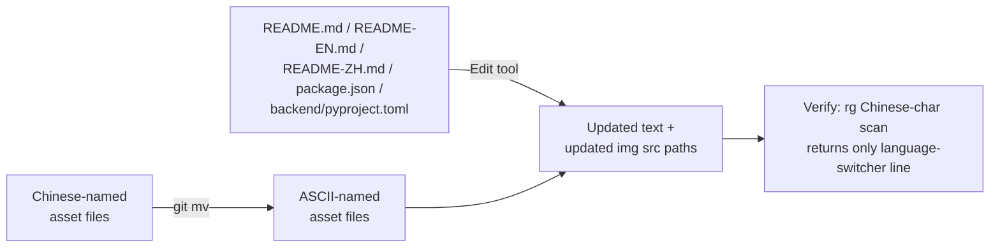

# Design Document — i18n-readme-tagline-and-assets

## Overview

**Purpose**: Eliminate the remaining Chinese surface text from the project's English-facing entry points (`README.md`, `README-EN.md`, `package.json`, `backend/pyproject.toml`) and replace Chinese-named image assets under `static/image/` with ASCII-only equivalents, so that visitors landing on the GitHub repo or installing the npm package see English-only metadata and so that asset URLs are tooling- and CDN-friendly.

**Users**: Non-Chinese-reading visitors arriving at the GitHub README, downstream consumers reading `package.json` / `backend/pyproject.toml` metadata, and any tool (CDNs, link-rotters, screenshot-rendering bots) that handles repo asset URLs.

**Impact**: Documentation surface and static image filenames change; no runtime, API, or pipeline behavior is affected. The Chinese-language entry point (`README-ZH.md`) keeps its Chinese body text but its asset references are updated to point at the renamed files.

### Goals

- Replace the Chinese tagline with English on `README.md`, `README-EN.md`, `package.json`, `backend/pyproject.toml`.
- Rename nine Chinese-named assets under `static/image/` to ASCII filenames, preserving byte content.
- Update every `` reference in `README.md`, `README-EN.md`, and `README-ZH.md` to the new ASCII paths.
- Verifiable acceptance: a Chinese-character scan over `README.md` and `README-EN.md` returns zero matches outside the language-switcher line.

### Non-Goals

- Translating the body of `README-ZH.md` (Chinese variant by design).
- Changing the Chinese tagline value in `locales/zh.json` (legitimate Chinese locale content).
- Re-encoding or re-cropping any image (rename only).
- Adding a CI guard that enforces ASCII filenames or no-Chinese-in-EN-README (tracked separately as #26).

## Boundary Commitments

### This Spec Owns

- The English-language tagline string used in `README.md`, `README-EN.md`, `package.json`, `backend/pyproject.toml`.
- The ASCII filenames for the nine renamed assets under `static/image/`.
- All `` references inside the three READMEs that point to the renamed files.

### Out of Boundary

- Any asset under `static/image/` that already uses an ASCII name (`MiroFish_logo*.jpeg`, `shanda_logo.png`).
- Code-level i18n initiatives (frontend strings, backend logs, agent prompts) — those are owned by sibling i18n specs.
- README content beyond the lines explicitly identified in §"Modified Files".

### Allowed Dependencies

- Git (`git mv` for rename-with-history).
- No new project dependencies.

### Revalidation Triggers

- Any future change that adds another Chinese-named asset under `static/image/` referenced from a README — the verification scan in this spec must be re-run.
- Any future change to the structure of the language-switcher line — the R4 verification regex tolerance for `[中文文档]` may need adjusting.

## Architecture

### Existing Architecture Analysis

This is a documentation- and asset-rename change. There is no architectural component to extend or replace. The relevant existing patterns to respect:

- **Per `.claude/rules/file-paths.md`**: shell commands that touch paths with non-ASCII characters must quote the paths.
- **Per `.kiro/steering/structure.md`**: `static/` is the project's image asset root; READMEs reference it via relative paths from repo root.
- **Per `.claude/rules/commits.md`**: Conventional Commits, lowercase, imperative, max 72 chars, no `Co-Authored-By:` watermark.

### Architecture Pattern & Boundary Map

No new architecture is introduced. The flow is a one-shot edit:



### Technology Stack

| Layer | Choice / Version | Role in Feature | Notes |
|-------|------------------|-----------------|-------|
| Frontend / CLI | — | n/a | No code changes. |
| Backend / Services | — | n/a | No code changes. |
| Data / Storage | — | n/a | No data model changes. |
| Messaging / Events | — | n/a | n/a |
| Infrastructure / Runtime | git ≥ 2.x | `git mv` for renames | Already a project prerequisite. |
| Documentation | Markdown / HTML-in-MD | Edit READMEs, `package.json`, `backend/pyproject.toml` | No new tooling. |

## File Structure Plan

### Directory Structure

No new files or directories are created. The existing layout is preserved:

```
static/image/
├── MiroFish_logo.jpeg                  (unchanged)
├── MiroFish_logo_compressed.jpeg       (unchanged)
├── shanda_logo.png                     (unchanged)
├── qq-group.png                        (renamed from "QQ群.png")
├── wuhan-university-simulation-cover.png        (renamed from "武大模拟演示封面.png")
├── dream-of-the-red-chamber-simulation-cover.jpg (renamed from "红楼梦模拟推演封面.jpg")
└── Screenshot/
    ├── screenshot1.png                 (renamed from "运行截图1.png")
    ├── screenshot2.png                 (renamed from "运行截图2.png")
    ├── screenshot3.png                 (renamed from "运行截图3.png")
    ├── screenshot4.png                 (renamed from "运行截图4.png")
    ├── screenshot5.png                 (renamed from "运行截图5.png")
    └── screenshot6.png                 (renamed from "运行截图6.png")
```

### Modified Files

- `README.md`
  - Lines 7–8: delete the Chinese tagline line and the `</br>` separator; the existing `<em>` line on (former) line 9 becomes the lone tagline.
  - Lines 52, 53, 56, 57, 60, 61: replace `Screenshot/运行截图{N}.png` with `Screenshot/screenshot{N}.png`.
  - Line 71: replace `武大模拟演示封面.png` with `wuhan-university-simulation-cover.png`.
  - Line 79: replace `红楼梦模拟推演封面.jpg` with `dream-of-the-red-chamber-simulation-cover.jpg`.
  - Line 220: replace `QQ群.png` with `qq-group.png`.
- `README-EN.md` — identical edit set as `README.md`.
- `README-ZH.md`
  - Lines 52, 53, 56, 57, 60, 61, 71, 79, 220: same nine `` replacements as above. Tagline and Chinese body text unchanged.
- `package.json`
  - Line 4: replace the `description` value with `MiroFish - A Simple and Universal Swarm Intelligence Engine, Predicting Anything`.
- `backend/pyproject.toml`
  - Line 4: replace the `description` value with `MiroFish - A Simple and Universal Swarm Intelligence Engine, Predicting Anything`.

### Renamed Files (via `git mv`)

| Old (quoted) | New |
|---|---|
| `"static/image/QQ群.png"` | `static/image/qq-group.png` |
| `"static/image/武大模拟演示封面.png"` | `static/image/wuhan-university-simulation-cover.png` |
| `"static/image/红楼梦模拟推演封面.jpg"` | `static/image/dream-of-the-red-chamber-simulation-cover.jpg` |
| `"static/image/Screenshot/运行截图1.png"` | `static/image/Screenshot/screenshot1.png` |
| `"static/image/Screenshot/运行截图2.png"` | `static/image/Screenshot/screenshot2.png` |
| `"static/image/Screenshot/运行截图3.png"` | `static/image/Screenshot/screenshot3.png` |
| `"static/image/Screenshot/运行截图4.png"` | `static/image/Screenshot/screenshot4.png` |
| `"static/image/Screenshot/运行截图5.png"` | `static/image/Screenshot/screenshot5.png` |
| `"static/image/Screenshot/运行截图6.png"` | `static/image/Screenshot/screenshot6.png` |

## System Flows

Not applicable. No runtime flows are introduced or changed.

## Requirements Traceability

| Requirement | Summary | Components | Interfaces | Flows |
|-------------|---------|------------|------------|-------|
| 1.1 | English tagline in README.md | README.md L7–9 edit | n/a | n/a |
| 1.2 | English tagline in README-EN.md | README-EN.md L7–9 edit | n/a | n/a |
| 1.3 | English description in package.json | package.json L4 edit | n/a | n/a |
| 1.4 | English description in backend/pyproject.toml | backend/pyproject.toml L4 edit | n/a | n/a |
| 1.5 | README-ZH.md tagline preserved | README-ZH.md (no L7 edit) | n/a | n/a |
| 2.1 | Rename screenshot{1..6} | `git mv` of six files | n/a | n/a |
| 2.2 | Rename Wuhan video cover | `git mv` of one file | n/a | n/a |
| 2.3 | Rename Red Chamber video cover | `git mv` of one file | n/a | n/a |
| 2.4 | Rename QQ group image | `git mv` of one file | n/a | n/a |
| 2.5 | Byte-preserving rename | `git mv` mechanism choice | n/a | n/a |
| 2.6 | No duplicate copies | `git mv` (atomic rename) + `git status` verification | n/a | n/a |
| 3.1 | README.md image references updated | README.md L52–61, 71, 79, 220 edits | n/a | n/a |
| 3.2 | README-EN.md image references updated | README-EN.md L52–61, 71, 79, 220 edits | n/a | n/a |
| 3.3 | README-ZH.md image references updated | README-ZH.md L52–61, 71, 79, 220 edits | n/a | n/a |
| 3.4 | No broken images on render | Post-edit verification step | n/a | n/a |
| 4.1 | No Chinese chars in README.md body (excl. switcher) | Verification scan | n/a | n/a |
| 4.2 | No Chinese chars in README-EN.md body (excl. switcher) | Verification scan | n/a | n/a |
| 4.3 | Reviewer-runnable scan returns zero matches | `rg` command in design + commit message | n/a | n/a |

## Components and Interfaces

This spec has no software components, services, or APIs. The "components" reduce to two textual operations (translate + rename) and one verification.

| Operation | Layer | Intent | Req Coverage | Key Dependencies | Contracts |
|-----------|-------|--------|--------------|------------------|-----------|
| Tagline translation | Docs / Metadata | Replace Chinese tagline with English in 4 files | 1.1, 1.2, 1.3, 1.4 | Edit tool | n/a |
| Asset rename + reference update | Static assets / Docs | Rename 9 files; update `` in 3 READMEs | 2.1–2.6, 3.1–3.4 | `git mv`, Edit tool | n/a |
| Verification scan | Acceptance gate | Confirm no residual Chinese in EN READMEs body | 4.1, 4.2, 4.3 | ripgrep | Commit message records the scan command and result |

### Verification Contract

The acceptance gate is a single ripgrep invocation, runnable by any reviewer:

```
rg --pcre2 '[\x{4e00}-\x{9fff}]' README.md README-EN.md \
  | rg -v 'README-ZH\.md'
```

**Preconditions**: All edits and renames committed.
**Postconditions**: The pipeline returns zero lines (the only Chinese characters left are in `[中文文档](./README-ZH.md)`, which the second `rg` filters out by matching the `README-ZH.md` substring on the same line).
**Invariants**: `README-ZH.md` body is not modified by this scan logic; the language-switcher line in the EN READMEs is the sole expected exemption.

## Data Models

Not applicable. No data structures are added or modified.

## Error Handling

### Error Strategy

Failure modes are limited to (a) a `git mv` failing because a path was mistyped (immediately visible at command-execution time) and (b) a `` left pointing at an old Chinese-named filename (caught by the verification scan).

### Error Categories and Responses

- **Mistyped rename target**: `git mv` fails with a clear error; re-run with the correct path.
- **Missed reference update**: Verification scan returns the offending file/line; fix and re-scan.
- **Accidental binary re-encoding**: `git diff --stat` of the asset file shows non-zero content delta; abandon the change and redo with `git mv`.

### Monitoring

Not applicable for a one-shot docs change. The PR diff plus the verification-scan output in the PR description serve as the audit trail.

## Testing Strategy

This is a documentation/asset change with no executable code. Testing is review-time:

- **Verification scan (mandatory)**: Run the ripgrep command in §"Verification Contract" against the working tree before commit; expect zero output. Re-run once more in CI / on the PR branch.
- **Rendered-preview check (mandatory)**: Open `README.md`, `README-EN.md`, `README-ZH.md` in GitHub's rendered-markdown view (or a local Markdown previewer) on the feature branch and confirm:
  1. The tagline appears once, in English, on `README.md` and `README-EN.md`.
  2. All six screenshot tiles render.
  3. Both video-cover thumbnails render.
  4. The QQ group image renders.
  5. `README-ZH.md` still renders identically except for the new ASCII image URLs.
- **`git diff --stat` check (mandatory)**: For each of the nine asset files, the stat must show `0 insertions(+), 0 deletions(-)` (pure rename). If any asset shows a content delta, the rename was performed incorrectly.

## Optional Sections

### Migration Strategy

No data migration. The "migration" is a single PR containing all renames + edits. There is no rollback step beyond a normal `git revert` of the merge commit if a broken image is reported post-merge.
