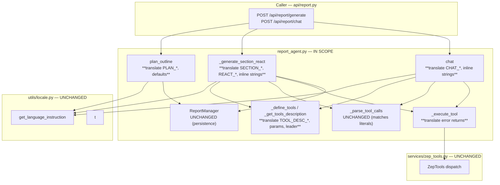

# Design Document — i18n-report-agent-prompts

## Overview

**Purpose**: Translate every Chinese string-literal that flows into the LLM message stream of `backend/app/services/report_agent.py` into English so that, under `Accept-Language: en`, the Report-Agent produces English-flavoured analytical reports and chat replies — and not the Chinese-biased output that today's Chinese-base prompts produce despite the `get_language_instruction()` English postfix.

**Users**: MiroFish operators running the 5-step pipeline under English locale; reviewers tracking the i18n epic (#11); developers maintaining sibling i18n issues (#6, #7, #8, #10) downstream of this change.

**Impact**: Behavioural — under `Accept-Language: en`, the report's section titles, section bodies, embedded quotations, and chat replies become English-flavoured. No public-API change. No `Report.to_dict()` shape change. No new dependencies.

### Goals

- Replace every Chinese string-literal in `report_agent.py` that is sent to the LLM (system prompt, user prompt, ReACT loop messages, tool descriptions, `_define_tools` parameter hints, `_execute_tool` error returns, `plan_outline` defaults) with English equivalents.
- Preserve every variable interpolation, every JSON schema key, every literal trigger string (`Final Answer:`, `<tool_call>`, tool-name strings), every `get_language_instruction()` call site.
- Keep the public surface of `ReportAgent`, `ReportManager`, `Report`, `ReportOutline`, `ReportSection`, `ReportStatus` byte-for-byte equivalent in shape.

### Non-Goals

- Logger calls (`logger.info`, `logger.warning`, `logger.error`, `logger.debug`) inside the same file — owned by issue #6. Notably, the single raw-Chinese `logger.debug(f"LLM响应: ...")` at line 1322 is left untouched.
- Module docstring (lines 1–11), class docstrings, dataclass docstrings, method docstrings, inline `#` comments — owned by issue #7.
- Refactoring prompt structure, the JSON output schema of `PLAN_SYSTEM_PROMPT`, the ReACT loop control flow, conflict-resolution branches, or the chat tool-budget caps.
- Externalizing prompts into `/locales/*.json`.
- Live end-to-end report generation under both `en` and `zh` (deferred to fixture-based static checks; reviewer trust on quality parity, matching the precedent of issues #2/#3/#4).

## Boundary Commitments

### This Spec Owns

- The string-literal **content** of all LLM-facing regions in `backend/app/services/report_agent.py`:
  - Tool description constants `TOOL_DESC_INSIGHT_FORGE` (476–492), `TOOL_DESC_PANORAMA_SEARCH` (494–509), `TOOL_DESC_QUICK_SEARCH` (511–521), `TOOL_DESC_INTERVIEW_AGENTS` (523–548).
  - PLAN-phase prompts `PLAN_SYSTEM_PROMPT` (552–589), `PLAN_USER_PROMPT_TEMPLATE` (591–611).
  - EXEC-phase prompts `SECTION_SYSTEM_PROMPT_TEMPLATE` (615–767), `SECTION_USER_PROMPT_TEMPLATE` (769–792), including the embedded "Correct Example" / "Wrong Example" code blocks.
  - ReACT loop conversation templates `REACT_OBSERVATION_TEMPLATE` (796–806), `REACT_INSUFFICIENT_TOOLS_MSG` (808–811), `REACT_INSUFFICIENT_TOOLS_MSG_ALT` (813–816), `REACT_TOOL_LIMIT_MSG` (818–821), `REACT_UNUSED_TOOLS_HINT` (823), `REACT_FORCE_FINAL_MSG` (825).
  - CHAT-phase prompts `CHAT_SYSTEM_PROMPT_TEMPLATE` (829–855), `CHAT_OBSERVATION_SUFFIX` (857).
  - The `_define_tools` parameter-description dict values (925–952) and the `_get_tools_description` leader `"可用工具："` (1129).
  - The `_execute_tool` error returns at lines 1058 and 1062.
  - The inline LLM-visible strings inside `_generate_section_react`: `report_context` f-string (1294), empty-response retry (1316–1317), conflict-handling block (1342–1346), inline `unused_hint` literals (1380, 1476).
  - The inline LLM-visible strings inside `chat`: report-truncated marker (1799), no-report fallback (1805), observation joiner (1861).
  - The default / fallback outline content in `plan_outline`: success-path default title (1197), exception-path fallback `ReportOutline` (1212–1218).
- The `unused_tools_str` join separator at line 1454 — switch from `"、"` to `", "` for natural English rendering inside the now-English ReACT templates.

### Out of Boundary

- All `logger.*` calls in this file (issue #6), including the one raw-Chinese `logger.debug` at line 1322.
- All `"""..."""` docstrings and `#` comments in this file (issue #7).
- `backend/app/utils/locale.py`, `/locales/*.json`, `/locales/languages.json`.
- `backend/app/services/zep_tools.py`, `zep_entity_reader.py`, `zep_graph_memory_updater.py`.
- `backend/app/api/report.py`, `backend/app/api/simulation.py`, `backend/app/api/graph.py`.
- `backend/app/services/simulation_runner.py`, `simulation_ipc.py`, OASIS subprocess source.
- `backend/app/config.py` constants.
- `backend/pyproject.toml`, `backend/uv.lock`.
- All other files in the repository.

### Allowed Dependencies

- Read access to `get_language_instruction()` from `backend/app/utils/locale.py` — three call sites preserved verbatim (lines 1166, 1262, 1808).
- Read access to `t(...)` from `backend/app/utils/locale.py` — call sites preserved verbatim.
- No new external dependencies.

### Revalidation Triggers

- A change to the `Report.to_dict()` payload shape would force the report API blueprint and the frontend report panel to re-validate. **This spec does not change the shape.**
- A change to the `PLAN_SYSTEM_PROMPT` JSON output schema (`title`, `summary`, `sections[].title`, `sections[].description`) would force `plan_outline()`'s response parser to re-validate. **This spec preserves the schema verbatim.**
- A change to the `Final Answer:` literal trigger or the `<tool_call>...</tool_call>` XML tag would force `_generate_section_react`'s parser branches to re-validate. **This spec preserves both byte-for-byte.**
- A change to the four primary tool names (`insight_forge`, `panorama_search`, `quick_search`, `interview_agents`) or the legacy aliases (`search_graph`, `get_graph_statistics`, `get_entity_summary`, `get_simulation_context`, `get_entities_by_type`) would force `_execute_tool` and `_is_valid_tool_call` to re-validate. **This spec does not rename tools.**

## Architecture

### Existing Architecture Analysis

`ReportAgent` is a single Python class in `backend/app/services/report_agent.py`. The three LLM invocation paths (PLAN, SECTION, CHAT) follow a uniform pattern:

```
system_prompt = <chinese system prompt template>
system_prompt = f"{system_prompt}\n\n{get_language_instruction()}"
user_prompt = <chinese user prompt template with {interpolations}>
response = self.llm.chat(messages=[
    {"role": "system", "content": system_prompt},
    {"role": "user", "content": user_prompt}
])
```

`_generate_section_react` extends this with a multi-turn ReACT loop where the user-role messages re-injected after each tool call (`REACT_OBSERVATION_TEMPLATE`, etc.) are also Chinese today. There is no abstraction layer between prompt construction and LLM invocation — the prompt text and the call site are colocated. This matches sister modules (`simulation_config_generator.py`, `oasis_profile_generator.py`, `ontology_generator.py`).

### Architecture Pattern & Boundary Map

**Selected pattern**: In-place string-literal translation. No new components, no new modules, no new abstractions.



**Architecture Integration**:
- Selected pattern: in-place string-literal translation; matches the precedent of issues #2/#3/#4.
- Domain/feature boundaries: prompt-content is the only boundary that moves. Logger / docstring / comment boundaries (issues #6, #7) and persistence-layer boundary (`ReportManager`) are explicitly preserved.
- Existing patterns preserved: `get_language_instruction()` postfix injection at three call sites; `<tool_call>` XML protocol; `Final Answer:` literal trigger; tool-name registry; JSON output schema for outline planning.
- New components rationale: none — no new components.
- Steering compliance: respects `tech.md` "preserve both styles working" for comments/docstrings (those are out of scope); respects `structure.md` per-project file isolation; respects `commits.md` Conventional Commits format for the eventual commit message.

### Technology Stack

| Layer | Choice / Version | Role in Feature | Notes |
|-------|------------------|-----------------|-------|
| Frontend / CLI | n/a | Frontend renders the translated `Report` payload as plain text/Markdown | No frontend change required |
| Backend / Services | Python 3.11, Flask 3.0 | Hosts `ReportAgent` and the report API | Single-file edit |
| Data / Storage | Neo4j + Graphiti | Source of retrieval results consumed by `zep_tools` | Unchanged |
| Messaging / Events | n/a | Report generation runs as a background `Task` | Unchanged |
| Infrastructure / Runtime | uv-managed venv | Backend dependency manager | No new dependencies |

> No new external dependencies, libraries, or infrastructure components are introduced. Detailed locale-resolution mechanics are documented in `research.md`.

## File Structure Plan

### Modified Files

- `backend/app/services/report_agent.py` — translate every Chinese string-literal that is sent to the LLM, plus the one separator literal at line 1454. No structural code changes; no new methods; no new constants. Line counts will shift due to the typically larger English character count, but the file's overall organization is unchanged.

### Unmodified Files (explicitly verified)

- `backend/app/utils/locale.py`
- `backend/app/services/zep_tools.py`, `zep_entity_reader.py`, `zep_graph_memory_updater.py`
- `backend/app/api/report.py`, `simulation.py`, `graph.py`
- `backend/app/services/simulation_runner.py`, `simulation_ipc.py`
- `backend/app/config.py`
- `backend/pyproject.toml`, `backend/uv.lock`
- `/locales/en.json`, `/locales/zh.json`, `/locales/languages.json`
- All frontend files

## System Flows

The PLAN / SECTION / CHAT flows are unchanged at the control-flow level — only the string content of system / user / observation messages is translated. No new diagram is required; `research.md` records the relevant parser-trigger details.

## Requirements Traceability

| Requirement | Summary | Components | Interfaces | Flows |
|-------------|---------|------------|------------|-------|
| 1.1, 1.2, 1.3, 1.4, 1.5, 1.6, 1.7 | Translate `PLAN_SYSTEM_PROMPT` and `PLAN_USER_PROMPT_TEMPLATE`; preserve schema, count limits, interpolations, postfix call site | `PLAN_SYSTEM_PROMPT` (552), `PLAN_USER_PROMPT_TEMPLATE` (591), `plan_outline` (1137) | `plan_outline()` LLM `chat_json` invocation at line 1177 | PLAN flow |
| 2.1–2.9 | Translate `SECTION_SYSTEM_PROMPT_TEMPLATE` (incl. examples) and `SECTION_USER_PROMPT_TEMPLATE`; preserve `Final Answer:` / `<tool_call>` literals; preserve no-headings instruction | `SECTION_SYSTEM_PROMPT_TEMPLATE` (615), `SECTION_USER_PROMPT_TEMPLATE` (769), `_generate_section_react` (1221) | `_generate_section_react()` LLM `chat` invocation at line 1305 | SECTION ReACT flow |
| 3.1–3.7 | Translate `CHAT_SYSTEM_PROMPT_TEMPLATE` and `CHAT_OBSERVATION_SUFFIX`; preserve `<tool_call>` literal and prefix-injection contract | `CHAT_SYSTEM_PROMPT_TEMPLATE` (829), `CHAT_OBSERVATION_SUFFIX` (857), `chat` (1766) | `chat()` LLM `chat` invocations at lines 1828, 1868 | CHAT flow |
| 4.1–4.6 | Translate ReACT loop conversation templates; preserve `Final Answer:` literal; switch separator to `", "` | `REACT_*` constants (796–825) | `_generate_section_react()` ReACT loop branches | SECTION ReACT flow |
| 5.1–5.7 | Translate four `TOOL_DESC_*` blocks, `_define_tools` parameter dict values, `_get_tools_description` leader; preserve tool names | `TOOL_DESC_*` (476–548), `_define_tools` (919), `_get_tools_description` (1127) | `_define_tools()` and `_get_tools_description()` return values | SECTION + CHAT flows |
| 6.1–6.7 | Translate inline LLM-visible strings in `_generate_section_react` and `chat` | Inline strings at 1294, 1316–1317, 1342–1346, 1380, 1476, 1799, 1805, 1861 | Direct `messages.append(...)` calls | SECTION + CHAT flows |
| 7.1–7.3 | Translate `_execute_tool` error returns | f-strings at 1058, 1062 | `_execute_tool()` return value | SECTION + CHAT flows (error path) |
| 8.1–8.4 | Translate `plan_outline` defaults; preserve `ReportOutline` shape | `plan_outline` defaults at 1197, 1212–1218 | `plan_outline()` return value | PLAN flow (default + fallback paths) |
| 9.1–9.5 | Locale switching continues to work | `get_language_instruction()` call sites at 1166, 1262, 1808 | unchanged | All flows |
| 10.1–10.5 | Public API stable | `ReportAgent`, `ReportManager`, `Report`, `ReportOutline`, `ReportSection`, `ReportStatus` | unchanged | All flows |
| 11.1–11.5 | End-to-end Step 4 / Step 5 parity | Verification only | unchanged | All flows |
| 12.1–12.6 | Out-of-scope guardrail | None edited | unchanged | n/a |

## Components and Interfaces

| Component | Domain/Layer | Intent | Req Coverage | Key Dependencies (P0/P1) | Contracts |
|-----------|--------------|--------|--------------|--------------------------|-----------|
| Tool description constants | Module-scope constants in `report_agent.py` | LLM-facing tool catalog injected into SECTION + CHAT system prompts via `_get_tools_description` | 5.1, 5.2, 5.7 | `_define_tools` (P0), `_get_tools_description` (P0) | State (string literals only) |
| `PLAN_*` prompts | Module-scope constants | Outline planning system + user prompts | 1.1, 1.2, 1.5, 1.6 | `get_language_instruction` (P0), `plan_outline` (P0) | State |
| `SECTION_*` prompts | Module-scope constants | Section ReACT system + user prompts | 2.1, 2.2, 2.3, 2.4, 2.6, 2.7 | `get_language_instruction` (P0), `_generate_section_react` (P0), `_get_tools_description` (P1) | State |
| `REACT_*` templates | Module-scope constants | ReACT loop user-role messages re-injected after tool calls | 4.1, 4.2, 4.3, 4.4, 4.5 | `_generate_section_react` (P0) | State |
| `CHAT_*` prompts | Module-scope constants | Chat system prompt + observation suffix | 3.1, 3.2, 3.3, 3.4, 3.5, 3.6 | `get_language_instruction` (P0), `chat` (P0), `_get_tools_description` (P1) | State |
| `_define_tools` parameter dict | `ReportAgent` instance method | Catalog of tools + parameter hints, exposed to LLM via `_get_tools_description` | 5.3, 5.4, 5.6 | `_get_tools_description` (P0) | Service |
| `_get_tools_description` | `ReportAgent` instance method | Renders `_define_tools` output as a single string for SECTION + CHAT prompts | 5.5 | `_define_tools` (P0) | Service |
| `_execute_tool` error returns | `ReportAgent` instance method | Returns observation strings to the LLM for unknown-tool / execution-error paths | 7.1, 7.2, 7.3 | `_execute_tool` (P0) | Service |
| `_generate_section_react` inline strings | `ReportAgent` instance method body | LLM-visible strings appended to `messages` during ReACT loop | 6.1, 6.2, 6.3, 6.4 | `_generate_section_react` (P0) | Service |
| `chat` inline strings | `ReportAgent` instance method body | LLM-visible strings appended to `messages` during chat loop | 6.5, 6.6 | `chat` (P0) | Service |
| `plan_outline` defaults | `ReportAgent` instance method body | Default / fallback `ReportOutline` content emitted on success-without-title or exception path | 8.1, 8.2, 8.3, 8.4 | `plan_outline` (P0) | State |

> All components are existing module-scope constants or method-internal expressions. None require a full detail block — the responsibility boundary is "translate the string content; preserve the structural shape". The summary table above plus the requirement-level acceptance criteria in `requirements.md` form a complete contract.

### Implementation Notes (cross-cutting)

- **Translation glossary** (consistent across all components — see `research.md` Decision: Standard English phrasing): 上帝视角 → "god's-eye view"; 未来预演 → "forecast simulation" / "simulated future"; 模拟需求 → "simulation requirement"; 模拟世界 → "simulated world"; 章节 → "section"; 大纲 → "outline"; 引用 → "quote"/"quotation"; 正确示例 → "Correct Example"; 错误示例 → "Wrong Example"; 注意 → "Note"; 重要 → "IMPORTANT"; 工具 → "tool"; 检索 → "retrieval".
- **Literal preservation**: `Final Answer:`, `<tool_call>`, `</tool_call>`, all tool names (`insight_forge`, `panorama_search`, `quick_search`, `interview_agents`, plus legacy aliases), all `{interpolation}` tokens, all JSON schema keys, all emoji / box-drawing characters (`💡`, `═`).
- **Locale-agnostic strings**: `_execute_tool` error returns and `plan_outline` default / fallback outline content are returned regardless of locale (no `get_language_instruction()` injection at those sites). They become locale-agnostic English under this PR.
- **Separator change**: `unused_tools_str = "、".join(unused_tools)` at line 1454 → `", ".join(unused_tools)`. This is the only non-string-literal code change.

## Data Models

No data-model changes. `Report`, `ReportOutline`, `ReportSection`, `ReportStatus`, `Task`, and the report API JSON contract are all preserved verbatim. `Report.to_dict()` and `ReportOutline.to_dict()` shapes are unchanged. The persistence schema under `reports/<id>/` (`meta.json`, `outline.json`, `progress.json`, `section_NN.md`, `full_report.md`, `agent_log.jsonl`, `console_log.txt`) is unchanged.

## Error Handling

### Error Strategy

No new error types or recovery strategies. The translated `_execute_tool` error returns and `plan_outline` exception-path fallback continue to behave identically — the only change is the string content.

### Error Categories and Responses

- **Unknown-tool error**: `_execute_tool` returns a translated English string `"Unknown tool: {tool_name}. Please use one of: insight_forge, panorama_search, quick_search"`. The string is fed back to the LLM as the next user-role observation.
- **Tool-execution exception**: `_execute_tool` returns a translated English string `"Tool execution failed: {str(e)}"`. Same flow.
- **`plan_outline` LLM exception**: returns the translated English fallback `ReportOutline` (3 sections). Downstream report assembly proceeds normally.
- **Empty-response retry / conflict-handling / insufficient-tools**: translated English messages re-injected into the LLM message stream (R6, R4 acceptance criteria). Loop control flow unchanged.

## Testing Strategy

### Default sections (adapted to translation work)

- **Static lint**: `python -m py_compile backend/app/services/report_agent.py` — must pass.
- **Zero-Chinese assertion** (in-scope regions): a verification harness (a small ad-hoc script under `scripts/` if needed, deleted before PR) imports `report_agent` and runs `re.findall(r'[一-鿿]', literal)` over each in-scope constant, expecting an empty list. The single permitted Chinese remnant is the `logger.debug` f-string at line 1322 (not in scope).
- **Interpolation-shape parity**: invoke `PLAN_USER_PROMPT_TEMPLATE.format(simulation_requirement="x", total_nodes=0, total_edges=0, entity_types=[], total_entities=0, related_facts_json="[]")`, `SECTION_SYSTEM_PROMPT_TEMPLATE.format(report_title="x", report_summary="y", simulation_requirement="z", section_title="t", tools_description="d")`, `SECTION_USER_PROMPT_TEMPLATE.format(previous_content="x", section_title="t")`, `CHAT_SYSTEM_PROMPT_TEMPLATE.format(simulation_requirement="x", report_content="r", tools_description="d")`, `REACT_OBSERVATION_TEMPLATE.format(tool_name="x", result="y", tool_calls_count=1, max_tool_calls=5, used_tools_str="a, b", unused_hint="z")`, etc. — each must render without raising `KeyError`.
- **Trigger-literal preservation**: assert that `"Final Answer:"` is a substring of the translated `SECTION_SYSTEM_PROMPT_TEMPLATE`, `SECTION_USER_PROMPT_TEMPLATE`, `REACT_OBSERVATION_TEMPLATE`, `REACT_TOOL_LIMIT_MSG`, and `REACT_FORCE_FINAL_MSG`; assert that `"<tool_call>"` is a substring of the translated `SECTION_SYSTEM_PROMPT_TEMPLATE` and `CHAT_SYSTEM_PROMPT_TEMPLATE`.
- **Tool-name preservation**: assert that all four primary tool names appear unchanged in the translated `_define_tools` keys and in the translated `TOOL_DESC_*` blocks.
- **End-to-end (deferred)**: per the precedent of issues #2/#3/#4, full pipeline runs under `Accept-Language: en` and `Accept-Language: zh` are not part of CI for this PR. Reviewer trust applies. If feasible in the implementer's local environment, a single sample run under `en` to confirm no Markdown headings leak into section bodies and a single sample run under `zh` to confirm Chinese output quality is preserved — both optional confidence boosters, not gates.

## Security Considerations

No new security surface. Translated prompts do not expose new endpoints, do not add new external calls, and do not change authorization semantics. The `_execute_tool` error returns continue to expose `str(e)` from any caught exception — pre-existing behavior, unchanged by this PR.

## Performance & Scalability

No performance regression expected. English prompts may be ~10–30% longer in token count than the equivalent Chinese (English requires more tokens for the same semantic content), but this is well within the 4096 `max_tokens` ceiling on the section LLM call and the model's overall context budget. No caching, no batching, no concurrency change.

## Migration Strategy

No data or schema migration. The change is a single in-place edit. Rollback strategy: revert the single commit on `feat/i18n-5-translate-report-agent-prompts` if a regression is detected.

## Supporting References

- Detailed discovery, alternatives evaluation, decision rationale, and risk register: `.kiro/specs/i18n-report-agent-prompts/research.md`.
- Sibling spec (i18n-simulation-config-generator-prompts): `.kiro/specs/i18n-simulation-config-generator-prompts/{requirements,design,gap-analysis,research}.md`.
- Sibling commits: `0806832` (#2), `9d1d29b` (#3), `6c2a412` (#4).
- Ticket snapshot: `.ticket/5.md`.
