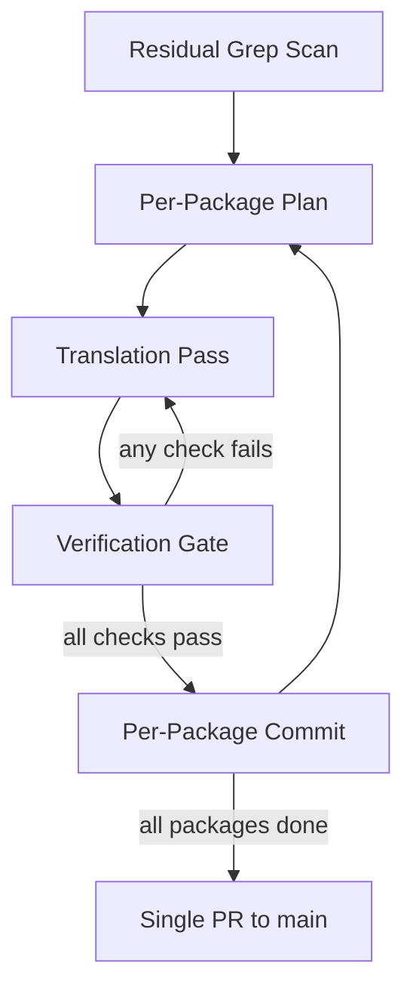
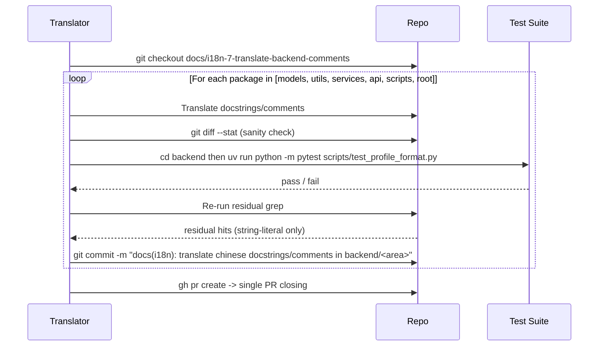

# Design Document — `i18n-translate-backend-comments`

## Overview
**Purpose**: Translate Chinese-language docstrings and `#` comments across `backend/` Python files into English, so that English-speaking maintainers can read and review the codebase without translation overhead.

**Users**: Backend maintainers and code reviewers who do not read Chinese.

**Impact**: Improves developer ergonomics and review throughput. No runtime, behavior, or interface change. Adjacent i18n tickets (#2/#3/#4/#5/#6), which own the string-literal Chinese, remain unaffected.

### Goals
- Eliminate Chinese characters from docstrings and `#` comments under the in-scope paths.
- Preserve Google-style docstring shape and project formatting rules (4-space indent, ≤120 chars/line, double-quoted strings).
- Keep the diff comments-and-docstrings-only — no executable, string-literal, or symbol changes.

### Non-Goals
- Translating Chinese inside string literals (prompt templates, `logger.{info,warning,error}` arguments, API responses, error messages). These are owned by issues #2/#3/#4/#5/#6.
- Refactoring code, reformatting style, or renaming symbols.
- Introducing new tooling, linters, or CI rules.
- Translating `backend/tests/test_locale*.py` (Chinese there is intentional test data inside string literals; outside ticket scope).

## Boundary Commitments

### This Spec Owns
- Comment and docstring text under: `backend/app/__init__.py`, `backend/app/config.py`, `backend/app/api/`, `backend/app/models/`, `backend/app/services/`, `backend/app/utils/`, `backend/run.py`, `backend/scripts/`.
- The decision rule for distinguishing docstrings from value strings (first-statement rule).
- The Chinese→English Google-style docstring key map.
- The verification workflow (residual `grep`, `pytest`, diff sanity check).

### Out of Boundary
- All string-literal content, including triple-quoted strings used as values.
- Files under `backend/tests/`, `backend/.venv/`, and any non-Python file.
- Refactors, renames, formatting changes, or new dependencies.
- Front-end localization, locale JSON files, or i18n runtime behavior.

### Allowed Dependencies
- The repository's Python source (read + write for in-scope files only).
- The existing test suite (`backend/scripts/test_profile_format.py`) for verification.
- The existing `grep`-based residual scan for verification.

### Revalidation Triggers
- A new in-scope file added under the listed paths (would expand the file list).
- A change to `dev-guidelines.md` regarding docstring style (would change the key map or quote/indent rule).
- A merge of any adjacent i18n ticket (#2/#3/#4/#5/#6) that turns a string literal into a docstring or vice versa.

## Architecture

### Existing Architecture Analysis
This change touches only commentary; no architectural element of the backend is modified. The work spans the following packages:

- `backend/app/__init__.py`, `backend/app/config.py` (Flask app and configuration entrypoint).
- `backend/app/api/` (Flask blueprints).
- `backend/app/models/` (`Project`, `Task` models).
- `backend/app/services/` (graph builder, simulation runner, report agent, etc.).
- `backend/app/utils/` (LLM client, file parser, retry, logger, locale, paging).
- `backend/run.py` (process entrypoint).
- `backend/scripts/` (simulation runners, profile-format test).

### Architecture Pattern & Boundary Map



**Architecture Integration**:
- Selected pattern: **Iterative pass per package** with a verification gate after each pass. Linear, deterministic, low-coordination.
- Domain/feature boundaries: One pass per backend package; commits are package-scoped to keep review chunks small.
- Existing patterns preserved: 4-space indent, double-quoted strings, Google-style docstrings, `snake_case`, project file layout.
- New components rationale: None — no new code, no new files.
- Steering compliance: Conforms to repo-level coding rules and the commits ruleset.

### Technology Stack

| Layer | Choice / Version | Role in Feature | Notes |
|-------|------------------|-----------------|-------|
| Backend / Services | Python ≥3.11 | Source language whose docstrings/comments are being translated | No version change; no dependency change |
| Tooling | `git`, `grep`, `pytest` (existing) | Discovery, verification, regression check | No new tools |

No frontend, data, messaging, or infrastructure layer is touched.

## File Structure Plan

### Directory Structure (no additions, no deletions)
```
backend/
├── app/
│   ├── __init__.py            # docstrings/comments only
│   ├── config.py              # docstrings/comments only
│   ├── api/                   # all *.py: docstrings/comments only
│   ├── models/                # all *.py: docstrings/comments only
│   ├── services/              # all *.py: docstrings/comments only
│   └── utils/                 # all *.py: docstrings/comments only
├── run.py                     # docstrings/comments only
└── scripts/                   # all *.py: docstrings/comments only
```

### Modified Files
The 37 in-scope files identified in `gap-analysis.md` are modified — comment and docstring lines only. No other paths are touched.

## Translation Rules

These rules drive the translation pass and the verification gate. They are normative; the implementation must follow them exactly.

### Rule 1 — Docstring vs Value String Disambiguation
A triple-quoted string is treated as a **docstring** (in scope) iff it is the first statement of a module, class, or function body. All other triple-quoted strings are **values** (out of scope) and must not be modified.

### Rule 2 — Translate Docstrings to English Google-style
- Translate Chinese narrative text to faithful English.
- Convert the following Chinese section keys to canonical English Google-style keys when present:

| Chinese key | English key |
| --- | --- |
| `参数:` | `Args:` |
| `返回:` | `Returns:` |
| `异常:` | `Raises:` |
| `产生:` / `生成:` | `Yields:` |
| `示例:` | `Examples:` |
| `注意:` / `备注:` | `Note:` |

- Preserve double-quoted triple-quoted form (`"""..."""`).
- Preserve indentation matching the surrounding scope.

### Rule 3 — Translate Inline `#` Comments to English
- Translate the comment text to English.
- If the translated comment would merely restate the immediately following executable line (a redundant verb-phrase paraphrase), delete the comment.
- Preserve `TODO:` / `FIXME:` markers and any embedded ticket reference verbatim.
- Preserve trailing in-line comments on the same line as code (e.g. `PENDING = "pending"  # waiting`).

### Rule 4 — Style Compliance
- Keep every translated line ≤120 characters.
- Do not introduce trailing whitespace.
- Preserve the original indentation of each comment/docstring.
- Use double quotes for any docstring rewritten.

### Rule 5 — Preservation
- Do not modify any executable Python statement.
- Do not modify any string literal (single-, double-, triple-quoted, f-string, raw, byte) that is not a docstring under Rule 1. The single exception is the docstring being rewritten under Rule 2: quote-style normalization to triple double-quoted form (`"""..."""`) is permitted on the docstring only, since it is the artifact under translation.
- Do not rename any symbol.

## System Flows

### Per-package iteration



## Requirements Traceability

| Requirement | Summary | Components | Interfaces | Flows |
|-------------|---------|------------|------------|-------|
| 1.1 | No Chinese in docstrings under in-scope paths | Translation Pass | Rule 1, Rule 2 | Per-package iteration |
| 1.2 | No Chinese in `#` comments under in-scope paths | Translation Pass | Rule 3 | Per-package iteration |
| 1.3 | Residual grep returns only string-literal Chinese | Verification Gate | Residual grep workflow | Per-package iteration |
| 1.4 | Google-style docstring shape preserved | Translation Pass | Rule 2 (key map) | — |
| 2.1 | No executable statement modified | Verification Gate | Rule 5 | Per-package iteration |
| 2.2 | No string literal modified | Verification Gate | Rule 1 (first-statement rule), Rule 5 | Per-package iteration |
| 2.3 | No symbol renamed | Verification Gate | Rule 5 | Per-package iteration |
| 2.4 | `pytest` passes | Verification Gate | Test suite invocation | Per-package iteration |
| 2.5 | Hunks touching code rejected | Verification Gate | `git diff --stat` review | Per-package iteration |
| 3.1 | Drop redundant comments | Translation Pass | Rule 3 | — |
| 3.2 | Translate the *why* faithfully | Translation Pass | Rule 3 | — |
| 3.3 | Preserve `TODO:`/`FIXME:` and ticket refs | Translation Pass | Rule 3 | — |
| 3.4 | No new comments introduced | Translation Pass | Rule 3 | — |
| 4.1 | ≤120 chars/line | Verification Gate | Rule 4 | — |
| 4.2 | No trailing whitespace | Verification Gate | Rule 4 | — |
| 4.3 | Preserve indentation | Translation Pass | Rule 4 | — |
| 4.4 | Double quotes on rewritten docstrings | Translation Pass | Rule 4 | — |
| 4.5 | Preserve 4-space indentation | Translation Pass | Rule 4 | — |
| 5.1 | Use grep for discovery | Verification Gate | Discovery scan | — |
| 5.2 | Re-run grep after each batch | Verification Gate | Residual grep workflow | Per-package iteration |
| 5.3 | Continue until non-string-literal residual cleared | Verification Gate | Rule 1 disambiguation | Per-package iteration |
| 5.4 | `git diff --stat` only in-scope paths | Verification Gate | Diff sanity check | Per-package iteration |
| 6.1 | Branch `docs/i18n-7-translate-backend-comments` | Tracking & Branching | `/done` skill | — |
| 6.2 | Reference issue #7 | Tracking & Branching | Commit/PR template | — |
| 6.3 | Conventional Commits `docs(i18n)` | Tracking & Branching | `.claude/rules/commits.md` | — |
| 6.4 | No unrelated changes | Verification Gate | Diff sanity check | — |

## Components and Interfaces

| Component | Domain/Layer | Intent | Req Coverage | Key Dependencies (P0/P1) | Contracts |
|-----------|--------------|--------|--------------|--------------------------|-----------|
| Translation Pass | Process | Apply Rules 1–5 to one package's `*.py` | 1.1, 1.2, 1.4, 3.1, 3.2, 3.3, 3.4, 4.3, 4.4, 4.5 | None (manual + AI-assisted) | Process |
| Verification Gate | Process | Run residual grep, `pytest`, and diff sanity check after each package | 1.3, 2.1, 2.2, 2.3, 2.4, 2.5, 4.1, 4.2, 5.1, 5.2, 5.3, 5.4, 6.4 | `git`, `grep`, `pytest` (P0) | Process |
| Tracking & Branching | Process | Branching, commit messages, PR | 6.1, 6.2, 6.3 | `/done` skill, `gh` CLI (P0) | Process |

### Process

#### Translation Pass
| Field | Detail |
|-------|--------|
| Intent | Translate docstrings and `#` comments in one package without touching code or string literals |
| Requirements | 1.1, 1.2, 1.4, 3.1, 3.2, 3.3, 3.4, 4.3, 4.4, 4.5 |

**Responsibilities & Constraints**
- Apply Rule 1 (first-statement disambiguation) before editing any triple-quoted string.
- Apply Rule 2 (key map) for any Chinese Google-style key encountered.
- Apply Rule 3 to inline comments; delete redundant ones.
- Operate on one package at a time; do not interleave packages.

**Dependencies**
- Inbound: Verification Gate (provides feedback if a previous batch failed).
- Outbound: Verification Gate (hands off post-pass).
- External: None.

**Contracts**: Process [x] / Service [ ] / API [ ] / Event [ ] / Batch [ ] / State [ ]

**Implementation Notes**
- Integration: Operates directly on the working tree on branch `docs/i18n-7-translate-backend-comments`.
- Validation: After each file is rewritten, sanity-check that the diff for that file shows changes only on comment/docstring lines.
- Risks: Accidental edit to a string-literal triple-quoted value — mitigated by Rule 1 + diff review.

#### Verification Gate
| Field | Detail |
|-------|--------|
| Intent | Confirm a package's translation pass left runtime behavior intact |
| Requirements | 1.3, 2.1, 2.2, 2.3, 2.4, 2.5, 4.1, 4.2, 5.1, 5.2, 5.3, 5.4, 6.4 |

**Responsibilities & Constraints**
- Re-run `grep -rln '[一-鿿]' backend/ --include='*.py'` after each package and confirm residual hits are limited to string-literal Chinese owned by adjacent tickets.
- Run `uv run python -m pytest backend/scripts/test_profile_format.py` and confirm exit 0.
- Run `git diff --stat` and confirm only in-scope file paths are listed.
- Spot-check a sample of changed files to confirm only comment/docstring lines changed.

**Dependencies**
- Inbound: Translation Pass.
- Outbound: Tracking & Branching (commits) when all checks pass; loops back to Translation Pass otherwise.
- External: `git`, `grep`, `pytest` (P0 — required for verification).

**Contracts**: Process [x] / Service [ ] / API [ ] / Event [ ] / Batch [ ] / State [ ]

**Implementation Notes**
- Integration: Run from the repo root; no environment variables required beyond what `uv run` already provides.
- Validation: All four checks (grep / pytest / diff scope / spot diff) must pass before committing.
- Risks: A flaky `pytest` run unrelated to this change would block progress — mitigated by reading the failure and re-running once.

#### Tracking & Branching
| Field | Detail |
|-------|--------|
| Intent | Branch, commit, push, and open PR per project conventions |
| Requirements | 6.1, 6.2, 6.3 |

**Responsibilities & Constraints**
- Branch name: `docs/i18n-7-translate-backend-comments`.
- Commit messages follow Conventional Commits with `docs(i18n)` scope (e.g. `docs(i18n): translate chinese docstrings/comments in backend/services`).
- PR closes #7 and references the spec.

**Dependencies**
- Inbound: Verification Gate (only commits when all checks pass).
- External: `gh` CLI (P0), `/done` skill (P0).

**Contracts**: Process [x] / Service [ ] / API [ ] / Event [ ] / Batch [ ] / State [ ]

**Implementation Notes**
- Integration: Use `/done` skill at the end to handle branch/push/PR uniformly.
- Validation: Confirm PR body references issue #7 with `Closes #7` and lists each commit.
- Risks: None.

## Error Handling

### Error Strategy
This is a build-time / source-edit task — there is no runtime error path. Errors are caught by the Verification Gate.

### Error Categories and Responses
- **Translation slipped into a string literal**: caught by `git diff --stat` + spot diff. Response: revert that hunk, re-apply translation against the docstring/comment only.
- **Test suite fails after a pass**: caught by `pytest`. Response: read failure, identify which line was incorrectly modified (likely a string the translator misclassified as a docstring), revert that hunk, re-apply.
- **Residual grep returns non-string-literal Chinese**: caught by post-pass grep. Response: classify those hits as in-scope and translate them in the next sub-pass.
- **Line exceeds 120 chars after translation**: caught by spot diff. Response: reflow the comment/docstring without changing executable code.

### Monitoring
None — this is a one-shot change. No production observability required.

## Testing Strategy

The repository's existing tests are the safety net. No new tests are added.

### Default sections
- **Unit Tests**: Not applicable; nothing executable changes.
- **Integration Tests**: `uv run python -m pytest backend/scripts/test_profile_format.py` must continue to pass after each commit.
- **E2E/UI Tests**: Not applicable.
- **Verification checks (per package commit)**:
  1. Residual `grep -rln '[一-鿿]' backend/ --include='*.py'` (run from repo root) returns only files whose remaining Chinese is in string literals owned by adjacent tickets.
  2. `cd backend && uv run python -m pytest scripts/test_profile_format.py` exits 0.
  3. `git diff --stat HEAD~..HEAD` shows only in-scope file paths.
  4. Spot diff on three random changed files confirms only comment/docstring lines changed.

## Supporting References (Optional)
- `gap-analysis.md` — full file enumeration and pattern survey.
- `research.md` — discovery log, alternatives, and decisions.
