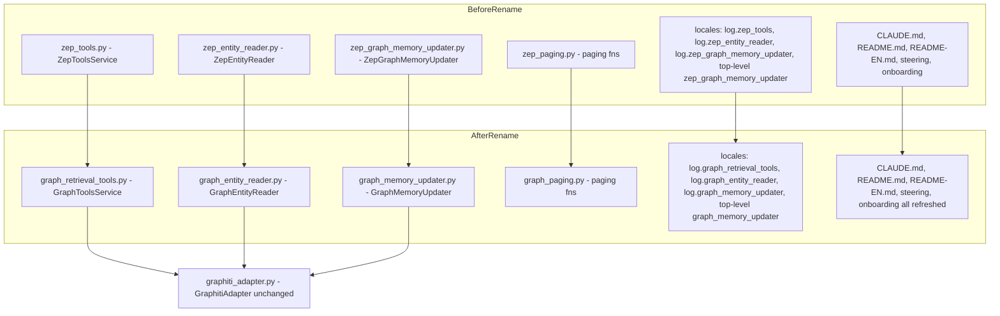
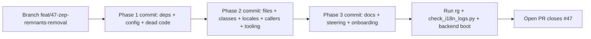

# Design Document — zep-remnants-removal

## Overview

**Purpose**: Eliminate every Zep Cloud reference from the MiroFish codebase without altering runtime behaviour. The four `zep_*` Python modules become `graph_*`, the four `Zep*` classes become `Graph*`, ~135 locale keys are renamed in lock-step across `en.json` / `zh.json` and every caller, the `zep-cloud` dependency pin and `ZEP_API_KEY` config slot are deleted, and steering / README documentation stops describing Zep as part of the current stack.

**Users**: developers and reviewers reading the codebase, plus operators reading log output. Both groups currently see "Zep" naming that no longer reflects what the code does.

**Impact**: file paths, class names, locale keys, and message text change. Functional behaviour, IPC contracts, database schema, and the 5-step pipeline are unchanged. Backend boots and the simulation runs identically before and after the rename.

### Goals

- Rename 4 files, 4 classes, ~135 locale keys, and 1 internal helper to remove all "Zep" references from source code.
- Update ~15 import call sites and 2 tooling/comment-reference files to point at the new paths.
- Drop the unused `zep-cloud==3.13.0` pin and the unread `ZEP_API_KEY` config slot.
- Delete dead method `generate_python_code()` in `ontology_generator.py`.
- Refresh `CLAUDE.md`, `README.md`, `README-EN.md`, `.kiro/steering/*.md`, and `.claude/onboarding/*` so they reflect the post-rename state.
- After implementation, `rg -ni 'zep' .` (with the documented exclusion globs) returns zero hits.

### Non-Goals

- No functional change to graph retrieval, memory updates, or simulation behaviour.
- No edits to `README-ZH.md` (Chinese localisation content is out of scope).
- No restructure of the `log.graph_retrieval_tools.*` message identifiers (only the namespace prefix changes; `m001`–`m051` stay).
- No backwards-compat shims or re-export modules.
- No coordination work for issue #46; #47 must merge first, then #46 adopts the new namespace directly.

## Boundary Commitments

### This Spec Owns

- File renames in `backend/app/services/` and `backend/app/utils/` matching the table in §Architecture below.
- Class renames in the renamed modules and every importer.
- Locale-key renames in `locales/en.json` and `locales/zh.json` (~135 keys).
- Locale message-value edits where "Zep" / "ZepToolsService" / "ZepGraphMemoryUpdater" literals appear in user-visible strings.
- Caller updates for `t('log.zep_*.…')`, `t('progress.zep…')`, `t('log.zepEntitiesFound')`, and any frontend reference to the renamed keys.
- Deletion of unused dependency / config / dead code surfaces (`zep-cloud` pin, `ZEP_API_KEY`, `generate_python_code()`).
- Documentation refresh in `CLAUDE.md`, `README.md`, `README-EN.md`, `.kiro/steering/*.md`, `.claude/onboarding/step1_codebase/*.md`.
- Update of `scripts/check_i18n_logs.py` SOURCE_FILES list to reference the renamed paths.

### Out of Boundary

- Editing `README-ZH.md`.
- Restructuring or renumbering message identifiers within renamed namespaces (e.g., `m001`).
- Adding new log messages or new locale keys.
- Modifying graph retrieval logic, simulation behaviour, or any business rule.
- Touching the Graphiti or Neo4j configuration.
- Issue #46's externalisation backlog (independent of this rename).

### Allowed Dependencies

- `GraphitiAdapter` and Neo4j-backed code paths remain the underlying implementation; the rename does not touch them.
- `i18n-locale-parity-guard` and `scripts/check_i18n_logs.py` are project-internal tooling and may be relied on for verification.
- The `vue-i18n` runtime for caller updates on the frontend.
- The `app/utils/locale.py` `t()` helper for backend caller updates.

### Revalidation Triggers

- If a new caller of any renamed locale key is added between requirements freeze and implementation, the rename pass must update it. (Detected by post-rename grep.)
- If a new `zep_*` reference is added in `.kiro/steering/` or `.claude/onboarding/` after design, Phase 3 must absorb it.
- If issue #46 partially lands before this spec, the namespace overlap must be reconciled. Sequence guard: #47 first.

## Architecture

### Existing Architecture Analysis

The four `zep_*` modules already operate against `backend/app/services/graphiti_adapter.py:GraphitiAdapter`. No Zep client class is instantiated at runtime; the audit verified zero `import zep` / `from zep` hits across Python source. The `GraphitiAdapter` itself self-describes as a "drop-in replacement" for `zep_cloud.client.Zep` and exposes a namespace identical to the historical Zep client (`graph.node.get_by_graph_id`, `graph.edge.get_by_graph_id`, etc.). This makes the rename a pure naming refactor with no API surface change.

The `services/__init__.py` package re-exports `ZepEntityReader`, `EntityNode`, `FilteredEntities`, `ZepGraphMemoryUpdater`, `ZepGraphMemoryManager`, and `AgentActivity` — the new names replace these in `__all__`.

The `i18n` subsystem stores all translatable strings in `locales/en.json` and `locales/zh.json` and routes lookups through `app/utils/locale.py:t(...)` (backend) and `vue-i18n`'s `t(...)` composable (frontend). Locale-key renames must update both stores plus every caller in lock-step or `i18n-locale-parity-guard` fails.

### Architecture Pattern & Boundary Map



**Architecture Integration**:

- **Selected pattern**: Single-PR mechanical refactor (3 commits — Phase 1 cleanup, Phase 2 renames, Phase 3 docs). Rationale in `research.md` (Architecture Pattern Evaluation, Option A).
- **Domain/feature boundaries**: each renamed file owns the same responsibilities as its predecessor. The `GraphitiAdapter` continues to mediate all Neo4j access; no boundary moves.
- **Existing patterns preserved**: `app/utils/locale.py:t(...)` for backend i18n; `vue-i18n` for frontend i18n; `Task`-tracked background work; per-project `group_id` scoping; subprocess cleanup via `SimulationRunner.register_cleanup()`.
- **New components rationale**: none — every "new" file is a rename of an existing file. No new modules, no new classes, no new locale keys.
- **Steering compliance**: maintains `tech.md`'s Neo4j+Graphiti stack note; updates `structure.md`, `tech.md`, `database.md`, `api-standards.md` to drop `zep_*` filename references; preserves the layer-based naming rule from steering.

### Technology Stack

| Layer | Choice / Version | Role in Feature | Notes |
|-------|------------------|-----------------|-------|
| Backend / Services | Python ≥3.11, Flask 3.0, managed by `uv` | Host of the renamed modules and their import sites. | No package changes beyond removing `zep-cloud==3.13.0` from `requirements.txt`. |
| Frontend / UI | Vue 3.5, `vue-i18n` | Hosts the single caller of `log.zepEntitiesFound`. | No dependency changes. |
| Locales / i18n | JSON files in `locales/{en,zh}.json` + `app/utils/locale.py` `t()` helper | Stores and resolves the renamed keys. | Parity guard (`i18n-locale-parity-guard`) checks structural equality across locales. |
| Tooling | `scripts/check_i18n_logs.py` | Enforces log-message externalisation; hard-codes file paths that need updating. | Three SOURCE_FILES entries change. |

## File Structure Plan

### Directory Structure

```
backend/
├── app/
│   ├── services/
│   │   ├── graph_retrieval_tools.py        # renamed from zep_tools.py
│   │   ├── graph_entity_reader.py          # renamed from zep_entity_reader.py
│   │   ├── graph_memory_updater.py         # renamed from zep_graph_memory_updater.py
│   │   ├── graphiti_adapter.py             # docstring updated; no rename
│   │   ├── ontology_generator.py           # generate_python_code() removed
│   │   ├── oasis_profile_generator.py      # internal symbol rename
│   │   ├── report_agent.py                 # import updates
│   │   ├── simulation_manager.py           # import updates
│   │   ├── simulation_config_generator.py  # import updates
│   │   ├── simulation_runner.py            # import updates
│   │   ├── graph_builder.py                # import updates + caller update
│   │   └── __init__.py                     # re-export list updated
│   ├── api/
│   │   ├── simulation.py                   # import updates
│   │   └── report.py                       # import updates
│   ├── utils/
│   │   └── graph_paging.py                 # renamed from zep_paging.py
│   └── config.py                           # ZEP_API_KEY line removed
├── requirements.txt                        # zep-cloud pin removed
└── pyproject.toml                          # no change (no zep entry)

frontend/
└── src/
    └── components/
        ├── Step2EnvSetup.vue               # t('log.zepEntitiesFound') → t('log.graphEntitiesFound')
        └── Step4Report.vue                 # 24 comment refs updated

locales/
├── en.json                                 # ~135 keys renamed; "Zep" value strings rewritten
└── zh.json                                 # same key renames as en.json (parity)

scripts/
└── check_i18n_logs.py                      # SOURCE_FILES entries updated (lines 41, 45, 48)

(root)
├── CLAUDE.md                               # Zep deprecation paragraph removed
├── README.md                               # Zep migration notice rewritten
├── README-EN.md                            # Zep migration notice rewritten
├── README-ZH.md                            # unchanged (out of scope)
└── .env.example                            # ZEP_API_KEY line removed

.kiro/steering/
├── structure.md                            # zep_* filename references removed
├── tech.md                                 # Zep Cloud notes removed
├── database.md                             # zep_paging.py reference updated
└── api-standards.md                        # zep_paging.py reference updated

.claude/onboarding/step1_codebase/
├── 02_conventions.md                       # Zep references reviewed and updated
└── 03_readme_decisions.md                  # Zep references reviewed and updated
```

### Modified Files (summary)

| Path | Change |
|------|--------|
| `backend/requirements.txt` | Delete line `zep-cloud==3.13.0`. |
| `backend/app/config.py` | Delete `ZEP_API_KEY = …` line and the surrounding deprecation comment. |
| `.env.example` | Delete `ZEP_API_KEY=` line (developer to confirm). |
| `backend/app/services/ontology_generator.py` | Delete `generate_python_code()` method (lines 398–~470) and its inline comment at `:136`. |
| `backend/app/services/graphiti_adapter.py` | Rewrite module docstring (lines 1–9) to remove "drop-in replacement" framing and `zep_tools` / `zep_entity_reader` mentions. |
| `backend/app/services/zep_tools.py` | `git mv` → `graph_retrieval_tools.py`. Rename class. Update internal `from ..utils.zep_paging` import. Rewrite docstring. Rename 51 `t()` keys. Rewrite log message values containing "Zep" / "ZepToolsService". |
| `backend/app/services/zep_entity_reader.py` | `git mv` → `graph_entity_reader.py`. Rename class. Update `from ..utils.zep_paging` import. Rename 10 `t()` keys. Rewrite log message values containing "Zep". |
| `backend/app/services/zep_graph_memory_updater.py` | `git mv` → `graph_memory_updater.py`. Rename `ZepGraphMemoryUpdater`/`ZepGraphMemoryManager` classes. Rename 14 `log.zep_graph_memory_updater.*` keys and ~50 top-level `zep_graph_memory_updater.*` keys. Rewrite "ZepGraphMemoryUpdater" / "Zep" literals in message values. |
| `backend/app/utils/zep_paging.py` | `git mv` → `graph_paging.py`. No internal symbol change. |
| `backend/app/services/__init__.py` | Update imports and `__all__` entries (5 names). |
| `backend/app/services/report_agent.py` | Update `from .zep_tools import (ZepToolsService, …)` → `from .graph_retrieval_tools import (GraphToolsService, …)`. Update class refs (line 911). |
| `backend/app/services/simulation_manager.py` | Update `from .zep_entity_reader import ZepEntityReader, FilteredEntities` → `from .graph_entity_reader import GraphEntityReader, FilteredEntities`. Update class refs (line 273). |
| `backend/app/services/simulation_config_generator.py` | Update import + class name. |
| `backend/app/services/simulation_runner.py` | Update `from .zep_graph_memory_updater import ZepGraphMemoryManager` → new path/class. Update 5 class call sites (370, 543, 590, 790, 1179). |
| `backend/app/services/oasis_profile_generator.py` | Update import. Rename `_search_zep_for_entity` → `_search_graph_for_entity`. Rename local `zep_results` → `graph_results`. Update `t('progress.zepSearchQuery', …)` → new key. |
| `backend/app/services/graph_builder.py` | Update `from ..utils.zep_paging` → `..utils.graph_paging`. Update `t('progress.zepProcessing', …)` → new key. |
| `backend/app/api/simulation.py` | Update import + 5 class instantiations (lines 70, 101, 136, 458, 1353). |
| `backend/app/api/report.py` | Update imports at lines 956, 1000 + 2 class instantiations (958, 1002). |
| `frontend/src/components/Step2EnvSetup.vue` | Update `t('log.zepEntitiesFound', …)` → `t('log.graphEntitiesFound', …)` (line 817). |
| `frontend/src/components/Step4Report.vue` | Rewrite 24 comment lines (545–610) to reference `graph_retrieval_tools.py`. |
| `locales/en.json` | Rename keys per Requirement 3.2; rewrite "Zep" mentions in `step.graphBuildDescription`, `step.graphRagDesc`, and every renamed message value. |
| `locales/zh.json` | Mirror the en.json key renames; rewrite Zep mentions in localized values. |
| `scripts/check_i18n_logs.py` | Replace `zep_tools.py`, `zep_graph_memory_updater.py`, `zep_entity_reader.py` (lines 41, 45, 48) with renamed paths. |
| `CLAUDE.md` | Drop Zep deprecation paragraph (line 55), `ZEP_API_KEY` reference (line 104), "legacy Zep tools" services bullet (line 117), "Zep pagination" utility bullet (line 119). |
| `README.md` | Rewrite "migrated from Zep Cloud" notice (line 232) as factual present-state description (or remove). |
| `README-EN.md` | Same as `README.md`. |
| `README-ZH.md` | **No change** (out of scope). |
| `.kiro/steering/structure.md` | Remove `zep_*` filename references (lines 36, 38, 52, 161, 163). |
| `.kiro/steering/tech.md` | Remove "Neo4j + Graphiti replaces Zep Cloud" paragraph (124–127); remove `ZEP_API_KEY` env mention. |
| `.kiro/steering/database.md` | Update lines 17, 19, 100 to drop `zep_*` references. |
| `.kiro/steering/api-standards.md` | Update line 130 (`zep_paging.py` → `graph_paging.py`). |
| `.claude/onboarding/step1_codebase/02_conventions.md` | Update Zep references. |
| `.claude/onboarding/step1_codebase/03_readme_decisions.md` | Update Zep references. |

## System Flows

This is a pure rename refactor; no runtime flow changes. Diagram omitted.

## Requirements Traceability

| Requirement | Summary | Components | Interfaces | Flows |
|-------------|---------|------------|------------|-------|
| 1.1 | Drop `zep-cloud` pin | `backend/requirements.txt` | n/a | Phase 1 |
| 1.2 | Remove `ZEP_API_KEY` | `backend/app/config.py`, `.env.example` | n/a | Phase 1 |
| 1.3 | Delete `generate_python_code()` | `backend/app/services/ontology_generator.py` | Method removal | Phase 1 |
| 1.4 | Rewrite `graphiti_adapter.py` docstring | `backend/app/services/graphiti_adapter.py` | Module docstring | Phase 1 |
| 1.5 | Remove `api.zepApiKeyMissing` locale key | `locales/en.json`, `locales/zh.json` | i18n key | Phase 1 |
| 1.6 | Backend boots without import errors | All renamed modules + importers | Python module import | Phase 1 verification |
| 2.1 | `graph_retrieval_tools.py` exists; `zep_tools.py` does not | `backend/app/services/` | File rename | Phase 2 |
| 2.2 | `graph_entity_reader.py` exists | `backend/app/services/` | File rename | Phase 2 |
| 2.3 | `graph_memory_updater.py` exists | `backend/app/services/` | File rename | Phase 2 |
| 2.4 | `graph_paging.py` exists | `backend/app/utils/` | File rename | Phase 2 |
| 2.5 | Renamed classes exported; `__all__` updated | `backend/app/services/__init__.py` + 4 renamed modules | Class rename | Phase 2 |
| 2.6 | All importers use new module paths and class names | `backend/app/api/*.py`, `backend/app/services/*.py`, `scripts/check_i18n_logs.py` | Import statements | Phase 2 |
| 2.7 | No transitional shims | Renamed modules + importers | Architectural constraint | Phase 2 |
| 2.8 | `_search_zep_for_entity` → `_search_graph_for_entity`; `zep_results` → `graph_results` | `backend/app/services/oasis_profile_generator.py` | Symbol rename | Phase 2 |
| 3.1 | No locale key contains "zep" | `locales/en.json`, `locales/zh.json` | i18n keys | Phase 2 |
| 3.2 | Locale-key rename table applied | `locales/en.json`, `locales/zh.json` | i18n keys | Phase 2 |
| 3.3 | Every caller updated to new keys | `*.py`, `*.vue` | i18n caller | Phase 2 |
| 3.4 | No value string contains "Zep" | `locales/en.json`, `locales/zh.json` | i18n values | Phase 2 |
| 3.5 | en.json / zh.json parity preserved | Locale files | i18n parity | Phase 2 verification |
| 4.1 | `scripts/check_i18n_logs.py` references new module paths and exits 0 | `scripts/check_i18n_logs.py` | Script source list | Phase 2 |
| 4.2 | `Step4Report.vue` comment refs updated | `frontend/src/components/Step4Report.vue` | Inline comments | Phase 2 |
| 4.3 | Self-references inside renamed modules updated | Renamed Python modules | Docstrings / comments | Phase 2 |
| 5.1 | `CLAUDE.md` Zep references removed | `CLAUDE.md` | Documentation | Phase 3 |
| 5.2 | `README.md` and `README-EN.md` cleaned | Root README files | Documentation | Phase 3 |
| 5.3 | `README-ZH.md` unchanged | n/a | Out of scope | n/a |
| 5.4 | Steering files updated | `.kiro/steering/*.md` | Documentation | Phase 3 |
| 5.5 | Onboarding files updated | `.claude/onboarding/step1_codebase/*.md` | Documentation | Phase 3 |
| 6.1 | Backend imports clean after rename | All renamed modules | Python import surface | Phase 2 verification |
| 6.2 | `_recover_stuck_projects` loads renamed module | `backend/app/__init__.py` | Runtime startup | Phase 2 verification |
| 6.3 | `GraphMemoryUpdater` streaming identical | Renamed memory updater | Behavioural | Phase 2 verification (smoke test) |
| 6.4 | `GraphToolsService` exposes same tools | Renamed retrieval tools | Behavioural | Phase 2 verification (smoke test) |
| 6.5 | `group_id` scoping preserved | Renamed modules | Behavioural invariant | Phase 2 verification |
| 7.1 | `rg -ni 'zep' .` returns zero hits with exclusions | Repository | Acceptance | Phase 3 verification |
| 7.2 | `rg 'import zep\|from zep' --type py` returns zero hits | Python source | Acceptance | Phase 3 verification |
| 7.3 | `scripts/check_i18n_logs.py` exits 0 on renamed files | Tooling | Acceptance | Phase 2/3 verification |
| 7.4 | Verification surfaces no hits | Repository | Acceptance | Final gate |

## Components and Interfaces

Each "component" here is a renamed module or its responsibility seam. Since this spec performs no functional change, the component contracts are *identical to the pre-rename ones, modulo name*. The blocks below capture only the rename-relevant facts.

### Component summary

| Component | Domain/Layer | Intent | Req Coverage | Key Dependencies (P0/P1) | Contracts |
|-----------|--------------|--------|--------------|--------------------------|-----------|
| GraphToolsService | Backend / retrieval | Hybrid graph search and synthesis tools consumed by ReportAgent | 2.1, 2.5, 2.6, 3.2, 4.1, 4.3, 6.4 | GraphitiAdapter (P0), GraphPaging (P0), `t()` (P0) | Service |
| GraphEntityReader | Backend / retrieval | Read/filter Neo4j entity nodes by ontology type | 2.2, 2.5, 2.6, 3.2, 4.1, 6.5 | GraphitiAdapter (P0), GraphPaging (P0) | Service |
| GraphMemoryUpdater / GraphMemoryManager | Backend / write path | Stream OASIS agent activity into Neo4j during simulation | 2.3, 2.5, 2.6, 3.2, 4.1, 6.3 | GraphitiAdapter (P0), `t()` (P0) | Service / Batch |
| GraphPaging helpers | Backend / utility | Cursor-style paging over Graphiti node/edge listings | 2.4, 2.6, 4.1 | GraphitiAdapter (P0) | Service (functional API) |
| `services/__init__.py` re-exports | Backend / package | Public service-package surface | 2.5, 2.6 | Renamed modules (P0) | API (intra-package) |
| OasisProfileGenerator | Backend / generation | Generate AI agent profiles using graph search | 2.6, 2.8, 3.3 | GraphEntityReader (P0), `t()` (P0) | Service |
| GraphBuilderService | Backend / generation | Build the knowledge graph and stream progress | 2.6, 3.3 | GraphPaging (P0), `t()` (P0) | Service |
| Locale stores | Cross-cutting / i18n | Centralised translation keys/values | 1.5, 3.1–3.5, 4.1 | `t()` / `vue-i18n` (P0) | State (JSON files) |
| Documentation (CLAUDE.md, READMEs, steering, onboarding) | Cross-cutting / docs | Describes the current stack | 5.1–5.5 | n/a | n/a |

### Backend / Retrieval

#### GraphToolsService

| Field | Detail |
|-------|--------|
| Intent | Hybrid graph search and synthesis tools (SearchResult, InsightForge, Panorama, Interview) consumed by ReportAgent. |
| Requirements | 2.1, 2.5, 2.6, 3.2, 4.1, 4.3, 6.4 |

**Responsibilities & Constraints**

- Owns the rename of `ZepToolsService` → `GraphToolsService` and the file path `zep_tools.py` → `graph_retrieval_tools.py`.
- Preserves all existing public classes — `SearchResult`, `NodeInfo`, `EdgeInfo`, `InsightForgeResult`, `PanoramaResult`, `AgentInterview`, `InterviewResult`, `GraphToolsService`.
- Owns rename of the `log.zep_tools.*` locale namespace → `log.graph_retrieval_tools.*` and rewrites of message values that include "Zep" / "ZepToolsService".

**Dependencies**

- Inbound: `report_agent.py` (P0), `api/report.py` (P0).
- Outbound: `graphiti_adapter.py:GraphitiAdapter` (P0), `graph_paging.py` (P0, sibling rename), `app/utils/locale.py:t()` (P0).
- External: none.

**Contracts**: Service [x] / API [ ] / Event [ ] / Batch [ ] / State [ ]

##### Service Interface (unchanged shape, renamed class)

```python
class GraphToolsService:
    def __init__(self, max_retries: int = 3) -> None: ...
    def search(self, query: str, group_id: str, …) -> SearchResult: ...
    def insight_forge(self, query: str, simulation_requirement: str, group_id: str, …) -> InsightForgeResult: ...
    def panorama(self, entity_name: str, group_id: str, …) -> PanoramaResult: ...
    def interview(self, topic: str, group_id: str, …) -> InterviewResult: ...
```

- Preconditions: `group_id` is set (otherwise retrieval is skipped per `log.graph_retrieval_tools.m001`).
- Postconditions: returns the dataclass-shaped result objects, unchanged from the pre-rename behaviour.
- Invariants: `group_id` scoping is preserved end-to-end (Requirement 6.5).

**Implementation Notes**

- Integration: all 3 importers (`report_agent.py:26`, `api/report.py:956`, `api/report.py:1000`) updated in the same commit as the file rename.
- Validation: post-rename `python -c "from app.services.graph_retrieval_tools import GraphToolsService"` (run from `backend/`) imports clean.
- Risks: message-value rewrites for "Zep" → "Graphiti" / "Graph" must keep `{placeholder}` substitution markers intact — risk mitigated by string-only edits (no parameter changes).

#### GraphEntityReader

| Field | Detail |
|-------|--------|
| Intent | Reads/filters Neo4j entity nodes by ontology type. |
| Requirements | 2.2, 2.5, 2.6, 3.2, 4.1, 6.5 |

**Responsibilities & Constraints**

- Rename `ZepEntityReader` → `GraphEntityReader`; `zep_entity_reader.py` → `graph_entity_reader.py`.
- Preserve public classes `EntityNode`, `FilteredEntities`, `GraphEntityReader`.
- Own rename of `log.zep_entity_reader.*` → `log.graph_entity_reader.*`.

**Dependencies**

- Inbound: `simulation_manager.py:17`, `simulation_config_generator.py:27`, `oasis_profile_generator.py:26`, `api/simulation.py:13`, `services/__init__.py:6` (all P0).
- Outbound: `graph_paging.py` (P0), `graphiti_adapter.py` (P0), `t()` (P0).

**Contracts**: Service [x]

##### Service Interface (unchanged shape, renamed class)

```python
class GraphEntityReader:
    def __init__(self) -> None: ...
    def filter_entities(self, group_id: str, ontology_types: list[str]) -> FilteredEntities: ...
```

**Implementation Notes**

- Integration: 5 importers updated in the same commit.
- Validation: `python -c "from app.services.graph_entity_reader import GraphEntityReader"` passes.
- Risks: `services/__init__.py` `__all__` must include `GraphEntityReader` (5 entries to edit).

### Backend / Write Path

#### GraphMemoryUpdater and GraphMemoryManager

| Field | Detail |
|-------|--------|
| Intent | Streams agent activity → Neo4j during simulation; manager handles per-project updater lifecycle. |
| Requirements | 2.3, 2.5, 2.6, 3.2, 4.1, 6.3 |

**Responsibilities & Constraints**

- Rename file + two classes; rename `log.zep_graph_memory_updater.*` and the top-level `zep_graph_memory_updater.*` (action / platform) namespace to their `graph_memory_updater` equivalents.
- Preserve `AgentActivity` dataclass and `GraphMemoryManager.create_updater` / `stop_updater` / `get_updater` / `stop_all` static-method API.

**Dependencies**

- Inbound: `simulation_runner.py:25` and 5 call sites (`370`, `543`, `590`, `790`, `1179`).
- Outbound: `graphiti_adapter.py` (P0), `t()` (P0).

**Contracts**: Service [x] / Batch [x]

##### Batch / Job Contract

- Trigger: simulation start (`SimulationRunner.start_simulation`).
- Input: `AgentActivity` events emitted by OASIS agents.
- Output: Neo4j nodes/edges scoped by project `group_id`.
- Idempotency & recovery: unchanged (per-batch retry preserved; `m008` / `m009` failure logs continue under renamed keys).

**Implementation Notes**

- Integration: `simulation_runner.py` updates 5 call sites + 1 import.
- Validation: `python -c "from app.services.graph_memory_updater import GraphMemoryManager"` passes; smoke-run a 1-agent simulation to confirm activity reaches Neo4j.
- Risks: the action/platform top-level namespace is keyed by string fragments (e.g. `zep_graph_memory_updater.action.create_post_with_content`) — these are looked up by the module's formatting code. Any drift between the locale-file key and the code's lookup string breaks message rendering. Mitigated by `replace_all` editing the key prefix in both the module and the locale files.

### Backend / Utility

#### GraphPaging helpers

| Field | Detail |
|-------|--------|
| Intent | Cursor-style pagination over Graphiti node/edge listings. |
| Requirements | 2.4, 2.6, 4.1 |

**Responsibilities & Constraints**

- Rename file `zep_paging.py` → `graph_paging.py`. Functions `fetch_all_nodes`, `fetch_all_edges` retain signatures.

**Dependencies**

- Inbound: `zep_tools.py:23` (→ renamed file), `zep_entity_reader.py:15` (→ renamed file), `graph_builder.py:18`.
- Outbound: `graphiti_adapter.py` (P0).

**Contracts**: Service [x] (functional API)

##### Service Interface

```python
async def fetch_all_nodes(client, group_id: str, page_size: int = 100) -> list[NodeInfo]: ...
async def fetch_all_edges(client, group_id: str, page_size: int = 100) -> list[EdgeInfo]: ...
```

**Implementation Notes**

- Integration: 3 importers updated in the same commit.
- Validation: confirmed by the import-clean test above.
- Risks: none — pure functional API.

### Cross-cutting / i18n

#### Locale stores

| Field | Detail |
|-------|--------|
| Intent | JSON locale stores (`en.json`, `zh.json`) holding ~135 zep-tagged keys plus message values containing "Zep". |
| Requirements | 1.5, 3.1–3.5, 4.1 |

**Responsibilities & Constraints**

- Apply the key-rename map from Requirement 3.2.
- Rewrite any message value containing "Zep" / "ZepToolsService" / "ZepGraphMemoryUpdater" inside renamed namespaces.
- Rewrite `step.graphBuildDescription` (line 107) and `step.graphRagDesc` (line 157) values to drop "Zep" mentions while preserving meaning.
- Maintain structural parity between `en.json` and `zh.json` (parity guard).
- For each `console.zep*` and `api.zepApiKeyMissing` key: delete if no caller exists at implementation time (verify via grep); rename otherwise.

**Contracts**: State [x]

##### State Management

- State model: nested JSON objects keyed by dotted-path.
- Persistence & consistency: filesystem (`locales/`). Single-PR atomic write.
- Concurrency: edits land in a single commit; no concurrent writers.

**Implementation Notes**

- Integration: edits coordinated with caller updates (Requirement 3.3) so no run-time miss occurs.
- Validation: after the rename, `python scripts/check_i18n_logs.py` exits 0 and `rg "[Zz]ep" locales/` returns zero hits.
- Risks: missing one of `en.json` or `zh.json` is the single biggest regression risk; mitigated by editing both in the same `Edit` operation per key block.

### Cross-cutting / Documentation

#### Docs and steering

| Field | Detail |
|-------|--------|
| Intent | Refresh CLAUDE.md, READMEs, steering files, and onboarding to drop Zep from "current stack" narrative. |
| Requirements | 5.1–5.5 |

**Responsibilities & Constraints**

- Drop the "Zep deprecation" paragraph + filename-prefix bullet + `ZEP_API_KEY` mention in `CLAUDE.md`.
- Rewrite the "migrated from Zep Cloud" notice in `README.md` and `README-EN.md` as a factual present-state description (or remove if no longer relevant).
- Preserve `README-ZH.md` as-is.
- In `.kiro/steering/*.md`, drop `zep_*` filename references and "legacy filename" notes. Keep the architectural facts (Neo4j+Graphiti) intact.
- In `.claude/onboarding/*.md`, prune Zep references unless they explicitly frame Zep as historical.

**Contracts**: none (docs only).

**Implementation Notes**

- Integration: doc edits happen in Phase 3 only — never alongside the rename Phase 2 — to keep the rename commit reviewable.
- Validation: `rg -ni 'zep' .` with exclusion globs (`!README-ZH.md`, `!.git/`, `!node_modules/`, `!.venv/`) returns zero hits.
- Risks: an onboarding doc that includes Zep as part of a tutorial workflow could become incoherent if the references are merely stripped. Mitigated by reading each onboarding doc end-to-end before editing and rewriting prose where needed.

## Data Models

No data-model changes. Neo4j schema, Graphiti models, and i18n JSON schema are all preserved. Only the keys inside `locales/{en,zh}.json` change name; the JSON document structure (nested objects under `api`, `progress`, `log`, `console`, etc.) is unchanged.

## Error Handling

### Error Strategy

The rename does not introduce new error paths. Existing error paths inside the renamed modules continue to use `t(...)` lookups; the only change is the namespace prefix. Three risks are addressed by validation, not by new error-handling code:

- **Locale-key miss after rename** → caught by `i18n-locale-parity-guard` and `scripts/check_i18n_logs.py`.
- **Importer miss** → caught by `python -m py_compile` and a backend boot test (`uv run python run.py` from `backend/`).
- **`README-ZH.md` accidentally edited** → caught by reviewer checking `git diff README-ZH.md` is empty.

### Monitoring

Existing log channels are unchanged. The renamed message values (e.g., "Graphiti retrieval complete: …" replacing "Zep retrieval complete: …") read more accurately, which improves operator observability.

## Testing Strategy

### Unit Tests

- `python -c "from app.services import (GraphToolsService, GraphEntityReader, GraphMemoryUpdater, GraphMemoryManager, AgentActivity)"` (run from `backend/`) imports clean.
- `python -c "from app.utils.graph_paging import fetch_all_nodes, fetch_all_edges"` imports clean.
- `python -c "from app.services.graph_retrieval_tools import GraphToolsService, SearchResult, InsightForgeResult, PanoramaResult, InterviewResult"` imports clean.

### Integration Tests

- Start the backend (`cd backend && uv run python run.py`) and confirm:
  - No `ImportError` / `ModuleNotFoundError` / `AttributeError` traceback at boot.
  - `_recover_stuck_projects` runs without raising.
  - `GET /api/projects` returns 200 (or the expected empty-list 200).
- Run `python scripts/check_i18n_logs.py` from the repo root — exits 0.
- Run `rg "import zep|from zep" --type py` — returns zero hits.
- Run `rg -ni 'zep' .` with the documented exclusions — returns zero hits.

### E2E / UI Tests

A full 5-step pipeline run (graph build → env setup → simulation → report → chat) is the canonical regression test for this spec. Out of scope for this design to enumerate; the implementer follows the steering guidance: smoke-run all five steps manually before opening the PR. If end-to-end run is impractical in the sandbox, state so explicitly in the PR description and rely on the import / boot tests above.

### Performance / Load

Not applicable — pure rename, no performance characteristic change.

## Migration Strategy

This is a one-shot rename with no migration window. No data migration, no client communication, no rollback plan beyond `git revert`. The acceptance criterion (`rg -ni 'zep' .` returns zero hits) is binary and verifiable post-merge.



## Supporting References

- `research.md` (alongside this design) holds the full discovery log, the locale-key inventory verification, the architecture pattern evaluation, and design-decision rationale.
- Ticket #47 snapshot at `.ticket/47.md`.
- Steering knowledge in `.kiro/steering/` (`structure.md`, `tech.md`, `database.md`, `api-standards.md`) — read before Phase 3 edits.
